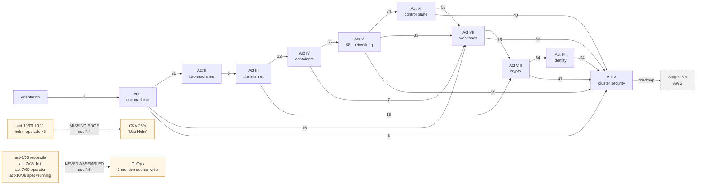

# Audit 2 — `learn_networking` after the 2026-08-23 remediation

*Audit run read-only, 2026-08-23 (second pass). 81 numbered lessons + 47 supporting pages = 128
Markdown files, ~2.2 MB across 11 units.*

> ## Status: all ten fix-list items applied, 2026-08-23
>
> The audit below is preserved as written. This banner records what was then done about it, and what
> the doing changed about the findings — because two of them were wrong, including one of mine.
>
> | # | Item | Commit | Verified how |
> |---|---|---|---|
> | 1 | `act-5/07b` shape 3 | `9c87251` | Ran the whole lesson on kind v1.36.1. Also found two defects the audit missed: `probe()` used `set -- $t`, which does not word-split under zsh, so **every line reported a denial regardless of policy**; and the API server says `Forbidden: may not specify both ipBlock and another peer`, not `Invalid value`. |
> | 2 | Act X drill 9 `enforce-version` | `7145cf1` | **The audit's own proposed fix was also wrong.** Mapped the whole staircase against a live API server with `--dry-run=server`: seccomp is a v1.19 control and capabilities a v1.22 one, so *both* are inside a v1.24 pin and a v1.24 pin is indistinguishable from `latest`. Pin moved to v1.21, probe is now a Pod violating `capabilities.drop` alone. |
> | 3 | CKS System Hardening drills, CKA Storage drill | `a3e39fc`, `76382a1` | Three new drills, each executed end to end. Act X 10 (capability-name typo, `CapEff` 0 vs 1), Act X 11 (same `localhostProfile` path, different file per node, both Pods Running), Act VII 7 (four `Pending` claims, two with identical events). |
> | 4 | etcd quorum in `act-6/05` | `70585cf` | `member list` and `endpoint health --cluster` run for real; the majority table is arithmetic. The quorum-loss symptom is **marked in the lesson as reasoning rather than measurement**, because one node cannot show it. |
> | 5 | The Helm row | `c1b1eac` | Three of the eight commands it called absent are present. Row corrected and Act X's three chart installs cited. |
> | 6 | Deprecated-API migration in `act-6/06` | `d22c773`, `69ceacd` | Removal error text, `apiserver_requested_deprecated_apis`, `api-resources`, `explain --api-version` all executed. `kubectl convert` is **not part of `kubectl`** — that is now stated rather than assumed. The `Warning:` header route was added in a follow-up commit once it reproduced. |
> | 7 | Pin `trivy`, `crane`, ESO | `0a97a0b` | `aquasec/trivy:0.74.0` and `crane:v0.21.9` pulled and run; chart pinned to 2.6.0. |
> | 8 | Assemble GitOps | `8c8db7e` | New lesson `act-7/08b`, four lines and no product. Every Kubernetes measurement executed, including the two nobody predicts: a deleted manifest file leaves the object running **and `kubectl diff` exits 0**, and `imageID` disagrees with a repo that holds a tag. |
> | 9 | CKS arithmetic | `c1b1eac` | 19½ of 26 = 75%, reproduced from a script that reads the rows. **The same check caught a second error the audit missed**: the CKA map's Cluster Architecture row claimed ✅4 against three ✅ rows, so its headline was already wrong before this pass touched it. |
> | 10 | A second tenant | `f2e2463` | Act VI drill 8, executed. Takes drill 6's fix away: the PDB belongs to a tenant you do not own and `kubectl scale` is refused by their `ResourceQuota` in a controller's event stream. |
>
> **One finding was discovered by doing the work and is larger than anything in the audit.** Running
> `act-5/07b` for the first time showed that **kindnet enforces NetworkPolicy** — kind v0.24 embedded
> `kube-network-policies` into kindnetd — and reproduced all four policy shapes exactly on the default
> `netlab` cluster. The act asserted the opposite in five places and Act X in three more, twice using
> it as a teaching example and once to declare a measurement impossible. Corrected in `83a4b7e` and
> `b76f298`: lesson 07 now opens with a *measurement* (`before: exit 0 / after: exit 28`) instead of a
> fact to look up, the Calico install is off the critical path for the highest-value CKA lesson in the
> course, and `act-10/07` now closes the door it said its lab could not.
>
> Two demoted items came along for free: `kubectl diff` as a reflex (the GitOps lesson's drift check)
> and `ResourceQuota` (drill 8). Everything else in the demoted list stands.
>
> Remaining, and named as remaining: authoring a `StorageClass` and a `PriorityClass`; building an HA
> control plane, `kubeadm init/join` and in-place upgrade, all of which need machines this lab does not
> have; AppArmor on Docker Desktop; Argo and Flux themselves; and Velero, blue/green and observability,
> which are a different course.
>
> After: `check_pedagogy.py` exits 0, 797 relative links resolve with zero breaks, both domain-map
> totals reproduce from a script, and the `netlab` cluster is back to two `Ready` nodes with nothing
> left behind.

This is a **follow-up**, not a re-run. [`AUDIT.md`](AUDIT.md) recorded the first pass and its ten
applied fixes. This pass does three things that one could not:

1. **Verifies the remediation actually landed** — the first audit closed with *"not verified by
   execution"* and its own status banner listed fourteen changes on trust.
2. **Reads the material the remediation added** — one new lesson and two new drills, written
   statically from commands other lessons had run. Both defects below are in that material, which is
   exactly where the first audit predicted them.
3. **Runs Phase 5, which the first pass never did** — the five-level depth taxonomy, the enterprise
   pattern matrix, and the professional-efficiency checklist, with exam-readiness and job-readiness
   kept apart.

Findings already recorded and fixed in `AUDIT.md` are **not** repeated. Where a finding survives, it
is named as surviving and re-scoped.

---

## The verdict in one paragraph

**The remediation is real.** All ten fix-list items and all four demoted items are present in the
files; `python3 tools/check_pedagogy.py` exits 0; 776 relative links resolve with zero breaks; the
deprecated-API surface is clean across twenty distinct `apiVersion` values; the `act-6 → act-7` graph
edge that the first audit drew as **NO EDGE** now carries 58 backward references and a `Next:` link;
`.secdemo/` is gone and its exercise is adopted into `act-10/08` generating its own secret. The
syllabus is current as of today, re-verified against source rather than the previous audit's notes.

**Two things are broken, and both are in the content the remediation added.** `act-5/07b-policy-shapes.md`
— the lesson both domain maps now advertise as the single highest-value hour of CKA manifest practice —
hardcodes a Pod CIDR that contradicts the cluster the same lesson requires, in the one shape that has
no probe to catch it. And Act X drill 9's `enforce-version` teaching point rests on an expected output
that Pod Security Standards cannot produce: `privileged: true` is forbidden by Baseline in *every*
version, so the namespace the drill says will admit a privileged Pod will refuse it.

**The Phase 5 result is the new information.** The course is not tutorial-shaped — 139 explicit
predict-prompts and 38 fault-hunts put the reasoning load at Levels 2–3 even where the typing is
Level 1. What it lacks is volume at the top: roughly **eight Level-4 design exercises and three
Level-5 optimise exercises across 1,002 command blocks.** Six enterprise patterns are `[Missing]`,
and the sharpest one is not a coverage gap at all — the course builds every component of GitOps and
never assembles or names it.

---

## 1. Remediation verification

Every claim in `AUDIT.md`'s status banner, checked against the files.

| # | Claimed fix | Verified | Evidence |
|---|---|---|---|
| 1 | 13 overclaimed rows re-marked; CKA 21½/27 ≈80%, CKS 20/26 ≈77% | ✅ **landed** | `cka:261`, `cks:52`. CKA arithmetic checks out exactly. CKS is off by half — see **N3** |
| 2 | New `act-5/07b-policy-shapes.md`; NetworkPolicy rows now ✅ | ✅ **landed** — with defects | 16 KB lesson; `namespaceSelector`/`ipBlock`/`policyTypes: [Egress]` all present. See **N1** |
| 3 | Three broken Act X drills fixed | ✅ **landed** | `diagnose.md:286-290` `sub()` exits on a missed anchor; `:308` asserts; `:266` exports `KUBECONFIG`; drill 3 labelled paper |
| 4 | Node image pinned on the primary line | ✅ **landed** | `act-5/01:49`, `:73-74`, `:176` all pin `kindest/node:v1.36.1` — primary line *and* recovery path *and* the `netcni` cluster |
| 5 | `act-6 → act-7` seam reconnected | ✅ **landed** | `act-6/08:280` names Act VII and its spine; `:286` and `in-the-wild.md:95` carry `Next:`. Acts IV, V, VII, IX terminal pages too |
| 6 | Act IX gains RBAC manifests | ✅ **landed** | `act-9/06` now has 2 `apiVersion:` and 5 `--dry-run=client -o yaml`, plus `create clusterrole` and `--resource-name` at `:162`, `:177` |
| 7 | Act X bench C + drills 8, 9 | ✅ **landed** — drill 9 defective | `diagnose.md:526` bench C, `:590` drill 8, `:662` drill 9. See **N2** |
| 8 | eBPF promise re-pointed | ✅ **landed** | `act-1/03:51` → `act-10/10`; `act-10/10:454` states precisely what it pays and what it does not; Hubble retired honestly at `act-10/09:169-175` |
| 9 | Drills timed | ✅ **landed** | All 53 drills across 10 files carry `**Target: N minutes**` plus a `## The clock` section with the 10-minute rule. Version floors now declared too (`act-6/diagnose.md:10` states the ≥1.29 requirement the first audit found undeclared) |
| 10 | Navigational decay | ✅ **landed** | `.secdemo/` deleted; `grep -rn secdemo --include='*.md'` returns only `AUDIT.md`'s own record of it, and `act-10/08:517` generates its secret into `$TMPDIR` |
| — | `appconf` → `app-config` | ✅ **landed** | `act-7/05` is `app-config` at `:19,42,47,72,119,134,271`; `appconf` survives only in `act-7/diagnose.md`, which is where it belongs |
| — | Gatekeeper `v1beta1` silence closed | ✅ **landed** | `act-10/05:216` — a full paragraph on why the group has never had a `v1` and why the rule is per-group, not per-suffix |
| — | Act V's three unexplained agents | ✅ **landed** | flagged inline in `03-services.md` |
| — | `act-5/05-cni.md` unrunnable Cilium block | ✅ **landed** | re-marked as a claim with a pointer |

**Harness:** `tools/check_pedagogy.py` exits 0, and `ACT_DIRS` (`:28-31`) now includes
`act-10-cluster-security` with `DIAGNOSE_EXEMPT = set()` — the invariant gap found *while* fixing is
closed.

**Not verified by execution here either.** This pass is static. The two defects below were found by
reading, not running, which is worth stating: they are the kind a single `probe` call would have
caught.

---

## 2. The knowledge graph, rebuilt

Act-level `requires` edges, recounted from the current files. Numbers are prose references from the
source act into the target act; an edge means the later act reaches back, so the earlier act is a
prerequisite.



**684 backward (dependency) references, 95 forward (promissory).** Every backward reference points to
a strictly lower act, so a valid topological ordering exists and there are no cycles. The spine is now
unbroken **0→1→2→3→4→5→6→7→8→9→10** — the `6→7` break the first audit drew in red is gone.

| check | result |
|---|---|
| **Topological validity** | ✅ valid, no cycles. 684/684 backward edges strictly descending |
| **Link integrity** | ✅ 776 relative Markdown links, **0 broken** (one false positive: a literal `…` in `tools/README.md:31`) |
| **Orphan nodes** | ✅ the first audit's three orphans are closed: `.secdemo/` deleted, `act-10/05` and `act-9/diagnose.md` now cited from the maps |
| **Missing edges** | ⚠️ **two**, both new: Act X's Helm workflow → CKA's Helm competency (**N4**); the four GitOps components → the pattern (**N6**) |
| **Redundant nodes** | ✅ none. `site/src/content/docs/` looked like a duplicate corpus and is not — it is generated by `site/scripts/sync-content.mjs` and gitignored (`.gitignore:27`). `networking-fundamentals/` is the single source of truth |

### Syllabus currency — re-verified at source, 2026-08-23

Not taken from the previous audit's notes.

| source | states | repo targets | verdict |
|---|---|---|---|
| [`github.com/cncf/curriculum`](https://github.com/cncf/curriculum) | ships `CKA_Curriculum_v1.35.pdf` and `CKS_Curriculum v1.34.pdf` | CKA v1.35, CKS v1.34 | ✅ exact |
| [CKA program changes](https://training.linuxfoundation.org/certified-kubernetes-administrator-cka-program-changes/) | Storage 10 / Troubleshooting 30 / Workloads 15 / Cluster Architecture 25 / Servicing and Networking 20, effective **18 Feb 2025** | identical | ✅ exact |
| [CKS program changes](https://training.linuxfoundation.org/cks-program-changes/) | Cluster Setup 15 / Cluster Hardening 15 / System Hardening 10 / Microservice Vulns 20 / Supply Chain 20 / Monitoring 20, effective **15 Oct 2024** | identical | ✅ exact |

| syllabus diff | result |
|---|---|
| topics **added** with no repo node | **none** |
| topics **removed** still taught as exam-relevant | **none** — PodSecurityPolicy, Dashboard hardening and Dockerfile-hardening-as-a-topic are all explicitly flagged as removed (`cks:286,289,290`) |
| **weighting** changes not reflected | **none**, and the repo still independently catches that `cncf/curriculum`'s own README publishes the stale pre-Oct-2024 CKS split (`cks:29-32`) |

**No syllabus drift. The CKS map's version-mismatch note (`cks:8-12`) — document at v1.34, environment
at v1.35, study against 1.35 — is confirmed correct and is the kind of calibration most paid material
gets wrong.**

---

## 3. Feynman convergence

The first audit ran the full three-pass loop over all 81 lessons: **0 Not Converged, 39 Converged, 42
Converged-with-flags.** Nothing in the remediation touched lesson prose in a way that could regress
that, so it is not re-run here. Two notes on the two files that *are* new prose:

| file | status | note |
|---|---|---|
| `act-5/07b-policy-shapes.md` | **Converged** | Introduces nothing undefined. `from:`, peer, `podSelector`, `namespaceSelector`, `ipBlock`, `policyTypes` all arrive with a plain-language gloss at first use, and the framing — *"this is a list-nesting question wearing a networking costume"* — is a working mental model, not an analogy that breaks. Pass 1 restates cleanly: *"a rule lists who may knock; each entry on the list can carry several conditions, and an entry is satisfied only when all of its own conditions hold."* |
| `act-10/diagnose.md` drills 8–9 | **Converged** | Both reuse vocabulary lessons 03 and 06 established. Drill 9's `enforce-version` is defined where first used (`:709`) |

The first audit's sharpest surviving flags are unchanged and remain correctly demoted: **MAC colliding
with itself** across `act-2/01` (Media Access Control) and `act-8/03:201` (Message Authentication
Code), and **OIDC never defined in the act named for it**. Both are one-sentence fixes and neither
changes an exam result.

---

## 4. Command and tooling flags

### Deprecated API surface: clean

Twenty distinct `apiVersion` values across the course, every one GA or correctly justified:

```
59 v1                              5 policies.kyverno.io/v1        2 rbac.../v1
14 apps/v1                         5 audit.k8s.io/v1               2 external-secrets.io/v1
11 networking.k8s.io/v1            3 kind.x-k8s.io/v1alpha4        2 example.com/v1
10 admissionregistration.k8s.io/v1 3 gateway.networking.k8s.io/v1  1 pod-security.admission.config.k8s.io/v1
 9 apiserver.config.k8s.io/v1      3 constraints.gatekeeper.sh/v1beta1  1 node.k8s.io/v1
 6 batch/v1                        2 templates.gatekeeper.sh/v1    1 autoscaling/v2, 1 apiextensions.k8s.io/v1, 1 kyverno.io/v1
```

Zero hits for `extensions/v1beta1`, `policy/v1beta1`, `batch/v1beta1`, `autoscaling/v2beta*`,
`apiextensions.k8s.io/v1beta1`, `node.k8s.io/v1beta1`, `dockershim`, `kubectl convert`, `--export`,
`--generator`. The only two non-GA versions are `kind.x-k8s.io/v1alpha4` (kind's own config; has
never had another version) and `constraints.gatekeeper.sh/v1beta1` (now explained in prose — fix
landed). `PodSecurityPolicy` appears five times, every one of them as a removed thing.

### Two defects

| # | severity | where | finding |
|---|---|---|---|
| **N1** | **breaks the lesson** | `act-5/07b:171-173, 192` | **The `ipBlock` CIDRs contradict the cluster the lesson requires.** `:24-29` mandates the Calico `netcni` cluster and greps `calico-node` to confirm. `act-5/01:190` instructs the reader building that cluster to set `podSubnet: "192.168.0.0/16"` and *"expect Pod IPs that read `192.168.x.y` rather than this act's `10.244.x.y`"*. Shape 3 hardcodes `cidr: 10.244.0.0/16` with `except: 10.244.1.0/24`. On the mandated cluster the allow matches **nothing** — the policy is a deny-all-ingress, not the "allow the Pod network minus node 2" it claims. **There is no `probe` call after shape 3**, so a reader following along cannot detect it. Knock-on: `db-and` is never deleted, so shape 4's headline measurement (`by IP: exit 28`) is over-determined — it would time out from the leftover ingress policy with no egress policy at all. Second, smaller: `:226` runs `nslookup db.polns.svc.cluster.local` and claims `grep -c Address` → `2`, but the bench only ever runs `kubectl run db` — **no Service named `db` exists**, so the lookup is NXDOMAIN and the count is 1. The check still discriminates blocked (0) from allowed (≥1), but the stated output is unobtainable, which is a plain tell that the lesson was never executed. |
| **N2** | **breaks the drill** | `act-10/diagnose.md:671-700` | **Drill 9's `enforce-version` claim is factually wrong.** The probe is `kubectl run t --privileged` against three namespaces, and the expected output is `tenant-c ADMITTED` for a namespace labelled `enforce=restricted` plus `enforce-version=v1.24`. Per the [Pod Security Standards](https://kubernetes.io/docs/concepts/security/pod-security-standards/), `spec.containers[*].securityContext.privileged` is forbidden by **Baseline with no version annotation** — i.e. in every revision, including a v1.24 pin. `tenant-c` will **refuse**. The drill's headline (*"Exactly one of those three namespaces will refuse a privileged Pod"*) and its whole tenant-c teaching point collapse on first contact. |

**N2 has a small, strengthening fix.** The *concept* is right — a version pin does freeze a weaker
standard. It just needs a probe that violates only a post-v1.24 addition. In Restricted, **Seccomp**
and **Capabilities** became required at **v1.25**, so a Pod that is non-root with
`allowPrivilegeEscalation: false` but carrying no `seccompProfile` and no `capabilities.drop: ["ALL"]`
is admitted under a `v1.24` pin and refused under `latest`. Those are two of the exact four fields
Act X lessons 01–03 derive by experiment and lesson 03 measures PSA naming — so the corrected drill
ties back *harder* to the lessons than the broken one does.

### Exam-tool availability, imperative/declarative, verification

Unchanged from the first audit and correctly handled: `exam-prep/README.md:121` records which tool
docs are not whitelisted; gVisor and AppArmor are the best-handled deferrals in the course.

`--dry-run=client -o yaml` has improved from 3 real manifest-skeleton uses to **8 in the acts**
(`act-9/06` ×5, `act-7/09`, `act-5/04b`, `act-10/05`) plus 6 in `kubectl-speed.md`. Still the thinnest
high-leverage idiom in the repo relative to its exam value, but no longer a hole.

The first audit's verification-discipline table (Acts II–III at 68–72%) was demoted and is not
re-measured here — my heuristic and its heuristic disagree enough on absolute values that publishing
a second set of numbers would be noise rather than information. The one file worth a human's eye is
`act-4/02-veth-and-bridge.md`, where four consecutive command blocks carry no stated expectation.

---

## 5. Free/OSS tooling — drift check

The first audit's inventory was clean on cost: every lab runs on `kind` + Docker + `netshoot` + a
locally built `netlab`, and Act X lesson 11 uses the External Secrets Operator's `fake` provider
specifically to avoid a cloud account. That holds. This pass checks only for **drift** — anything that
has moved, been paywalled, or been deprecated.

| tool | pinned in repo | status | note |
|---|---|---|---|
| `kind` / `kubectl` | `kindest/node:v1.36.1` | free, maintained | now pinned on **all four** invocation sites |
| Kyverno | `v1.19.0` | free, Apache-2.0 | ✅ |
| Gatekeeper | `v3.23.0` | free, Apache-2.0 | ✅ |
| Cilium | chart `1.19.7` | free, Apache-2.0 | `--version` pinned on both install and upgrade |
| Calico | `v3.28.0` | free, Apache-2.0 | pinned, with the pod-CIDR caveat stated — see **N1** for the caveat not being honoured downstream |
| Falco | chart `9.1.0` | free, Apache-2.0 | `--version` pinned |
| `kube-bench` | `v0.10.7` | free, Apache-2.0 | ✅ |
| `cosign` | `v2.4.1` | free, Apache-2.0 | ✅ |
| external-secrets | **unpinned** | free, Apache-2.0 | `act-10/11:34` has no `--version`; the chart's CRD group moved `v1beta1`→`v1`, and the lesson's manifests use `external-secrets.io/v1`, so a future chart is the one thing that could break it |
| `trivy` | **`:latest`** | free, Apache-2.0 | `:latest` is load-bearing here in a bad way: lesson 08's whole SBOM finding is *"pin tool, version, DB snapshot and entry point and treat a change in any of the four as a change in the finding"* — and the lesson does not pin its own tool |
| `crane` | **no tag** | free, Apache-2.0 | same class, lower stakes |
| `apparmor_parser` / `aa-status` | — | free | **still unrunnable on the documented platform.** Docker Desktop's Linux VM kernel has no AppArmor; `/sys/kernel/security/lsm` is absent and the lesson measures the honest failure. 10% CKS domain, half a two-tool bullet |

**Still missing, curriculum-expected, free:** `bom` (whitelisted docs, the exam's SBOM tool — the
course teaches `trivy`'s SBOM instead), **Kubesec**, **KubeLinter**, **Istio `PeerAuthentication`**
(whitelisted docs), a loadable AppArmor profile, and **Falco rule authoring**. All six are named
honestly in `exam-prep/`; none is closed by a lesson. That set is unchanged from the first audit and
correctly ranked below the graph-breaking items.

**Platform, unchanged and still the largest access barrier:** Docker Desktop is the only documented
path, licence-gated above the free-tier threshold, and its VM kernel is what makes AppArmor
enforcement impossible. `minikube`, `k3d`, `k3s` appear once each in `Toolbelt.md` with zero lesson
presence; Colima, OrbStack and Rancher Desktop appear nowhere.

---

## 6. Hands-on depth, enterprise patterns, efficiency

*This section is new. The first audit classified drills by shape (find-the-fault vs observe-and-explain);
it did not run the five-level taxonomy, the enterprise matrix, or the efficiency checklist.*

### 6A — Depth distribution

**Corpus.** 1,002 language-tagged command blocks (801 in lessons, 201 in drills), 139 `Predict first`
prompts, 85 `Check yourself` prompts, 53 drills, 83 `You understand this when you can` rubrics, 122
author-it-yourself heredoc manifests, 294 imperative `kubectl` operations.
*(Caveat: Act I uses untagged fences, so its 6 blocks are an undercount. Act I is pre-Kubernetes and
maps to no exam domain, so no per-domain figure is affected.)*

**Read the naive count and then the correction, because the taxonomy's own flag misfires on this repo.**

| level | count | where |
|---|---|---|
| **L1 Recall** — type the command shown | ~660 blocks | lesson blocks with no attached prediction, requirement or fault |
| **L2 Applied** — build from a stated requirement | ~340 | 139 predict-prompts + 85 check-yourself + 122 authored manifests (overlapping) |
| **L3 Diagnostic** — find and fix a root cause | **38** | 38 of 53 drills are symptom-only find-the-fault |
| **L4 Design** — choose the pattern, no single right command | **≈8** | `act-10/diagnose` drills 6 and 7 (paper) · `act-10/09:419` refuse-to-sign the compliance claim · `act-10/04:868` `failurePolicy` — which failure would you rather · `act-9/06:210` the reverse question · `act-7/diagnose:208` *"decide whether they are right"* · `act-5/07b:144` which shape do you write |
| **L5 Optimise** — improve a working setup against a real constraint | **≈3** | `act-7/diagnose` drill 4 *"we scaled it down but the bill didn't move"* (cost) · drill 6 the autoscaler under load · `act-7/10`'s scaleUp-0s / scaleDown-300s asymmetry derived from *being wrong upward costs money, downward costs an outage* |

**Naively that is ~95% L1–L2, which would trip the "tutorial-shaped, not job-shaped" flag. The flag
is wrong here, and it is worth saying why.** In a tutorial, an L1 block is the exercise. In this
course an L1 block is the *measurement half* of a predict-then-measure pair — 139 times the reader
commits a guess in writing before running anything, and `check_pedagogy.py` enforces a prediction
marker on every non-exempt lesson. The typing is L1; the cognition is L2–L3. The honest statement is
not "this course is recall-heavy" but **"this course has almost no ceiling."**

**Depth by domain**, counting L3 drills — the level both exams actually test — and L4/L5 presence:

| exam · domain | weight | L3 drills | L4 | L5 | flag |
|---|---|---|---|---|---|
| CKA Troubleshooting | 30% | **17** (act-5 ×4, act-6 ×7, act-7 ×6) | 1 | 1 | strongest in the repo |
| CKA Cluster Architecture | 25% | 9 (act-6 ×7, act-9 ×2) | 1 | 0 | — |
| CKA Servicing & Networking | 20% | 4 | 1 | 0 | — |
| CKA Workloads & Scheduling | 15% | 6 | 1 | **2** | the only domain with real L5 |
| **CKA Storage** | 10% | **1** — and it is really a StatefulSet-identity drill | 0 | 1 | ⚠️ **no PVC-won't-bind drill**, the domain's most-reported task shape, with the binding rule already stated at `cka:243` |
| CKS Microservice Vulns | 20% | 4 | 1 | 0 | — |
| CKS Supply Chain | 20% | 3 | 1 | 0 | — |
| CKS Monitoring/Logging/Runtime | 20% | 2 | 2 | 0 | — |
| CKS Cluster Setup | 15% | 1 | 1 | 0 | thin, and its one drill is `act-5` drill 4 |
| CKS Cluster Hardening | 15% | 3 | 0 | 0 | — |
| **CKS System Hardening** | 10% | **0** | 0 | 0 | ⚠️ **`seccomp` and `securityContext` return zero hits across all ten `diagnose.md` files** |

**N5 — the two domains with no find-the-fault drill for their core primitive.**
CKS System Hardening is the sharper of the two, because the teaching is already done to a higher
standard than anything else in the course: `act-10/01` alone contains four ready-made hidden faults —
`add: ["CAP_NET_BIND_SERVICE"]` accepted silently and granting nothing (a Pod that reviews as hardened
and is not), `runAsNonRoot` on a root image passing admission and failing at the kubelet with
`CreateContainerConfigError`, `readOnlyRootFilesystem` breaking `/tmp`, and a `Localhost` seccomp
profile whose file is present on one node and not the other. Four drills exist in the prose and none
was written.

### 6B — Enterprise pattern matrix

| pattern | status | relevance |
|---|---|---|
| **Multi-tenancy isolation** (ns + ResourceQuota + LimitRange + NetworkPolicy together) | **[Missing]** — `ResourceQuota` and `PriorityClass` are **0 hits course-wide**; `LimitRange` ×4 but never combined; `act-10/in-the-wild.md:75` names multi-tenancy as a deliberate omission | **[Both]** |
| **HA control plane / etcd quorum** | **[Missing]** — `quorum`, `HA control plane`, `highly-available`, `high availability` all **0 hits** | **[Both]** — see **N7** |
| **Pod scheduling for a real placement problem** | **[Integrated-scenario]** — `act-7/04` uses affinity, taints and `topologySpreadConstraints` to solve stated requirements, and `act-10/09` produces the best version in the repo: `podAntiAffinity` as *"a security control nobody writes down"*, because WireGuard encrypts the link between nodes and two Pods on one node have no such link | **[Both]** |
| **PDB + voluntary disruption** | **[Integrated-scenario]** — `act-6/07` derives eviction-≠-deletion and lands on PDB; `act-6` drill 6 is a PDB-blocked drain with a maintenance window closing | **[Both]** |
| **HPA / VPA / Cluster Autoscaler tied to load or cost** | **[Integrated-scenario]** — `act-7/10`: three autoscalers, three fields, the HPA-divides-by-`requests` trap, and the Cluster Autoscaler's input signal being `Pending` | **[Both]** |
| **Rolling-update tuning tied to availability** | **[Integrated-scenario]** — `act-7/02`, `maxSurge` rounds up / `maxUnavailable` rounds down, *spend a Pod, not availability* | **[Both]** |
| **Canary** | **[Integrated-scenario]** — `act-5/06b` weighted `HTTPRoute`, and weights are not percentages | **[Both]** |
| **Blue/green** | **[Missing]** — 0 hits. Cheap: a label-selector flip on the Service the course already has | **[Professional-only]** |
| **GitOps** | **[Missing]** as a pattern, `[Integrated-scenario]` as parts | **[Professional-only]** — see **N6** |
| **Helm / Kustomize multi-env templating** | **[Integrated-scenario]** — `act-7/08` base + overlay, `configMapGenerator`'s content hash turning a config change into a rolling update | **[Both]** |
| **RBAC as a least-privilege system** | **[Integrated-scenario]** for analysis, **[Missing]** for design — `act-9/06`'s 40-line reverse-question script reads 160 objects and finds 15 named subjects, 13 of them controllers, which is better than any "design RBAC for 3 teams" exercise. But no exercise asks the reader to *design* one | **[Both]** |
| **Admission control as a guardrail layer** | **[Integrated-scenario]** — `act-10/04` hand-built webhook + VAP, `act-10/05` the same rule twice in Kyverno and Gatekeeper, with the cleanup punchline that ten webhook configurations survive `delete -f` | **[Both]** |
| **Secrets beyond base64** | **[Integrated-scenario]** — `act-10/06` encryption at rest with the compaction step every guide omits; `act-10/11` ESO with rotation-at-source measured and *"deleting the Secret is no longer revocation"* | **[Both]** |
| **Supply-chain integrity chained end to end** | **[Integrated-scenario]** — **the standout of the whole repo.** `act-10/08` chains scan → SBOM → sign → admission-time verify → `mutateDigest: true` rewriting the stored reference to the content it verified, and includes the attacker-signs-with-their-own-key trap | **[Both]** |
| **Network segmentation as defence in depth** | **[Integrated-scenario]** — `act-5/07b` default-deny + explicit allow; `act-10/09` tests it against a real lateral-movement scenario and proves the policy irrelevant to confidentiality (4 occurrences of the password on the wire with default-deny in force) | **[Both]** |
| **Backup/DR as a restore drill** | **[Integrated-scenario]** for etcd — `act-6/05` deletes `/var/lib/etcd` for real and restores, and finds that a restore is an assertion rather than a rewind. **[Missing]** for Velero (0 hits) | etcd **[Both]** · Velero **[Professional-only]** |
| **Upgrade path incl. deprecated-API migration** | **[Isolated-mention]** — `act-6/06` derives skew and does half an upgrade by hand, but `kubectl convert` is 0 hits and no lesson treats API removal as an upgrade blocker | **[Both]** — see **N9** |
| **Incident response under time pressure** | **[Integrated-scenario]** — 53 timed drills with the 10-minute rule. **But no cross-domain drill**: every set is within one act, and `the-whole-stack.md` (the closest thing to a capstone) is a read-only narrative with no target to break | **[Both]** |
| **Observability (Prometheus/Grafana/Loki/traces)** | **[Missing]** — 0 hits, declared roadmap as Stage 7.8. `kubectl top` via metrics-server covers CKA's monitoring bullet | **[Professional-only]** |

### 6C — Professional efficiency checklist

| item | verdict | evidence |
|---|---|---|
| `kubectl` alias discipline | **PASS in `exam-prep`, absent from the course** | `alias k=` ×2 in `exam-prep`, 0 in the acts. Defensible — the exam ships the alias — but a reader who works the acts and skips the rehearsal track never sees it |
| Context / namespace switching discipline | **PASS** | `kubectl config use-context` ×6; `act-10/09` uses `kind create cluster --kubeconfig` so a throwaway cluster leaves no trace in `~/.kube/config`, explicitly framed as an improvement on Act V; all three Act X benches `export KUBECONFIG`; `set-context --current --namespace` in `kubectl-speed.md:32` |
| `kubectl explain` as the schema authority | **PASS** | ×14, and `act-5/06b` names it as exactly that when the Gateway API's fields are unfamiliar |
| `--dry-run=client -o yaml` as a scaffold | **WEAK** | 8 in the acts (was 3), 6 in `kubectl-speed.md`. The single highest-leverage CKA idiom is still the thinnest-practised |
| `kubectl diff` before `apply` | **FAIL** | ×3, never established as a reflex. `act-10/08:945` uses it rhetorically (*"every `kubectl diff` reads a name that was resolved elsewhere"*) — the one place it appears prominently is an argument about its limits |
| `rollout status` / `undo` reflex | **PASS** | ×33 / ×9, and `act-10/04` makes a `readinessProbe` load-bearing precisely because without it `rollout status` returns before the server binds |
| Docs-during-exam vs memorisation | **PASS** | `exam-prep/README.md:121` enumerates the whitelisted domains and flags which tools have no docs at all; `api-resources` ×15 in the course |
| Blast-radius thinking | **PARTIAL** | Strong in prose — 12 substantive passages, best at `act-10/07:590` (find who can reach 10250 *before* fixing the flag), `act-10/11:170` (an etcd snapshot's blast radius shrinks in time, not content), `act-6/04:49` (predict what `ca.key` means). **But no exercise ever runs on a cluster with a second tenant to damage** — every drill scopes to its own namespace and cleans up. Same root as the multi-tenancy gap |

### Exam-readiness gaps vs job-readiness gaps — kept apart

**Blocks exam readiness:** N1 (the NetworkPolicy lesson is defective in the shape both maps sell
hardest), N2 (the PSA drill is wrong), N5 (no drill for CKS System Hardening 10% or CKA Storage 10%),
the declared authoring gaps already in the maps (`StorageClass`, static `PV`, `ResourceQuota`,
`PriorityClass`, Gateway-with-TLS, `Corefile`, Falco rule authoring, `ImagePolicyWebhook`), and N9's
API-migration hole inside a 25% domain.

**Blocks job readiness only:** N6 (GitOps unnamed), Velero, observability, blue/green, multi-tenancy
as an integrated pattern, the L4/L5 ceiling, and the absence of any shared-risk context. **Fixing the
first list does not touch the second**, and the second is where the course is furthest from its own
stated destination — `JOURNEY-MAP.md:4-6` promises the reader will see past what the certifications
test, and on patterns it is currently at or slightly below them.

---

## 7. Prioritised fix list

Ranked by exam impact, then self-critiqued on *"if a learner fixed only this, would it move them
toward a pass?"* Ease of fix is not a ranking input — items 1 and 2 are among the cheapest and sit at
the top because they are **wrong**, not because they are quick.

### 1. Run `act-5/07b-policy-shapes.md` on the Calico cluster and fix shape 3

**Why it decides a pass:** both maps now point at this lesson as *the* highest-value hour of CKA
manifest practice (`cka:181`, and CKS Cluster Setup 15% cites it twice). Shape 3's `ipBlock` names
`10.244.0.0/16` on a cluster the same lesson requires to be `192.168.0.0/16`, so the policy denies
everything instead of demonstrating `except`, and the missing `probe` means a reader learns a wrong
lesson with no signal. The `nslookup` against a Service that the bench never creates confirms the
lesson has never been executed. Fix: parameterise the CIDR off `$DBIP`'s network (or `kubectl get
pod -o wide`), add a `probe` after shape 3, `kubectl delete networkpolicy db-and` before shape 4, and
either `kubectl expose pod db --port=80` or point the `nslookup` at a name that exists. **Then run it.**

### 2. Fix Act X drill 9's `enforce-version` probe

**Why:** the drill's stated output is impossible, so the reader's first action contradicts the answer
key on a 20%-domain topic the CKS map calls *"a common opener"* and *"the fastest win."* A drill that
disagrees with the cluster is worse than no drill — it teaches distrust of the drill set. Swap the
`--privileged` probe for one that omits `seccompProfile` and `capabilities.drop: ["ALL"]` while
running non-root with `allowPrivilegeEscalation: false`: admitted under a `v1.24` pin, refused under
`latest`, because both controls became required in Restricted at v1.25. The corrected drill is also a
better drill — those are two of the four fields lessons 01–03 derive.

### 3. Write the CKS System Hardening drills

**Why:** a 10% domain with **zero** find-the-fault drills, and the first audit already recorded it as
the only domain in either exam with no verified ✅. The teaching is the best in the course and four
faults are sitting in `act-10/01`'s prose ready to be hidden: a silently-useless `add:
["CAP_NET_BIND_SERVICE"]`, `runAsNonRoot` on a root image failing at the kubelet rather than
admission, `readOnlyRootFilesystem` breaking `/tmp`, and a `Localhost` seccomp profile missing on one
node. Two drills close the domain. Add one PVC-won't-bind drill for CKA Storage while the drill file
is open — same shape, same 10% weight, same "the map states the rule and nothing hides it" problem.

### 4. Add the etcd quorum reasoning to `act-6/05`

**Why:** `quorum`, `HA control plane` and `highly-available` are **zero hits course-wide**, and CKA's
bullet is *"Manage cluster lifecycle and implement highly-available control planes"* in a 25% domain.
The map blames the one-node lab, which is fair for the *task* and wrong for the *reasoning* — why an
odd member count, what quorum loss looks like from the client side, why `etcdctl member list` and
`endpoint status` are the first two commands. None of that needs a second node, and `act-6/05`
already has the reader destroy and restore a real etcd. This is the highest-weight gap that can be
closed with prose the lab can actually support.

### 5. Correct the Helm row and cite Act X's installs

**Why:** `cka:82` says `helm repo add` and `--create-namespace` *"appear nowhere in the course"* while
`act-10/09:155`, `act-10/10:441` and `act-10/11:34` run exactly those, with `--version`, `--set` and
`helm upgrade --reuse-values`. The row is wrong in the pessimistic direction, which costs the learner
hours rather than marks — but it is also a **missing graph edge**: Act X's three chart installs are
the best evidence in the repo for a 25%-domain competency and no coverage row cites them. Correct the
claim, add the citations, and narrow the genuine remainder to what it is: `repo update`, `search
repo`, `show values`, `history`, `rollback` as a run command, `--skip-crds`, `upgrade --install`.

### 6. Teach deprecated-API migration inside `act-6/06`

**Why:** the repo's own API surface is spotless and the reader is never taught to check anyone else's.
`kubectl convert` is 0 hits and no lesson names API removal as an upgrade blocker — which is the most
common real-world upgrade failure and sits inside CKA's 25% lifecycle bullet. `act-6/06` already
derives skew from first principles and ends at `kubeadm upgrade plan`; the deprecation check belongs
in the same breath, because `upgrade plan` is where a real cluster surfaces it.

### 7. Pin `trivy` and `crane`, and version the ESO chart

**Why it ranks here rather than lower:** this is not tidiness, it is the repo contradicting its own
best finding. `act-10/08`'s sharpest measurement is that `trivy image` and `trivy sbom` report 155 and
157 findings with the same tool, version and frozen DB, and its stated habit is *"pin tool, version,
DB snapshot and entry point and treat a change in any of the four as a change in the finding."* The
lesson then runs `trivy:latest`. A reader who follows the lesson's own advice cannot reproduce the
lesson's own numbers.

### 8. Assemble GitOps from the four pieces already built

**Why:** `JOURNEY-MAP.md`'s 7.6 promises GitOps at least conceptually, and the course has **one**
mention of the word (`act-10/08:945`) with zero for Argo or Flux. Yet every component is taught
well — the reconciliation loop (`act-6/03`), an operator written in 25 lines of shell (`act-7/09`),
drift as a measured phenomenon (`act-7/08`: `helm list` cheerfully reports `deployed` while the
cluster disagrees), and the argument that makes GitOps hard (`act-10/08`: a Pod spec is not a
description of what is running, so a repo pins a name someone else resolved). One page joining those
four closes a promise and costs no new tooling. **Job-readiness only** — neither exam has a GitOps
bullet — which is why it is here and not higher.

### 9. Correct the CKS map's arithmetic: 19½ of 26, not 20

**Why:** the AppArmor/seccomp row (`cks:251`) is marked 🟡 and its prose says the seccomp half *"would
earn ✅ on its own"* — and the total counts it as a full bullet. The honest figure is **19½ of 26, 75%**,
not *"20 of 26, about 77%."* Half a bullet is nothing on its own; it matters because this is the same
class of error the first audit found and fixed in the CKA map, in the one instrument whose entire
value is that its numbers can be trusted.

### 10. Give one exercise a second tenant

**Why it is last despite being the theme of section 6:** every drill runs on a clean single-purpose
cluster, so the course's genuinely good blast-radius prose (`act-10/07:590`, `act-10/11:170`) is never
something the reader has to act on. One drill where the fix damages a neighbouring namespace — a
default-deny egress applied cluster-wide, or a `drain` with a PDB in a namespace the reader does not
own — would convert twelve paragraphs of prose into a reflex, and it would drag `ResourceQuota` into
the course as a side effect. It is last because no exam question asks it.

### Demoted after self-critique

- **`--dry-run=client -o yaml` volume** (8 in the acts) — improved from 3, and adding more would be
  padding rather than teaching. `kubectl-speed.md` is the right home for repetition.
- **`kubectl diff` as a reflex** — real, and one line in `act-7/02` would close it. Not worth a rank.
- **MAC colliding with itself; OIDC never defined** — the first audit's two sharpest Feynman flags,
  still open, still one sentence each, still changing nobody's exam result.
- **Docker Desktop as the sole platform** — the largest access barrier in the repo and still just a
  paragraph. It costs money and it does not cost marks, except via AppArmor, which is already
  declared.
- **Blue/green, Velero, observability** — all `[Missing]`, all correctly out of scope for both exams,
  all declared as roadmap. Adding them would be a different course.
- **`act-4/02-veth-and-bridge.md`'s four unverified blocks** — worth an eye, not a rank.

---

## Method

Read-only throughout. Baseline: `python3 tools/check_pedagogy.py` → exit 0, before and after.

Sweeps run: a remediation verification pass over all fourteen claimed changes; a link-integrity script
over 776 relative links; an act→act reference matrix (684 backward, 95 forward); a deprecated-API and
`apiVersion` inventory; a coverage-claim recount of both maps with the arithmetic reproduced in Python;
a command-block and exercise-type census (1,002 blocks, 139 predictions, 85 checks, 53 drills, 122
authored manifests, 294 imperative ops); an enterprise-pattern grep sweep with false positives
eliminated by hand (`argo` matched `cargo` and `argon2id` — the 15 apparent hits are **zero**; `SLO`
matched nothing on a word boundary); and a close read of the three files the remediation added.

Curriculum facts were fetched live rather than carried over: `github.com/cncf/curriculum`'s file
listing, and both Linux Foundation program-changes pages. The Pod Security Standards claim behind **N2**
was checked against `kubernetes.io/docs/concepts/security/pod-security-standards/` directly, because
the drill's correctness turns on whether a control carries a version annotation.

Spot-check the two load-bearing findings:

```bash
# N1 — the lesson requires Calico; the lab sets 192.168.0.0/16 for Calico; the lesson uses 10.244
grep -n 'calico-node\|10.244' networking-fundamentals/act-5-kubernetes/07b-policy-shapes.md
grep -n '192.168.0.0/16' networking-fundamentals/act-5-kubernetes/01-lab-with-kind.md
grep -c 'kubectl expose\|kind: Service' networking-fundamentals/act-5-kubernetes/07b-policy-shapes.md  # 0

# N2 — the probe, and the claim
sed -n '688,701p' networking-fundamentals/act-10-cluster-security/diagnose.md

# N5 — no seccomp or securityContext fault anywhere in the drills
grep -ril 'seccomp\|securityContext' networking-fundamentals/act-*/diagnose.md   # empty

# N6/N7/N8 — the enterprise zeros (every one prints 0)
for p in ResourceQuota PriorityClass quorum Velero Prometheus; do
  printf '%-14s %s\n' "$p" "$(grep -row "$p" networking-fundamentals/ | wc -l)"
done
```
