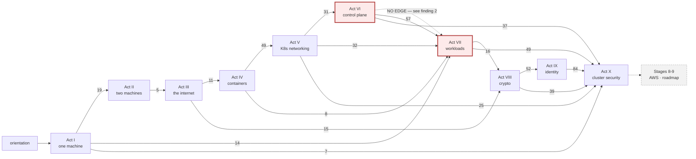

# Audit — `learn_networking` as a CKA/CKS learning graph

*Read-only audit, 2026-08-23. 81 numbered lessons + 46 supporting pages = 127 Markdown files,
~260k words across 11 units. No content was modified by the audit itself.*

---

> ## ⚑ Status: remediated 2026-08-23 — read this before acting on any finding below
>
> **The audit text is preserved unchanged as the record of what was found.** All ten items on §7's
> prioritised fix list have since been applied, plus three of the five demoted items, so most findings
> below now describe a *former* state. What changed:
>
> | Fix | What was done |
> |---|---|
> | **1** — 13 overclaimed rows | Every one re-marked with what is actually missing. CKA now states **21½ of 27 bullets, ~80%** with the arithmetic shown; CKS **20 of 26, ~77%**. All seven internal contradictions resolved; the future-tense CARE date corrected in three files. |
> | **2** — NetworkPolicy shapes | New lesson **[`act-5/07b-policy-shapes.md`](networking-fundamentals/act-5-kubernetes/07b-policy-shapes.md)**: the AND-vs-OR hyphen proved on a four-client bench, `ipBlock` + `except` and why it may not share a peer, and a default-deny egress including the DNS outage. Both maps' NetworkPolicy rows are now ✅. |
> | **3** — three broken Act X drills | Bench B's patcher now refuses to write unless all three anchors match, and the bench asserts a non-empty `audit.log` before drills 4–5 may start. Bench B exports `KUBECONFIG`. Drill 3 is labelled as paper and carries the Kyverno reinstall path and its ≥1.15 floor. |
> | **4** — the version chain | `act-5/01:48` now pins `kindest/node:v1.36.1` on the primary line **and** in the recovery path, with a table of the three downstream floors. Floors also declared in the Act V, VI and VIII drill sets. |
> | **5** — the `act-6 → act-7` seam | `act-6/08` now names Act VII and its spine; `act-6/in-the-wild.md` has a `Next:`; the false "supporting pages do not exist" claim removed. `Next:` also added to the terminal pages of Acts IV, V, VII and IX. |
> | **6** — Act IX's missing manifest | A new section in `act-9/06` shows all four RBAC objects as documents via `--dry-run=client -o yaml`, plus `create clusterrole`, `--resource-name`, and the two silent-failure fields. |
> | **7** — the two missing CKS drills | Act X gains **bench C** and **drills 8 and 9**: `identity` first in `providers` hidden in a bench you build without reading, and three namespaces where only one PSA posture actually refuses a Pod. |
> | **8** — the eBPF promise | Re-pointed from Act V to `act-10/10`, which now states precisely what it pays (a program loaded and its attachment named) and what it does not (authoring your own). `act-1/03:192` and `act-3/05-tls:155` re-pointed to where they actually land. Hubble retired honestly at the one place a Cilium cluster exists. |
> | **9** — untimed drills | All **53** drills now carry a target time and the 10-minute walk-away rule; `exam-prep/exam-day.md` links back to all ten sets. |
> | **10** — navigational decay | `Toolbelt.md`'s status banner rewritten and every taught tool marked; `tools/README.md` corrected; the stale `LESSON-INDEX.md` annotation removed; **`.secdemo/` adopted into `act-10/08`** as a build-secret section that generates its own secret, and the directory with its git-tracked literal credential deleted. |
> | demoted | `appconf`→`app-config` fixed; the Gatekeeper `v1beta1` silence closed; Act V's three unexplained agents (`API server`, `kubelet`, `control plane`) now flagged inline in `03-services.md` rather than only in the act README; `act-5/05-cni.md`'s unrunnable Cilium block re-marked as a claim with a pointer to the act that builds one. |
>
> One invariant gap was found *while* fixing and closed: `tools/check_pedagogy.py`'s `ACT_DIRS` omitted
> `act-10-cluster-security`, so Act X was never checked for act-shape. It is checked now, and passes.
>
> **Not verified by execution.** The new lesson and the two new drills were written statically, from
> commands the surrounding lessons had already run. They have not been walked on a live cluster.
> `python3 tools/check_pedagogy.py` exits 0 across the whole course.

---

## The verdict in one paragraph

The course is in better shape than its own navigational layer says it is, and the teaching is
stronger than the audit expected: **all 81 lessons converged under a full three-pass Feynman loop, and
not one required a rewrite for jargon density.** The graph is topologically valid, every one of the 91
cross-directory links resolves, `check_pedagogy.py` exits 0, the deprecated-API sweep is clean, and
the syllabus transcription is exactly current against `cncf/curriculum` and the Linux Foundation
program-changes pages. Those are real results and they are reported as results, not as absences.

What is broken is in three specific places. **First, the exam-prep domain maps overclaim 13 of their
45 coverage rows**, and the misses concentrate on high-weight competencies the maps themselves name as
the most-cited exam failures — a learner using those maps to allocate study time will under-prepare
exactly where it costs most. **Second, the promise graph has four broken edges**: the course's whole
method is that a question posed early gets paid later, and the eBPF/`bpftrace` promise from Act I is
mis-addressed to Act V and then paid in Act X with a Helm flag. **Third, three Act X drills are
defective**, including a test bench that reports success unconditionally and would let two CKS drills
run against a cluster with no audit log while producing output that reads like findings.

Two of my own earlier findings were **refuted** during the audit and are retracted below. That is
recorded rather than quietly dropped.

---

## 1. The knowledge graph

**Corpus.** 81 numbered lessons across `00-orientation` + Acts I–X.

| unit | lessons | lesson words | | unit | lessons | lesson words |
|---|---|---|---|---|---|---|
| orientation | 2 | 3,512 | | Act VI — control plane | 8 | 22,639 |
| Act I — one machine | 8 | 19,098 | | Act VII — workloads | 10 | 29,338 |
| Act II — two machines | 8 | 18,814 | | Act VIII — trust (crypto) | 6 | 21,249 |
| Act III — the internet | 6 | 14,810 | | Act IX — identity | 6 | 20,672 |
| Act IV — containers | 5 | 10,757 | | Act X — cluster security | 11 | 66,271 |
| Act V — K8s networking | 11 | 24,832 | | | | |

### Act-level graph

Edge labels count prose references from source act into target act — 688 total, 638 backward
(dependency) and 50 forward (promissory). An edge means the later act reaches back into the earlier
one, so the earlier act is a prerequisite.



The spine is unbroken 0→1→2→3→4→5→6, **breaks at 6→7**, then resumes 7→8→9→10. Every act also reaches
back past its immediate predecessor, which is the design working: Act X's strongest dependency is Act
IX (84 references), Act VII's is Act VI (57), Act IX's is Act VIII (52), Act V's is Act IV (49).

The crypto/identity insert holds under load. Acts VIII–IX were written after Acts IV–VII but sequenced
before Act X, and the edges confirm the claim that nothing in Acts IV–VII leans on them: Act III → Act
VIII carries 15 references (the TLS cliffhanger), Act VIII → Act IX carries 52, and no act between
them depends on either.

### The promise chains — what the graph is actually made of

An 81-node diagram is a hairball. What carries the course is the set of edges where a lesson poses a
question and a later lesson pays it *by quoting it back*. Solid = paid and verified against both files.
Red = broken.

```mermaid
graph TD
  P1["act-1/06b:163<br/>'flavours of survives'"] --> P1o["act-7/06-storage:9<br/>quotes it verbatim"]
  P2["act-4/01b-cgroups:126<br/>'who reads that second number?'"] --> P2o["act-7/04-scheduling:5<br/>quotes it verbatim"]
  P3["act-2/03b-mtu:89<br/>'two questions before Act IV'"] --> P3o["act-4/04-overlay-vxlan:134<br/>'here it is, sprung'"]
  P4["act-3/02b-conntrack:19<br/>'the chains Act IV takes apart'"] --> P4o["act-4/03-iptables-and-nat:7<br/>'the note comes due'"]
  P5["act-3/05-tls:165<br/>the sealed lock"] --> P5o["act-8/README:5<br/>opens by quoting it"]
  P6["act-5/06b-gateway-api<br/>'reconciliation' planted"] --> P6o["act-6/03:30<br/>'a name you already used'"]
  P7["act-9/06:454<br/>'the loose thread'"] --> P7o["act-10/04<br/>CEL · 17 back-refs"]

  B1["act-1/03:51 + act-1/05b:228<br/>eBPF · 'Act V is where you meet it'"]
  B1 -. "MIS-POINTED" .-> B1x["Act V<br/>prose only · no eBPF run"]
  B1 -. "real payoff, 5 acts late" .-> B1y["act-10/10:442<br/>one Helm flag"]
  B1 -. "UNPAID" .-> B1z["bpftrace<br/>1 occurrence · never run"]

  B2["act-1/03:192<br/>'Act V puts both on trial'"] -. "MIS-POINTED" .-> B2x["act-7/03-probes<br/>where half lands"]
  B3["act-3/05-tls:155<br/>'Both settled in Act V'"] -. "OVERCLAIMED" .-> B3x["act-6/04 + act-8/05:328"]
  B4["act-6/08:280<br/>'the act it points at<br/>does not exist yet'"] -. "STALE" .-> B4x["act-7/<br/>10 lessons · EXISTS"]
  H["Hubble<br/>act-5/03:257 · act-5/05:50"] -. "NEVER DELIVERED" .-> Hx["not even in act-10/09<br/>which installs Cilium"]
  S[".secdemo/"] -. "ORPHAN" .-> Sx["0 references in any .md"]

  style B1 fill:#fdeaea,stroke:#b3403f
  style B1x fill:#fdeaea,stroke:#b3403f
  style B1y fill:#fdeaea,stroke:#b3403f
  style B1z fill:#fdeaea,stroke:#b3403f
  style B2 fill:#fdeaea,stroke:#b3403f
  style B2x fill:#fdeaea,stroke:#b3403f
  style B3 fill:#fdeaea,stroke:#b3403f
  style B3x fill:#fdeaea,stroke:#b3403f
  style B4 fill:#fdeaea,stroke:#b3403f
  style B4x fill:#fdeaea,stroke:#b3403f
  style H fill:#fff6e5,stroke:#c08420
  style Hx fill:#fff6e5,stroke:#c08420
  style S fill:#fff6e5,stroke:#c08420
  style Sx fill:#fff6e5,stroke:#c08420
```



### Adjacency list (act level, "requires")

| act | requires, strongest first |
|---|---|
| Act I | orientation |
| Act II | I (19) |
| Act III | II (4), I (2) |
| Act IV | II (4), III (2), I (1) |
| Act V | IV (49), III (15), II (10), I (4) |
| Act VI | V (31), I (5), III (1), IV (1) |
| Act VII | VI (57), V (32), I (14), IV (8), III (1) |
| Act VIII | VII (16), III (15), V (13), VI (12), II (1), IV (1) |
| Act IX | VIII (52), V (8), VI (4), VII (1) |
| Act X | IX (84), VII (49), VIII (39), VI (37), V (25), I (7), II (6), IV (5) |

### Topological validity: valid, no cycles

Verified two ways: all 638 backward references point to a strictly lower act, and all 91
cross-directory links resolve without closing a loop. The 50 forward references are promissory
annotations, not dependency edges — four name the wrong target, which is a defect in the annotation,
not a cycle.

**Two construction traps, recorded so the next graph-builder avoids them:**

1. `LESSON-INDEX.md:85,91` still annotates `act-1/06b`'s question as *"(which mis-promised Act V)"*.
   The lesson was fixed — `act-1/06b:163` now reads *"Act VII"* — but the note documenting the old bug
   was not. Any graph built naively from `LESSON-INDEX.md` gains a phantom `act-1/06b → Act V` edge.
2. **Stage order ≠ act order.** `Stage \d` appears exactly once in all of `networking-fundamentals/`
   (`act-3/05-tls.md:165`); the numbering lives only in `JOURNEY-MAP.md`, outside the course tree.
   Stage 4 = Act VIII, Stage 5 = Act IX, Stage 6 = Act IV, Stage 7 = Acts V–VII + X. Treating "Stage
   N" as a course position mis-orders the graph by four acts.

### Orphans and weakly-attached nodes

| node | attachment |
|---|---|
| **`.secdemo/`** | **True orphan.** `Dockerfile.bad` / `Dockerfile.good` / `secret.txt` are a working build-secret-leak exercise — a live CKS topic — and `grep -rn secdemo --include='*.md' .` returns **0**. All three files are git-tracked, and `secret.txt` holds a literal `SUPERSECRET_KEY_12345`. |
| **`act-10/05-policy-as-a-product.md`** | 7,132 words, the largest lesson in Act X, and **linked from no coverage row in either domain map** — named only in CKS intro prose. It is also the exact lesson satisfying the map's own recommendation to "apply a provided ConstraintTemplate or ClusterPolicy and verify a non-compliant Pod is rejected." |
| **`act-9/diagnose.md`** | 3,380 words, six RBAC drills, **in neither map** — which is why the RBAC rows under-cite their own strongest evidence. |
| `your-own-machine.md` | inbound only from `README.md:34`; no nav footer, no act links in. |
| `act-1/commands.md`, `act-5/09-debugging-walkthrough.md` | reachable only from their act README. |

**Not orphans:** AWS Stages 8–9 are declared roadmap in three places and are excluded from all
coverage arithmetic rather than counted as gaps.

### Redundancy check: no true redundancy

RBAC (Act IX 06 vs Act X 07), NetworkPolicy (Act V 07 vs CKS Cluster Setup), conntrack (Acts
III/IV/V) and TLS (Acts III/VIII) were checked for same-concept-taught-twice. In every case the later
treatment cross-references the earlier and escalates in depth — Act X 07 adds the Node authorizer and
`NodeRestriction` on top of Act IX's four-object model; Act VIII opens the box Act III sealed and says
so by quoting it. **No redundant nodes found.**

---

## 2. Domain coverage vs official curriculum — and the syllabus diff

### Syllabus currency: clean, verified

The repo targets **CKA v1.35** and **CKS v1.34**. As of today `cncf/curriculum` ships exactly
`CKA_Curriculum_v1.35.pdf` and `CKS_Curriculum v1.34.pdf` — the same versions. The LF program-changes
pages confirm **CKA 30/25/20/15/10 effective 18 Feb 2025** and **CKS 20/20/20/15/15/10 effective
15 Oct 2024**, with no 2026 revision announced. The repo's tables match bullet for bullet.

| syllabus diff | result |
|---|---|
| topics **added** by the current guide with no repo node | **none** |
| topics **removed/deprecated** still taught as exam-relevant | **none** — PodSecurityPolicy, Dashboard hardening and Dockerfile-hardening-as-a-topic are all explicitly flagged as removed |
| **weighting** changes not reflected | **none** — and the repo independently caught that `cncf/curriculum`'s own README still publishes the pre-Oct-2024 CKS 10/15 split |

There is no syllabus drift. The repo's own research on this is better than most paid material.

### The real coverage problem: 13 of 45 rows overclaim

Every coverage row in both maps was verified against the lesson it links. **25 CONFIRMED · 13
OVERCLAIMED · 1 UNDERCLAIMED · 0 MIS-LINKED.** No link points at a lesson that doesn't teach the
topic — the failure mode is uniformly *degree*, not *destination*.

Nine of the thirteen share three root causes: **NetworkPolicy is ingress-only**, **`kubeadm upgrade
apply` is never run**, and **nothing is ever authored where an existing object could be patched
instead**.

| exam · domain | competency | claimed | verdict | what is actually missing |
|---|---|---|---|---|
| CKA 20% · CKS 15% | **Define and enforce Network Policies** | ✅ | **OVERCLAIMED** | `act-5/07` gives one ingress-only manifest with one `podSelector` and one port; the nmap experiment's policy is *a comment* (`:118`). Repo-wide: **`namespaceSelector` never appears inside a NetworkPolicy**, **`ipBlock` zero hits**, **no `egress:` rule or `policyTypes:[Egress]` anywhere**. The map calls the cross-namespace AND-vs-OR trap *"the most-cited technical failure across both exams"* — and nothing teaches it. |
| CKA 25% · CKS 15% | **Manage cluster lifecycle / Upgrade to avoid vulnerabilities** | ✅ | **OVERCLAIMED** | `act-6/06:141`: *"The two commands below are **not for your lab** — read them, do not run them."* `:212`: *"a real in-place upgrade [is] the one thing in this act your lab cannot honestly show you."* `upgrade plan` runs; `apply` and `node` are prose. The exam task *is* the in-place upgrade. The lesson is honest; the marker is not. |
| CKA 10% | **Implement storage classes and dynamic provisioning** | ✅ | **OVERCLAIMED** | **`kind: StorageClass` zero hits repo-wide.** The lesson consumes the pre-existing `standard` class and patches one field (`act-7/06:260`). |
| CKA 10% | **Manage PVs and PVCs** | ✅ | **OVERCLAIMED** | **`kind: PersistentVolume` zero hits repo-wide.** No static PV is ever written, so "create a PV, then a PVC that binds to it" has no worked example. |
| CKA 25% | **Use Helm and Kustomize** | ✅ | **OVERCLAIMED** | Kustomize half is solid. Helm half: the chart comes from `helm create demo`. **`repo add`, `repo update`, `search repo`, `show values`, `--skip-crds`, `history`, `rollback`, `upgrade --install`, `--create-namespace` are zero hits repo-wide** — including the two task shapes the map itself lists. |
| CKA 20% | **Use the Gateway API** | ✅ | **OVERCLAIMED** | Genuinely hands-on for GatewayClass/Gateway/HTTPRoute/`weight`/status. But its only listener is `protocol: HTTP` — **`protocol: HTTPS`, `certificateRefs`, `tls.mode` zero hits**. The map's own reported task shape is *"convert an Ingress into a Gateway + HTTPRoute **with TLS**."* |
| CKA 20% | **Understand and use CoreDNS** | ✅ *above depth* | **OVERCLAIMED** | 1,286 words teaching only the resolver-client side. **`Corefile` zero hits repo-wide**; the CoreDNS ConfigMap and Deployment are never read or edited; `dnsConfig`, `hostAliases` zero hits. "Above exam depth" is not supportable for a competency whose exam surface is the server config. |
| CKA 15% | **Configure Pod admission and scheduling** | ✅ *above depth* | **OVERCLAIMED** | Scheduling half genuinely above depth. Admission half absent: **`ResourceQuota` zero hits, `PriorityClass` zero hits**; `LimitRange` created once, in a file this row doesn't link. |
| CKS 20% | **Behavioral analytics to detect malicious activity** | ✅ | **OVERCLAIMED** | Falco is installed and gets a real detection. But **`- rule:`, `condition:`, `falco_rules`, `rules_files` all zero hits** — no rule is written, no shipped rule overridden, `/etc/falco/falco.yaml` never opened. The map's own calibration quotes a candidate who *"had to improvise and write a new one from scratch."* The course consumes Falco; the exam asks you to author for it. |
| CKS 10% | **Kernel hardening: AppArmor, seccomp** | ✅ | **OVERCLAIMED** | seccomp alone earns ✅. AppArmor cannot: the only Pod applied **fails** — *"Cannot enforce AppArmor: AppArmor is not enabled on the host"* — **`aa-status` zero hits repo-wide, no profile ever loaded**. Half the bullet's two named tools is unexercisable. |
| CKS 15% | Use NetworkPolicy to restrict **cluster-level** access | ✅ | **OVERCLAIMED** | Worse here than in CKA because the bullet says *cluster level*. `act-10/07:253` states it outright: *"a default-deny egress policy is the right answer here and this cluster cannot demonstrate it."* |
| CKS 10% | Least-privilege IAM | 🟡 | **UNDERCLAIMED** | Only cloud IAM (out-of-scope Stage 9) holds it at 🟡. For what CKS examines, coverage is ✅-grade. |

Two further repo-wide gaps the maps don't surface: **`kubectl create clusterrole` and
`--resource-name` are zero hits**, so the "four-object model built from first principles" is one object
short in practice — ClusterRole is explained and enumerated, never authored. And **`ImagePolicyWebhook`
is zero hits**, which the map does state in-row.

### Coverage heatmap

Word counts over the distinct lessons each domain's table links. Lessons shared across domains are
counted in each, so shares describe emphasis, not a partition.

**CKA**

| domain | weight | lessons | words (share) | verified ✅ / bullets | index |
|---|---|---|---|---|---|
| Troubleshooting | **30%** | 9 | 27,258 (23.7%) | **4 / 5** | **under −6.3pp** — best-verified domain, least attention |
| Cluster Architecture | **25%** | 11 | 38,025 (33.1%) | **3 / 8** | **over +8.1pp** — most words, worst hit rate |
| Servicing and Networking | **20%** | 8 | 19,041 (16.6%) | **3 / 6** | under −3.4pp |
| Workloads and Scheduling | **15%** | 8 | 23,324 (20.3%) | **4 / 5** | over +5.3pp |
| Storage | **10%** | 2 | 7,351 (6.4%) | **1 / 3** | **under −3.6pp** — thinnest, worst ✅ rate in either exam |

**CKS**

| domain | weight | lessons | words (share) | verified ✅ / bullets | index |
|---|---|---|---|---|---|
| Minimize Microservice Vulnerabilities | **20%** | 6 | 27,360 (24.3%) | **2 / 4** | over +4.3pp — but every ✅ survives |
| Supply Chain Security | **20%** | 3 | 19,457 (17.3%) | **1 / 4** | under −2.7pp |
| Monitoring, Logging, Runtime Security | **20%** | 3 | 15,314 (13.6%) | **4 / 5** | **most under-indexed, −6.4pp** — a 20% domain on three files |
| Cluster Setup | **15%** | 4 | 19,255 (17.1%) | **2 / 5** | over +2.1pp, leaning on borrowed lessons |
| Cluster Hardening | **15%** | 4 | 20,285 (18.0%) | **3 / 4** | over +3.0pp — *entirely* borrowed; no lesson is primarily this domain |
| System Hardening | **10%** | 3 | 10,960 (9.7%) | **0 / 4** | weight matched, **zero verified ✅** — the only such domain in either exam |

### Internal contradictions in the maps — seven

| # | where | contradiction |
|---|---|---|
| 1 | `cka:74`/`:83` vs `:221`/`:230`/`:69` | RBAC marked ✅ and declared closed by Act IX, while the summary still bills it as an open gap *"needing the identity material planned for Acts IX–X."* Acts IX and X are committed. |
| 2 | `cka:221` | Arithmetic error in the same paragraph: the table is 5 ✅ + 1 🟡 + 2 ❌, so it should read 5½ of 8, not 4½. |
| 3 | `cks:211-212` vs `cks:67` | *"Secrets encryption at rest … is the single biggest hole in the course"* — while lesson 06 (5,394 words) generates the key, writes the ordered `providers` list, does the three-part apiserver edit, reads `k8s:enc:aescbc:v1:key1:` out of etcd, re-encrypts, compacts, and reverses provider order to prove the rule. Not a hole; one of Act X's two strongest lessons. |
| 4 | `cka:36` vs `:44`/`:220` | *"All five bullets are now covered"* vs a 🟡 row and "4½ of 5". |
| 5 | `cks:47-50` vs `cks:96` | The intro files the `ImagePolicyWebhook` shortfall under "read the 🟡 rows carefully" — but that row is marked **✅**. |
| 6 | `cks:230` vs `cks:188` | Claims *"NetworkPolicy egress is ✅"* while naming the metadata-IP gap whose remedy is *"NetworkPolicy egress."* Neither is true: zero egress rules exist. |
| 7 | `cks:185` vs `cks:230` · `cks:206` vs `cks:229` | The same lesson marked ✅ in one domain and 🟡 in another (`act-5/07`; `act-9/06`). |

Plus the date defect: *"From 18 June 2026…"* is stated in future tense in three files
(`exam-prep/README.md:38`, `cks-domain-map.md:15`, `exam-day.md:124`). That date is two months past.

---

## 3. Feynman convergence — all 81 lessons, full three-pass loop

Eleven agents in parallel, one per unit, each given the **cumulative introduced-concept set from all
prior acts** so "undefined" means undefined *at that point in the course*.

| unit | lessons | Converged | with flags | **Not Converged** | worst lesson |
|---|---|---|---|---|---|
| orientation + Act I | 10 | 3 | 7 | **0** | `act-1/02-the-socket-object.md` |
| Act II | 8 | 4 | 4 | **0** | `01b-vlans-and-segmentation.md` |
| Act III | 6 | 4 | 2 | **0** | `05-tls.md` |
| Act IV | 5 | **5** | 0 | **0** | — clean sweep |
| Act V | 11 | 3 | 8 | **0** | `03-services.md` |
| Act VI | 8 | 5 | 3 | **0** | `06-upgrades-and-version-skew.md` |
| Act VII | 10 | 4 | 6 | **0** | `05-configuration.md` |
| Act VIII | 6 | 4 | 2 | **0** | `03-ciphers.md` |
| Act IX | 6 | 1 | 5 | **0** | `05-oauth2-and-oidc.md` |
| Act X 01–05 | 5 | 4 | 1 | **0** | `05-policy-as-a-product.md` |
| Act X 06–11 | 6 | 2 | 4 | **0** | `09-encryption-between-pods.md` |
| **total** | **81** | **39** | **42** | **0** | |

**Not one lesson failed to converge.** For a 260k-word corpus on this subject matter, that is the
strongest single result in the audit, and it is what the repo's stated method exists to produce.

### The one structural Feynman finding: Act V's three unexplained agents

**`kubelet`, `API server` and `control plane` are used as active causal agents throughout Act V and
are never defined in any Act V lesson.**

| file:line | quote |
|---|---|
| `act-5/01:75` | *"Each node is a full container running a kubelet"* — before Pod is formally introduced |
| `act-5/02:89` | *"`kubectl exec` is `ip netns exec` with an API server in front of it"* |
| `act-5/03:19` | *"kube-proxy… watches the API server"* |
| `act-5/03:123` | *"a controller in the **control plane** watches"* |
| `act-5/03:143` | *"the kubelet says the Pod is ready"* |

The deferral is deliberate and stated — `act-5/README.md:49`: *"This act taught the network and
deliberately never said who was arranging it… Act VI opens the control plane."* **The defect is where
that acknowledgment lives**: in the act README, reached *after* all eleven lessons. Act I flags its
eBPF deferral inline, at the point of use (`act-1/03:51`). Act V's
readiness→EndpointSlice→kube-proxy chain — the mechanical heart of its heaviest lesson — is driven by
two agents the reader has no account of and no notice that one is coming. One inline sentence in
`03-services.md` closes it.

### Notable flags

| act | flag |
|---|---|
| Act VIII | **"MAC" collides with itself.** `03-ciphers.md:201` uses MAC = Message Authentication Code (*"Encrypt-then-MAC"*) — the same three letters taught in `act-2/01-ethernet-and-arp.md` as Media Access Control. Never glossed; the reuse persists at `04-key-exchange.md:147`. Sharpest single flag in the course. |
| Act IX | **"OIDC" is never defined anywhere in the act named for it.** Bare at `01:151`, `02:101`, `05:314` — *"the entire commercial reason OIDC won"*, a claim presupposing a competitive landscape the course never introduces. All of OIDC's substance is taught correctly; the word is never earned. |
| Act I | **"inode" is load-bearing for three lessons before definition.** Bare at `02-the-socket-object.md:7-8`, used as the join key in `05-ports-and-proc-net-tcp.md`, defined in `06-everything-is-a-file.md`. |
| Act II | **"switch" is never defined and silently breaks the model lesson 01 just built.** `01b:11,33` makes the switch the enforcer after `01:13` established *"one shared room, and everyone hears every word."* Also: `01:102-122` uses "subnet"/"gateway" throughout, then `02` says *"You already know what that gateway is"* — used, never taught. |
| Act III | **`05-tls.md` leans on the contents of its own sealed box.** The cliffhanger is handled honestly (`:157-167`). But `:19` and `:71` assert *why* the channel is secure — *"an eavesdropper who saw every packet still cannot derive it — that asymmetry is the whole trick"* — using unexplained public/symmetric-key vocabulary, and `:58`'s diagram says *"key material (encrypted to server's pubkey)"*. Naming a sealed box is fine; using its contents to explain the security property is not. |
| Act X | `05:904` "finalizer" undefined; `07:468` **"mirror pods"** — a term `act-6/02-static-pods.md` never uses (zero grep hits); `09:403` "ambient proxy" unpacked nowhere. |
| Act X | **`09` demolishes an analogy without replacing it.** `:209` correctly kills the folk model — *"The word 'tunnel' does most of the damage here"* — but offers no positive model for why WireGuard's *replace* differs from VXLAN's *wrap*. |

### A refutation worth recording

`act-6/04-the-clusters-own-pki.md` was flagged in advance as the most likely River violation in the
course — it teaches certificates, CAs, `CN`/`O` and chains of trust, four acts before Act VIII builds
cryptography. **It holds.** It reuses exactly the sealed-box vocabulary Act III licensed, defines each
new field in plain language at first appearance (*"CN=kubernetes-admin is your username… O=kubeadm:cluster-admins
is your group"*), and never asks the reader to understand *how* a signature is verified. Verdict:
*"the single most carefully-guarded lesson in the act."* The crypto-before-crypto seam holds.

### Analogies

Roughly half the lessons carry no analogy, teaching instead by paired measurement and direct proof
(matching `/proc/<pid>/ns/net` inodes; `unshare -m` vs `unshare -U`; working p=23, g=5 by hand). That
is defensible, and in two places the course deliberately *avoids* an analogy with a known failure
mode: `04-key-exchange.md` skips paint-mixing Diffie–Hellman entirely, and `05-certificates.md`
confines the padlock to "trust" so it never explains asymmetric maths. Strongest working models:
*"A handle is a question. A signed claim is an answer"* (`act-9/02`) · *"RBAC stores the answer. ABAC
computes it"* (`act-9/06`) · *"Revision history is not a journal, it is a shelf of objects you have not
thrown away yet"* (`act-7/02`) · *"A restore is not a rewind. It is an assertion about what the
cluster is"* (`act-6/05`) · *"It is not a clock. It is a hop budget"* (`act-2/03`).

---

## 4. Command and tooling flags

### Deprecated API surface: clean

Zero hits for `extensions/v1beta1`, `networking.k8s.io/v1beta1`, `policy/v1beta1`, `batch/v1beta1`,
`autoscaling/v2beta*`, `dockershim`, `kubectl convert`, `--export`, `--generator`. Every
version-sensitive kind uses a current GA group. PDBs are created imperatively, so no `policy/v1beta1`
exposure.

Every deprecated *thing* present is deliberately flagged as legacy: PodSecurityPolicy
(`act-10/07:525,567,696` — *"`PodSecurityPolicy` is not a thing that exists"*), `--record`
(`act-7/02:187`, never used), the three Kustomize spellings (`act-7/08:154,310-313`), the AppArmor
annotation (`act-10/02:286`, field taught as primary), `etcdctl snapshot status` removed in 3.6
(`act-6/05:83`).

**One unremarked case — the only defect of this kind.** `act-10/05:220,340,550` uses
`constraints.gatekeeper.sh/v1beta1`. That is correct — the group has no `v1` — but the prose never says
so. This is conspicuous *because* lesson 04 trains the reader to care: `act-10/04:515` carefully notes
that `MutatingAdmissionPolicy` reached `admissionregistration.k8s.io/v1` in 1.36 *"and on a 1.36 server
that API group has no other version at all."* A reader taught to read GA-vs-beta as meaningful then
meets three unremarked `v1beta1` usages. The inference is left open.

### Exam-tool availability

`exam-prep/README.md:121` correctly records that Trivy, AppArmor, kube-bench, Kyverno, OPA/Gatekeeper,
sigstore/cosign, gVisor, Kubesec and KubeLinter docs are **not** whitelisted, so teaching `trivy` is
not itself a defect. Checked at each teaching site: gVisor (`act-10/02:369`) and AppArmor
(`act-10/02:321`, naming `man 5 apparmor.d` as the only available reference) are the best-handled in
the course. `trivy` and `cosign` are the weakest — the "docs unavailable, learn the flags from memory"
warning lives only in `exam-prep/`, so a reader who works the acts and skips the rehearsal track will
not know.

### Imperative vs declarative

| act | imperative ops | `apply -f/-k` | heredoc YAML | `apiVersion:` | ratio |
|---|---|---|---|---|---|
| Acts I–IV, VIII | 0 | 0 | 0 | 0 | n/a — pre-Kubernetes |
| Act V | 26 | 12 | 11 | 23 | 2.2 : 1 |
| **Act VI** | 24 | **0** | **0** | **0** | **100% imperative** |
| Act VII | 85 | 28 | 26 | 28 | 3.0 : 1 |
| **Act IX** | 45 | **0** | 7 (shell) | **0** | **100% imperative** |
| Act X | 126 | 49 | 75 | 78 | 2.6 : 1 |
| exam-prep | 41 | 2 | 0 | 0 | 20.5 : 1 |

**The finding is an inversion, not an imbalance.** `--dry-run=client -o yaml` — the single
highest-leverage CKA idiom — occurs **six times** in all 81 lessons, and two of those
(`act-6/07:92,110`) are `drain --dry-run` rather than manifest generation while one (`act-10/04:428`)
is deliberately `=server`. Real manifest-skeleton usage: **three**. `exam-prep/kubectl-speed.md` alone
has six.

Consequence: **Act IX teaches RBAC with no manifest anywhere.** 32 `kubectl create
role/rolebinding/sa/token` invocations, 13 `auth can-i`, zero `apiVersion:`. Field names appear only as
Python dict keys in `whocan.py`, never as YAML's list/mapping syntax. A reader finishes understanding
RBAC better than most CKA holders and **has never seen a `Role` rendered as YAML** — which is the
artifact both exams hand you to read and repair. A single `kubectl create role … --dry-run=client -o
yaml` closes it at no cost to the lesson's argument.

Thin coverage of named CKA competencies: `kubectl expose` 9 occurrences course-wide, `annotate` 3,
`--from-file` 4.

### Verification discipline

Share of command blocks followed within ~10 lines by an expected output or explicit expectation:

| act | ratio | | act | ratio |
|---|---|---|---|---|
| orientation | 100% | | Act VI | 90% |
| Act I | 94% | | Act VII | 89% |
| Act II | 72% | | Act VIII | 91% |
| **Act III** | **68% — worst** | | Act IX | 98% |
| Act IV | 79% | | Act X | 97% |
| Act V | 85% | | exam-prep | 85% |

Worst files: `act-2/02b-routing-and-bgp.md` 33% (1 of 3) · `act-3/diagnose.md` 46% ·
`act-2/diagnose.md` 50% · `act-3/02b-conntrack.md` 67%.

**The trend is the story: verification discipline rises monotonically with how recently the act was
written.** Acts IX and X sit at 97–98%; Acts II and III at 68–72%. Drills withholding output is
correct by design; `in-the-wild.md` pages presenting host commands with no expected output at all —
five acts do this — is not.

### One confirmed broken command — and it is genuinely isolated

`act-7/05-configuration.md` creates a ConfigMap named **`app-config`** (`:19`, used consistently at
`:42`, `:47`, `:72`, `:271`) but `:119` passes `--configmap-name=appconf` and `:134` runs `kubectl
patch configmap appconf`. `appconf` is the name used by `act-7/diagnose.md:103` — a later,
self-contained drill — so this is a naming leak from the drill back into the lesson.

**The consequence is larger than one failing line.** `kubectl set volumes` at `:118-119` *succeeds*, so
the Pod then sits in `ContainerCreating` with `configmap "appconf" not found`; the `rollout status` at
`:120` times out; the `ls -la` output claimed at `:123-126` — the plain-file-versus-symlink contrast
that is the entire point of the section — cannot appear; and `:134` returns `NotFound`. So the section
titled *"The exception that catches everyone"*, which teaches the `subPath` trap, **cannot have been
run as written.** That contradicts the *"run against a real cluster and corrected"* claim in
`LESSON-INDEX.md` and `act-7/README.md` for this lesson specifically.

**It is the only one.** A dedicated sweep built CREATED and REFERENCED identifier sets per lesson and
diffed them across all 44 numbered Kubernetes lessons plus five `diagnose.md` files — six passes
covering kubectl object arguments, namespaces, YAML cross-references (`configMapKeyRef`, `secretName:`,
`claimName:`, `serviceAccountName:`, `parentRefs`, `backendRefs`, `roleRef`, `runtimeClassName`), flag
references, `-k` directories and shell variables used before assignment — plus a fuzzy near-miss pass
(hyphens stripped, plurals folded) specifically shaped to catch this bug. It found exactly this one.

Act X is the largest surface (~6,300 lines, ~180 distinct objects) and is **clean**. Act IX is clean,
and its two apparent mismatches are deliberate teaching material with the typo quoted in the prose —
`diagnose.md:103` uses `--role=pod-readers` against a Role named `pod-reader` and then says so at
`:134`: *"The first is a typo — `--role=pod-readers`, plural, against a role called `pod-reader`."*
Act V's only oddities are illustrative reference cards (`08-debugging.md`, `09-debugging-walkthrough.md`)
that use fabricated output and never claim to be runnable.

### No execution performed — and where it is worth the human's time

Static audit only, as scoped. Acts VI–X are documented as cluster-verified line by line, and the gap
the repo itself names is the drills: `LESSON-INDEX.md` records that Act VI's and Act X's `diagnose.md`
drills *"reuse those verified commands but have not been walked end to end as drills."*
Assembled-but-unwalked is exactly where a drill silently stops working — and section 6 confirms three
Act X drills are in fact broken. **Those two files are the highest-value target for
`technical-accuracy-checker`.**

---

## 5. Free/OSS tooling inventory

### Cost barrier: none. This came back clean.

Every lab runs on `kind` + Docker + `nicolaka/netshoot` + a locally built `netlab` image.
`act-5/01:5`: *"You do not need a cloud account or a spare server for this."* Act X lesson 11 — the one
topic that ordinarily forces a cloud account — deliberately uses the External Secrets Operator's
`fake` provider and says why (`:282`). Managed Kubernetes appears only as contrast. The only money
named anywhere is the $445 exam fee, and killer.sh is correctly described as *included with
registration*. **The barriers that exist are platform and pinning barriers, not price barriers.**

### Inventory

**T1** taught hands-on with an install step · **T2** failure-mode-only, deliberately unrunnable and
explained · **T3** named as an exam-relevant gap, never run · **T4** roster-only, zero lesson presence.

| tool | tier | where | install | pinned | exam gap? |
|---|---|---|---|---|---|
| `kind`, `kubectl` | T1 | `act-5/01` | ✅ `brew install kind kubectl` | ⚠️ see §6 | — |
| `crictl` | T1 | Acts V, VI, X (55 uses) | ✅ provenance stated | ships on node | — |
| `etcdctl` / `etcdutl` | T1 | `act-6/05` | ✅ *"neither is on the node; they ship in the etcd image"* | `etcd:3.6.8-0` | — |
| `helm` | T1 | `act-7/08`, `act-10/09,10,11` | ✅ flagged as the only new binary since `kind` | — | ⚠️ no `repo add`/`--skip-crds` |
| `kustomize` | T1 | `act-7/08` | ✅ *"built into `kubectl`"* | — | docs not whitelisted, flagged |
| Kyverno | T1 (75 uses, deepest) | `act-10/05` | ✅ | `v1.19.0` | authoring correctly demoted |
| Gatekeeper | T1 | `act-10/05` | ✅ | `v3.23.0` | authoring correctly demoted |
| Cilium | T1 | `act-10/09` | ✅ + disambiguates three `cilium` binaries | chart `1.19.7` | — |
| Calico | T1 | `act-5/01` | ✅ + pod-CIDR caveat | `v3.28.0` | — |
| Falco | T1 | `act-10/10` | ✅ | chart `9.1.0` | ⚠️ **no rule ever authored** |
| `kube-bench` | T1 | `act-10/07` | ✅ in-cluster Job | `v0.10.7` | — |
| `cosign` | T1 (24 uses) | `act-10/08` | ✅ `:513-517`, first use `:518` | `v2.4.1` | docs not whitelisted |
| `trivy` | T1 | `act-10/08` | ✅ docker shim | **`:latest`** | docs not whitelisted |
| `crane` | T1 | `act-10/08` | ✅ docker shim | **no tag** | — |
| external-secrets | T1 | `act-10/11` | ✅ | **no `--version`** | not examined (correct) |
| WireGuard | T1 via Cilium | `act-10/09` | ✅ | via cilium | — |
| seccomp | T1 | `act-10/02` | n/a (kernel) | — | — |
| **`apparmor_parser` / `aa-status`** | **T2** | `act-10/02:321` | **cannot run** — Docker's Linux VM kernel has no AppArmor | — | **10% domain, unrunnable on the documented platform** |
| gVisor / `runsc` | T2 | `act-10/02:369` | deliberately absent, well justified | — | — |
| **`bom`** | **T3** | `exam-prep` only, 12 prose refs | none | — | **YES — the *whitelisted* SBOM tool. Course teaches trivy's SBOM instead** |
| Kubesec / KubeLinter | T3 | `exam-prep` only | none | — | YES — curriculum-named, ❌ in the map |
| Istio | T3 | prose only | none | — | YES — `istio.io` whitelisted, course teaches none. `PeerAuthentication` **zero hits repo-wide** |
| sigstore keyless | T3 | `act-10/08:644` | not runnable offline, stated | — | partial |
| `kubeadm init`/`join` | T3 | read-only | needs two VMs, stated | — | YES ~3%, honestly declared |
| Hubble | **T4** | named twice in Act V | never | — | broken promise, not examined |
| Velero · Prometheus · Grafana · Loki · Jaeger · k9s · stern · ArgoCD · Flux · Crossplane · kubeseal · `opa` CLI · Vault | T4 | `Toolbelt.md` only | none | — | Observability (7.8) declared unwritten |
| `syft` | — | `exam-prep` | correctly skipped | — | no |

### Missing free tools the curriculum expects

**`bom`** (whitelisted docs domain, first-hand reported, curriculum-named SBOM), **Kubesec**,
**KubeLinter**, **Istio/`PeerAuthentication`** (whitelisted docs), **`aa-status`** + a loadable
AppArmor profile, **Falco rule authoring**. `exam-prep` is candid about every one; no lesson closes
any.

### Platform

| platform | status |
|---|---|
| `kind` | the only cluster; 25 invocations |
| Docker Desktop | **hard requirement**, ≥4 GB RAM (`act-5/01:75`), stated up front |
| minikube · k3d · k3s | named once each in `Toolbelt.md:155`; **zero** lesson presence |
| Colima · OrbStack · Rancher Desktop · podman-machine · Lima | **zero mentions anywhere** |

Docker Desktop as the single documented path is the largest access barrier, for two compounding
reasons: it is licence-gated above the free-tier threshold, and its VM kernel is what makes AppArmor
enforcement and `--network host` impossible. A one-paragraph "on Linux, or with Colima/OrbStack, this
differs" note removes both.

### Free practice platforms

Well handled — but only from `exam-prep/`. Killercoda (5 links, free), killer.sh (2 links, correctly
described as included), `editor.networkpolicy.io`, plus a *"Stale — do not use"* blocklist naming three
popular outdated repos. **The lessons themselves offer no browser-based fallback** for a reader who
cannot run Docker.

### Two live-endpoint dependencies

`www.cloudflare.com` (16 references, load-bearing for Acts III and VIII TLS work) and `httpbin.org`.
Both break behind a corporate proxy, and neither has a stated offline alternative — notable in a
course that otherwise runs entirely on the reader's own machine.

### `Toolbelt.md` is materially stale

Its status banner (`:21-34`) makes three false claims: Stage 4 cryptography is *"🟡 being built"* (Act
VIII is complete), *"`cosign` is not yet [taught]"* (24 invocations in `act-10/08`), and Stage 5
identity has *"🔜 no lessons yet"* (Act IX is 6 lessons plus a live Keycloak). Only Gateway API carries
a "(taught)" marker, so Velero, Prometheus, Loki, k9s and ArgoCD read as shipped material.

---

## 6. Hands-on density and scenario coverage

### No theory-heavy lesson exists

Words per fenced command block. Only 8 of 81 lessons exceed 350; **none exceeds 600.**

| lesson | words | blocks | w/blk |
|---|---|---|---|
| `act-2/02b-routing-and-bgp.md` | 2,359 | 4 | **589** |
| `act-3/05-tls.md` | 2,521 | 5 | 504 |
| `act-3/02-tcp-states.md` | 1,481 | 3 | 493 |
| `act-3/04-http.md` | 3,918 | 9 | 435 |
| `act-2/03c-dhcp.md` | 2,023 | 5 | 404 |
| `act-9/02-tokens-and-sessions.md` | 2,324 | 6 | 387 |
| `act-2/03b-mtu-and-fragmentation.md` | 1,517 | 4 | 379 |
| `act-2/04-dns.md` | 1,814 | 5 | 362 |

The prose-leaning end is mostly legitimate — `02b-routing-and-bgp.md` is built on two real incidents
that cannot be reproduced on a laptop; `05-tls.md` is a deliberate cliffhanger. But
`02b-routing-and-bgp.md` is *also* the worst file for verification (33%), so it has the least practice
**and** the least confirmation.

### Drill classification: better than expected

All 51 drills across ten `diagnose.md` files:

| classification | count | share |
|---|---|---|
| **find-the-fault** — symptom given, cause withheld | **38** | 75% |
| observe-and-explain | 7 | 14% |
| hybrid | 6 | 11% |
| **apply-the-fix** — "write this manifest" | **0** | 0% |

**Not one drill is a type-this-command exercise.** Acts II, IV, V, VI and VII are 25 consecutive
find-the-fault drills, and Act VI is the best-shaped set in the repo — seven tickets, seven
symptom-only openings, seven collapsed reveals, seven restore blocks.

**But the format degrades in exactly the three acts carrying the CKS material.** Acts I–VII open with
a three-rule preamble — *"Don't study the Reproduce it block — just run it… Form a hypothesis before
you inspect"* (`act-1/diagnose.md:8-13`, repeated verbatim in II–VII). **Acts VIII, IX and X drop those
rules and print the diagnostic output inline, above the reveal, before asking anything.** Compare
`act-6/diagnose.md:50` — *"Your symptom: a `Pending` Pod, and nothing obviously wrong anywhere"* —
against `act-9/diagnose.md:47-51`, which prints all three status codes then asks the reader to explain
the 401. Good question; not a hunt. **All 13 non-find-the-fault drills fall in Acts VIII–X.**

### Missing "break it, find it, fix it" per CKS primitive

| primitive | find-the-misconfiguration drill? |
|---|---|
| RBAC | ✅ **three, the strongest in the course** — Act IX drills 2 and 6, Act VI drill 5 |
| NetworkPolicy | ✅ one — Act V drill 4 (`podSelector:{}` with `policyTypes:[Ingress]` and no `ingress:` list, dressed as "baseline hardening") |
| image scanning / supply chain | 🟡 partial — Act X drills 1–3 cover pull policy, `AlwaysPullImages` and a private trust store. **Nothing on scanner output**, though lesson 08 measures three perfect candidates (`-` misread as `0`; 66 of 155 findings unfixable making a strict gate impassable; a stale CVE DB) |
| runtime detection | 🟡 audit log yes, **Falco no** — Falco appears only as the *answer* to drill 5, never a rule the reader writes or debugs |
| **Pod Security Admission** | ❌ **no hidden misconfiguration.** Act X drill 4 is the only PSA drill and the fault is *handed over* in the reproduce block (`kubectl label ns drill2 …enforce=privileged`). No drill gives a namespace whose posture is silently wrong. Lesson 03 raises the `AdmissionConfiguration`-exemption trap at `:393` and no drill exercises it |
| **secrets encryption at rest** | ❌ **zero drills of any kind.** Lesson 06 teaches four textbook find-the-fault traps — `identity` first in `providers` silently disables encryption while leaving a valid key in the file; a rotated key must be listed second before first; existing Secrets stay plaintext; a snapshot 400s later still holds the superseded revision (`:218`, `:596`). Not one became a drill |

### Time pressure: absent from all 51 drills

Not one drill states a target time, a clock, or any pressure. The nearest things are *"like you would
at 3am"* in the Acts I–VII preambles and one narrative aside (`act-7/diagnose.md:128`).

The pacing doctrine exists and is correct — `exam-prep/exam-day.md:69-81`: *"17 tasks, 120 minutes,
≈7 minutes each… the moment a task passes 10 minutes, flag it and move on."* **It never links to a
single drill, and no drill links back to it.** `cks-domain-map.md:57` offers a self-rating key
including *"`✓` under a clock"* — the only suggestion anywhere that a drill be timed, and it is a
checkbox, not an instruction.

The course has 38 well-built fault-finding scenarios and a correct pacing doctrine, and the two never
meet.

### Three drill defects that break the drill — all in Act X

**1. A bench that fails silently, in a drill set whose own reveal forbids exactly that.**
`act-10/diagnose.md:234-251` wires audit logging into the API server manifest via three
`str.replace(..., 1)` calls against exact anchor strings, then runs `print("patched")`
**unconditionally**. If a kubeadm version orders those flags differently, nothing is replaced, the file
is written back unchanged, the API server restarts perfectly — and **drills 4 and 5 then run against a
cluster with no audit log, producing empty greps that read as findings.** Drill 1's own reveal states
the broken rule: *"A bench that can fail quietly needs a check that fails loudly"* (`:95`).

**2. Drill 3's fix is unrunnable for anyone who followed the lessons.** `:184-196` patches
`deploy/kyverno-admission-controller` in namespace `kyverno`, and lesson 08 explicitly uninstalls
Kyverno at `08-what-you-shipped.md:990`. The fix also references `$REGTLS`, a variable set by lesson
08's registry bench and never set in the drill.

**3. Bench B never re-exports `KUBECONFIG`.** Bench A does (`:21`); bench B starts at `CP=…` (`:221`).
A reader starting at drill 4 in a fresh shell silently operates against `~/.kube/config`, contrary to
the act's own discipline.

### Undeclared version floors — the corrected version finding

An earlier pass in this audit reported *"Act V pins `kindest/node:v1.31.0` while Acts VI and X need
1.36."* **That was wrong and is corrected here.** Reading `act-5/01-lab-with-kind.md` in full:

- The **primary** instruction (`:48`) is bare `kind create cluster --name netlab --config
  kind-2node.yaml` — **unpinned**, so the reader gets their `kind` binary's default.
- `kindest/node:v1.31.0` appears only inside *"When cluster creation fails — the recovery path"*
  (`:62-63`), for the *"It hangs on Ensuring node image"* case, and adds *"Pin the same tag in both
  commands."*

The defect is sharper than first stated: **the recovery path hands the reader an old version.** A
reader who hits the most likely failure — a hanging 1 GB image pull — is instructed to pin 1.31.0, and
*that instruction creates the later problem*. Two populations of readers result, while the course
prints `v1.36.1` throughout Acts VI and X.

The 1.36 requirement is **correctly declared** where it exists (`act-10/04:515` even anticipates the
mismatch; `act-10/README.md` gates lesson 04's final section). **No drill needs ≥1.36.** The real
hazards run the other way — undeclared *floors*:

| drill | needs | declared? |
|---|---|---|
| Act VI drill 5 | **kubeadm ≥1.29** — deletes `clusterrolebinding kubeadm:cluster-admins`, recovers via `/etc/kubernetes/super-admin.conf`; *neither existed before 1.29*, so on an older image the reproduce block fails NotFound and the drill is unrunnable | **no** |
| Act V drill 4 | **kubectl ≥1.30** — `kubectl debug node/… --profile=sysadmin` (`:469`) | **no** |
| Act X drill 3 | Kyverno ≥1.15 for `ImageValidatingPolicy` | no |
| Act VIII drills | Homebrew OpenSSL not Apple LibreSSL (`-not_before`/`-not_after` are 3.x); drill 5 needs Python `cryptography` | in `act-10/README.md`, **not** in `act-8/diagnose.md` |

**Cheapest fix for the whole class: pin the node image on the primary `kind create cluster` line at
`act-5/01:48`, not only in the recovery path.**

### Fix-verification in the drills

Best: Act II (cleanup outside the reveal, each asserting positively — `ping … && echo "recovered"`,
`cat /sys/class/net/eth0/mtu # must read 1500`) and Act VI (`Fix it` outside the reveal plus a standing
check). Drills leaving the reader with no confirmation, several with the system still broken:

| drill | problem |
|---|---|
| Act I drill 2 | fix is prose only (`:157`); no corrected script, no re-count of `/proc/$pid/fd`. Reader ends holding a known-broken server |
| Act III drills 1, 3 | *"find and remove whatever is dropping the SYN"* / *"issue a cert from a trusted CA"* — never done, failing command never re-run |
| **Act V drill 1** | worst. The supplied patch is *designed to be refused* (`:122-124`) — clever — but the real fix (`:129`) is prose with no command and no re-`curl`. Drill closes with the Pod still broken |
| Act VIII drill 6, Act IX drill 6 | no remediation at all. Act IX drill 6 never re-runs `kubectl auth can-i … --as=` after the CRB is deleted |
| Act X drills 3, 4, 6, 7 | drill 4's remedial audit-policy rule is a bare fragment (`:315-318`) never applied or verified; 6 and 7 are paper exercises with only a model answer |

**Verification discipline is inversely correlated with CKS relevance.** Acts II, IV, VI, VII assert
their restored state. Acts VIII–X mostly stop at *"here is what you should have concluded."*

---

## 7. Prioritised fix list

Ranked by exam impact, then self-critiqued on one question: *would fixing this alone move a learner
toward passing?* Ease of fix is explicitly **not** a ranking input — several one-line fixes sit low.

### 1. Correct the 13 overclaimed coverage rows in the two domain maps
**Why it decides a pass:** these maps are the instrument a learner uses to allocate the last few weeks.
A ✅ against NetworkPolicy tells them to skip the single competency both maps call *"the most-cited
technical failure across both exams"* — and the course never teaches `namespaceSelector` inside a
policy, `ipBlock`, or any egress rule. Same for `kubeadm upgrade apply` (never run, in a 25% and a 15%
domain), Storage (2 of 3 bullets, nothing ever authored), Helm (`repo add` and `--skip-crds` are the
map's own task shapes and are zero hits), Falco rule authoring, and Gateway API TLS. This is the
highest-exposure defect in the repo and costs nothing but honesty to fix.

### 2. Teach the NetworkPolicy shapes the exam tests
**Why:** the largest single content gap weighted by exam exposure — 20% of CKA and 15% of CKS, and
`act-10/07:253` already admits *"a default-deny egress policy is the right answer here and this
cluster cannot demonstrate it."* Needs `namespaceSelector` AND-vs-OR in one `from` block versus two,
`ipBlock`, and one egress policy. The kindnet caveat means this likely wants the Calico `netcni`
cluster Act V already builds.

### 3. Fix the three broken Act X drills
**Why:** a drill that reports success while doing nothing is worse than no drill — it teaches false
confidence in the exact CKS material the reader is weakest on. The bench at `:234-251` must assert its
own patch landed (drill 1's reveal already states the rule it breaks); drill 3's fix must not depend on
a Kyverno install lesson 08 removed; bench B must export `KUBECONFIG`.

### 4. Pin the node image on the primary `kind create cluster` line
**Why:** `act-5/01:48` is unpinned and the *recovery* path at `:62` hands the reader 1.31.0 — below the
undeclared floors that Act VI drill 5 (kubeadm ≥1.29) and Act V drill 4 (kubectl ≥1.30) silently need.
A reader who hits a slow image pull is instructed into a cluster that breaks drills five acts later
with no diagnostic. One line, and it protects everything downstream.

### 5. Reconnect the `act-6 → act-7` seam
**Why:** `act-6/08:280` tells a reader who has just finished the control-plane act that *"the act it
points at does not exist yet"* — and Act VII is ten lessons that open by quoting Act VI back.
`act-6/README.md:40` separately says the act's supporting pages don't exist, three lines after linking
all three. A reader who believes the road ends stops walking, and Acts VII–X are 47% of the course's
words. Also fixes the `README.md:15` claim that every act points at the next.

### 6. Give Act IX one `Role` manifest
**Why:** Act IX closes the RBAC competency for both exams and contains **zero declarative YAML** — 32
imperative creates and no `apiVersion:` anywhere. The reader ends able to reason about RBAC better than
most CKA holders and unable to recognise the artifact the exam hands them to repair. A single
`kubectl create role … --dry-run=client -o yaml` fixes it without touching the lesson's argument, and
would triple the course's total manifest-skeleton usage (currently three occurrences in 81 lessons).

### 7. Add drills for secrets-encryption-at-rest and a hidden PSA misconfiguration
**Why:** these are the only two CKS primitives with no find-the-fault exercise, and lesson 06 already
contains four textbook faults (`identity` first in `providers` silently disabling encryption; a
rotated key ordered wrongly; existing Secrets left plaintext; a snapshot holding the superseded
revision). The teaching is done — the drills are just not written. PSA is reported as *"a common
opener"* and *"the fastest win"*, and no drill hides its fault.

### 8. Pay or redirect the eBPF promise, and re-point the three mis-addressed forward references
**Why this ranks above ordinary coverage gaps:** the course's method *is* that promises get paid, and
this is the mechanism failing on its own terms. `bpftrace` appears exactly once in 260k words — in the
promise — and is never run. `act-1/05b:228` sends the reader to Act V, where no eBPF program is loaded;
the real payoff is `act-10/10:442`, a Helm flag with no probe, no map, no hook. Either redirect the
pointers honestly or write the capstone. Same for `act-1/03:192` (half lands in `act-7/03-probes`),
`act-3/05-tls:155` (settled in Acts VI and VIII, not V), and Hubble — named twice in Act V, absent
even from `act-10/09`, which installs Cilium and spends the lesson watching traffic.

### 9. Put a target time on the drills
**Why:** the course is explicit that it "will not make you fast," and that is a fair scope decision —
but the 51 drills are the one exam-shaped artifact in the repo, and `exam-prep/exam-day.md:69-81`
already has the correct doctrine (*"≈7 minutes each… past 10 minutes, flag it and move on"*). The two
never reference each other. Adding a target time per drill and a link back is a metadata change that
converts existing content into timed rehearsal.

### 10. Fix the freshness decay in the navigational layer
**Why it is last despite being the cheapest:** these mislead study-time allocation but do not break
learning. The set: the RBAC gap table (`cka:221,230,69`) and its arithmetic error; *"secrets encryption
at rest is the single biggest hole"* (`cks:212`) against one of Act X's two strongest lessons; the
future-tense *"From 18 June 2026"* in three files; `Toolbelt.md:29-32`'s three false status claims;
`tools/README.md:34` misdescribing its own harness; the stale `LESSON-INDEX.md:85,91` annotation; the
five remaining map self-contradictions. Also here: adopt `.secdemo/` into a lesson or delete it — it is
a real CKS build-secret exercise referenced by nothing, and `secret.txt` is a git-tracked literal
credential.

### Demoted after self-critique

- **`act-7/05-configuration.md`'s `appconf`/`app-config` mismatch** — kept out of the top five only
  because it is provably isolated (a dedicated sweep across 44 lessons found no second instance) and
  fails loudly on contact. It is a two-word fix, and it should ride along with #3. Note though that it
  does more than break a command: the `subPath` section cannot have been run as written, so it is also
  a small hole in the repo's cluster-verified claim for that lesson.
- **The Gatekeeper `v1beta1` silence** (`act-10/05:220,340,550`) — one sentence, real but cosmetic.
- **Verification ratios in Acts II–III** (68–72%) — worth a pass eventually; these are the oldest
  lessons and the trend is already correcting itself, with Acts IX–X at 97–98%.
- **Analogy absence in ~half the lessons** — not a defect. Teaching by paired measurement is stronger
  here, and the course twice avoids an analogy *because* it has a known failure mode.
- **Docker Desktop as the sole platform** — a real access barrier, but a one-paragraph note, and it
  changes nobody's exam result.

### Findings retracted during this audit

1. **`cosign` ordering defect — refuted.** The shim is defined at `act-10/08:513-517` and first used at
   `:518`. Only `crane` and `trivy` are defined at the bench section, but `cosign` is never used before
   it is defined; the "three tools" line is an ordinary forward reference.
2. **The version-chain finding — overstated and corrected.** See §6: the primary `kind` line is
   unpinned, and the real defect is that the *recovery* path pins an old version, plus undeclared
   version floors in three drills.
3. **A claim that the CKS map still marks PSA and secrets as ❌ gap — false.** Both are marked
   ✅ covered (`cks:65-67`), and both verified as CONFIRMED, above exam depth.

---

## Method and reproducibility

Read-only throughout. Baseline recorded: `python3 tools/check_pedagogy.py` → *"✓ pedagogy checks pass
(whole course)"*, exit 0, before and after.

Sixteen parallel sweeps: 11 Feynman agents (one per unit, Act X split), a cross-act edge inventory
(688 prose references, 91 links, act→act matrices), a tool/platform/URL inventory (~40 tools), a
version-and-deprecation sweep, a coverage-claim audit (45 rows), a drill classification (51 drills),
and an object-name mismatch hunt (44 lessons, six passes plus a fuzzy near-miss pass). Every finding
carries `file:line` and a quoted phrase.

Where a sweep's claim contradicted the files, the files won — three findings were retracted on that
basis, listed above. One further sweep claim was discarded before it reached this report: an assertion
that the CKS map still marks PSA and secrets as ❌ gap, which `sed -n '60,70p' exam-prep/cks-domain-map.md`
disproves.

Spot-check any finding directly. For the four load-bearing ones:

```bash
rg -n 'bpftrace' networking-fundamentals                    # 1 hit: the promise itself
rg -n 'kindest/node' networking-fundamentals                 # both hits in the recovery path
rg -n 'secdemo' --include='*.md' . ; git ls-files .secdemo/   # 0 references, 3 tracked files
rg -n 'namespaceSelector|ipBlock|policyTypes' networking-fundamentals/act-5-kubernetes
```

Curriculum weights were taken from the two Linux Foundation program-changes pages and the file listing
of `github.com/cncf/curriculum`, not from third-party summaries — several of which publish wrong
splits, as the repo's own maps already note.
