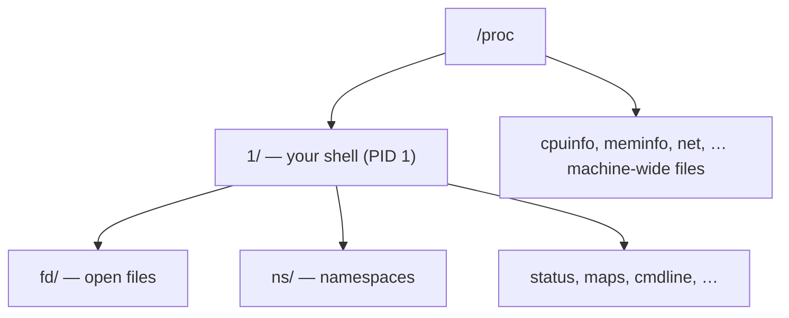
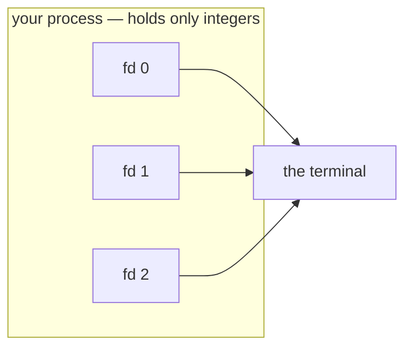

# What is a process?

In 1971, Dennis Ritchie and Ken Thompson were building Unix on a machine with about as much memory as a modern doorbell. They needed programs to cooperate — to reach the disk, the terminal, each other — without one program being able to scribble on another's memory and corrupt the whole machine.

Their fix was so plain it looked like a dodge, and we are not going to state it here. It is one short sentence, you have probably heard it, and hearing it *again* — now, as a rule handed to you — would cost you the only thing that makes it worth anything. So watch what they *did* instead. The disk got reached one way. The terminal got reached the same way. A pipe between two programs, the same way again. Decades later a network connection turned up and got reached that same way too. Four unrelated things, one shape.

Learn four verbs — `open`, `read`, `write`, `close` — and you can talk to the disk, the screen, another process, and a machine on the far side of the planet.

That shape has a name, and it is the last thing Act I hands you rather than the first. You will keep meeting it — on this page twice, and perhaps a dozen more times before the act ends. Hold the pattern; we won't name it yet. When the kernel gives you something new and it behaves like the last thing, just notice it and say nothing.

We're not going to take any of that on faith. We're going to watch it, on the machine you just started.

## Where you are

You ran one line (the flags are explained on the [lab page](README.md)):

```
docker run --rm -it --privileged nicolaka/netshoot
```

and you have a bare `#`. Run these two:

```
whoami
hostname
```

You'll see `root`, and a short random hostname like `3f9a2b1c4d5e`. That name *is* the container — its own little machine, walled off from your Mac, that **evaporates** the moment you type `exit` (that's what `--rm` buys you). So: you are **root** in a self-contained throwaway computer. Total power, zero consequences — the right instinct in here is to poke at everything. (In Act II we'll add one flag to make this container peer at the host's real network; for now it is a world unto itself, which is exactly what we want for "one machine talking to itself.")

## The machine is small enough to know completely

A computer, stripped of mystique, is just the programs running on it. List every single one:

```
ps aux
```

> **`ps aux`** prints every process, one per line.

You'll see something startling — just **two lines**:

```
PID   USER     TIME  COMMAND
    1 root      0:00 zsh
    9 root      0:00 ps aux
```

Your shell, and the `ps` you just ran. That's the entire machine. Now compare with your real computer: open a terminal on your Mac and run `ps aux | wc -l` (that `wc -l` counts lines) — you'll get *hundreds*.

That contrast is the point: **this world is small enough to understand completely.** Nothing here is hidden from you, and we can account for every process in that list. You will not get lost.

And one of those two lines is you:

```
echo $$
```

> **`$$`** is the shell's own process ID (PID).

You'll see `1`. That's not a typo — in a container, the shell you land in is the *first* process, PID 1, the one everything else descends from. You're not outside the machine looking in; you're its very first entry.

## A process is a directory

So where does the machine keep that ledger? It doesn't hide it. The kernel publishes everything it knows, as files, under one directory:

```
ls /proc
```

> **eza twin:** `eza /proc --group-directories-first --icons=always` — your first taste of eza *restructuring* output rather than just colouring it. `--group-directories-first` clusters the process directories apart from the named files, and `--icons=always` tags each entry. (eza's flags are its own dialect, not `ls`'s — learning them side by side is the point.)

You'll see a couple of bare **numbers** — `1` and whatever PID the `ls` got — sitting among a pile of *named* files like `cpuinfo`, `meminfo`, `mounts`, `net`. The numbers are the processes (the same PIDs from `ps`); the names are knobs and readouts for the whole machine, which we'll meet later. For now, go look at your own process — you're PID 1, so:

```
ls -F /proc/1
```

> **`-F`** marks directories with a trailing `/`.
> **eza twin:** `eza -F --group-directories-first /proc/1` — `-F` classifies in both tools, but eza floats `fd/`, `ns/` and the other directories to the top so the shape of a process reads at a glance.

You'll see entries like `fd/`, `ns/`, `status`, `maps`, `cmdline` (plus symlinks `cwd@`, `exe@`, `root@` marked with `@`). That is the kernel's complete view of *you*, laid out as files you can read. A process isn't an abstraction — it's a directory you can walk into.



Notice the shape again. To show you a *running program*, the kernel didn't invent a new interface — it gave you a directory and some files. That's the first sighting on this page, and not the last. Keep count; don't reach for the label. Now open the one directory that the rest of this course turns on.

## What a file actually is: an integer

To a running program, a file is not bytes on a disk — it's a **small integer**. When a process opens something, the kernel does the real work (finding it, tracking it) and hands back a number: a **file descriptor**. The process uses that number for every later `read` and `write`. The number is an *index* into a table the kernel keeps privately for that process; the process only ever holds the integers.



Three are open before any program even starts. See them:

```
ls -la /proc/self/fd
```

> **eza twin:** `eza -la --header /proc/self/fd` — `--header` labels the columns (Permissions, Size, Name, …), which plain `ls -la` never does. The two tools also *disagree* about fd 3 — keep an eye on it; we settle why in **The observer and the observed** below.

> **`/proc/self`** is a shortcut for "whichever process is asking" — here, the `ls` you just ran.

You'll see three numbered symlinks, something like:

```
0 -> /dev/pts/0
1 -> /dev/pts/0
2 -> /dev/pts/0
```

Here is exactly what each one is:

- **`0`** — standard input, your **keyboard**. When you type, bytes arrive on fd 0.
- **`1`** — standard output, your **screen**. Everything you've seen printed left on fd 1.
- **`2`** — standard error, also the screen, kept separate so errors don't pollute real output.

Now watch that number actually move — don't take it on faith. The `>` you use to redirect output is shorthand for `1>`: "point file descriptor 1 somewhere else." You can prove it by making a command report *its own* fd table while you redirect it.

You just saw that normally fd 1 points at your terminal. Run the same listing, but send its output to a file, then read the file back.

> **Predict first —** the same `ls` runs, but its output lands in a file instead of on the screen. Of the three lines it prints, how many will differ from what you saw a moment ago — and what will the different one say?

```
ls -l /proc/self/fd > /tmp/proof
cat /tmp/proof
```

> **eza twin:** `eza -l --color=always /proc/self/fd > /tmp/proof` then `cat /tmp/proof`. eza notices when its output isn't a terminal and drops colour by default (keeping the file clean); `--color=always` forces the colour codes into the file anyway — a small proof that eza, like every program here, just writes bytes to whatever fd 1 points at.

In the file you'll see:

```
0 -> /dev/pts/0
1 -> /tmp/proof
2 -> /dev/pts/0
```

Look at the line for `1`. It no longer points at the terminal — it points at `/tmp/proof`. That's the whole mechanism: `>` didn't change what `ls` *does*; it re-aimed fd 1 *before* `ls` ran, so everything `ls` wrote to "standard output" flowed into the file. (It even shows write-only now, `l-wx`, because `>` opens for writing.)

Here's the clincher. When you ran that, the `ls: /proc/self/fd/3: cannot read link` error still appeared on your **screen** — *not* in the file. That message went out fd **2**, which you didn't touch. You re-aimed fd 1 and left fd 2 alone, and the output split cleanly along those two numbers. That is fd 1 and fd 2 being real, separate things, proven in one command.

**A file descriptor is just a small number naming something this process can read or write**, and `>` is nothing more than the shell re-pointing one of those numbers. The program doesn't care whether the far end is a screen, a file, or — soon — a network.

> **Check yourself —** A process is isolated so it cannot touch another process's memory. So what *can* it touch, and what does it use to name each of those things?

<details>
<summary>Answer</summary>

It can touch whatever the kernel has opened on its behalf, and it names each one with a **file descriptor** — the small integer you have just been moving around, which indexes into a table private to that one process. The isolation is never broken: the process hands the kernel a number, and the kernel does the touching.

</details>

## The observer and the observed

Look at your output from `ls -la /proc/self/fd` again. You almost certainly saw something like this:

```
0 -> /dev/pts/0
1 -> /dev/pts/0
2 -> /dev/pts/0
ls: /proc/self/fd/3: cannot read link: No such file or directory
lr-x------    1 root root 64 ... 3
```

fd 3 appeared — but with an error. Here is exactly what happened.

`ls` works in two passes. First it opens the directory, reads all the entry names into memory, then **closes the directory**. Then it goes back over those names and calls `readlink()` on each one to find the symlink targets.

```
pass 1:  open("/proc/self/fd")  →  fd 3     ← fd 3 now exists
         read entries: {0, 1, 2, 3}
         close(fd 3)                        ← fd 3 now gone

pass 2:  readlink(".../0")  →  /dev/pts/0   ✓  fd 0 is still open
         readlink(".../1")  →  /dev/pts/0   ✓  fd 1 is still open
         readlink(".../2")  →  /dev/pts/0   ✓  fd 2 is still open
         readlink(".../3")  →  ENOENT       ✗  fd 3 was closed
```

By the time `ls` calls `readlink("/proc/self/fd/3")`, fd 3 no longer exists — the kernel drops its `/proc` entry the moment the fd is closed. The error is not about loops or self-reference; it is about timing. `ls` destroyed the thing it was trying to read.

Fds 0, 1, and 2 succeed because they live for the full lifetime of the process. fd 3 is transient: it opens to do a job, closes when the job is done, and vanishes from the ledger.

The act of listing your open file descriptors opened a new file descriptor. **fd 3 is real** — it exists in the kernel's table — but only while it is open. The error is the kernel's honest report that by the time you asked, it was already gone.

### The same fd 3, shown alive

Now run the eza twin on the very same directory.

> **Predict first —** `ls` could only report fd 3 as an error. `eza` is about to list the identical directory in the identical kernel. If it reports no error, what must it be doing differently — and what would fd 3 point at if you *could* see it?

```
eza -la --header /proc/self/fd
```

This time there's **no error** — and fd 3 isn't blank. You'll see something like:

```
lr-x------  - root ...  3 -> /proc/<pid>/fd
```

eza reads the directory the other way around: it keeps the directory **open** while it resolves the links. So when it `readlink`s fd 3, fd 3 is still its own live handle — pointing straight back at the directory it is busy listing. Where `ls` revealed fd 3 by its *absence* (an error, because it had already closed the handle), eza reveals it *alive*: `3 -> /proc/<pid>/fd`, the observer caught in the act of observing itself.

Same kernel, same fd, two honest renderings — `ls` shuts the door before checking what's behind it; eza checks while the door is still open. Run them back to back and you've watched the fd table change depending only on *who is looking*, which is the deepest thing this page has to teach.

## Where you are now

You can now answer these three questions:

1. What is a process? A numbered directory in `/proc` containing the kernel's complete view of a running program.
2. What is a file descriptor? A small integer, privately indexed per process, pointing at something the process can read or write.
3. Why did fd 3 appear with an error? Because `ls` closes its directory handle before calling `readlink()` on the collected entries — by the time it asks "what does fd 3 point at?", fd 3 is already gone.

That's the whole anatomy of a process. Now look at how processes use those descriptors to talk to each other and to the network.

> **You understand this when you can** run `ls -la /proc/self/fd` and `eza -la --header /proc/self/fd` back to back and say, before you press Enter on either, which one will print `cannot read link: No such file or directory` for fd 3 and which will print `3 -> /proc/<pid>/fd` — and why both are telling the truth about the same kernel.

→ Next: **[How processes communicate](02-how-processes-communicate.md)**
