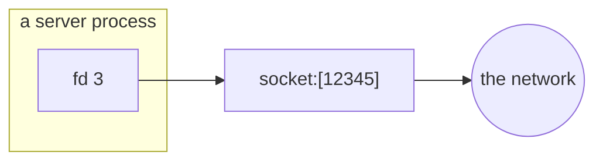
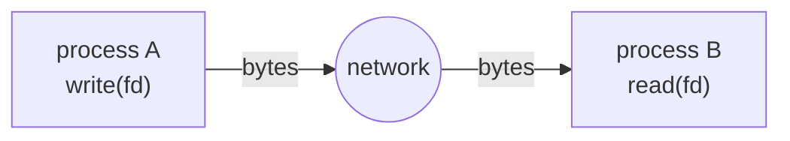

# How processes communicate

You now know that a process is a directory in `/proc`, and that its open connections to the world are integers — file descriptors — sitting in `fd/`. You know fd 0 is the keyboard, fd 1 is the screen, fd 2 is error.

The question is: how does a process reach *outside* itself — to another process, or to a machine on the other side of the planet?

The answer is the same four verbs: `open`, `read`, `write`, `close`. The only thing that changes is what the file descriptor points at.

## From local to remote

The simplest inter-process channel is a **pipe**: one process writes to fd 1, the shell wires that to another process's fd 0, and bytes flow between them. You have already used this without thinking about it — `ps aux | wc -l` is a pipe. The `|` character tells the shell to create a pipe and connect the two processes through it. Watch it happen to the descriptors themselves.

> **Predict first —** `ls`'s fd 1 normally points at your terminal, and here its output is going into `cat` instead. What will the line for fd 1 say this time?

```
ls -la /proc/self/fd | cat
```

> **eza twin:** `eza -la --color=always /proc/self/fd | cat` — eza would normally strip colour when it sees the pipe (fd 1 isn't a terminal); `--color=always` keeps it. That auto-detection is eza reading the very fd this lesson is about.

Normally `ls`'s fd 1 points at your terminal. But look at the line for `1`:

```
1 -> pipe:[2963238]
```

`ls`'s standard output is no longer the screen — the shell swapped it for one end of a pipe, and `cat` is reading the other end (over in its own process). Same four verbs, same fd 1; only the far end changed, from a terminal to a pipe. (You'll also see the transient `fd 3` that `ls` opened to read the directory, just like in the previous lesson.)

But a pipe only works between processes on the same machine. For two machines to talk, you need something with a wider reach.

## The socket entry

That something is a **socket**. A socket is a file descriptor that points not at a file on disk or a pipe in memory, but at the kernel's networking stack — which knows how to wrap bytes in packets and deliver them to another machine.

Look at what one looks like in `/proc`. A fresh lab container isn't running any servers yet, so start one yourself — `nc` (netcat) will sit and listen on a port:

```
nc -l 9999 &
```

> **`nc -l 9999`** opens a listening socket on port 9999. **`-l`** means *listen*, and the port is the plain positional argument — the OpenBSD `nc` in this image refuses `-p` alongside `-l`. The **`&`** runs it in the background so you get your prompt back.

Now inspect *its* file descriptors.

> **Predict first —** you know what fds 0, 1, and 2 are. The listening socket is the only new thing `nc` opened. Which number will it be, and what will it point at — a path, the port number, or something with no name at all?

```
ls -la /proc/$(pgrep -n nc)/fd
```

> **`pgrep -n nc`** prints the PID of the newest `nc` process, so you don't have to look it up.
> **eza twin:** `eza -la --header --classify /proc/$(pgrep -n nc)/fd` — `--classify` marks the symlinks with `@`, making the `socket:[...]` entry stand out from the plain `0/1/2` at a glance.

Among the familiar `0`, `1`, `2` you'll see:

```
3 -> socket:[2965120]
```

That `socket:[…]` is the clue (the number in brackets is the kernel's internal ID for the socket). The process holds only the integer `3` — but through that integer it can reach the network. When you're done, stop it with `kill %1`.



When a socket shows up in a process's `fd/` list, that process can talk to the network. When it doesn't, it can't — no matter what else is true about the process. The socket is the gate.

> **Check yourself —** `nc` holds the integer `3`, and `/proc/<pid>/fd/3` reads `socket:[2965120]`. Is that bracketed number the port `nc` is listening on?

<details>
<summary>Answer</summary>

No. The port is `9999`, and it appears nowhere in that line. The bracketed number is the kernel's own ID for the socket *object* — a completely separate thing from where that socket sits on the network. One number names the object; the other names the door it answers on. In Act I you use the first to find the second.

</details>

## The question to carry everywhere

That gives you the single most useful tool in this course — a question to bring to every new thing you meet:

> **What is the file here, who can read it, and who can write it?**

Ask it of a socket, a network interface, a routing table, a container, a Kubernetes Pod — and each one stops being magic and becomes a file with an owner. We're going to answer that question, concretely, for each of those things as we reach it, and by the end you'll have collected the whole set.

## The one sentence everything answers

And here is what all of it is in service of:

> **How do we make `write()` on one machine become `read()` on another?**



A socket makes `write` and `read` work between two processes on one machine. IP makes them work between two machines. TCP makes them work *reliably* across a network that drops and reorders. Namespaces make one machine pretend to be many. Kubernetes makes many machines each pretend to be many. But it is the same four verbs all the way down: open, read, write, close.

## Where you are now

If you can:

- run `ls -la /proc/self/fd` and explain every line including the self-referential fd 3,
- identify a socket entry and say what it means for a process to hold one,
- state the question to ask of every new networking primitive you meet,

— then you have the whole foundation. Everything in the acts ahead is an answer to the one sentence above.

> **You understand this when you can** start `nc -l 9999 &`, list that process's descriptors in one command, and point at the exact line that proves it can reach the network — naming which of `3`, `9999`, and `socket:[…]` is the descriptor, which is the port, and which is neither.

→ Next: **[Act I — One machine talking to itself](../act-1-one-machine/README.md)**, where you open the table yourself and meet your first socket.
