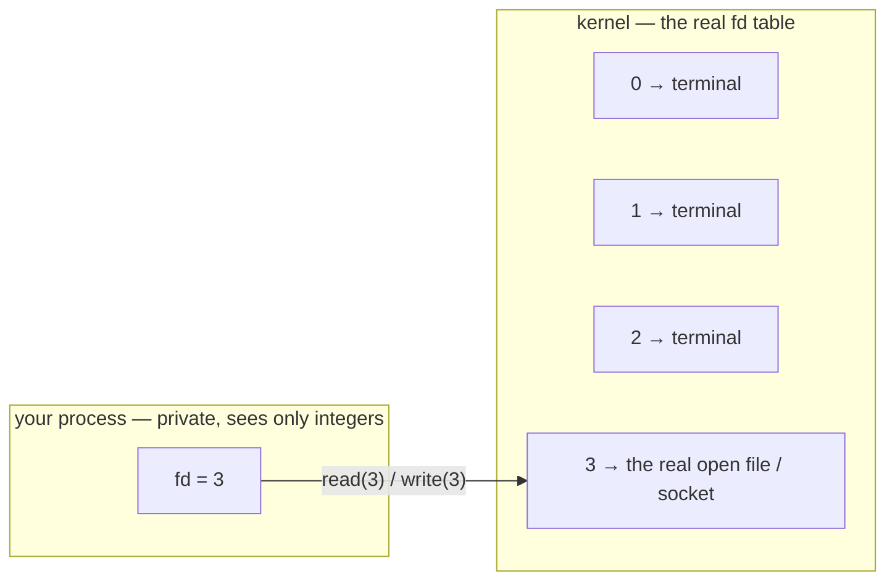

# The file-descriptor table

In the orientation you saw the three descriptors every process starts with — `0`, `1`, `2` — and learned that a network connection shows up in that same list as a `socket:[...]`. Now we work the table itself: add a row by hand, read what's stored behind it, and then write a tiny C program that makes a **file** and a **socket** appear in one table, side by side. That last picture is one to sit with when you reach it — we'll let it speak for itself rather than tell you what it means.

## Why a number, and not the thing itself?

Why does the kernel hand a program a *number* instead of letting it reach out and touch the disk or the network directly? Isolation. On a shared machine, a program that can reach into another program's memory can corrupt the whole system, so the kernel gives each process a **private address space** it cannot escape. That immediately creates a new problem: a process sealed off like that can't touch *anything* outside itself either.

The file descriptor is the resolution. The process can't reach out, so the kernel **hands things in** — as small integers the process passes back on every `read` and `write` to say which open thing it means.



The integer is never the file. It's a **row number** in a table the kernel keeps for you — and which you're forbidden to touch directly, precisely so you can't corrupt it.

## Make a row appear, then make it vanish

You can add a row by hand. The shell opens a descriptor and keeps it open if you attach it to the shell itself with `exec`.

> **`exec N>file`** opens file descriptor `N` in the current shell, pointed at `file`. **`exec N>&-`** closes it.

Run it.

> **Predict first —** after `exec 3>/tmp/scratch`, how many entries will `/proc/self/fd` show, and what will the new one point at?

```
exec 3>/tmp/scratch
ls -la /proc/self/fd
```

You'll see your new descriptor — `3 -> /tmp/scratch` — listed write-only (`l-wx`, because `>` opens for writing), alongside `0`, `1`, `2`. You'll also catch a transient higher number (e.g. `4`) that errors with `cannot read link` — that's the descriptor `ls` opened to read the directory, gone before the link resolves. Now close yours:

```
exec 3>&-
ls -la /proc/self/fd
```

The `3` is gone. You just added and removed a row in the kernel's table and watched its own record of your process change, live. `exec 3>...` did nothing but ask the kernel to insert one row and tell you the index.

## What's stored behind a row

The descriptor is the index; the kernel holds the real bookkeeping. It publishes that too:

```
cat /proc/self/fdinfo/1
```

You'll see a few lines — `pos:` (the byte offset — how far into the file you've read or written), `flags:` (how it was opened), and a couple of identifiers like `mnt_id:` and `ino:`. That's the metadata the process itself isn't allowed to change directly, published read-only. The tool that tidies all of this into one labeled block is `ls -la /proc/self/fd` — it invents nothing; it just formats the table.

## Your first C program: a file and a socket, side by side

Everything so far has been the *shell's* table. Now make your **own** descriptors appear from C. This needs a **C compiler**, which plain `nicolaka/netshoot` doesn't have, so **switch to the `netlab` image** now (netshoot *plus* a compiler, with the course's C baked in at `/code`). Type `exit` to leave this container, then start netlab:

```
docker run --rm -it --privileged --name lab netlab
```

> **Haven't built `netlab` yet?** On your Mac (not inside a container), run this once — full guide in [the lab code guide](../code/README.md):
> ```
> docker build -t netlab networking-fundamentals/code    # from a clone
> docker build -t netlab .                               # from your own folder of the four files
> ```
> The two commands differ on purpose: `docker build` takes a **folder path** (where the Dockerfile lives) and `-t netlab` *names* the image; `docker run` then takes that **image name**, not a path. Which is also why the folder path only ever appears here: from now on everything is `/code`, *inside* the image. Not cloning? [The four files are printed in full](../code/minihttp.c).

Read [`code/fd-demo.c`](../code/fd-demo.c) — stripped to what it *does*, it's four lines:

```c
printf("my pid is %d\n", getpid());
int file_fd = open("/etc/hostname", O_RDONLY);   // open a file   -> get an fd
int sock_fd = socket(AF_INET, SOCK_STREAM, 0);   // open a socket -> get an fd
getchar();                                        // then wait, so you can look
```

It opens a file, opens a socket, and **waits**. `open()` and `socket()` are the two system calls; each just returns "the next free integer" — ignore the C around them for now. Build and run it:

```
cc -Wall -o /tmp/fd-demo /code/fd-demo.c
/tmp/fd-demo
```

It prints the two descriptors it got, then waits:

```
my pid is 13
...
open("/etc/hostname") -> fd 3
socket(TCP)            -> fd 4   <-- a socket is just another fd
Press Enter to exit ...
```

So **fd 3 is a file, fd 4 is a socket**, and the program holds both. It now owns this terminal, waiting — so to look at it you need a **second shell into the same container**. On your Mac, open a new terminal tab and `exec` into the running `lab` container:

```
docker exec -it lab zsh
```

> **`docker exec -it lab zsh`** opens another interactive shell inside the *already-running* container named `lab`, sharing its processes and network. You'll use this second-shell trick constantly from here on.

In that second shell, look at fd-demo's table (use the PID it printed):

```
ls -l /proc/13/fd
```

```
0 -> /dev/pts/0
1 -> /dev/pts/0
2 -> /dev/pts/0
3 -> /etc/hostname
4 -> socket:[3331228]
```

There it is, plain as day: **a file (`3 -> /etc/hostname`) and a socket (`4 -> socket:[...]`) in the same table, addressed by the same kind of integer** — and the program will `read`/`write` both with the same calls.

Sit with that for a second before you move on. If the kernel hands you a network endpoint through the *exact* mechanism it hands you a file, what does that suggest the network *is*, as far as your program is concerned? You don't have to answer yet — just notice it. (It's the first of many times the kernel will quietly make the same point; by the end of the act you'll have a name for it of your own.)

Back in the first shell, press **Enter**; fd-demo exits and both descriptors vanish.

> **Check yourself —** Two different processes both have a file descriptor `3`. Are they referring to the same thing?

<details>
<summary>Answer</summary>

Almost certainly not. The fd table is **per-process**, so `3` is an index into *that* process's table. Two processes with fd 3 are pointing at two unrelated open files — unless one forked from the other, or a descriptor was deliberately passed between them.

</details>

## Meet `lsof` — the fd table, read for you

You've been reading the table by hand with `ls -l /proc/<pid>/fd`. The tool whose entire job is to do exactly that — for any process, with each descriptor's *type* spelled out — is **`lsof`** ("list open files"). It invents nothing: it reads the same `/proc` you just read.

> **`lsof -p <pid>`** lists every open file and socket a process holds.

With fd-demo still running (or start it again with `/tmp/fd-demo &`), from your second shell:

```
lsof -p $(pgrep -n fd-demo)
```

Among fd-demo's rows are the **file** and the **socket** you already found by hand:

```
COMMAND PID USER  FD   TYPE   DEVICE NODE     NAME
fd-demo  13 root   3r   REG     0,42          /etc/hostname
fd-demo  13 root   4u  IPv4  3331228          TCP   *:*
```

The same `3 → /etc/hostname` and `4 → socket`, now with a `TYPE` column the raw symlink never gave you: `REG` (a regular file) and `IPv4` (a TCP socket). fd-demo's socket still has *no address* — the bare, unplaced socket we examine next lesson — so there's no `host:port` for it (your `lsof` may word that address-less line slightly differently). **`lsof` is the `/proc/<pid>/fd` reader, automated.** Keep one reflex from the very start: if a tool ever disagrees with the file, the file wins — you can always drop back to `ls -l /proc/<pid>/fd`.

> **Image note —** plain `nicolaka/netshoot` ships only a *busybox* `lsof` stub that ignores `-p`/`-i` and dumps everything; the `netlab` image you switched to installs the real one, so run this there. Its killer flag — `lsof -i :PORT`, *"who owns this port?"* — arrives in lesson 5.

## Where you are now

You can add and remove a descriptor with `exec` and explain what the integer indexes; read a row's metadata from `/proc/self/fdinfo`; read any process's whole table with `lsof -p`; and you've watched a file and a socket occupy one table as the same kind of integer.

> **You understand this when you can** open a descriptor with `exec 3>/tmp/scratch`, point at the new `3 -> /tmp/scratch` line in `/proc/self/fd`, close it with `exec 3>&-`, and — from fd-demo's two printed descriptors alone — predict which one `lsof -p` will label `REG` and which it will label `IPv4`.

But notice the asymmetry. The *file* on fd 3 pointed at something you can name — `/etc/hostname`. The *socket* on fd 4 pointed at `socket:[3331228]` — a bare number, and the program did nothing with it. What is that thing the socket points at, really? That's the next file.

---

↑ **[Act I overview](README.md)** · Next: **[What a socket really is](02-the-socket-object.md)** →
