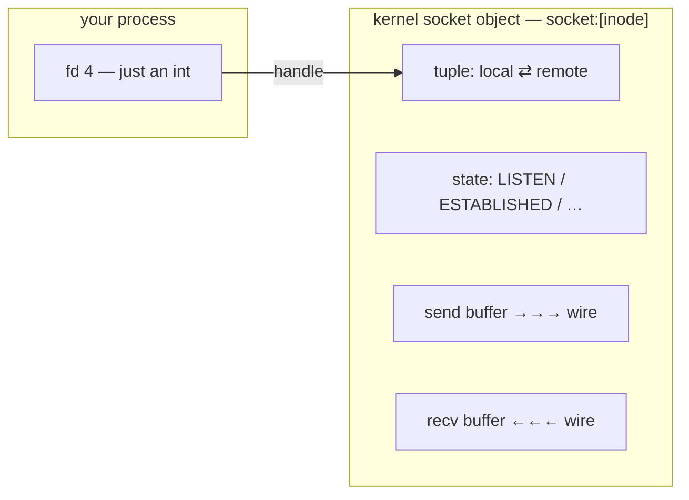

# What a socket really is

fd-demo left you with a puzzle. The file on fd 3 pointed at `/etc/hostname` — a thing with a name. The socket on fd 4 pointed at `socket:[3331228]` — a bare number, and the program never used it. Start fd-demo again and pull that number out on its own — it's a brand-new socket, so expect a brand-new number — because you'll need it in a minute:

```bash
/tmp/fd-demo &
INO=$(readlink /proc/$(pgrep -n fd-demo)/fd/4 | sed 's/[^0-9]//g')
echo "socket inode: $INO"
```

```
socket inode: 3363350
```

One integer in your process (`4`), one integer in the kernel (`3363350` this time), and not a single name between them. This file is about what that second number points at: a socket is an integer in *your* process, but a handle to a surprisingly rich object in the **kernel**. Understand that object now and the rest of Act I is just reading its fields out of files. (Leave fd-demo running.)

## The problem: a connection isn't a file you can open

By the early 1980s, Unix could open files, pipes, and terminals through the same four verbs — `open`, `read`, `write`, `close` — and that uniformity was the whole point. Then networking arrived and didn't fit. A network connection is not a path you can `open` by name. It has *two* endpoints, a protocol, a direction of setup, and it can fail in ways a local file never does.

The team building TCP/IP into BSD Unix had a choice: invent a separate, parallel set of system calls for the network, or make a connection look enough like a file that `read` and `write` still worked on it. They chose the second — the **sockets API** — which is why, once a connection exists, sending data across the internet is the same `write()` you'd use on a file. The price of that uniformity is a small ritual of *new* calls to bring the connection into being before the familiar verbs take over.

## A socket is a handle — to something the kernel keeps

`socket()` asks the kernel to create one endpoint of a communication channel and hands back an integer — indistinguishable, in your process's table, from a descriptor for a file. Its arguments pick the *kind*: `AF_INET` (IPv4) + `SOCK_STREAM` (a reliable TCP byte stream). **No struct comes back — just the integer.**

So where does the socket's behavior live? In the kernel. Behind that fd is the real thing — in the Linux source it's a `struct socket` wrapping a `struct sock` — which you never touch directly but which holds everything that makes a socket *a socket*. The fd is just a handle; this object is what it points at, and it carries three things worth knowing:

- **Identity — the tuple.** A connected socket is defined by four numbers: *local IP, local port, remote IP, remote port* (plus the protocol, making five). That tuple is how the kernel decides which socket an arriving packet belongs to.
- **Two buffers — send and receive.** Each socket owns a send queue and a receive queue in kernel memory. This is the part that surprises people: `write(fd, …)` does **not** put bytes on the wire — it *copies them into the send buffer* and returns, and the kernel transmits when it can. `read(fd, …)` does **not** touch the wire either — it *pulls bytes out of the receive buffer*, blocking if the buffer is empty. Your program only ever talks to these two buffers; getting them onto and off the wire is the kernel's job.
- **State.** A TCP socket carries a state — `LISTEN`, `ESTABLISHED`, `TIME_WAIT`, … — that the kernel advances as the connection is set up and torn down.



## Does a bare socket appear in the kernel's list of sockets?

fd-demo's socket was *just* `socket()` — never given an address, never connected. The kernel keeps a master list of TCP sockets, and you still have this one's inode sitting in `$INO`, so you can go and look:

> **`/proc/net/tcp`** is the kernel's table of every TCP socket that has an address — listeners and connections, one per row. (You decode it by hand in lesson 05.)

> **Predict first —** will fd-demo's socket be in that table, or not?

```bash
grep "$INO" /proc/net/tcp
```

**Nothing comes back** — in a fresh container, `/proc/net/tcp` is empty entirely. The socket object exists (it has an inode, it sits in fd-demo's table), but it has earned **no row** in the TCP ledger, because it has no address: no local port, no peer, no tuple. An endpoint that hasn't been *placed* anywhere is real but unreachable. (Stop fd-demo: `kill %1`, or press Enter in its shell.)

That is the gap the rest of the ritual closes. A socket becomes findable only once something fills in its identity.

## Two roles: who waits, who goes looking

There are exactly two ways that identity gets filled in — the two ways a socket is *used*:

- **A server** stays put and waits to be found: `socket()` → `bind()` (claim a local address) → `listen()` (announce it will accept) → `accept()` (take each caller). That's minihttp, next file.
- **A client** goes looking: `socket()` → `connect(fd, server_addr)` — no bind/listen/accept — and straight to `read`/`write`. That's `curl`.

Two roles, one object. Either way, the moment the connection exists, both ends do the same humble thing: `read` and `write` an integer.

> **Check yourself —** Your program holds the integer `4`. Where does the socket's real state — its buffers, its state, its four-tuple — actually live?

<details>
<summary>Answer</summary>

In the kernel. The integer is only a handle; every byte of the socket's state lives in a kernel object your process cannot address directly. That is why closing the descriptor and destroying the socket are two different events, and why `/proc/net/tcp` can show you a socket your program has already stopped looking at.

</details>

## Where you are now

You can explain why the socket in your process is just an integer — a handle to a kernel object that holds a connection's **tuple**, its **two buffers**, and its **state**. You can say what `write()` and `read()` really do (copy into / pull from those buffers, not the wire). And you've proven that a bare, address-less socket earns no row in `/proc/net/tcp` — identity is something a socket has to be *given*.

> **You understand this when you can** say what `write(4, buf, 100)` has actually accomplished by the time it returns — 100 bytes copied into that socket's send buffer in kernel memory, and not one byte on any wire — and explain why fd-demo's socket has an inode you can `grep` for but no row in `/proc/net/tcp` to find.

So give it one. The next file takes a bare socket and runs the server ritual — `bind`, `listen`, `accept` — turning it into minihttp, the program you carry through every act, and watches each kernel call happen live.

---

← Prev: **[The file-descriptor table](01-the-fd-table.md)** · ↑ **[Act I overview](README.md)** · Next: **[Building minihttp, the listening server](03-minihttp-server.md)** →
