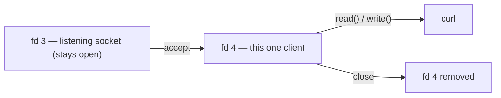
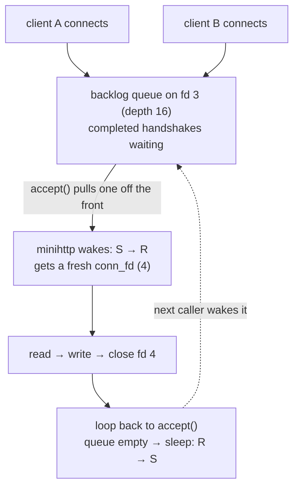
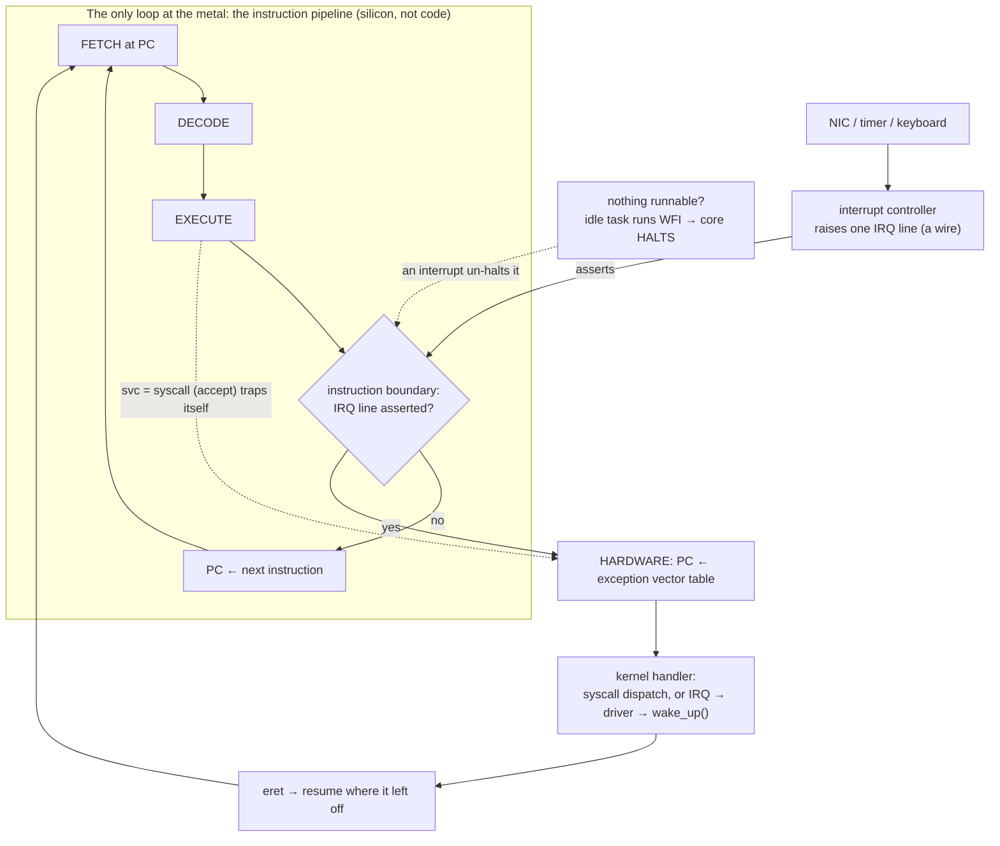

# Building minihttp, the listening server

You have a bare socket with no identity. Now you give it one. A server runs a short, fixed ritual — `socket` → `bind` → `listen` → `accept` — that turns that address-less endpoint into a doorway the rest of the machine can find. The program that does it is **minihttp**, the ~40-line server you carry through all five acts. In this file you read it, run it, and watch the kernel perform the ritual one system call at a time.

## The ritual, in five verbs

Read [`code/minihttp.c`](../code/minihttp.c) — stripped to what it *does*, the whole server is this:

```c
int listen_fd = socket(AF_INET, SOCK_STREAM, 0);  // 1. a socket — same call as fd-demo
bind(listen_fd, ... INADDR_ANY : port ...);       // 2. claim 0.0.0.0:port  (give it identity)
listen(listen_fd, 16);                            // 3. mark it "accepting connections"
for (;;) {
    int conn_fd = accept(listen_fd, NULL, NULL);  // 4. wait; each caller = a NEW fd
    read(conn_fd, ...);                           //    read the request on that fd
    write(conn_fd, ... "HTTP/1.1 200 OK" ...);    //    write the reply on that fd
    close(conn_fd);                               //    hang up; that fd is gone
}
```

- **`socket()`** — the same call fd-demo made; returns the listening fd.
- **`bind()`** — claims a local address and port. *This* is the step fd-demo never ran, the one that gives the socket its identity.
- **`listen()`** — flips the socket into a state where the kernel will queue incoming connections for it.
- **`accept()`** — hands back a *second, new* fd for one specific conversation.

Then plain `read`/`write`/`close` — the *same* verbs you'd use on a file. The detail to hold onto: **`accept()` returns a brand-new descriptor for every connection.** Build and run it (you're in `netlab` from the last lesson; if not, `docker run --rm -it --privileged --name lab netlab`):

```bash
cc -Wall -o /tmp/minihttp /code/minihttp.c
/tmp/minihttp 8080
```

> In `netlab` it's **already compiled** at `/code/minihttp`, so `/code/minihttp 8080` works too. (Staying in plain netshoot? `nc -l 8080` stands in as a listening socket, minus the `accept()`→fd 4 demo below.)

It prints:

```
minihttp: pid 12, listening on 0.0.0.0:8080 via fd 3
```

So the listening socket is fd `3` — and unlike fd-demo's bare socket, this one has been *bound*, so it now has an identity. **Leave it running** — it owns this terminal, blocked in `accept()` waiting for a caller (typing here does nothing; it only reads its socket).

## Watch the kernel build it, call by call

Don't take the ritual on faith — trace minihttp making each call. Stop it (`Ctrl-C`) and rerun it under `strace` in this first shell:

> **`strace -e trace=...`** runs a program and prints each listed system call as it happens, with arguments and return value.

> **`ltrace`** is its sibling: it traces *library* calls (the `libc` functions your program calls) instead of syscalls — same idea, one layer up.

> **A forward note on cost (and why we don't reach for eBPF yet) —** `strace` works by *stopping* the program at every syscall (via `ptrace`), so it can badly slow a busy process. There is a modern, near-free way to watch the same events from *inside* the kernel — **eBPF** (`bpftrace`) — but a `bpftrace` one-liner is a small program loaded into the kernel, so it only makes sense once you understand kernel hooks. We earn it in the Kubernetes stage, not here. Until then, `strace` is exactly right.

> **Predict first —** name the calls you expect to see, in order, *before* any client connects. Which one will the program stop inside?

```
strace -e trace=socket,bind,listen,accept /tmp/minihttp 8080
```

Mixed in with minihttp's own output, the ritual prints itself:

```
socket(AF_INET, SOCK_STREAM, IPPROTO_IP) = 3
bind(3, {sa_family=AF_INET, sin_port=htons(8080), sin_addr=inet_addr("0.0.0.0")}, 16) = 0
listen(3, 16)                           = 0
accept(3, NULL, NULL
```

Read it top to bottom. `socket()` returned **3** — exactly the fd minihttp announced. `bind()` claimed `0.0.0.0:8080` and returned `0` (success). `listen()` returned `0`. Then `accept(3, NULL, NULL` just… stops, with no return value printed. It's **blocking** — the kernel has parked minihttp inside `accept()`, waiting for someone to knock.

### Reading the address struct

That `bind()` line carries the one data structure your *program* builds — the **address**. `bind()` needs to know *where* to place the socket, so minihttp fills in a `struct sockaddr_in` (in [`code/minihttp.c`](../code/minihttp.c)) and hands `bind()` a pointer to it. strace prints its fields:

```c
struct sockaddr_in addr = {0};
addr.sin_family = AF_INET;                  // sa_family=AF_INET   → this is an IPv4 address
addr.sin_addr.s_addr = htonl(INADDR_ANY);   // sin_addr=0.0.0.0    → every interface
addr.sin_port = htons(port);                // sin_port=htons(8080)→ the port
```

- **`sin_family` = `AF_INET`** — the address family: IPv4 (vs. IPv6, or a Unix-domain socket). It tells the kernel how to read the rest of the struct.
- **`sin_addr` = `0.0.0.0`** — the IP to bind, here `INADDR_ANY` ("every interface" — a dial we return to in the loopback lesson).
- **`sin_port` = `htons(8080)`** — the port. `htons` ("host **to** network **short**") flips the two bytes into **network byte order** (big-endian), the order every machine agrees to use, so `8080` means the same thing on both ends regardless of the local CPU. (You meet byte order again in lesson 5, reading these numbers back out of a kernel file by hand.)

The trailing **`16`** is just the struct's size in bytes (`sizeof(struct sockaddr_in)`), which `bind()` needs because C hands it a raw pointer with no length attached. So the whole "addr object" is four things: a family, an address, a port, and a length — and `bind()` staples it onto socket `3`. That single call is what moves the socket from "bare, no row in `/proc/net/tcp`" (where fd-demo's stayed) to "has an identity the whole machine can see."

## A connection arrives: accept mints a new fd

Now knock. From your **second shell** (`docker exec -it lab zsh` if you closed it — if that errors with `No such container: lab`, the first shell's `lab` container exited too; restart it with `docker run --rm -it --privileged --name lab netlab` and rerun minihttp before trying again).

> **Predict first —** minihttp's listening socket is fd 3, and `accept()` is about to hand back a descriptor for this one conversation. Which integer will it be, and why that one?

```
curl -s localhost:8080
```

Look back at the first shell. The blocked line completes and a new one appears:

```
accept(3, NULL, NULL)                   = 4
accept(3, NULL, NULL
```

`accept()` returned **4** — a brand-new descriptor for this one conversation — then immediately blocked again on the next `accept()`, ready for the next caller. Every line of that trace maps to one kernel action, in the exact order the diagram predicts. Stop strace with `Ctrl-C`, then run minihttp plainly (`/tmp/minihttp 8080`) and `curl` it again; this time minihttp's own output shows the connection:

```
--- a request arrived on fd 4 ---
GET / HTTP/1.0
```

A **new** descriptor — `fd 4`. minihttp reads the request on 4, writes the reply on 4, then `close`s it and fd 4 is gone. The listener (fd 3) stays open for the next caller.



**Every connection a server handles is one more row in the fd table, created on `accept` and dropped on `close`.** A server is not a different *kind* of thing from fd-demo — it's a process with a socket open, that happens to keep minting new ones.

## The loop and the wait: who becomes the receptionist

Two things trip everyone up here. *What makes fd 3 the "listener" and fd 4 a "connection" — aren't they both just sockets?* And *what is the program actually doing while it waits?* Both have crisp answers.

**Nothing about the socket itself makes it a listener — a verb does.** fd 3 started life identical to fd-demo's bare socket. The call that promoted it is `listen()`:

```c
listen(listen_fd, 16);   // fd 3 is now PASSIVE — queue callers; don't expect data on it
```

`listen()` flips the socket into *passive* mode: it will never carry application data itself. From now on its only job is to be the thing you call `accept()` on. *That* is what "receptionist" means — a socket you only ever `accept()`, never `read()`/`write()`. fd 4 is the opposite: it is **born connected**, handed back by `accept()` already wired to one client, and you never call `listen()` on it. So the split isn't something the kernel stamps onto a socket — it's decided entirely by which calls the program makes. Run `listen()` on it → receptionist. Get it back from `accept()` → conversation. Same kind of object; different job, assigned by a verb.

**The wait is a real sleep, not a spin.** When the loop reaches `accept()` and no caller is queued, the kernel takes minihttp *off the CPU entirely* and marks it sleeping until a connection arrives. You can see that state directly. With minihttp running and idle (nobody connected), from your **second shell**:

```
grep State: /proc/$(pgrep -f minihttp | head -1)/status
```

> **`/proc/<pid>/status`** is the kernel's human-readable status page for a process; its `State:` line says whether it's running, sleeping, etc.

```
State:	S (sleeping)
```

`S` is *interruptible sleep* — the process is parked, using **zero CPU**, waiting to be woken. This is the same freeze you saw under `strace`, where `accept(3, NULL, NULL` simply stopped with no return value. A server that spends its life "waiting for connections" is not burning a core in a `while` loop asking *anyone yet? anyone yet?* — it is asleep, and the kernel wakes it the instant a client's connection is fully set up — that setup is a three-step **handshake**, and we take it apart message by message in lesson 5b. (For the sub-millisecond it actually serves a request the state flips to `R`, running — usually too brief to catch.)

**Where do callers wait before `accept()` reaches them?** In the *backlog* — that's the `16` in `listen(listen_fd, 16)`. Connections whose handshake has already completed, but that minihttp hasn't `accept()`ed yet, line up in a kernel queue attached to fd 3, up to 16 deep. `accept()` pulls the next one off the front. If a 17th piles up before the loop comes back around, the queue is full and the kernel refuses the overflow.



So the whole loop is five beats: **sleep in `accept` → wake when a caller arrives → get a fresh fd → serve it → close it → sleep again.** fd 3, the receptionist, is constant across every turn; the conversation fd is new each turn and gone by the end of it.

One consequence worth naming: minihttp serves **one client at a time**. It doesn't return to `accept()` until it has finished `read`/`write`/`close` on the current connection — so while it handles client A, client B waits in that backlog queue. Real servers escape this by handing each `conn_fd` to a thread, a forked process, or an event loop (`epoll`) and sprinting straight back to `accept()`. The shape never changes, though: **one persistent listener asleep in `accept`, a fresh descriptor per client.**

## The shadow it casts: the table has a ceiling

Since each connection is a row, and the table has a maximum size, a server can run out of *rows* while CPU and memory sit idle. Check the ceiling:

```
ulimit -n
```

In this lab you'll see a big number like `1048576` — the soft limit on open descriptors (`RLIMIT_NOFILE`). The exact value varies wildly by environment (Docker Desktop sets it high; many production setups cap it far lower — `1024` was the classic default), but the failure mode is identical: when a busy server hits its ceiling, the next `accept()` fails with **"too many open files" (`EMFILE`)**. The server looks healthy on every resource graph and silently stops taking connections — because the resource that ran out is *table rows*, not memory or CPU.

> **`prlimit --pid <pid>`** shows (and can set) the same limits for an *already-running* process — useful when you can't restart it to change a `ulimit`.

> **Check yourself —** minihttp is busy serving one client on fd 4 when a second client connects. What is the second connection doing, and whose fd table is it in?

<details>
<summary>Answer</summary>

It is waiting in the backlog queue attached to fd 3 — the kernel has finished setting it up and is holding it — and it is in **nobody's** fd table yet. A descriptor for it comes into existence only when minihttp loops back around to `accept()`, because `accept()` is the call that mints it. So a connection can be fully alive in the kernel while the application has no handle on it at all.

</details>

## The question this leaves for containers

A container is nothing more than a process holding socket descriptors, so everything you just watched applies to one unchanged. Two questions to carry, unanswered:

- Something *outside* the process has to decide whether it is healthy, and the only evidence available from outside is the ritual you just traced. Which half would you use — a bare `connect()`, or a `connect()` followed by a `write()` and a `read()`? What would each one fail to notice about a server that is listening but broken?
- You watched `accept()` mint a fresh row per client, and you found the ceiling with `ulimit -n`. A proxy fronting a thousand backends holds how many rows? Hold the shape: **the resource that runs out first is table rows, and no CPU or memory graph shows it running out.**

Act V puts both on trial against real machinery.

## Where you are now

You can name the server ritual — `socket` → `bind` → `listen` → `accept` — and say what the kernel does at each step. You read the `struct sockaddr_in` that `bind()` takes, and you know it's `bind()` that finally gives a socket the identity fd-demo's lacked. You know that `listen()` is the verb that turns fd 3 into the receptionist — a passive socket you only ever `accept()` — while every fd `accept()` returns is born connected. You watched `accept()` block and then mint fd 4 the instant a client connected, saw that "blocking" is the process *sleeping* (`State: S`) at zero CPU until the kernel wakes it, and you can explain why a busy server runs out of descriptors before it runs out of memory.

> **You understand this when you can** run `strace -e trace=socket,bind,listen,accept /tmp/minihttp 8080` and name each of the four return values before you read them — `3`, `0`, `0`, then no return value at all — and say which single one of those four calls is the one that gave the socket the identity fd-demo's never had.

But that `curl localhost:8080` hides something. The request reached minihttp **without touching a network card** — there isn't even one in here to touch. How does a machine send a packet to itself, and how fast is that? That's the next file.

## Appendix — one level below the syscall *(optional, hardware)*

Nothing later in the course needs this, which is why it sits at the end rather than interrupting the lesson. But if "the kernel wakes it" left you unsatisfied, open it.

<details>
<summary>If minihttp is asleep at zero CPU, how does the CPU even <i>notice</i> a connection arrived?</summary>

If minihttp is parked at zero CPU, *something* has to wake it — but it isn't polling, and nor is the kernel. The mechanism is wires, not code, and it splits in two:

- **A syscall is not *listened for* — it is *caused*.** When `accept()` runs the **`svc` instruction** *(supervisor call — like pulling a fire alarm: the program deliberately trips a switch that instantly hands control to the kernel)*, that instruction **is** the trap: it diverts the **program counter** *(the CPU's bookmark — the address of the next instruction it will run)* straight to a fixed kernel entry, like a `call` into privileged code. (That's the `el0_svc` you'd see in the kernel stack.) The program threw *itself* into the kernel; nothing was watching for it.
- **An incoming connection is an asynchronous interrupt.** The NIC has a physical signal line. An **interrupt controller** *(a switchboard: many device lines feed in, and it rings a single bell on the CPU's desk)* aggregates every device's line and asserts a single **IRQ wire** *(a doorbell wire — either ringing or silent)* into the CPU core. The core's **fetch-decode-execute pipeline** *(the CPU's assembly line: read an instruction, work out what it means, do it, repeat — forever)* — the only real "loop at the metal," built from logic gates — **samples that wire at every instruction boundary**. If it's asserted, the hardware loads the program counter from the **exception vector table** *(a posted "in case of X, jump to address Y" list, like the emergency-exit sign by a door)* and jumps into the kernel's interrupt handler, which runs the TCP code that completes the handshake and calls `wake_up` on the socket's **wait queue** *(the list of sleepers to nudge when this thing happens)*.



The deepest part: when the scheduler has **nothing** runnable, the core doesn't spin an empty loop — the idle task executes **`WFI`** ("wait for interrupt") and the core **halts** *(like switching the lights off and waiting for the doorbell, instead of pacing by the door)*, executing zero instructions until an interrupt un-halts it. Even doing nothing is a *halt-until-signal*, not a poll.

You can see the raw event counts the hardware has delivered:

```
cat /proc/interrupts
```

> **`/proc/interrupts`** counts, per device and per CPU, how many hardware interrupts have fired.

Each row is one source — a timer, a virtual NIC — and its tally is how many times that device yanked the IRQ line and dragged the CPU into the kernel. The timer's enormous count is the periodic tick that lets the kernel **preempt** *(tap a busy thread on the shoulder — "time's up, let someone else run")* a running thread and re-run the scheduler, so no thread can hog a core forever.

</details>

---

← Prev: **[What a socket really is](02-the-socket-object.md)** · ↑ **[Act I overview](README.md)** · Next: **[The loopback interface](04-loopback.md)** →
