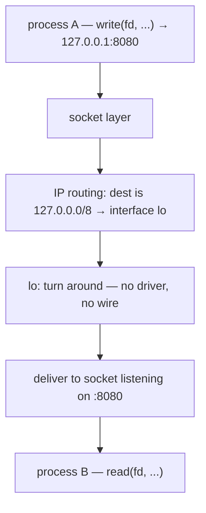

# The loopback interface

Last file ended on a small mystery. You ran `curl localhost:8080`, minihttp answered, and the bytes crossed from one process to another **without touching a network card** — there isn't even one to touch in here. So how does a machine send a packet to *itself*, and how fast is that? That question has a precise answer, and it is a file you can look at.

## The problem: how do you address yourself?

Once a process can `write()` to a socket and have another process `read()` it, an obvious question follows: what address do you use to reach a process on the *same* machine? You could special-case it — "if the destination is me, skip the network." But then a program written to talk over the network would need *different code* to talk to a neighbor on the same host, and you'd lose the one thing that makes all of this worth it: that talking across the room and talking across the planet are the same `write()`.

So the designers did something cleaner. They gave every machine a network device made of pure software, with no hardware behind it, reachable at one reserved address every machine on earth agrees on: **`127.0.0.1`**. A packet sent there goes down into the kernel's network stack and comes straight back up to a process on the same machine, having travelled nowhere. Same code, same address shape, no special case.

## Look at the interface that has no wire

It's a real interface, so the kernel describes it like any other. Look:

```
ip addr show lo
```

> **`ip addr show lo`** prints the kernel's state for one interface, named `lo` (loopback).

You'll see:

```
1: lo: <LOOPBACK,UP,LOWER_UP> mtu 65536 qdisc noqueue state UNKNOWN group default qlen 1000
    link/loopback 00:00:00:00:00:00 brd 00:00:00:00:00:00
    inet 127.0.0.1/8 scope host lo
       valid_lft forever preferred_lft forever
    inet6 ::1/128 scope host proto kernel_lo
```

Read it slowly. The flags say `LOOPBACK,UP` — it's a loopback device, and it's up. Its hardware address is `00:00:00:00:00:00`: all zeros, because there is no hardware. Its address is `127.0.0.1/8`. That `scope host` is the whole story — this address is reachable from *this host only*. `lo` is the network stack running with the hardware amputated.



The packet never leaves this box. It can't — `lo` isn't connected to anything.

## The interface is a file too — watch its counters move

Of course the kernel publishes per-interface traffic as a file. Look at it before you send anything:

```
cat /proc/net/dev
```

> **`/proc/net/dev`** is the kernel's table of byte/packet counters, one row per interface.

Find the `lo:` row. On a fresh container it's all zeros:

```
    lo:       0       0    0    0 ...        0       0    0    0 ...
```

The first block is bytes/packets **received**, the later block is **transmitted**. Now generate some loopback traffic and watch those numbers climb.

> **Predict first —** you are about to send four packets to yourself. On the `lo:` row, will the *receive* counters climb, the *transmit* counters climb, or both — and if both, by the same amount or different amounts?

```
ping -c 4 127.0.0.1
cat /proc/net/dev
```

> **`ping -c 4`** sends 4 **ICMP** echo requests and prints the round-trip time of each. (ICMP is a protocol in its own right, and Act II takes it apart; here we want it only as a cheap way to make traffic.)

The `lo:` row is no longer zero — something like:

```
    lo:    1371      18    0    0 ...     1371      18    0    0 ...
```

Receive and transmit climbed by the same amount, because on loopback every packet you send is a packet you receive — you are both ends. **That is monitoring, from the bottom:** every bandwidth graph you've ever seen is a tool sampling these exact counters and subtracting.

## The number on the wall: the cost of the stack with nothing in the way

Now look at the `ping` round-trip times themselves:

```
64 bytes from 127.0.0.1: icmp_seq=1 ttl=64 time=0.025 ms
64 bytes from 127.0.0.1: icmp_seq=2 ttl=64 time=0.072 ms
```

Roughly **0.02–0.07 ms**. There is no hardware in that number. It is the *entire* cost of the kernel's network path — building the packet, routing it, turning it around on `lo`, delivering it to a socket — and nothing else. This is the floor. Every real network you ever measure is this number plus the cost of physics and other machines; nothing on this host goes below it.

Here's a sharper way to feel that. Your container also has a *real* interface with a real address. Find it:

```
ip addr show eth0
```

You'll see an address like `172.17.0.3/16` on `eth0` — a real (virtual) NIC, unlike `lo`.

> **NIC** = network interface card, the (here, emulated) hardware network adapter — covered properly in Act II.

> **Predict first —** ping your *own* `eth0` address. The packet still never leaves the machine. Will it be faster than `127.0.0.1`, slower, or identical — and why?

```
ping -c 4 172.17.0.3
```

(Use the address *you* saw.) The round-trip comes out a little **higher** than loopback's — often 0.05–0.5 ms, with the very first packet highest as caches warm:

```
64 bytes from 172.17.0.3: icmp_seq=1 ttl=64 time=0.509 ms
64 bytes from 172.17.0.3: icmp_seq=2 ttl=64 time=0.063 ms
```

Still no wire — but the kernel routed this toward the *real interface's* address, sending it through the NIC driver's path before turning it back. That's a longer trip through more code than loopback's immediate turnaround, and the clock shows it. Loopback wins because it skips the most code there is to skip.

## Back to the spine

That `curl localhost:8080` from the minihttp lesson? It rode exactly this path. Start minihttp again and prove the traffic is loopback's by watching `lo` move:

```bash
/tmp/minihttp 8080 &
cat /proc/net/dev | grep lo:
curl -s localhost:8080
cat /proc/net/dev | grep lo:
```

The `lo:` counters jump between the two reads, and minihttp prints its `--- a request arrived on fd 4 ---`. The request never went near `eth0`. (Stop the server with `kill %1` when you're done.)

## The shadow it casts: one number from safe to exposed

A server chooses who can reach it with the address it binds to. Look again at the line in [`code/minihttp.c`](../code/minihttp.c) that does it:

```c
addr.sin_addr.s_addr = htonl(INADDR_ANY);   /* 0.0.0.0 — every interface */
```

`INADDR_ANY` is `0.0.0.0`: "listen on **every** interface I have, including the one facing the network." The other choice is `127.0.0.1`: "this machine only." That single number is the entire difference between private and public.

This is where real systems get breached. A developer tests a database locally, where binding to `127.0.0.1` works perfectly. To reach it from another container they switch the bind to `0.0.0.0` — and ship that. On a cloud instance, `0.0.0.0` now includes the *public* interface, and a database with no password is open to the internet. Mass scanners find these in hours. The elegance and the horror are the same fact: loopback and the public NIC are one `bind()` call with one number changed.

> **Check yourself —** A server bound to `127.0.0.1:8080` is running. From this same machine, `curl 127.0.0.1:8080` answers and `curl <your eth0 address>:8080` is refused. Neither packet left the machine. So why did one fail?

<details>
<summary>Answer</summary>

Because the refusal has nothing to do with distance — both packets stayed inside this one kernel. `bind()` recorded *which local address* the socket answers on, and the kernel matches an arriving packet's destination address against those records. The second packet was addressed to the `eth0` address, which no socket had claimed, so there was nobody to deliver it to. "Reachable" is a bookkeeping question, not a geography question.

</details>

## The question this leaves for containers

Notice what `lo` actually belongs to. Not the computer — the *network stack*. One stack, one `lo`, one `127.0.0.1`, `scope host`. So hold this as a question rather than a fact: **if two processes could somehow be persuaded to share a single network stack, they would share one `lo` — and could then talk over `127.0.0.1` without being on the same machine in any other sense at all.** Is that even possible? Who would want it, and what would it buy them?

Act IV builds the sharing; Act V shows what gets built on top of it. For now just carry the shape: *loopback is a property of a network stack, not of a computer.*

## Where you are now

You can point at `lo`, read its address and flags, and explain why it has no MAC. You can watch its byte counters climb in `/proc/net/dev`. You can state why loopback RTT is the irreducible floor for any latency on a host, and why a packet to your own `eth0` address is a touch slower than one to `127.0.0.1`. And you know that `0.0.0.0` versus `127.0.0.1` is one number standing between private and exposed.

> **You understand this when you can** `cat /proc/net/dev` before and after a single `curl -s localhost:8080`, point at the `lo:` row's receive *and* transmit columns having climbed by the same number of bytes, and explain in one sentence why `eth0`'s row did not move at all.

Notice the move you just made: you read the loopback interface's traffic straight out of a file, `/proc/net/dev`. The kernel keeps a companion file — `/proc/net/tcp` — with a row for every socket that has an address. minihttp's bound socket has one now; fd-demo's bare socket never did. Time to open that ledger and decode it by hand.

---

← Prev: **[Building minihttp, the listening server](03-minihttp-server.md)** · ↑ **[Act I overview](README.md)** · Next: **[Ports and /proc/net/tcp](05-ports-and-proc-net-tcp.md)** →
