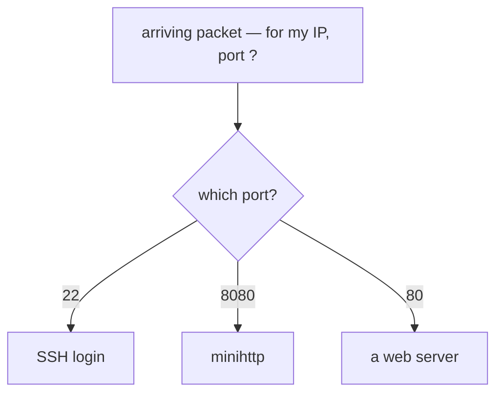

# Ports and /proc/net/tcp

You just used `curl` to talk to minihttp, and it answered. That exchange created a **connection**, and your server is still **listening** for more. The kernel writes both of those facts down — live — in a single file. This lesson finds your server in that file and teaches you to read it by hand. Once you can, every fancy network tool stops being magic: each one is just a program that reads this same file and tidies it up.


## Why there are ports at all

Your machine has one IP address but runs many programs that all want the network at once — a web server, an SSH login, a database. A packet arrives addressed to your one IP. Which program is it for?

Think of the IP as a **building's street address**, and the **port** as the **apartment number** inside it. The IP gets the packet to the building; the port gets it to the right door. A port is just a number from 0 to 65535 that a program claims when it starts — minihttp claimed `8080`.



(One rule for later: ports 0–1023 are "privileged" — only the **root** user may claim them. That's why a program answering on port 22 can be trusted to really be SSH: the kernel won't let an ordinary user squat there. minihttp's 8080 is above 1023, so anyone may use it.)

## Step 1 — find your server with no tool at all

Start minihttp; it will listen and wait:

```bash
/code/minihttp 8080 &
```

> The `&` runs it in the **background**, so you get your prompt back instead of the server taking over the terminal.

The kernel now *knows* minihttp is listening on `8080` — it has to, or it couldn't deliver the next packet to it. So that fact is written down somewhere. Before reaching for any tool, ask the harder question: **could you find your server with nothing but the file the kernel keeps?** You can. Open it.

> **`/proc/net/tcp`** is the kernel's live list of every TCP socket — every listener and every connection — one per row.

> **Predict first —** you know your server is `0.0.0.0:8080` in state `LISTEN`. Not one of those five words is going to appear in the file. So in what form will each of them be written?

```
cat /proc/net/tcp
```

Here is the whole thing, header line and one complete row, nothing elided:

```
  sl  local_address rem_address   st tx_queue rx_queue tr tm->when retrnsmt   uid  timeout inode
   0: 00000000:1F90 00000000:0000 0A 00000000:00000000 00:00000000 00000000     0        0 3209833 1 0000000000000000 100 0 0 10 0
```

It looks like noise. It isn't — every fact you'd want is in there, in the kernel's raw shorthand (hex, plus one trick). Let's dig them out by hand.

## Step 2 — decode the row by hand

Take it field by field. You only need three to start.

**1. `local_address` = `00000000:1F90`** — this is `IP:PORT`, in hex.
- The IP `00000000` is four zero bytes → `0.0.0.0`.
- The port `1F90` is hex; convert it: `0x1F90 = 8080`. There's your port.

**2. `st` = `0A`** — the connection's *state*, as a code. `0A` means `LISTEN`. (The full list of state codes is the whole next lesson.)

**3. `inode` = `3209833`** — a unique ID for this socket inside the kernel. Hold onto it; it's the thread back to the program that owns it (next step).

One trick you'll need for real connections: **the IP is byte-reversed** (little-endian). Worked example — decode `0100007F`:

1. split into bytes: `01 00 00 7F`
2. reverse them: `7F 00 00 01`
3. convert each to decimal: `127 0 0 1` → **`127.0.0.1`**

That reversal is the only hard part; the rest is just reading hex.

There it is: you just pulled your server — address, port, state — out of raw kernel memory with your own eyes, with nothing standing between you and the truth.

### Now name every remaining column

Three fields carried you. The row has seventeen, and you should be able to account for all of them — otherwise "I can read this file" is a half-truth. Field by field, left to right, for the exact row above:

| # | header name | value here | what it is |
|---|---|---|---|
| 1 | `sl` | `0:` | slot — this row's index in *this* dump. Not an identity; it renumbers. |
| 2 | `local_address` | `00000000:1F90` | local `IP:port`, hex, IP byte-reversed → `0.0.0.0:8080` |
| 3 | `rem_address` | `00000000:0000` | the peer's `IP:port` — all zeros, because a listener has no peer |
| 4 | `st` | `0A` | state code; `0A` = `LISTEN` (whole list next lesson) |
| 5 | `tx_queue:rx_queue` | `00000000:00000000` | bytes queued to send : bytes waiting to be read — **the two socket buffers from lesson 2**, in hex |
| 6 | `tr:tm->when` | `00:00000000` | which retransmit/keepalive timer is armed (`00` = none) : ticks until it fires |
| 7 | `retrnsmt` | `00000000` | retransmissions on this connection |
| 8 | `uid` | `0` | the user that owns the socket — `0` is root |
| 9 | `timeout` | `0` | unanswered *zero-window probes* — nudges to a receiver that has said *my buffer is full, stop sending*. Act III's subject, like fields 13–17; the header's name for it is misleading. |
| 10 | `inode` | `3209833` | the socket's inode — your join key to the fd tables, used in step 3 |
| 11 | *(unnamed)* | `1` | reference count on the kernel socket object |
| 12 | *(unnamed)* | `0000000000000000` | the kernel address of the `struct sock`, printed with `%pK` — masked to zeros unless the host's `kernel.kptr_restrict` lets you see it, so you may instead find a real address like `ffff88810b0d5000` |
| 13–17 | *(unnamed)* | `100 0 0 10 0` | TCP's own tuning state: the retransmission timeout, the delayed-ACK estimate, a packed quick-ACK/ping-pong counter, the congestion window, and — for a listener — the TCP Fast Open queue limit. These are Act III's subject; recognise them here and move on. |

Notice where the header line stops: at `inode`. That is the kernel telling you something. **Fields 1–10 are the interface; fields 11–17 are internals**, printed for kernel debugging, unnamed on purpose, and reshuffled across kernel versions. Nothing you build should read them. Everything you actually need — address, port, state, queues, owner, inode — is in the ten named columns, which is why `inode` being the tenth field is worth remembering.

An `ESTABLISHED` row has the identical seventeen fields; only the values change. `rem_address` fills in with the peer, `st` reads `01`, and field 17 turns into the slow-start threshold (often `-1` early in a connection) instead of the Fast Open limit.

## Step 3 — follow the inode back to the program, by hand

The row told you a socket is in state `LISTEN` on `0.0.0.0:8080`. It did **not** tell you *which program* owns it. That's the `inode`'s job: it's a join key, and the same number appears in the owning program's file-descriptor table (from lesson 1). Search every process for it:

```
ls -la /proc/*/fd 2>/dev/null | grep 3209833
```

> Use *your* inode. `2>/dev/null` hides the harmless "permission denied" lines for processes you don't own.

```
... 3 -> socket:[3209833]
```

One number connected "a socket in the kernel's list" to "fd 3 in this exact process." You've now rebuilt the whole chain by hand: **port → socket row → inode → file descriptor → process.**

But *feel* what that cost: you dug a number out of hex, then globbed every `/proc/*/fd` and grepped for it. Illuminating once — unbearable for every connection on a busy machine. That ache is exactly the itch a tool exists to scratch.

## Step 4 — now earn the tools

Here's the turn: **everything you just did by hand is all the "network tools" do.** They are not magic and they know nothing you don't — each reads `/proc/net/tcp` (and the fd tables) and tidies the output. Having done it the hard way, you can now use them *and* trust them, because you know exactly what they read.

The everyday one is **`ss`**:

```
ss -tlnp
```

> **`ss`** = "socket statistics." The flags: **t** = TCP, **l** = only *listening* sockets, **n** = numeric (don't rename `8080` to a service name), **p** = show the owning program.

```
State  Recv-Q Send-Q Local Address:Port  Peer Address:Port  Process
LISTEN 0      16      0.0.0.0:8080        0.0.0.0:*          users:(("minihttp",pid=13,fd=3))
```

Every field is one you just decoded: `LISTEN` is your `0A`; `0.0.0.0:8080` is your `00000000:1F90` un-reversed and converted; `minihttp … fd=3` is your inode→process join — all in a millisecond. **The tool and the file are the same truth; the only difference is that now you can't be fooled by the tool.**

> **The rival it replaced — `netstat -tlnp`** does the identical job, and you'll meet it on older boxes, so recognise it. But `netstat` rebuilds its picture by *walking `/proc` the slow way*; `ss` queries the kernel's socket tables directly and pulls far ahead on a host with thousands of connections. Run both on a busy machine and you'll feel why `ss` won.

And the tool that automates the *inode→program* join specifically is **`lsof -i`**:

> **`lsof -i :8080`** — `-i` selects internet sockets; `:8080` filters to that port.

```
lsof -i :8080
```

```
COMMAND  PID USER  FD   TYPE DEVICE NODE NAME
minihttp  13 root   3u  IPv4  ...    TCP  *:8080 (LISTEN)
```

One line gives you what took you three steps by hand: the program (`minihttp`), the descriptor (`3`), the state (`LISTEN`) on port 8080 — the *"what's on this port?"* command, sibling to `ss`. (Needs the real `lsof` from `netlab`, not netshoot's busybox stub.)

Keep one reflex from here on: **if a tool ever disagrees with the file, the file wins** — you can always drop back to `cat /proc/net/tcp` and read it yourself. Stop the server for now: `kill %1`.

> **On your own machine —** macOS has no `/proc/net/tcp` at all, yet the same table exists — it is just only reachable through a tool. See what your Mac is actually connected to right now, and which command stands in for the file you just read, in [Act I in the wild](in-the-wild.md).

> **Check yourself —** A row in `/proc/net/tcp` shows `local_address` as `0100007F:1F90`. Which address and port is that — and why does one half look backwards and the other half not?

<details>
<summary>Answer</summary>

`127.0.0.1:8080`. The address is a little-endian hex integer, so the bytes `01 00 00 7F` reverse to `7F 00 00 01` = `127.0.0.1`. The port `1F90` is plain big-endian hex for 8080 — ports are *not* byte-swapped. The file shows the kernel's in-memory representation rather than a formatted string, which is exactly why the tools exist.

</details>

## Experiment — `0.0.0.0` vs `127.0.0.1`, step by step

This is the one that trips everyone. The `Local Address` you just learned to read — `0.0.0.0` versus `127.0.0.1` — decides **who is allowed to reach a server**. Let's prove exactly what the difference is.

> **Where you type this:** inside the `lab` container — the shell from `docker run … netlab`, or a `docker exec -it lab zsh` shell — **not** your Mac. You need only **one** terminal; both servers run in the background.

### Your machine has two addresses — think of them as two doors

```
ip -4 addr show lo | grep inet
ip -4 addr show eth0 | grep inet
```

```
    inet 127.0.0.1/8 ...      ← the "inside" door
    inet 172.17.0.3/16 ...    ← the "outside" door
```

- `127.0.0.1` (**loopback**) is reachable *only from inside* this container — the **inside door**.
- `172.17.0.3` (**eth0**) is the real address other containers and machines use — the **outside door**.

> Wherever you see `172.17.0.3` below, use **your** eth0 address.

When a server starts, it tells the kernel which door(s) to answer on. `0.0.0.0` = "**all** my doors." `127.0.0.1` = "the **inside** door only." We'll start one server of each kind and knock on both doors of each.

### Step 1 — start server A (answers on all doors)

```
/code/minihttp 8080 &
```

minihttp is hard-wired to bind `0.0.0.0`, so server A answers on **every** door, port 8080.

### Step 2 — start server B (answers on the inside door only)

```
python3 -m http.server 8081 --bind 127.0.0.1 &
```

> **Heads-up: this is *not* minihttp.** `python3 -m http.server` is a tiny web server built into Python. We use it *only* because it lets us pick the bind address with `--bind` — minihttp can't (it's hard-wired to `0.0.0.0`). What it serves doesn't matter; we just need "some server on `127.0.0.1`."

Server B binds `127.0.0.1`, port 8081 — the **inside door only**.

### Step 3 — confirm what each one bound to

```
ss -tlnp | grep -E '8080|8081'
```

```
LISTEN 0 16    0.0.0.0:8080   0.0.0.0:*  users:(("minihttp",pid=...,fd=3))
LISTEN 0 5   127.0.0.1:8081   0.0.0.0:*  users:(("python3",pid=...,fd=3))
```

Notice what's **not** there: neither server bound `172.17.0.3`. We never bind the outside address directly — `0.0.0.0` already includes it. (`172.17.0.3` shows up next only as a curl *target*.)

### Step 4 — knock on both doors of each server

`curl <address>:<port>` sends a request *to that address*. Try each server via the inside door (`127.0.0.1`) and the outside door (your eth0 IP):

> **Predict first —** three of these four succeed, one fails. Which?

```
curl -s -o /dev/null -w 'A inside  127.0.0.1:8080  -> %{http_code}\n' 127.0.0.1:8080
curl -s -o /dev/null -w 'A outside 172.17.0.3:8080 -> %{http_code}\n' 172.17.0.3:8080
curl -s -o /dev/null -w 'B inside  127.0.0.1:8081  -> %{http_code}\n' 127.0.0.1:8081
curl --max-time 2 http://172.17.0.3:8081
```

```
A inside  127.0.0.1:8080  -> 200
A outside 172.17.0.3:8080 -> 200
B inside  127.0.0.1:8081  -> 200
curl: (7) Failed to connect to 172.17.0.3 port 8081 ... Could not connect to server
```

`200` means "answered." Only the **last** one fails: server B bound only the inside door, so a knock on the **outside** door finds nobody listening. Server A (all doors) answers both ways. **That one failure is the entire lesson.**

### Why this bug hides so well

Two things to notice:

1. `172.17.0.3` here was only a **destination** we sent curl to — we never *bound* it.
2. **`curl localhost` always uses the inside door** (`localhost` = `127.0.0.1`), where *both* servers answer. So if you only ever test with `curl localhost`, server B looks perfectly healthy — the bug is invisible. You have to knock on the **outside** door to expose it.

Stop both servers: `kill %1 %2`.

### Does `0.0.0.0` mean "open to the internet"? No — and from your Mac you can't reach it at all right now.

Binding `0.0.0.0` only means "the program *will answer* on the outside door **if a request reaches it.**" Whether a request *can* reach it depends on where you're standing. Three rings, innermost first:

1. **Inside the `lab` container** (where you ran the curls above): both doors reachable — that's the `200 / 200 / 200 / refused` you just saw.
2. **Another container** on the same Docker network: can reach server A at `172.17.0.3:8080`, but not server B (`127.0.0.1` is private to its own container).
3. **Your Mac laptop shell** (outside Docker): **cannot reach either server.** You started the lab with `docker run … netlab` and **no `-p`**, and on Docker Desktop the `172.17.0.x` address lives inside Docker's Linux VM, unreachable from macOS. So running `curl localhost:8080` *or* `curl 172.17.0.3:8080` **from your Mac** fails right now.

To reach a server from your Mac, you'd **publish** the port when starting the container:

```
docker run --rm -it --privileged -p 8080:8080 --name lab netlab
```

Then, from your **Mac shell**, `curl localhost:8080` works — but **only for server A** (`0.0.0.0`). Even with `-p`, a `127.0.0.1`-bound server stays unreachable from the Mac, because Docker forwards the published port to the container's *real* interface, where a loopback-only server isn't listening. That's the **exact same bind bug** as the Kubernetes one, just one ring further out.

So `0.0.0.0` opens only the *innermost* gate; real exposure needs the outer ones (`-p` here; a NodePort/LoadBalancer/Ingress and an open firewall in Kubernetes). An accidental `0.0.0.0` with those outer gates already open is how databases end up naked on the internet.

## The question this leaves for containers

You just built a server that passes every test you can run from inside the machine and refuses every knock from outside — and the whole verdict was legible in one field, `Local Address`. Carry that as a question rather than a fact: **when something outside a machine delivers traffic to a program inside it, which door does that traffic arrive at — and does your local test knock on the same one?**

Every system that puts a network in front of your server has to answer that, and every one of them can get it wrong in exactly the way server B did. You already know where the answer is written down. Act V hands you a real one to convict.

> **On your own machine —** this same live socket table exists on the Mac in front of you. See every program quietly holding a connection open — and which one is secretly eating your bandwidth — in [Act I in the wild](in-the-wild.md).

## Where you are now

You can start a server and find it in the kernel's raw `/proc/net/tcp` with **no tool at all** — reading its IP and port (reversing the little-endian bytes), its state code, and its inode by hand — then follow that inode through the fd tables back to the exact program that owns the socket. *Only then* do you reach for `ss`, `lsof -i`, or `netstat`, knowing precisely what each one reads and why `ss` is the one that won. And you understand `0.0.0.0` vs `127.0.0.1` as "all doors" vs "the inside door," and why testing with `localhost` hides the difference.

> **You understand this when you can** be handed the bare row `1: 0100007F:1F90 00000000:0000 0A 00000000:00000000 00:00000000 00000000 0 0 3209833 1 0000000000000000 100 0 0 10 0` with no header line, and say without a tool: it is a listener on `127.0.0.1:8080`, its inode is `3209833` because `inode` is the tenth field, both socket buffers are empty, and the five numbers on the end are none of your business.

One column you've only glanced at: the **state** (`st`) — `0A` for your listener, and a fleeting one you might catch right after a `curl`. Every socket is always in exactly one state, and TCP marches it through a precise sequence from the opening handshake to the final goodbye. That sequence is the last thing to learn in this act — and it turns out to be exactly what lets a port scanner map your machine while your application notices nothing. That's the next file.

---

← Prev: **[The loopback interface](04-loopback.md)** · ↑ **[Act I overview](README.md)** · Next: **[TCP states and the SYN scan](05b-tcp-states-and-the-syn-scan.md)** →
