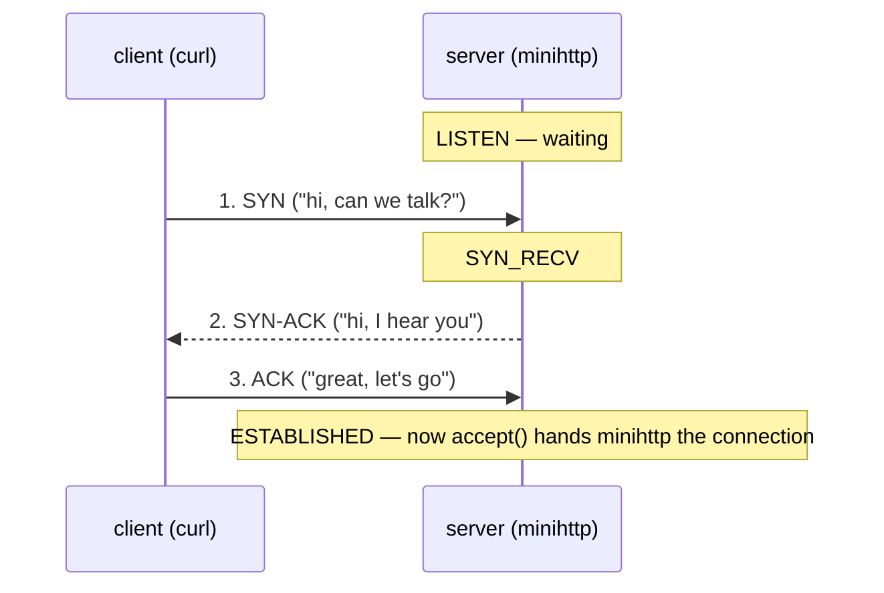
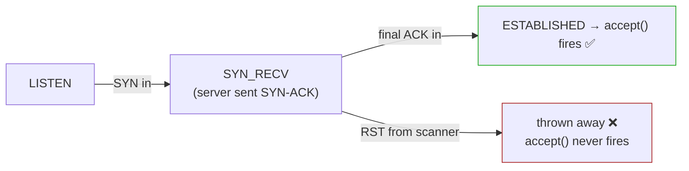

# TCP states, and the scan that hides in them

Every connection is somewhere in its life: just starting up, open and talking, or shutting down. The kernel tracks exactly where, as the socket's **state** — the `State` column you saw in `ss`, the `st` code in the file. You only need a handful of states to understand everything that matters here, including a clever attack that maps your open ports while your server notices nothing at all.


## A connection has a life: born, lives, dies

Three beats, that's the spine:

1. **Born** — a short greeting called the **handshake**.
2. **Lives** — state `ESTABLISHED`; data flows (your `curl` request, minihttp's reply).
3. **Dies** — a short goodbye; the side that hangs up first lingers a moment in `TIME_WAIT`.

### The birth: the three-way handshake

Opening a TCP connection is like the start of a phone call — *"Hi"* / *"Hi, I can hear you"* / *"Great, let's talk."* Three messages, and the server's state climbs with each one:



> **SYN** and **ACK** are just labelled bits in the message. **SYN** = "let's start." **ACK** = "got your message."

The server walks `LISTEN → SYN_RECV → ESTABLISHED`. **Here is the one fact to hold onto — the hinge of this whole lesson:**

> The server's `accept()` — the call that hands your program a new connection (it returned `fd 4` back in lesson 3) — fires **only when the state reaches `ESTABLISHED`**, after that *third* message.

The first two messages (the SYN and the SYN-ACK) are handled entirely **inside the kernel**. Your program hears nothing until the handshake fully completes. Keep that in your pocket — the attack at the end is built on exactly this.

The death is a mirror of the birth (goodbye messages instead of hellos), and the side that closes first sits in `TIME_WAIT` for about a minute before the kernel forgets the connection. *Why* it lingers is an Act III story; for now, just recognize `TIME_WAIT` when you see it.

### The states you'll actually meet

You only need these four to follow along:

| State | Meaning |
|---|---|
| `LISTEN` | a server waiting for callers — no connection yet |
| `SYN_RECV` | mid-handshake: got the SYN, sent SYN-ACK, waiting for the final ACK |
| `ESTABLISHED` | handshake done — data can flow |
| `TIME_WAIT` | connection closed; lingering briefly before being forgotten |

<details>
<summary>The complete list of 11 states (reference — for reading any <code>/proc/net/tcp</code> row)</summary>

| Code | State | Meaning |
|---|---|---|
| `0A` | LISTEN | waiting for callers |
| `02` | SYN_SENT | client sent its SYN, waiting for the reply |
| `03` | SYN_RECV | server got the SYN, sent SYN-ACK, waiting for the ACK |
| `01` | ESTABLISHED | handshake complete, data flows |
| `04` | FIN_WAIT1 | we sent a FIN (closing), waiting for its ACK |
| `05` | FIN_WAIT2 | our FIN was ACKed, waiting for *their* FIN |
| `06` | TIME_WAIT | both closed; we linger before forgetting |
| `08` | CLOSE_WAIT | the *other* side closed; waiting for our app to close |
| `09` | LAST_ACK | we closed after them, waiting for the final ACK |
| `0B` | CLOSING | both sent FIN at once (rare) |
| `07` | CLOSE | no connection |

</details>

## Watch the states change live

Each state is just a value you can read. Let's catch three of them. Start minihttp:

```
/code/minihttp 8080 &
```

> **`ss -tan`** lists TCP sockets in **a**ll states, **n**umeric. The `State` column is the same thing as `/proc/net/tcp`'s `st`, just spelled out.

**① LISTEN** — the listener, before anyone connects:

```bash
ss -tan | grep :8080
```

```
LISTEN 0  16   0.0.0.0:8080   0.0.0.0:*
```

**② ESTABLISHED** — for this one, open a connection and *hold it open* without sending a request. This needs a **second terminal** into the container (`docker exec -it lab zsh`). In that second shell:

```
nc 127.0.0.1 8080 &
```

> **`nc` (netcat)** opens a raw TCP connection. Type nothing, and it just *holds the connection open* — the handshake finished, but no request was sent.

Back in your **first** shell, look again:

```
ss -tan | grep :8080
```

```
LISTEN 0  16        0.0.0.0:8080    0.0.0.0:*
ESTAB  0  0       127.0.0.1:49476   127.0.0.1:8080
ESTAB  0  0       127.0.0.1:8080    127.0.0.1:49476
```

Two `ESTAB` rows — because on loopback **both ends of the connection live in this same kernel**: one row is `nc`'s side, the other is minihttp's side of the very same connection, mirror-imaged. (Stop nc with `kill %2` in the second shell.)

**③ TIME_WAIT** — complete a *real* request, then look quickly (this row vanishes after ~60s):

```
curl -s -o /dev/null localhost:8080 ; ss -tan | grep :8080
```

```
LISTEN     0  16        0.0.0.0:8080    0.0.0.0:*
TIME-WAIT  0  0       127.0.0.1:8080    127.0.0.1:49532
```

minihttp closed first (it sends `Connection: close`), so *its* side is the one parked in `TIME-WAIT`. The `49532` is the throwaway port curl borrowed for this one request — and in the raw file it's the little-endian hex you learned to flip: `0100007F:C17C` → `0xC17C = 49532`. You're now watching the state machine turn, one row at a time.

## How a port scan abuses the handshake

A **port scanner** is a tool that knocks on many ports to learn which ones have a server listening. The famous one is `nmap`. The trick that makes one kind of scan "stealthy" is built entirely on the hinge you pocketed earlier.

Recall: **`accept()` fires only at `ESTABLISHED`** — after the third handshake message. A **SYN scan** deliberately stops one message short:

1. It sends the **SYN**. The server moves to `SYN_RECV` and replies **SYN-ACK**.
2. That SYN-ACK reply is *all the scanner wanted* — it proves a server is there, the port is **open**.
3. So instead of the final ACK, it sends a **RST** ("never mind, forget it"). The half-built connection is thrown away from `SYN_RECV`. It **never reaches `ESTABLISHED`** — so `accept()` **never fires.**

> **Check yourself —** A scanner sends a SYN, gets the SYN-ACK, then sends an RST instead of the final ACK. Why does your application never see this connection at all?

<details>
<summary>Answer</summary>

Because the handshake never completed, so the connection never reached `ESTABLISHED` and was never handed to `accept()`. It lived and died entirely inside the kernel's `SYN_RECV` state. The scanner learned the port is open; your application learned nothing — which is exactly why noticing a scan has to happen in the kernel rather than in the app.

</details>



The kernel did all the talking — SYN in, SYN-ACK out — on its own. The application is woken only at the green box, and the scanner deliberately takes the red one. (Detail: Linux often answers that SYN *statelessly* using "SYN cookies," so you usually won't even catch a real `SYN_RECV` row — the half-open leaves almost no trace.)

## Why that's a security problem

Picture an attacker casing a building before a break-in: they walk the perimeter and note **which doors exist and which are unlocked** — not entering, just making a map. On a server, the doors are **open ports**, and each open port is **a running service**: SSH on 22, a database on 5432, Redis on 6379, your app on 8080. An attacker's first move against any target is to learn what's listening, because an open port is a candidate way in — once they know "6379 is open," they know Redis is there, can check its version, look up its known vulnerabilities, and aim a real exploit at exactly that.

So a SYN scan is **reconnaissance** — step one of an attack — and the danger is two things stacked:

1. **It reveals your attack surface.** Anyone on the network can list every service you run.
2. **It does it invisibly.** Almost all logging people set up lives at the **application** layer — the web server logs "connection from 1.2.3.4," SSH logs login attempts. All of that fires on `accept()`, at `ESTABLISHED`. The SYN scan never gets there. So:

> The attacker maps every open port, and your application's logs show **zero connections**. From the app's point of view, nobody ever knocked.

"The logs are clean" is **not** proof you weren't scanned. The recon happened below the line your application can see.

**The defender's takeaway — and the reason this whole act exists:** since the app is blind to it, detection has to drop down to where the SYN *was* visible — the **kernel**. The kernel saw every SYN even though no app did; that's what firewall logs, `conntrack`, and intrusion-detection tools watch. The person who can read the kernel's own ledger — `/proc/net/tcp`, `ss`, the counters — sees what the application layer cannot. (Fair caveat: modern firewalls *can* log SYNs, so a SYN scan is less invisible than it was decades ago. The lasting lesson isn't "scans are undetectable" — it's "app-layer monitoring has a blind spot, and attackers work inside it.")

## Try it: watch a scan your server never sees

This proves the hinge directly. You need **two terminals** into `lab` (`docker exec -it lab zsh` for the second). `nmap -sS` needs root, which you already are inside `netlab`.

**Shell 1 — run minihttp under `strace`, watching only the `accept` call:**

```
strace -e trace=accept /code/minihttp 8080
```

It prints its listening line, then:

```
accept(3, NULL, NULL
```

…and **hangs there** — `accept` is waiting for a connection to reach `ESTABLISHED` (exactly the blocking-on-`accept` you saw in lesson 3).

**Shell 2 — scan that port two ways.**

> **Predict first —** `accept()` returns only at `ESTABLISHED`. One of these scans finishes the handshake; the other stops at `SYN_RECV`. Which will make the hanging `accept` line in shell 1 complete?

A **SYN scan** — SYN, read the SYN-ACK, then RST instead of the final ACK:

```
nmap -sS -p 8080 127.0.0.1
```

```
8080/tcp open  http-proxy
```

nmap says **open** — but glance at shell 1: the `accept(3, NULL, NULL` line is *still hanging*. The connection never reached `ESTABLISHED`, so minihttp slept through the whole exchange.

A **connect scan** — nmap completes the full three-way handshake, like a real client:

```
nmap -sT -p 8080 127.0.0.1
```

```
8080/tcp open  http-proxy
```

Same `open` verdict — but now shell 1 jumps:

```
accept(3, NULL, NULL)                   = 4
accept(3, NULL, NULL
```

`accept` returned **4**: the connection hit `ESTABLISHED` and the server woke. Both scans found the port open; **only `-sT` reached the application.** That gap — between what the *kernel* answers and what the *app* ever sees — is the whole point of the stealth scan, and now you can point to exactly where it lives in the state machine. Stop strace with `Ctrl-C`, and stop any leftover server with `kill %1`.

## The question this leaves for containers

You proved a gap: the kernel answered a scan the application never heard. So take the question forward rather than a product name — **if the application layer has a blind spot shaped exactly like a SYN, where would you have to stand to see into it, and which of the kernel's files would you have to be reading?**

You already know the honest answer to "where": down here, in the kernel, in the ledgers you have spent this act learning to read. What you *cannot* yet answer is how anyone does that across a few thousand processes on a few dozen machines at once, continuously, without stopping the world the way `strace` does. Hold that; it is one of the reasons eBPF exists, and [Act X's runtime-detection lesson](../act-10-cluster-security/10-seeing-it-happen.md) is where you meet it — watching a detector load an eBPF program into a node's kernel and declare which event source it attached to.

## Where you are now

You can name the states a connection passes through — `LISTEN → SYN_RECV → ESTABLISHED → … → TIME_WAIT` — and you've watched three of them change live in `ss`. You know the hinge (`accept()` fires only at `ESTABLISHED`), and from it you can explain precisely why a SYN scan maps your ports while your application's logs stay empty, and why catching it belongs in the kernel.

> **You understand this when you can** put minihttp under `strace -e trace=accept`, run `nmap -sS -p 8080 127.0.0.1` and then `nmap -sT -p 8080 127.0.0.1`, and say before each one whether the `accept(3, NULL, NULL` line will still be hanging afterwards — and name the state the SYN scan's connection died in.

And that completes the *evidence* this act runs on. Stop and notice the move you've made over and over: every time you wanted the truth, you opened a file in `/proc` — the fd table, the socket ledger `/proc/net/tcp`, the interface counters `/proc/net/dev`, a process's `State:`. You trusted those files over every tool. But you never asked the one question underneath all of them: **what *are* these files?** They sit on no disk, report a size of zero, and still answer you live and correct. There's one door left in Act I, and it's the one that finally names the idea you've been circling since lesson 1. That's the next file.

---

← Prev: **[Ports and /proc/net/tcp](05-ports-and-proc-net-tcp.md)** · ↑ **[Act I overview](README.md)** · Next: **[Everything is a file](06-everything-is-a-file.md)** →
