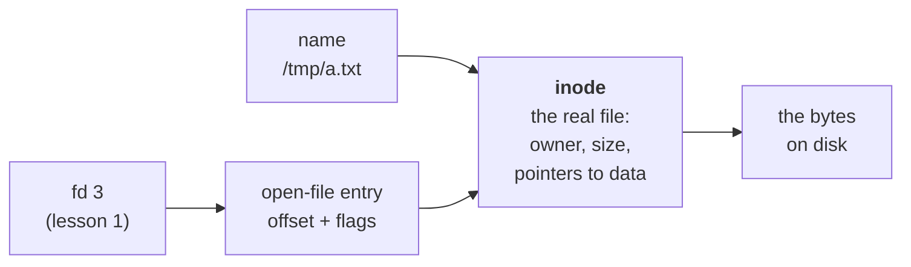
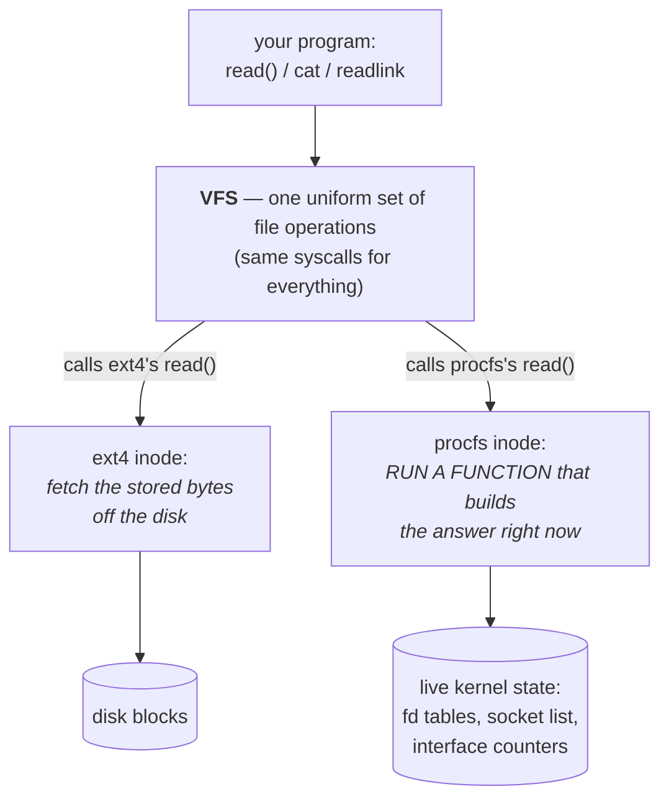

# Everything is a file

All act long you've trusted the same kind of evidence. The fd table in `/proc/self/fd`. The socket ledger in `/proc/net/tcp`. The interface counters in `/proc/net/dev`. Every time a tool and a file disagreed, you sided with the file — because the file was "the kernel's own truth."

But you never turned the question on the files themselves. **What *are* they?** You've been `cat`-ing them like they're text saved on a disk somewhere. They aren't. There is no disk involved.

So where do they come from, and why does reading one give you a live answer that's correct to the microsecond? This last lesson chases that question to the bottom — and when you reach it, the sentence this whole act has been circling will finally be yours to say, not because anyone told you, but because you'll have watched it be true four different ways.

## The wall: you've been reading files that live on no disk

Let's make the strangeness concrete before we explain it. A normal file takes up room on a disk. Check whether `/proc` does:

> **`df -h <path>`** (*disk free*) reports the filesystem backing a path: its device, total size, and how much is used.

> **Predict first —** `/proc/net/tcp` clearly has *contents* (you decoded a row of it by hand last lesson). So how many bytes does the filesystem under it report as used?

```
df -h /proc
```

```
Filesystem    Size  Used  Available  Use%  Mounted on
proc             0     0          0    0%   /proc
```

Zero. Total size zero, used zero. A filesystem with no space cannot be *storing* anything — yet `/proc/net/tcp` is full of rows whenever you have sockets open. Push one step further and look at a single file's own size:

```
stat /proc/net/dev
```

```
  File: /proc/net/dev
  Size: 0         Blocks: 0     IO Block: 1024   regular empty file
```

> **`stat <file>`** prints a file's *metadata* — size, type, owner, timestamps, and the inode number we're about to meet — as opposed to its contents.

The kernel calls `/proc/net/dev` a **"regular empty file," size 0** — and yet last lesson's sibling, `cat /proc/net/dev`, printed a full table of byte counters for `lo` and `eth0`. **An empty file that isn't empty.** That contradiction is the whole lesson. To resolve it we have to take apart what a file actually *is* — and that starts one level below the name.

## What a file really is: the inode

Here's the first thing almost everyone has backwards, so test your own model. You think of a file as "its name" — `/etc/hostname` *is* the file. It isn't. The name is just a label in a directory; the real file is a numbered object the kernel keeps, called an **inode** (short for *index node* — node number *N* in the kernel's index of files). The name points at the inode; the inode owns the actual bytes and all the bookkeeping.

Prove the name and the file are separate things. Make a file, then ask for its inode number:

```
echo hi > /tmp/a.txt
ls -li /tmp/a.txt
```

> **`ls -i`** prints each file's **inode number** in the first column — the kernel's real internal ID for the file, independent of any name.

```
399622 -rw-r--r--  1 root root 3 ... /tmp/a.txt
```

That `399622` is the file's true identity. The name `/tmp/a.txt` is just one signpost pointing at it. To *prove* the name is only a signpost, add a second name for the very same inode — a **hard link** — and watch both names report the identical number:

> **`ln <target> <newname>`** (no `-s`) makes a **hard link**: a second directory entry pointing at the *same inode*. (`ln -s`, which we'll meet next, is the different kind.)

```
ln /tmp/a.txt /tmp/b.txt
ls -li /tmp/a.txt /tmp/b.txt
```

```
399622 -rw-r--r--  2 root root 3 ... /tmp/a.txt
399622 -rw-r--r--  2 root root 3 ... /tmp/b.txt
```

Read what changed. Both names show the **same inode `399622`** — they are not two files, they are two names for *one* file. And the count in the middle went from `1` to **`2`**: that's the inode's *link count*, the number of names pointing at it. (This is why deleting a file is really called *unlinking* — you remove one name, and the kernel only frees the inode's bytes when the count hits zero. Hold that thought; it comes back with a vengeance in a few minutes.)

So the real chain underneath a file has one more link than you may have pictured — and you already built most of it in lesson 1:



A file descriptor (your `fd 3`) points at an open-file entry (which holds the `pos:` offset you saw in `/proc/self/fdinfo`), which points at the **inode**, which owns the data. The name is just a *fourth* arrow into the same inode from a directory. **The inode is the file. Everything else is a pointer to it.** Now we can ask the sharp version of our question: what inode does `/proc/net/dev` have, and where are *its* bytes?

## mount: how a filesystem gets its place in the tree

Before we can answer that, one more piece: *why is `/proc` even reachable as a path?* Your machine looks like it has a single tree of files rooted at `/`. It doesn't. It has several separate filesystems, **grafted** onto each other at chosen directories. The act of grafting is called **mounting**, and the directory where one filesystem joins another is a **mount point**.

> **`mount`** (with no arguments) lists every filesystem currently grafted into the tree, in the form `SOURCE on MOUNTPOINT type FSTYPE (options)`.

> **Predict first —** you know real files live on a disk-backed filesystem. When you look for `/proc` in the mount list, what do you expect its *source device* to be?

```
mount | grep ' /proc '
```

```
proc on /proc type proc (rw,nosuid,nodev,noexec,relatime)
```

Decode it word by word, because every word matters:

- **`on /proc`** — it's grafted at the directory `/proc`. Anything under that path is served by *this* filesystem, not by your disk.
- **`type proc`** — the filesystem's *type* is literally `proc` (a.k.a. **procfs**). Not `ext4`, not `overlay`, not any disk format. It's a special type built into the kernel.
- **`proc on`** — its **source** is the word `proc`, not a device like `/dev/sda1`. There is no device. That's the tell: **nothing on disk backs it.**

So `/proc` is a filesystem with no storage, mounted into your tree so you can reach it by path. (The modern reader for this same table is **`findmnt`**, which draws it as a tree — but `mount` is the one on every box, and it reads the same kernel list; if they ever disagree, you know which to trust by now.)

> **Side road —** the line *above* `/proc` in that list, for `/`, says `type overlay` — and that one word explains how containers share an image, start instantly, and throw your changes away on exit. It's a filesystem made of *stacked* filesystems. It's not networking, so it's optional, but if you're curious how your container's own `/` works: **[The container's filesystem is layered →](06b-the-container-filesystem.md)** (self-contained, loops right back here). That leaves exactly one place its "files" can be coming from. If they're not on a disk, the kernel must be **making them up on the spot.** Let's catch it in the act.

## Decode a magic symlink by hand

Go back to the very first file you ever read this act — your own fd table — but this time look at it as a *filesystem object*, with `stat`-level eyes:

```
ls -l /proc/self/fd/0
```

```
lrwx------  1 root root 64 ... /proc/self/fd/0 -> /dev/null
```

The leading **`l`** says symlink, and the `->` shows a target. So these `/proc/<pid>/fd/N` entries — the ones that read `socket:[3331228]` for a socket back in lesson 1 — are **symbolic links**. To understand why that's strange, you first need to know what an ordinary symlink really is. Build one and dissect it:

> **`ln -s <target> <name>`** makes a **symbolic link**: its own little file whose *entire contents are a path string*. **`readlink <name>`** prints that stored string.

```
cd /tmp
echo "real contents" > real.txt
ln -s real.txt mylink
ls -l mylink
readlink mylink
```

```
lrwxrwxrwx  1 root root 8 ... mylink -> real.txt
real.txt
```

Look hard at the size: **`8`**. The word `real.txt` is exactly 8 characters. **A symlink's data literally *is* the target path, stored as text** — nothing more. It's a real inode, on a real filesystem, holding a string. Two consequences fall straight out of that, and both are worth feeling:

```
ln -s /nowhere/missing.txt broken
readlink broken      # prints /nowhere/missing.txt just fine
cat broken           # cat: can't open 'broken': No such file or directory
```

A symlink never checks its target — `readlink` happily returns a path to nothing; it only fails when something *follows* it. It's just stored text. Now put the ordinary symlink next to the `/proc` one and the contradiction is glaring:

| | size | what's stored | dangling allowed? |
|---|---|---|---|
| `mylink -> real.txt` (ordinary) | **8** = length of `"real.txt"` | the path string, on disk | yes |
| `/proc/self/fd/0 -> /dev/null` (procfs) | **64** (always) | *nothing* | — |

The procfs link's size is **64 no matter what it points to** — it isn't the length of any string, because there *is* no stored string (procfs has no disk, remember). So when you ask procfs "where does fd 0 point?", it can't read a stored answer the way `mylink` does. It has to **compute one, right then**, by walking your process's open-file table to entry 0 and describing what it finds.

These are called **magic symlinks**, and here is the experiment that proves the answer is manufactured live rather than stored — the deleted-file trick, which also pays off that "unlinking" hint from earlier.

> **Predict first —** open a file on fd 7, then *delete its name from the disk*. The inode's link count drops to 0, but your fd still holds it open. What will `/proc/self/fd/7` point at — and can you still read the file that has no name?

```
echo "i was deleted but still here" > ghost.txt
exec 7< ghost.txt        # open it on fd 7 of THIS shell
rm ghost.txt             # remove its only name
ls -l /proc/self/fd/7
cat /proc/self/fd/7
```

```
lr-x------  1 root root 64 ... /proc/self/fd/7 -> '/tmp/ghost.txt (deleted)'
i was deleted but still here
```

Sit with both lines. The file's name is gone from `/tmp` — but the inode's link count was 1 from your fd, so the kernel kept the bytes alive (exactly the unlink rule from before). The magic symlink reports `/tmp/ghost.txt (deleted)` — a description **no stored string could ever hold**, because the file changed *after* any string would have been written.

And `cat /proc/self/fd/7` still reads the contents, because following a magic symlink doesn't re-resolve that bogus path — it shortcuts straight to the open-file object behind fd 7. The kernel didn't *retrieve* that link target. It **generated** it the instant you asked.

One question remains: how can a "file read" run code instead of returning bytes — and is that special to symlinks, or does it explain `/proc/net/dev` too?

## The resolution: a file is an *interface*, not bytes

Here is the bottom of the well, the idea every prior step was clearing the ground for.

**A file is anything that implements the file operations. Not a thing with bytes on a disk — a thing that can answer `read`.**

When your program calls `read()` on fd 3, it does **not** say "fetch bytes from disk." It says "run *this* file's read operation." Every inode in the kernel carries a small table of **function pointers** — an operation named `read`, one named `write`, one named `get_link` (for symlinks), and so on.

The kernel layer that defines this uniform set of operations and offers them to your program as identical system calls is the **VFS — the Virtual File System.**



Now the size-0 contradiction dissolves completely. When you `cat /etc/hostname`, the VFS calls **ext4's** read operation, which copies stored bytes off the disk — so the file has a real size. When you `cat /proc/net/dev`, the VFS calls **procfs's** read operation, which is *a function in the kernel* that, at that instant, walks the live list of network interfaces and formats their current byte counters into text. There's nothing to store — so the size is 0 — yet there's always an answer, because the answer is *computed on read*.

That's why the `lo:` counters in lesson 4 climbed every time you re-`cat`-ed: you weren't re-reading a file, you were **re-running a function** that reports the live total. Same for `/proc/net/tcp`: each read re-walks the kernel's actual socket table, which is why it's never stale. Same for the magic symlinks: their `get_link` operation *computes* the target.

Disk files store bytes; `/proc` runs code; the magic symlink runs code; a moment ago the socket let you `read`/`write` the network. **Your program cannot tell any of them apart, because the VFS makes them answer the same operations.** And *that indistinguishability is the whole point* — it's the abstraction itself.

You now have the name this act has been withholding since lesson 1, and you earned every word of it: **everything is a file.** Not as a slogan painted on the wall, but as a precise statement about a data structure — *everything that implements the file operations is a file, whether or not any bytes exist behind it.*

The socket was a file (lesson 1). The listening server, the loopback device's counters, the kernel's socket ledger, your own process's guts — files, all of them, because each one answers `read`. That is the sentence the rest of this course is built on, and it's yours now.

> **Check yourself —** Someone tells you a socket, a `/proc` file, and a file on disk are "all files." Name the one thing they genuinely share — and name what they do *not* share.

<details>
<summary>Answer</summary>

They all implement the VFS's file operations, so `read`, `write`, and `close` work on every one of them and your program cannot tell which is which. What they do not share is storage: the disk file's `read` copies stored bytes, procfs's `read` runs a function over live kernel state, and the socket's `read` drains a buffer the network stack filled. "Everything is a file" is a claim about the *interface*, not a claim that bytes exist anywhere.

</details>

## The shadow it casts: a window into the kernel cuts both ways

The elegance and the horror are, once again, the same fact. If the kernel's live state is *readable as files*, then reading those files is how you understand a machine — and also how you attack one.

The defender's edge: the deleted-but-open trick you just ran by hand is a standard **incident-response move**. Malware commonly deletes its own binary the moment it starts, so `ls` shows nothing on disk — but the process still runs, so its inode is still pinned, and a responder recovers the live executable straight out of `/proc/<pid>/exe` or `/proc/<pid>/fd`, exactly as you read `ghost.txt`. The file had no name and was still right there.

The attacker's edge: the same window enumerates a machine for free. A foothold on a box can read `/proc/<pid>/cmdline` for every process to harvest passwords and tokens passed as command-line arguments; read `/proc/<pid>/environ` for secrets in environment variables; and read `/proc/net/tcp` to map every connection — no special tools, just files.

Worse, because procfs exposes such raw power, a `/proc` carelessly mounted into a container has been a real **container-escape** path (writable `/proc/sys` knobs, or `/proc/<pid>/mem` reaching into another process's memory). That's exactly why the mount line you read said `nosuid,nodev,noexec`: the kernel deliberately defangs procfs at the mount point because a window this powerful is dangerous left wide open.

The thing that lets you understand the machine completely is the thing that lets an intruder understand it completely.

## The question this leaves for containers

Everything you just proved concerned *one* `/proc`, answering about *one* machine. Two questions to carry forward, both unanswered:

- Procfs computes its answer out of live kernel state at the instant you read it. So what would happen if a kernel could be persuaded to keep **more than one** version of that state at once — several socket tables, several sets of process numbers, several sets of interfaces — and then `/proc` were asked to render one? What would `cat /proc/net/tcp` even *mean* then, and who decides which slice you get?
- If every number a monitoring tool could ever want is already a file the kernel computes on read, what work is left for the tool to do?

Hold both. Act IV makes the first one real with your own hands; Act V runs the second at a scale where it stops being obvious.

> **On your own machine —** there's a catch worth knowing: **macOS has no `/proc` at all** (it's a Linux/BSD-procfs feature, and macOS's kernel doesn't expose one). So every experiment in this lesson only works *inside the Linux lab container*, never in your Mac terminal. The closest native macOS equivalent is `lsof` (the fd-table reader from lesson 1) and `vmmap`/`fs_usage` — tools that ask the kernel directly, because there's no file to `cat`. See [Act I in the wild](in-the-wild.md) for what your Mac *does* expose.

## Where you are now

You can explain why a "file" with size 0 can still pour out content — because a file is an *interface*, and `/proc` answers reads by **running code** over live kernel state, not by returning stored bytes. You know the inode is the real file and the name is just a pointer at it, proven by a hard link sharing one inode under two names. You can read the `mount` table and spot a filesystem with no disk behind it.

You can tell an ordinary symlink (a stored path string, size = its length) from a magic one (size 64, computed on read), and you used the deleted-but-open trick to *prove* the answer is generated live. And the four `/proc` files you met across this act — `/proc/self/fd`, `/proc/net/tcp`, `/proc/net/dev`, and your fd's metadata — are no longer four mysteries but one mechanism seen four times. **Everything is a file** isn't a poster anymore; it's a sentence you can defend down to the function pointer.

So look back at what this entire act quietly never asked you to do: **find anyone.** minihttp and `curl` lived in the same kernel, shared one `/proc/net/tcp`, and a `write()` on one became a `read()` on the other because the same kernel copied the bytes across — no wire, no distance, no chance the message got lost. Every guarantee you leaned on came from *one kernel owning both ends.*

The instant two **separate** machines must talk, every one of those guarantees evaporates at once: there is now a gap no single kernel reaches across, the other machine has to be *found*, and the bytes have to *survive a journey* that can drop them. That gap — and the layered machinery built to cross it — is Act II.

> **You understand this when you can** explain why `stat /proc/net/dev` reports `Size: 0` while `cat /proc/net/dev` prints a full table, in one sentence that uses the word *function* — and reproduce the deleted-but-open proof from memory: `exec 7< ghost.txt`, `rm ghost.txt`, then `ls -l /proc/self/fd/7` and `cat /proc/self/fd/7`.

Before you cross that gap, prove this act stuck. The next page is a recall exercise: the questions come at you with no lesson text around them, and every answer stays folded away until you have committed to one out loud.

---

← Prev: **[TCP states and the SYN scan](05b-tcp-states-and-the-syn-scan.md)** · ↑ **[Act I overview](README.md)** · Next: **[Test yourself](test-yourself.md)** →
