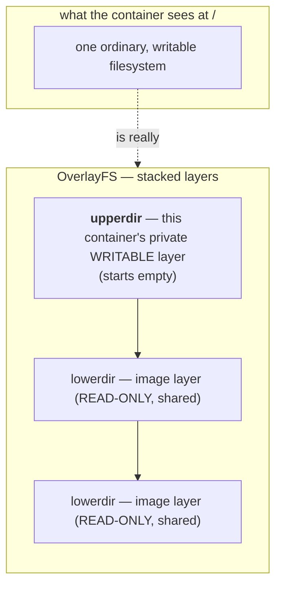

# The container's filesystem is layered *(optional sidequest)*

> **This is a side road, not the main river.** Act I is about networking on one machine, and filesystems aren't networking — so you can skip straight to [Test yourself](test-yourself.md) and lose no thread. But you've spent the whole act trusting `mount` and the idea that *a filesystem is whatever answers the file operations*, and there's one `mount` line you walked past that explains more about how containers actually work than anything else on the machine. If `df overlay` made you curious, follow it down here. It's self-contained, and it loops you right back.

Last lesson, `mount | grep ' /proc '` showed you a filesystem backed by nothing. But the line for `/` — the one under your feet this whole act — said something stranger:

```
overlay on / type overlay (rw,relatime,lowerdir=...,upperdir=...,workdir=...)
```

That word **`overlay`**, and the fact that your `/` reports ~450 GB it doesn't really own, is the entire reason a container can start in a second, share an image with a hundred siblings, and throw your changes away when it dies. This sidequest follows that one word to the bottom.

## The problem: a whole Linux filesystem, a hundred times over

Picture the naive way to run ten containers from the same image. Each container needs a complete root filesystem — `/bin`, `/etc`, `/usr`, the works, maybe 200 MB. The obvious approach is to **copy** that 200 MB ten times. Sit with why that's unbearable: ten copies is 2 GB of mostly-identical bytes, every copy takes seconds to write, and starting an eleventh container means copying *again*. Containers are supposed to start instantly and cost almost nothing. Copying the whole filesystem per container makes both impossible.

So you want the opposite: the 200 MB of image **shared, read-only, once**, with each container getting only a thin **private** space for the handful of files it actually changes. The catch is that a container still has to *see* one normal, writable filesystem at `/` — it can't know it's special. You need many containers sharing one read-only base, each able to write, none disturbing the base or each other, all seeing a single seamless `/`. That is exactly the problem **OverlayFS** solves.

## The resolution: stack filesystems, show the top

Overlay's trick is the `mount` idea from last lesson, taken one step further. Last lesson, `mount` grafted **one** filesystem onto a directory. Overlay **stacks several** and merges them into one view:



Two rules run the whole show:

1. **Reading:** to find a file, overlay looks **top-down** and returns the first layer that has it. So a file from the read-only image is visible — unless the writable layer has a newer version on top of it.
2. **Writing (copy-on-write):** the lower layers are read-only, so to change a file that lives down there, overlay first **copies it up** into the writable layer, then edits the *copy*. The image underneath is never touched.

That's it. Shared read-only base + a private writable top + "show the topmost version." Let's see each piece for real.

## Read the stack by hand

> **Where:** inside the `lab` container (your `docker run … netlab` shell). One terminal.

```
mount | grep 'on / '
```

```
overlay on / type overlay (rw,relatime,
  lowerdir=/var/lib/.../snapshots/1138/fs:/var/lib/.../snapshots/1119/fs,
  upperdir=/var/lib/.../snapshots/1139/fs,
  workdir=/var/lib/.../snapshots/1139/work)
```

Three options, three roles:

- **`lowerdir=…/1138/fs:…/1119/fs`** — the image layers, **colon-separated**, read-only. Each was one step in the image build. These directories are *shared* by every container started from this image.
- **`upperdir=…/1139/fs`** — this container's single **writable** layer. Everything you create or change lands here, and nowhere else.
- **`workdir=…`** — overlay's private scratch area, used to make a copy-up atomic. You never touch it.

One thing to notice and file away: those paths (`/var/lib/...`) are on the **host's** disk — inside Docker Desktop's Linux VM, in your case — *not* inside the container. That matters in a second, and it's also why your `df` reported ~450 GB: the container's `/` is really a window onto the host disk, so it sees the *host's* free space. (Consequence worth keeping: there's no per-container size limit by default — one container filling the disk starves the host and every sibling. They all drink from the same well.)

## Watch copy-on-write happen

Here's the honest constraint, stated plainly: **you cannot inspect `upperdir` from inside the container.** It lives in the host VM, and the container only sees the *merged* result at `/`. So to watch the writable layer fill up, you step out to the tool that reads it for you — `docker diff`, run from your **Mac shell**, not inside the container.

> **`docker diff <container>`** lists every change in a container's writable layer versus its image, with a one-letter marker: **`A`** added, **`C`** changed (copied up), **`D`** deleted.

> **Where:** these commands run in your **Mac terminal** (the host), because `docker` is the host's tool. Keep your `lab` container running; open a Mac shell.

Make three different kinds of change, then look.

> **Predict first —** three changes: a brand-new file, an append to a file that came from the image, and a deletion of a file that came from the image. `docker diff` marks each one `A`, `C`, or `D`. Which change gets which letter — and which of the three do you expect to *add* bytes to the writable layer?

```
docker exec lab sh -c 'echo brand-new > /newfile.txt; echo "# my change" >> /etc/profile; rm /bin/df'
docker diff lab
```

```
A /newfile.txt        ← brand-new file: created straight in the writable layer
C /etc                ← directory marked changed because something inside it changed
C /etc/profile        ← existed in the image (read-only), so it was COPIED UP, then edited
D /bin/df             ← existed in the image; "deleting" it just hides it in the writable layer
```

Read each marker as a sentence about the two rules:

- **`A /newfile.txt`** — a new file has no lower version, so it's simply born in `upperdir`.
- **`C /etc/profile`** — this file came from the read-only image. You appended to it, so overlay **copied it up** first and edited the copy. **The image's `/etc/profile` is byte-for-byte untouched** — every *other* container from this image still sees the original.
- **`D /bin/df`** — you can't really delete a file you don't own. Overlay records a *whiteout* in the writable layer that says "hide whatever is below." The image still has `/bin/df`; this container just can't see it anymore.

So everything you do to a container's filesystem is a thin set of edits floating on top of an image that never changes. That's the elegance. Now the consequence.

> **Check yourself —** `docker diff` printed `D /bin/df`. Did deleting that file free any disk space?

<details>
<summary>Answer</summary>

No — it *used* a little. `/bin/df` lives in a read-only lower layer you cannot modify, so overlay wrote a whiteout marker into the writable layer meaning "hide whatever is below this name." The binary is still there, still occupying the same bytes, in an image layer shared with every other container started from that image. Deleting in an upper layer adds information; it never removes any.

</details>

## The ache it removes — and the one it creates

You felt this rule the very first lesson without being told why: the lab runs `docker run --rm`, processes die on `exit`, and you were told "there's nothing to clean up." Now you know the mechanism. **`--rm` deletes the `upperdir`.** Your entire writable layer — every `A`, `C`, and `D` above — is thrown away when the container exits. The shared read-only image layers survive (other containers need them); your changes do not. Prove it:

> **Where:** Mac shell.

```
docker run --rm alpine sh -c 'echo "i exist" > /scratch.txt; cat /scratch.txt'
docker run --rm alpine sh -c 'cat /scratch.txt 2>&1 || echo "(gone — fresh writable layer)"'
```

```
i exist
(gone — fresh writable layer)
```

The first container wrote `/scratch.txt` into its writable layer and read it back. The second is a *different* container with a *fresh, empty* writable layer — the file never existed for it. **This is the whole reason "containers are disposable" is true, and also the trap that bites everyone once:** run a database in a plain container, restart it, and your data is gone — because the data was sitting in a writable layer that got discarded. The disposability you want for *processes* is a disaster for *data*. Which raises the obvious question: how do you keep something?

## The fix: a volume is a real filesystem grafted in

The answer is pure last-lesson `mount`. If the problem is "the writable layer is ephemeral," the fix is to **mount a separate, persistent filesystem in at a path** — so writes to that path bypass the overlay entirely and land somewhere that outlives the container. That's a **volume**.

> **`docker run -v <volume>:/data …`** grafts the named volume onto `/data` inside the container — a mount point, exactly like last lesson, but pointing at storage the container can't throw away.

> **Where:** Mac shell.

```
docker volume create demovol
docker run --rm -v demovol:/data alpine sh -c 'echo "written by container 1" > /data/note.txt'
docker run --rm -v demovol:/data alpine sh -c 'echo "container 2 reads:"; cat /data/note.txt'
```

```
container 2 reads:
written by container 1
```

Both containers were `--rm` and both are gone — yet the file survived, because `/data` wasn't part of either container's overlay. It was a different filesystem mounted in, and `mount` outlives the thing it's mounted into. **Overlay is for the image (shared, disposable); a volume is for the data you mean to keep (separate, persistent).** That single distinction is most of what "container storage" means.

## The shadow it casts: a layer remembers what you deleted

Recall the `D /bin/df` whiteout: deleting a file in an upper layer doesn't remove it from the lower layer — it just *hides* it. Now apply that to how images are built. Each instruction in a Dockerfile creates a new read-only layer stacked on the last, and **every layer is kept**. So the classic disaster:

```
COPY secret.pem /app/secret.pem     # layer 5: the secret is now baked in
RUN rm /app/secret.pem              # layer 6: a whiteout that HIDES it
```

The running container shows no `secret.pem` — it's hidden by the whiteout in layer 6. But **layer 5 still physically contains the file**, and layers are exactly what gets pushed to a registry and shared. Anyone who pulls the image can peel back to layer 5 (`docker history`, or just unpacking the layer tarballs) and read the secret you "deleted." This is one of the most common real-world image leaks: AWS keys, private certs, and `.env` files removed in a later `RUN` but still sitting in an earlier layer for anyone to recover. The same copy-up/whiteout mechanism that makes the filesystem cheap and disposable also makes it **remember** — and forensic responders use precisely this to recover what an attacker thought they'd wiped. The elegance and the hazard are one fact: layers never forget.

## The question this leaves for containers

You now hold both halves of a puzzle and neither answer. The writable layer dies with the container. A filesystem mounted in at a path outlives it. So: **what should happen to a program's data when the program is expected to be restarted, replaced, or moved to a different machine entirely — and who gets to decide where "the path that survives" actually points?**

Notice that the question has more than one right answer, because "survives a restart" and "survives the machine" are different promises, and something has to be able to make each of them separately. Carry the split — overlay for the image, a mount for the data — and see how many flavours of "survives" Act VII turns out to need.

## Where you are now

You can read the `overlay` line in `mount` and name its three parts (`lowerdir` shared read-only image, `upperdir` private writable, `workdir` scratch); explain copy-on-write and whiteouts from a `docker diff`; say exactly why `--rm` (and a Pod restart) discards your changes, and why a **volume** mounted in at a path is how you keep data; and you know that image layers retain deleted secrets because a layer never forgets. The ~450 GB your container claimed is no longer a mystery — it's the host disk, seen through a stack of layers.

> **You understand this when you can** read the `overlay` line out of `mount`, name which of its three directories `--rm` throws away, and predict from a described change alone — new file, edit to an image file, deletion of an image file — whether `docker diff lab` will print `A`, `C`, or `D`.

That closes the side road. The networking spine of Act I is done — head back to prove it stuck.

---

← Back to **[Everything is a file](06-everything-is-a-file.md)** · ↑ **[Act I overview](README.md)** · Next: **[Test yourself](test-yourself.md)** →
