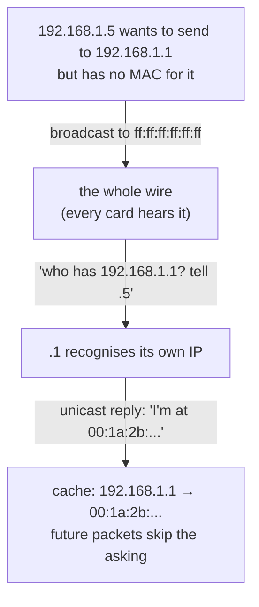

# The wire and the two names

Act I was one machine talking to itself, and the hard problems hid because the same kernel sat on both ends of every `write()`. Now put the wire back.

You type `ping 192.168.1.1` and expect bytes to cross to another machine — but here is the first surprise, and it is a deep one: the packet that leaves your card does **not** leave as an IP packet addressed to `192.168.1.1`. It leaves wrapped in an Ethernet frame, addressed to a name your IP layer has never heard of.

There are two completely separate naming systems stacked on top of each other, and a small protocol whose entire job is to translate between them. This file is about learning both names, then watching the translator work — live, in a file — and then working it yourself.

## The problem: the wire has never heard of an IP address

In 1973 at Xerox PARC, Bob Metcalfe needed to connect a roomful of Alto computers to a single shared coaxial cable. Picture the electrics: when one card pushes a signal onto that cable, *every* card on it receives the signal. The wire has no notion of "to whom" — it is one shared room, and everyone hears every word. So if you want to address one machine, the addressing can't come from the wire; it has to be carried *in the bytes themselves*.

Could you address it by IP? In 1973 the IP address didn't exist yet — but even if it had, it would be the wrong tool. An IP address is meant to mean the same thing across many networks; the wire is *one* network, and it needs a name for "that card, right there, on this cable."

So Metcalfe gave every card a name burned into its hardware, and wrapped every transmission in a **frame** stamped with the destination's hardware name, so that each card could glance at the front of an arriving frame and decide in nanoseconds whether the bits were meant for it.

**That is the whole of it: a shared cable has no notion of "to whom," so the addressing has to be carried in the bytes themselves.**

That leaves you with two names for every machine, and you must hold the distinction clearly:

- a **MAC address** — 48 bits, six hex pairs like `02:42:ac:11:00:02`, burned into the card — is a **Layer 2** name: it identifies a card on *this* wire and is meaningless one hop away.
- an **IP address** is a **Layer 3** name: it identifies a machine across the *whole* internet, but it cannot be put on a wire directly.

## What's actually in a frame

A frame is the envelope the wire understands. Everything you send is wrapped in one:

```
  bytes:  7+1        6              6           2          46 - 1500        4
        +--------+-----------+-----------+------------+----------------+--------+
        |preamble| dst MAC   | src MAC   | EtherType  |    payload     |  FCS   |
        | +SFD   | 48 bits   | 48 bits   | 0x0800=IP  | (the IP packet)| CRC-32 |
        +--------+-----------+-----------+------------+----------------+--------+
         clock     to whom     from whom   what's       the actual      did it
         sync      on the wire  on the wire inside?      cargo           arrive
                                                                         intact?
```

The preamble is just a clock-sync pattern the hardware strips off; the frame "really" starts at the destination MAC. The **EtherType** is the field that says what the payload is — `0x0800` means "an IPv4 packet is inside," and `0x0806` means "this is ARP," the translator you'll meet in a moment. Hold onto that `46 – 1500` on the payload: that ceiling comes back to bite three lessons from now.

## Read the card's name straight from the kernel

You don't need a tool to see your card's hardware name — the kernel publishes it as a file, exactly like everything in Act I. Start the lab (this is the one line every lesson in this act opens with):

```bash
docker run --rm -it --privileged --network host --name lab nicolaka/netshoot
```

> **`/sys/class/net/eth0/address`** is the card's 48-bit MAC, written as hex pairs.

> **Predict first —** the MAC you're about to read is supposedly "burned into the card." After you read it, do you expect the kernel will let you *change* it?

```bash
cat /sys/class/net/eth0/address
```

Out comes something like `02:42:ac:11:00:02` — the raw destination name other cards look for. Now watch a counter the kernel keeps for this card. It publishes a running tally of every frame accepted off the wire:

```bash
cat /sys/class/net/eth0/statistics/rx_packets
ping -c 3 8.8.8.8
cat /sys/class/net/eth0/statistics/rx_packets
```

The number jumped — by at least the replies you received. You just watched the kernel count frames coming off the wire, one integer file at a time, with nothing between you and the truth.

## Meet `ip link` — the same files, read for you

Reading `/sys/class/net/eth0/` file by file is illuminating once and tedious forever. The tool that gathers the card's name and counters into one labeled block is **`ip link`** (and `ip -s link` for the statistics):

```bash
ip -s link show eth0
```

The same six hex pairs you `cat`-ed appear on the `link/ether` line, and the `RX`/`TX` blocks are the same `statistics/` counters laid out in a grid. It is **not measuring anything the files don't already hold** — it reads the same `/sys` you just read and formats it. Keep the reflex from Act I: if a tool ever disagrees with the file, the file wins.

## The second name problem: IP has an address, the wire wants a MAC

Now the gap. Your IP layer wants to send a packet to `192.168.1.1`, and hands the card… an IP address. But the card can only put a *MAC* on the wire. The two naming systems have no built-in connection — knowing a machine's IP tells you nothing whatsoever about its hardware name. Sit with that for a moment and try to solve it with what you already have: there is no table, no registry, and nobody on the wire you can ask privately, because you'd need their MAC to ask.

By 1982 this was a daily problem on LANs, and David Plummer's RFC 826 solved it with almost comic directness: *if you don't know which MAC owns an IP, ask everyone.* Shout the question onto the shared wire — which, remember, every card hears — let the owner answer, and remember the answer so you never have to ask again. It worked because, on a 1982 LAN, everyone shouting was a friend.



## Watch the two names get stitched, by hand

The cache ARP fills is — of course — a file:

> **`/proc/net/arp`** — one row per known mapping: IP, HW type, flags, MAC, device. Flag `0x2` = complete (resolved); a MAC of `00:00:00:00:00:00` with flag `0x0` = the kernel asked but no reply has come yet.

Open two shells into the lab (`docker exec -it lab zsh` for the second). In the first, watch the cache live; in the second, provoke lookups. You want to see *both* states, so you will ask twice: once about an address nobody owns, and once about one that answers.

First find your own subnet and gateway, and pick an address in the subnet that nothing is using (say `.222`):

```bash
ip -4 addr show eth0                       # your address and its /prefix
ip route show default | awk '{print $3}'   # your gateway's IP
```

> **Predict first —** the instant before a reply arrives, what will the brand-new row for that IP show in its MAC column? And for an address nobody owns, what will that row ever become?

```bash
# shell 1 — watch the cache change live
watch -n1 cat /proc/net/arp
```

```bash
# shell 2 — ask about an address in your subnet that nothing owns
ping -c 2 192.168.65.222                   # substitute an unused address from YOUR subnet

# shell 2 — now forget the gateway and ask about it again
ip neigh flush dev eth0
ping -c 2 "$(ip route show default | awk '{print $3}')"
```

The unused address appears as an **incomplete** row — an all-zero MAC, flag `0x0` — and sits there while the kernel keeps retrying, because the shout went out and nobody answered. The gateway, flushed and re-asked, appears the same way for a fraction of a second and then flips to a real hardware address as the reply lands. Two rows, two outcomes, and between them the whole protocol: the kernel asks, and the frame waits until somebody claims the name. You just watched two separate naming systems get stitched together in real time.

> **Where you are matters here.** On macOS with Docker Desktop, `--network host` gives you the Linux VM's network (gateway `192.168.65.1`), not your Mac's LAN — so the *only* neighbour to resolve is that gateway, and your phone and router will not appear. The mechanism is identical; the population is not. To watch a whole room of real neighbours resolve — router, phone, TV, forgotten smart bulb — run `arp -a` natively on your Mac in [Act II in the wild](in-the-wild.md#your-neighbours-on-the-lan-arp). On a Linux host, this is your real LAN and the `ip neigh flush` above clears the machine's real cache (harmless — the kernel re-resolves on the next packet).

> **Check yourself —** You have a machine's IP address and it is on your wire. Why can the kernel still not send it a frame?

<details>
<summary>Answer</summary>

Because a frame is addressed by **MAC**, not by IP, and nothing about an IP address tells you the hardware address of the card holding it. The kernel must first broadcast an ARP request — "who has this IP?" — and cache the reply. Until that answer lands, the row in `/proc/net/arp` is incomplete and the packet waits.

</details>

## Earn `arp -n` and `ip neigh` — and meet the rival

Two tools read that same cache, and the difference between them is a little history lesson:

```bash
arp -n
ip neigh
```

**`arp -n`** is the old BSD tool: it reads `/proc/net/arp` and prints it with column headers, showing the raw flag. **`ip neigh`** is its modern replacement from the `iproute2` suite: same kernel state, but it translates the flag into a *word* — `REACHABLE`, `STALE`, `INCOMPLETE`, `FAILED` — that tells you not just the mapping but its freshness. Both are just readers of the cache you decoded by hand; neither knows anything `/proc/net/arp` doesn't. (`ip neigh` is the one to reach for: the status word is exactly what you want when a mapping has gone stale.)

## Become the translator — ask for a mapping yourself

Every tool you've met so far — `cat /proc/net/arp`, `arp -n`, `ip neigh` — *reads* the cache. Not one of them *asks*. The asking has always been the kernel's job: you ran `ping`, and the kernel, finding no MAC for that IP, broadcast the ARP request on your behalf. So here is the question that turns you from a spectator into the protocol: could *you* send the request yourself — be the thing that shouts "who has this IP?" onto the wire?

To do it by hand you'd have to assemble the exact frame from the diagram at the top of this file: a destination MAC of `ff:ff:ff:ff:ff:ff` (broadcast — every card hears it), EtherType `0x0806` (this is ARP, not IP), and inside, the ARP question itself. Hand-building those bytes through a raw socket in C is real work; the tool that lets you *state* the frame field-for-field instead — the active counterpart to all the file-reading you've done — is **scapy**.

> **scapy** is a packet you write in Python. `Ether(...)` is the frame header you diagrammed; `/ARP(...)` is its payload. You set every field yourself, so nothing is hidden — it is the frame diagram, typed. (This is the first time in the course you put a packet on the wire *by hand* instead of reading one out of a file.)

> **Predict first —** you're about to broadcast "who has `<your gateway>`?" Before you send it: what will the *reply*'s `hwsrc` field contain, and will it match the MAC already sitting in `/proc/net/arp` from your earlier ping?

Start scapy (it ships in `netshoot`; if it's missing, `apk add py3-scapy` — netshoot is Alpine, so `apk`, not `pip`), then build the request, look at it, and send it:

```bash
scapy
```

```python
>>> req = Ether(dst="ff:ff:ff:ff:ff:ff")/ARP(op=1, pdst="192.168.1.1")  # use YOUR gateway IP
>>> req.show()              # every field you set — map each one back to the frame diagram
>>> reply = srp1(req, iface="eth0", timeout=2)
>>> reply[ARP].hwsrc        # the owner's MAC, read straight off the reply
```

`op=1` is "request" (a question); `pdst` is the IP you're asking about. `srp1` **s**ends at layer 2 — the `p` means you handed it a raw frame, because you built the Ethernet header yourself — and waits for **1** reply.

The owner recognises its own IP and unicasts back its MAC in `hwsrc`: you asked the exact question the kernel usually asks, and read the answer off the wire with your own hands. Now cross-check the Act I reflex — that `hwsrc` is the *same* MAC `cat /proc/net/arp` already holds for the gateway (from the ping above). Two ways to learn one mapping; if they ever disagreed, the file would still win.

**Meet the rival.** The one-trick tool that does precisely this — broadcast an ARP request, print the replier's MAC — is **`arping`**:

```bash
arping -c 1 192.168.1.1
```

It is `srp1(Ether()/ARP())` with the lid welded shut: quicker to type, but it can only ever ask the one honest question. scapy is the rival that can ask *any* question — including a dishonest one. That difference is the whole of the next section.

## The shadow it casts: two names, neither one authenticated

Look back at both names with a suspicious eye, because each is a label the wire simply trusts.

The MAC first. It is supposedly "burned in" — but `ip link set eth0 address 02:00:00:00:00:01` rewrites it in one command, and from that instant every frame the card sends claims the new identity. (That's the answer to the predict-first question up top.)

> **Read that one, don't run it.** You are in `--network host`, so `eth0` is not a container's private card — it is the host's. Rewriting its MAC rewrites the machine's identity on the wire, and on a Linux host that survives your `exit` and can cost you your DHCP lease. You will get to change a MAC safely in Act IV, on an interface you built yourself inside a namespace of your own.

Whole port-security schemes — 802.1X on corporate and campus networks — pin access to a known MAC on the theory that hardware addresses are hard to forge. They aren't: a machine can simply put on the MAC of a device that already passed the check.

ARP is worse, because it authenticates *nothing*. A machine may announce a mapping nobody asked for — a *gratuitous ARP*. And look how little stands between the honest request you just sent and the lie: flip `op=1` to `op=2` (reply), and set `psrc` to a victim's IP with `hwsrc` as your own MAC —

```python
# the forged packet — one field away from the request above. (Don't run this here: --network
# host puts you on your REAL LAN, and this would poison a real device's cache.)
Ether(dst="ff:ff:ff:ff:ff:ff")/ARP(op=2, psrc="192.168.1.1", hwsrc="<my MAC>")
```

There's a legitimate use for an unsolicited reply (after a failover, the new machine blasts one so everyone's cache follows it instantly), but the protocol can't tell a failover from a lie.

An attacker on the LAN sends exactly that gratuitous ARP claiming "the gateway `192.168.1.1` is at *my* MAC," every machine dutifully caches it, and now all traffic for the outside world flows through the attacker first.

The elegance and the horror are the same fact: ARP was built in 1982 for a wire full of trusted colleagues, so it believes any reply — and four decades later that same trusting shout is still how every Ethernet on earth resolves an address.

## The question you carry into Kubernetes

Notice something odd about the MAC you just read. Nothing was burned into anything when Docker started this container — and yet `/sys/class/net/eth0/address` had six hex pairs in it, and frames find their way in.

So hold the question, not an answer: **every card on a wire needs a Layer 2 name, and something has to hand those names out and switch frames between them.** Ask it again the day you meet one machine running fifty containers at once — fifty names, one physical card. Whatever plays the switch, and whoever assigns the names, will have to answer to the same `/proc/net/arp` you just decoded.

> **You understand this when you can** read `/sys/class/net/eth0/address`, then predict *before* running `ping` to an unused address in your own subnet that `/proc/net/arp` will hold a row with an all-zero MAC and flag `0x0` — and say which single field of the frame diagram that missing MAC belongs in.

> **On your own machine —** the ARP cache you just met is live on your home Wi-Fi this second. List your real neighbours — the router, your phone, the TV, that forgotten smart bulb — with `arp -a` in [Act II in the wild](in-the-wild.md#your-neighbours-on-the-lan-arp).

## Where you are now

You can read a machine's MAC straight out of `/sys`, name every field of a frame from preamble to FCS, and say why the EtherType field has to exist at all. You watched ARP stitch an IP to a MAC in `/proc/net/arp` — incomplete row, then resolved — and you can reach for `arp -n` or `ip neigh` knowing they only read that cache.

You've also crossed from *reading* to *doing*: you broadcast an ARP request yourself with scapy and read the owner's MAC off the reply (with `arping` as the one-trick rival), and you saw that the very same one-line packet becomes a poisoning attack the instant you flip it to a gratuitous reply. And you've seen that *both* names are unauthenticated labels the wire trusts.

But notice what made ARP work: the broadcast reaches **everyone** on the wire, and **anyone** may answer. That's fine for a roomful of colleagues. Now imagine thousands of machines on one switched network — every ARP, every broadcast, flooded to every card, and any host free to impersonate the gateway. The shared wire that made addressing simple becomes a problem of both noise and trust as it grows. How do you slice one physical wire into many separate, smaller wires — without running new cable? That's the next file.

---

↑ **[Act II overview](README.md)** · Next: **[VLANs and segmentation](01b-vlans-and-segmentation.md)** →
