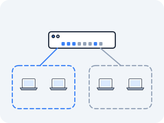
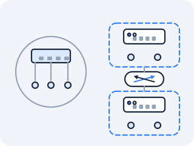
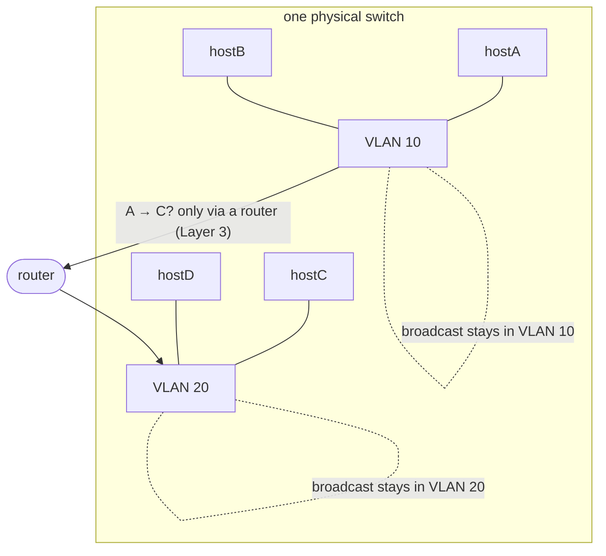

# VLANs — one wire, many separate networks

The last file ended on an uncomfortable thought. ARP works by shouting onto a wire that *every* card hears, and *any* card may answer. For a roomful of colleagues that's fine.



But the wire grows: hundreds of machines, every broadcast flooded to all of them, and any host free to claim it's the gateway. The shared wire that made addressing simple becomes both a noise problem and a trust problem the bigger it gets. So here's the question this file answers: how do you cut one physical wire into several smaller, isolated wires — without laying a single new cable? The answer, like the MAC and the IP before it, turns out to be just a number written into the frame.

## The problem: one shared wire neither scales nor isolates

By the mid-1990s a switched Ethernet had become a victim of its own success. Every machine plugged into the building's switches shared one **broadcast domain**: one ARP request, one stray broadcast, was flooded to every port. With hundreds of hosts the broadcast traffic alone taxed every card, and a single misbehaving machine could drown the network — a *broadcast storm*. And there was no isolation at all: accounting, engineering, and the jack in the public lobby were electrically the same wire, so anything one machine could broadcast or ARP-spoof, every machine received.

You could fix it by buying a separate physical switch for each group — but that's expensive and rigid, and the moment someone moves desks you're re-cabling. **So the wire's two failures — noise that grows with the building, and accounting sharing a segment with the lobby jack — are one failure: the partition was physical, and physical partitions cost money and don't move.** The cleaner idea, standardized as IEEE 802.1Q in 1998, was to make the partition *virtual*: keep one physical switch, but tag every frame with a label saying which group it belongs to, and have the switch refuse to carry a frame across labels. One switch, many independent wires, defined by a number.

## What a VLAN actually is — a broadcast domain with a number on it

A VLAN (Virtual LAN) is a **broadcast domain defined by a number** rather than by physical wiring. The number is a 12-bit **VLAN ID** (1–4094) carried in a 4-byte **802.1Q tag** slipped into the Ethernet frame right after the source MAC:



<!-- figure -->

```
   +-----------+-----------+===============+-----------+-----------+--------+
   | dst MAC   | src MAC   | 802.1Q tag    | EtherType |  payload  |  FCS   |
   | 48 bits   | 48 bits   | TPID 0x8100   | 0x0800=IP |           |        |
   +-----------+-----------+===============+-----------+-----------+--------+
                           | PCP(3) DEI(1) VID(12) |
                           |  prio        VLAN ID  |   ◄── the whole partition
                                          1..4094       is these 12 bits
```

A switch port is one of two kinds. An **access port** belongs to exactly one VLAN, and the host plugged into it sends and receives ordinary *untagged* frames, never knowing it's been partitioned. A **trunk port** carries many VLANs between switches and *tags* every frame so the far end knows which domain it came from.

And here is the iron rule: a broadcast in VLAN 10 reaches only VLAN 10. Two hosts on the same physical switch but different VLANs cannot reach each other at Layer 2 **at all** — to cross between them, a frame must climb to a router at Layer 3, exactly as if they sat in two different buildings.

**Twelve bits in the frame header. That is the entire partition.**



## Make two VLANs on one card, by hand

A Linux VLAN is just an interface, and like every interface it surfaces as files. In the lab —

```bash
docker run --rm -it --privileged --network host --name lab nicolaka/netshoot
```

— carve two VLANs out of one physical `eth0`:

> **`ip link add link eth0 name eth0.10 type vlan id 10`** creates an interface whose every outgoing frame carries the 802.1Q tag for VID 10, riding on the parent `eth0`.

> **Predict first —** you're about to make `eth0.10` and `eth0.20` on the *same* physical card. Will they share one broadcast domain (it's one card, after all) or two (they're two VLANs)?

```bash
ip link add link eth0 name eth0.10 type vlan id 10
ip link add link eth0 name eth0.20 type vlan id 20
cat /proc/net/vlan/config
```

The file lists both devices, each bound to parent `eth0` with its own VLAN ID. They ride the *same physical card* yet are two separate broadcast domains: a frame leaving `eth0.10` is stamped VID 10, and a switch will never deliver it to a VID 20 port. That's the answer to the prediction — two domains, one wire.

Which raises a sharper question about what "two wires" even means here. You met the card's Layer 2 name in the last lesson, and these are supposedly two separate wires:

> **Predict first —** `eth0.10` is a brand-new interface. Will it have a MAC address of its own, or `eth0`'s?

```bash
cat /sys/class/net/eth0/address
cat /sys/class/net/eth0.10/address
cat /sys/class/net/eth0.20/address
```

All three are the *same* six hex pairs. There is one card, so there is one hardware name — the separation is not a second card and not a second MAC, it is purely the twelve bits stamped into each frame on the way out. That is how thin the wall is, and it is the whole of the shadow at the bottom of this file.

## `ip -d link show` — the tag, read for you

You read the partition out of `/proc/net/vlan/config` by hand. The tool that names it per-interface is `ip -d link show` (the `-d` for *detail*):

```bash
ip -d link show eth0.10
```

It prints `vlan protocol 802.1Q id 10` — nothing the config file didn't already hold, just labeled.

> **Tear these down when you're done.** `--network host` means `eth0` is the host's card, so these two interfaces are real additions to the host's network namespace, not a container's private copy: `ip link del eth0.10 && ip link del eth0.20`.

> **Check yourself —** `eth0.10` and `eth0.20` share one physical card and one MAC address. So what actually stops a frame you send out of `eth0.10` from being delivered to a host sitting in VLAN 20?

<details>
<summary>Answer</summary>

Nothing on your machine — the switch does it. Your card stamps VID 10 into the 802.1Q tag and puts the frame on the wire; the switch reads those twelve bits and refuses to forward the frame to any port that isn't in VLAN 10. The boundary is not electrical and not a second card: it is a number in a header that the switch chooses to honour. Which is exactly why a host that writes a *different* number can go somewhere it shouldn't.

</details>

## The shadow it casts: isolation that's only a tag

**The wall between two VLANs is a number the endpoints write — so a carefully malformed frame walks straight through it.**

The whole promise of VLANs is "different VLANs are as separate as different buildings." But that separation lives in a 12-bit number any host can write, and switches trust it.

In a **VLAN hopping** attack by *double tagging*, an attacker on VLAN 10 sends a frame stamped with **two** 802.1Q tags: an outer tag for the trunk's *native* VLAN (which switches forward untagged, stripping it off) and an inner tag for the victim VLAN 20. The first switch strips the outer tag and forwards the frame down the trunk; the second switch sees the inner tag and dutifully delivers it into VLAN 20 — a packet that walked straight through a wall that was supposed to be impassable.

The elegance and the horror are the same fact: the boundary is a header the endpoints write, so a carefully malformed frame is all it takes to cross it. (The defences are all "don't trust the tag": never put real traffic on the native VLAN, and pin access ports to a single VLAN.)

## The question you carry into Kubernetes

You just built two isolated wires out of one card and a number. So carry the pattern, not a verdict: **an isolation boundary can be a label that something in the path agrees to honour, rather than a physical gap** — and when the label is written by the endpoint, the boundary is only as strong as whoever checks it.

The question to keep asking: when you are told two workloads are "isolated," ask *what writes the label, and who checks it?* You will be told a cluster isolates Pods from each other. Before you believe it, find that sentence's VLAN tag.

> **You understand this when you can** create `eth0.10` on a card, read its VLAN ID out of `/proc/net/vlan/config` rather than from a tool, and explain — pointing at the frame diagram — why two hosts on the same switch in different VLANs need a router to exchange one packet, even though the wire physically reaches both.

## Where you are now

You can point at the 12-bit VID inside a frame, explain why two interfaces on one wire still can't hear each other's broadcasts, build two VLANs on one card and read them from `/proc/net/vlan/config`, and name the double-tagging trick that defeats the boundary.

But notice what VLANs did *not* solve. They sliced one wire into isolated wires — and made it *impossible* for a host on one to reach a host on another at Layer 2. The whole point of a network, though, is to reach machines that aren't on your wire at all. For that you need a name that means the same thing across *every* wire, and a rule for getting a packet from one to the next. That name is the IP address. That's the next file.

---

← Prev: **[The wire and the two names](01-ethernet-and-arp.md)** · ↑ **[Act II overview](README.md)** · Next: **[IP and routing](02-ip-and-routing.md)** →
