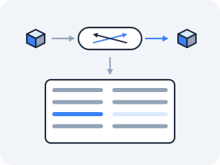
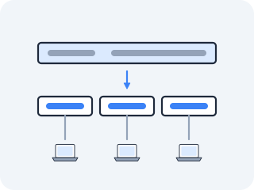

# IP and routing

VLANs left you with a pile of isolated wires and a fresh frustration: a host on one wire *cannot* reach a host on another at Layer 2, and the MAC address — that hardware name — means nothing one hop away. But the whole point of a network is to reach machines that aren't on your wire.



For that you need two things you don't yet have: a name that means the same thing on *every* wire, and a rule that decides, at each junction, which way to send a packet so it gets closer. That name is the IP address. That rule is the routing table. This file builds both, and reads them straight out of the kernel.

## The problem: one name that means the same thing everywhere

By the late 1970s the ARPAnet was no longer one network; it was several — radio, satellite, Ethernet — that had to be glued into one. Vint Cerf and Bob Kahn's problem was to give every machine an address that meant the same thing regardless of which kind of wire it sat on, so a packet could be handed from network to network until it arrived.

You could imagine baking the wire's identity into the address — but then moving a machine to a different kind of link would change its name, and the gluing would fall apart. **A name that mentions the wire is a name that changes when the wire does — so the address had to be independent of every wire.** Their answer, fixed in the early 1980s, was a single flat **32-bit number** for every host on the entire internet, independent of any wire. CS:APP §11.3 is blunt about what that number really is: an IP address is just an unsigned 32-bit integer. Everything else is decoration for humans.

## What an IP address actually is — a 32-bit integer

The familiar dotted-decimal `10.244.0.5` is pure sugar: take the 32 bits, chop them into four 8-bit bytes, write each as a decimal with dots between. The kernel never thinks in dots — it thinks in the integer, and it stores that integer in **network byte order**, which is big-endian (most-significant byte first).

CS:APP §11.3 stresses this because your x86 machine is little-endian internally, so the kernel byte-swaps on the way in and out; the dotted string you read is the big-endian bytes spelled left to right. A *subnet* is just a question about the **high bits** of that integer: a prefix like `/16` says "the first 16 bits are the network, the rest is the host."

> That `address/prefix` notation is **CIDR** — Classless Inter-Domain Routing. "Classless" is the whole point: an earlier scheme forced every network to be one of three fixed sizes (a `/8`, a `/16`, or a `/24`), and CIDR replaced it with "state how many bits are the network, and any number will do." Every `/16`, `/22`, and `/32` in this act and in every cloud console you will ever open is that one notation.

<!-- figure -->

```
   10  .  244  .   0   .   5
  00001010 11110100 00000000 00000101      the 32-bit integer
  └────── network ──────┘└──── host ─────┘
     first 16 bits           last 16 bits
     = 10.244              = 0.5

  network = 10.244.0.0/16
  usable hosts = 2^16 - 2 = 65534   (minus the all-zeros network address
                                       and the all-ones broadcast address)
```

Masking is literally a bitwise AND: the address AND the mask `11111111 11111111 00000000 00000000` zeros out the host bits, leaving `10.244.0.0` — the network the address belongs to.

## Subnet one by hand — the arithmetic everything later is made of

You have everything you need to do this yourself now: the mask is a run of ones, masking is an AND, and the diagram above already shows that the network address and the broadcast address are the two you don't get to hand to a host. So do two, before any tool and before any worked example. On paper.



> **Predict first —** for `10.244.6.37/22` and for `192.168.1.200/28`, work out the network address, the broadcast address, and the number of usable hosts. Six answers. Write all six down.

The verification is one command, run in the lab — this is the first of two experiments in this lesson, so start it now and stay in it:

```bash
docker run --rm -it --privileged --network host --name lab nicolaka/netshoot
```

`netshoot` ships Python, and Python's standard library has an `ipaddress` module that does exactly this arithmetic — so you are checking your hand-work against the same masking, not against a different opinion:

```bash
python3 -c '
import ipaddress
for c in ("10.244.6.37/22", "192.168.1.200/28"):
    n = ipaddress.ip_network(c, strict=False)
    print(c, "-> network", n.network_address,
          "| broadcast", n.broadcast_address,
          "| usable", len(list(n.hosts())))
'
```

```
10.244.6.37/22 -> network 10.244.4.0 | broadcast 10.244.7.255 | usable 1022
192.168.1.200/28 -> network 192.168.1.192 | broadcast 192.168.1.207 | usable 14
```

**If you got `10.244.0.0` or `10.244.6.0` for the first one, you did the thing everybody does the first time: you rounded to the nearest dot.** `/16` and `/24` land on dots and can be done by squinting at the decimals, which is exactly why they teach you nothing. `/22` does not. Its boundary falls *inside* the third byte — six of that byte's bits are network, two are host — and no amount of looking at the decimal `6` will show you where the line is.

So here is the method, in the one form that cannot mislead you: bits, all the way across.

That needs one thing first — decimal to binary for an arbitrary byte, in your head, because the whole
point is to do this without a tool. Walking eight place values in a row is too long to hold, so
**split the byte at 16**: one division, then two numbers under 16, each converted on the `8-4-2-1`
ladder.

<!-- figure -->

```
  172 / 16  =  10  remainder  12          (160 is ten 16s)

    10  ->  8? yes, rem 2 · 4? no · 2? yes, rem 0 · 1? no  ->  1010
    12  ->  8? yes, rem 4 · 4? yes, rem 0 · 2? no · 1? no  ->  1100

  172  =  1010 1100        check: 128 + 32 + 8 + 4 = 172
```

Four steps per half instead of eight in a row, you never hold a number bigger than 15, and each nibble
can be re-checked on its own — which is what you want when somebody is watching, because the thing that
saves you is error *recovery*, not speed. Have the multiples of 16 cold —
`16 32 48 64 80 96 112 128 144 160 176 192 208 224 240` — and several are already familiar to you as
mask octets.

Worked in full on a third address, `172.16.21.99/20`. The other two bytes are your practice: do `21`
and `99` yourself before you read the row.

<!-- figure -->

```
  address   172      . 16       . 21       . 99
            10101100   00010000   00010101   01100011
  /20 mask  11111111   11111111   11110000   00000000     20 ones, then 12 zeros
            ────────── AND ──────────────────────────
  network   10101100   00010000   00010000   00000000  =  172.16.16.0
                                  ^^^^ ----             the split lands MID-BYTE

  broadcast: same network bits, host bits all ONES
            10101100   00010000   00011111   11111111  =  172.16.31.255

  host bits = 32 - 20 = 12   ->   2^12 = 4096 addresses
  usable    = 4096 - 2 = 4094      (minus network address and broadcast address)
```

Three results, three rules, and none of them are anything but the AND: **network** is address AND
mask; **broadcast** is the network with every host bit set to 1; **usable hosts** is
`2^(32 − prefix) − 2` — the 2 being the network address and the broadcast address, which are spoken
for. That last rule holds for `/30` and shorter, which covers every subnet you hand addresses out of.
The two prefixes below it are exceptions, and worth having now because you will meet both.

> ### `/31` and `/32` — where minus-two stops being true
>
> | prefix | addresses | `− 2` says | actually usable |
> |---|---|---|---|
> | `/30` | 4 | 2 | 2 |
> | `/31` | 2 | **0** | **2** |
> | `/32` | 1 | **−1** | **1** |
>
> The minus-two exists to reserve a network address and a broadcast address. On a **`/31`** there is
> exactly one other machine on the wire, so there is nothing to broadcast *to* and no subnet identity
> worth naming apart from the two hosts on it — neither reservation earns its keep, and you get both
> addresses. That is [RFC 3021](https://www.rfc-editor.org/rfc/rfc3021), *Using 31-Bit Prefixes on IPv4
> Point-to-Point Links*, and it is the ordinary way to number a router-to-router link. `/30` was the
> old way, and it threw away half of every one.
>
> A **`/32`** is one address and no prefix at all — a *host route*. Loopback addresses, virtual IPs,
> and, in Act V, the route a node holds for one single Pod.
>
> The kernel agrees, and you can watch it agree in the container you are already in:
>
> ```bash
> ip link add p0 type dummy && ip link set p0 up
> ip addr add 10.7.0.1/31 dev p0 && ip route show dev p0
> ip addr add 10.7.0.9/32 dev p0 && ip route show dev p0
> ```
>
> The `/31` installs `10.7.0.0/31 proto kernel scope link src 10.7.0.1` — a real on-link prefix, so
> the kernel considers both addresses reachable without a gateway. The `/32` adds **no second route**:
> the output is unchanged. There is no prefix for the kernel to treat as on-link, and that absence is
> what "host route" means. Clean up with `ip link del p0`.
>
> Python already encodes the exception, which is why the checks in this lesson count `hosts()` rather
> than subtracting 2: `len(list(n.hosts()))` gives **2** for a `/31` and **1** for a `/32`, where
> `n.num_addresses - 2` gives 0 and −1. Check your arithmetic with the same wrong expression and the
> tool will agree with you — which is the one thing a check must never do.
>
> IPv6 has no broadcast address at all, so none of this subtraction applies there. A `/64` has 2^64
> usable addresses, full stop.

Now go back and redo whichever of the two you missed, with the bits written out, and add the `/20` above to your check:

```bash
python3 -c '
import ipaddress
n = ipaddress.ip_network("172.16.21.99/20", strict=False)
print(n.network_address, n.broadcast_address, len(list(n.hosts())))
'
```

This arithmetic is the floor under every cloud VPC, every Pod CIDR, and every firewall rule you will meet for the rest of the course. It is worth being able to do it without a tool, on a whiteboard, while somebody watches.

Now the routing decision. A router holds many such networks and, for each packet, finds the matching one by **longest-prefix match** — the most specific route wins, *never* "first match":

<!-- figure -->

```
  packet arrives: dst = 10.244.0.5
                         │
                         ▼
   ROUTING TABLE                      does 10.244.0.5 fall inside?
   ┌──────────────────┬───────────┐
   │ 0.0.0.0/0        │ via gw    │   yes (matches everything) — prefix 0
   │ 10.0.0.0/8       │ via gwA   │   yes (10.* )              — prefix 8
 ► │ 10.244.0.0/16    │ dev eth1  │   yes (10.244.*)           — prefix 16  ◄ WINS
   └──────────────────┴───────────┘        most specific match
```

The packet matches three rows; the `/16` wins because 16 is the longest prefix.

> **Check yourself —** A routing table holds `0.0.0.0/0 via gw`, `10.0.0.0/8 via gwA`, and `10.244.0.0/16 dev eth1`. Where does a packet for `10.9.9.9` go, and why?

<details>
<summary>Answer</summary>

Out `gwA`, via the `/8`. All three rows are consulted, but `10.9.9.9` does not fall inside `10.244.0.0/16`, so the two matching rows are the `/8` and the default `/0` — and the `/8` is the longer prefix. Longest-prefix match means most specific *matching* row, never first row.

</details>

## Read the routing table by hand

The kernel keeps this table in two files — one humane, one not — and you should look at the raw one before any tool. Stay in the same `lab` shell:

> **`/proc/net/route`** — the raw table, one row per route, addresses as little-endian hex. **`/proc/net/fib_trie`** — the actual data structure (a prefix trie) the kernel walks, dumped as text.

```bash
head -20 /proc/net/fib_trie
cat /proc/net/route
```

The `fib_trie` dump is deliberately overwhelming — a tree of `/N` nodes and leaves the kernel descends to do longest-prefix match — and after twenty lines of it you'll feel in your bones why a tool exists. The raw `/proc/net/route` is more decodable but tricky: each address is a little-endian hex integer, the same byte-reversal you learned reading `/proc/net/tcp` in Act I. Only four of its columns matter to you — `Iface`, `Destination`, `Gateway`, `Mask`. The rest (`RefCnt`, `Use`, `Metric`, `MTU`, `Window`, `IRTT`) are kernel bookkeeping, exactly like the fields you were told to ignore in `/proc/net/tcp`.

So decode a row yourself before any tool tells you what it says. Find the row whose `Destination` is `00000000` — that is the default route, `0.0.0.0/0`, and its `Gateway` column is the machine's next hop for the whole internet.

You already know what that gateway is: you read it with `ip route show default` and pinged it in the ARP lesson. So this is not a guessing game, it is the sharper test — *does the file, decoded by your own hand, come out to the address the tool told you?*

> **Predict first —** take *your* row's `Gateway` hex, reverse its four bytes, and write out the dotted-decimal. Do it before reading on, and predict whether it will match the gateway you already know. If it doesn't, one of you is wrong — and it isn't the file.

Here is the same decode worked on a sample row from a different machine, so the method is visible without handing you your own answer:

<!-- figure -->

```
  Iface  Destination  Gateway   Flags  ...  Mask
  eth0   00000000     0102A8C0  0003        00000000
         │            │                     │
         │            │                     └─ Mask 00000000 = /0 : matches everything
         │            └─ four hex bytes, LITTLE-endian:  01 02 A8 C0
         │                 reverse them:                C0 A8 02 01
         │                 as decimal:                  192 .168 .  2 .  1
         └─ Destination 00000000 = 0.0.0.0 : this is the default route
```

Read the bytes right-to-left, two hex digits at a time, and convert each pair to decimal — `C0`=192, `A8`=168, `02`=2, `01`=1. Now check your own row's answer against the tool:

```bash
ip route show default
```

They agree, and that is the whole point of having decoded it: you did not take "the file wins" on faith, you read the file and then watched the tool report exactly what you had already worked out. If they had disagreed, the file would still be right.

## Earn `ip route` — and ask the kernel out loud

Having felt the raw table, earn the tool. `ip route` reads exactly `/proc/net/route`, byte-swaps, masks, and labels it — it invents nothing. Its sharpest form doesn't just print the table; it asks the kernel to *run the match* for a destination:

> **Predict first —** for `ip route get 8.8.8.8`, which interface will the kernel say the packet leaves by, and what *source* IP will it stamp on the packet?

```bash
ip route get 8.8.8.8
ip route get 127.0.0.1
```

It answers in one line: which route matched, the outgoing interface (`dev …`), the next-hop gateway (`via …`), and — the part people miss — the **source** IP the kernel will stamp, chosen from the outgoing interface's address (`src …`). You sent nothing; you made the kernel perform its longest-prefix match aloud. `127.0.0.1` chooses `lo` instead, by the very same rule. And the reflex from Act I still holds: if `ip route` ever disagreed with `/proc/net/route`, the file would win.

## The shadow it casts: longest-prefix match has no concept of authority

**"Most specific wins" is arithmetic, not permission — announce a longer prefix than the owner and the planet believes you.**

That rule scales all the way up to the whole internet — and trusts whoever announces. On February 24, 2008, Pakistan Telecom, ordered to block YouTube at home, announced into the global routing system a route for a *more specific* slice of YouTube's address range than YouTube itself advertised.

More specific means a longer prefix, and a longer prefix wins — so routers across the planet, doing exactly the masking arithmetic above, concluded the best path to YouTube led to Pakistan, and for roughly two hours much of the world's YouTube traffic was routed into one ISP and dropped. Nobody was hacked and nothing broke; the internet simply did what longest-prefix match told it to, because the routing system believes what it's told. (*How* that announcement spread to the whole planet is the next file's protocol.)

## The question you carry into Kubernetes

Two things you just proved are about to be load-bearing, so hold them as questions rather than facts.

First: the longest prefix possible is `/32` — a route to exactly one address. Ask yourself what a table would look like if somebody wanted traffic for *one specific machine* to always win the match, no matter what else was in the table.

Second: `ip route get <dst>` makes the kernel run its match out loud without sending anything. That is a debugging superpower and you should be suspicious of how little you have used it. When you are eventually told "these two machines can't reach each other," the shape to reach for is: **whose table decides, and what does `ip route get` say it picked?**

> **You understand this when you can** take a `/22` and a `/28` you have never seen, produce the network address, the broadcast address, and the usable host count on paper, and separately decode a `Gateway` field out of `/proc/net/route` into dotted-decimal by reversing its bytes — then predict what `ip route get` will answer for an address before you run it.

> **On your own machine —** longest-prefix routing does something beautiful every single day: the `1.1.1.1` you reach is not the one your friend in another city reaches. Prove it — find the exact Cloudflare datacenter answering *you*, and see how few hops away it is — in [Act II in the wild](in-the-wild.md#which-cloudflare-answers-you-anycast).

## Where you are now

You can subnet a network on paper — network address, broadcast address, usable host count, for a prefix that cuts a byte in half — because you write the bits out and AND them instead of squinting at the decimals. You can decode a hex row of `/proc/net/route` into a dotted-decimal gateway by hand and watch `ip route show` agree with you, predict which row `ip route get` will pick before you run it, and read the source IP the kernel will stamp. You know longest-prefix match is "most specific wins," never "first match."

But every route in that table got there *somehow*. On your laptop a couple arrived by hand or from DHCP. On the internet there are nearly a million routes, across tens of thousands of independently run networks, changing every second — and no human types those. So who fills the table? The routers tell each other, with a protocol that runs the entire internet and trusts what it's told exactly as much as ARP did. That's the next file.

---

← Prev: **[VLANs and segmentation](01b-vlans-and-segmentation.md)** · ↑ **[Act II overview](README.md)** · Next: **[Routing protocols and BGP](02b-routing-and-bgp.md)** →
