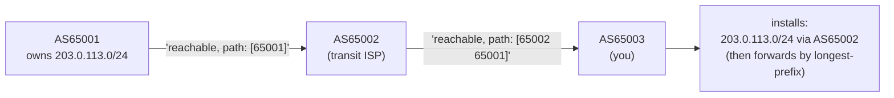

# Routing protocols and BGP — who fills the table

The last file left you reading a routing table and predicting which row wins by longest-prefix match. It never asked the obvious question: *who put those rows there?* And it left a loose thread — how did one ISP's announcement in Pakistan reach routers across the whole planet in minutes? Both have the same answer.

On your laptop a handful of routes arrived by hand or from DHCP, but the internet has nearly a million routes, spread across tens of thousands of independently run networks, changing every second. No human maintains that. The routers tell each other — and the protocol they use to do it runs the entire internet and trusts what it's told exactly as much as ARP did.

## The problem: no human can maintain a million routes

**So the routers fill it for each other — and by the late 1980s they had to do it across organisations that refused to take orders from one another.**

A routing table fills two ways. **Statically**: an administrator types `ip route add` by hand — fine for a few routes that never change. **Dynamically**: routers run a protocol that discovers routes and reacts when links fail.

By the late 1980s the network had become a network *of networks*, each run by a different organisation that wanted to set its own policy and not be dictated to by outsiders. Two engineers, Kirk Lougheed and Yakov Rekhter, famously sketched the replacement on a few napkins at an IETF meeting in 1989; the **Border Gateway Protocol** (RFC 1105) has glued the independent pieces of the internet together ever since.

## What BGP actually is — networks announcing what they can reach

**Each network tells its neighbours which prefixes it can reach and the list of networks a route has crossed to get there.**

The internet is divided into **Autonomous Systems** (AS): each is one network under a single authority — an ISP, a cloud provider, a large company — identified by an **AS number** (ASN). Routing splits in two. *Interior* protocols (OSPF, IS-IS) fill the table **inside** one AS, where everyone cooperates. *Exterior* routing — **BGP** — runs **between** ASes, where they don't.

Each BGP router announces to its neighbours which IP prefixes it can reach, and the **AS-path** to get there: the list of ASes a route has crossed. That makes BGP a *path-vector* protocol — carrying the path both prevents loops (an AS rejects any route already listing itself) and lets each AS apply *policy* (prefer this neighbour, refuse that one).

BGP picks a *best path* by policy, not by distance — but once a route is installed, your packets are still forwarded by the plain longest-prefix match from the last file. (BGP itself rides on a reliable connection — TCP port 179, the dependable byte-stream you'll build in Act III; for now just hold that it's a conversation that doesn't lose messages.)



Each hop *prepends* its own ASN to the path — that's the loop prevention and the policy hook in one.

## See who installed a route, by hand

You can't peer with the internet from the lab, but you can watch the kernel record *who owns* each route. The routes any protocol learns land in the same table you already decoded — `/proc/net/route`, read with `ip route` — and the kernel stamps each with a `proto` field. In the lab:

```bash
docker run --rm -it --privileged --network host --name lab nicolaka/netshoot
```

> **Predict first —** when you add a route and tag it as coming from BGP, will `ip route show proto bgp` list it — and what does that prove the kernel tracks about a route besides its destination and next hop?

> **`--network host` means these are the host's real routes.** Every `ip route add` below has a matching `ip route del` on the next line or two. Run each block to its end — on a Linux host a stray route you leave behind is a route the machine really uses.

```bash
ip route show                                   # note the "proto" word on each row
ip route add 203.0.113.0/24 dev eth0 proto bgp  # pretend a BGP daemon installed this
ip route show proto bgp                          # filter to BGP-sourced routes
ip route del 203.0.113.0/24                      # clean up
```

The route appears only under the `proto bgp` filter, because the kernel records each route's origin. That field is how a node holds routes from several sources at once — a static default, DHCP's gateway, BGP-learned prefixes — and can still say where each came from.

A real router keeps its full set of candidate routes in a *RIB* in user space (the BGP daemon — FRR, BIRD), then installs the chosen best paths into the kernel *FIB* — the exact `/proc/net/route` you decoded. The daemon is the brain; the file is the muscle it drives.

## The shadow it casts: trust, at planetary scale

BGP, like ARP and like longest-prefix match itself, **believes whatever it's told.** Before seeing what breaks, test your mental model.

> **Predict:** YouTube's real block was `208.65.152.0/22`. If Pakistan Telecom announced `208.65.153.0/24` — a smaller slice of the same space, pointing at themselves — which row wins by the rule you already know? And what happens to packets that arrive at Pakistan Telecom if they have no route for them?

The /24 wins. The packets arrive and go nowhere. That is the entire mechanism of the 2008 YouTube hijack — and you can stage it in your own kernel, because "which row wins" is the same longest-prefix match you ran with `ip route get` in the last file. Install YouTube's real route, then the hijacker's more-specific one pointing *nowhere* (a `blackhole` route: packets that match it are silently dropped — "arrive and go nowhere," exactly):

```bash
ip route add 208.65.152.0/22 dev eth0        # YouTube's real, less-specific announcement
ip route add blackhole 208.65.153.0/24       # the hijack: a /24 inside it, routed to oblivion
ip route get 208.65.153.10                    # an address BOTH cover — who wins?
ip route get 208.65.155.10                    # inside the /22 but OUTSIDE the /24 — who wins?
ip route del blackhole 208.65.153.0/24 ; ip route del 208.65.152.0/22   # clean up
```

`ip route get 208.65.153.10` comes back **`unreachable`** — the kernel chose the `/24` blackhole over the working `/22`, and the packet dies, just as YouTube's traffic died in Islamabad. But `208.65.155.10`, one prefix over, still routes out `eth0`: the hijack only swallowed the slice it was more-specific about. You didn't take "the /24 wins" on faith — you watched the same rule from the last file hand a global outage to whoever announces the longest prefix.

Pakistan Telecom had been ordered to *block* YouTube domestically. They announced a more-specific prefix pointing at themselves — probably intending to blackhole it inside their own network. But their upstream provider (PCCW, a Hong Kong ISP) had loose filters and propagated the announcement globally.

Within minutes every BGP router on the planet was choosing Pakistan Telecom's /24 over YouTube's /22 — not because they were tricked, but because they were following the rule correctly. Packets for YouTube flew to Islamabad and vanished.

The fix had nothing to do with the protocol either. YouTube's engineers noticed the BGP table was wrong, called PCCW directly, and PCCW **withdrew** Pakistan Telecom's announcement. Routers reconverged — BGP propagated the withdrawal just as it had propagated the hijack — and YouTube's /22 was the best route again within minutes.

The resolution was a phone call, not a technical safeguard. That's how fragile it is: the same social contract that caused the problem (PCCW trusting its peer without filtering) is what fixed it (PCCW acting when told).

> **Check yourself —** YouTube could not reach into the world's routers and delete Pakistan Telecom's `/24`. Using nothing but the rule you just staged in your own kernel, what could YouTube announce to win its own traffic back — and what does that tell you about who wins a hijack fight?

<details>
<summary>Answer</summary>

Announce prefixes at least as specific as the hijacker's. YouTube's own `/24`s tie the hijacker's `/24`, and anything longer beats it — which is exactly what YouTube did while the phone call was being made. Longest-prefix match has no concept of authority, so a hijack fight is settled by whoever announces the longer prefix, not by whoever owns the address space. The only reason it does not escalate forever is an operational convention, not the protocol: most networks refuse to accept announcements longer than a `/24`, so `/24` is the ceiling — and once both sides are at the ceiling, the winner is decided by policy and peering, i.e. by the phone call.

</details>

### Can't anyone do this? Who checks?

That's the right question. Getting an ASN is a form and a fee to your regional registry (ARIN covers North America, RIPE covers Europe, APNIC covers Asia-Pacific). Once you have one, you can announce any prefix you like — BGP has no built-in ownership check. The protocol that routes the entire internet runs on the same blind trust as ARP.

What keeps it from collapsing daily is a handful of things that are *not* the protocol. Two of them are purely human:

| Defense | What it is | Why it's fragile |
|---|---|---|
| **Prefix filtering** | ISPs only accept routes matching what's documented in routing registries (IRR) | manual, inconsistently applied — PCCW's filter failed in 2008 |
| **Social / business contracts** | mis-routing a peer breaks agreements and costs money | doesn't stop a state actor or a malicious insider |

There is a third defence that is not the protocol either, but is at least mechanical: **RPKI**. The owner of an IP block publishes a signed statement — "AS 36561 is authorised to originate `208.65.152.0/22`" — and a router that bothers to check can compare an arriving announcement against that statement and drop it if the origin doesn't match. Notice what it does *not* do: it never proves the AS-path is real, only who is allowed to be at the far end of it. Adoption began around 2012 and is still partial, which is why hijacks still happen.

> That signed statement raises a question this act cannot answer: what does it *mean* to sign something, and why would a router in another country believe the signature? Hold the shape — *an assertion nobody trusts, made checkable by a signature somebody does* — because you will meet it again the moment we stop taking a lock on your browser's address bar for granted.

Now turn the failure the other way round. The famous non-malicious case is just as dramatic:

> **Predict:** on October 4, 2021, a routine maintenance change made Facebook's own routers **withdraw** their BGP announcements — not announce a wrong route, just stop announcing the right one. With no announcement at all, what does every other router's longest-prefix match have left to match against? And would `facebook.com` still resolve to an address?

Nothing, and no. The internet deleted Facebook's routes, so there was no row to win the match; and because Facebook's own authoritative nameservers lived inside the address space that had just vanished, name resolution failed too. Badge readers stopped working. Nobody attacked anything — BGP did exactly what it was told. The protocol that routes the whole internet and the protocol that resolves every domain name turn out to depend on each other, and on the same fragile trust.

## The question you carry into Kubernetes

You have just seen that a router is not special hardware. It is a table, a `proto` field recording who filled each row, and a daemon in user space deciding what to put there. Your lab container has all three.

So carry the question: **if a machine with a routing table and a daemon is a router, what stops an ordinary server from being one?** Nothing you have met so far. When you eventually have thirty machines that each own a slice of address space and need to tell the other twenty-nine about it, ask whether they should be told by hand — and if not, which of the two mechanisms from this file you would reach for.

> **You understand this when you can** add a route tagged `proto bgp` to a kernel, show that `ip route show proto bgp` finds it and plain `ip route show` also lists it, and then stage the 2008 hijack from memory — a `/22` plus a more-specific `blackhole /24` — and predict which of two addresses `ip route get` will call unreachable before you press enter.

## Where you are now

You can explain the difference between static and dynamic routing, between interior and exterior protocols, and between a daemon's RIB and the kernel's FIB. You know BGP is networks announcing reachability with an AS-path, that forwarding still falls back to longest-prefix match, and that its trust model is ARP's flaw scaled to the planet.

You can trace the exact mechanism of the 2008 Pakistan hijack — a more-specific /24 beating YouTube's /22, propagated by a peer with loose filters — and explain why an ASN being a form-and-a-fee to a registry is both the barrier and the gap: anyone can announce anything, and what holds it together is operational discipline and social contracts, not the protocol.

So far the network can *address* a machine and *route* toward it. But IP itself is a blunt instrument: it will drop your packet without a word, and has no notion of when a packet has wandered too long. The small protocols that ride on IP and make it usable — a channel for the network to report problems, a bare-bones way to send one message, and a countdown that kills lost packets — are next.

---

← Prev: **[IP and routing](02-ip-and-routing.md)** · ↑ **[Act II overview](README.md)** · Next: **[ICMP, UDP, and TTL](03-icmp-and-udp.md)** →
