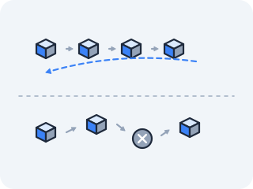

# ICMP, UDP, and TTL

The routing table tells the kernel where to send a packet — but that's just the map. What happens when a packet actually travels the route and fails silently partway? What if an application wants to fire one small message without a three-way handshake? And what stops a misrouted packet from circling the network forever? Bare IP answers none of these — we'll find each answer by provoking it on the wire and watching it happen.



## ICMP — when the network needs to say something back

Early IP networks had a maddening property: when a packet failed — no route, a router out of buffers — it simply vanished, and the sender never learned why. There was no way for the network *itself* to say anything. RFC 792 (1981) added a dedicated channel for exactly that: a way for a router to tell a sender "I dropped your packet, and here's the reason."

**ICMP**, the Internet Control Message Protocol, carries no application data — only messages *about* the network. It rides directly on IP (not on any port-based protocol), and each message has a **type** naming the kind and a **code** naming the subtype:

<!-- figure -->

```
   IP header │ ICMP message
             │ type=8  code=0  -> echo request   (ping out)
             │ type=0  code=0  -> echo reply      (ping back)
             │ type=11 code=0  -> time exceeded   (TTL hit zero)
             │ type=3  code=N  -> destination unreachable (N says why)
```

ICMP keeps no per-connection table — unlike the socket ledger in `/proc/net/tcp` or the ARP cache you just queried, there is no file to `cat`. A message exists only for the instant it is in flight. *How do you catch something with no persistent state?*

You tap the wire itself as packets pass — and that is what **`tcpdump`** does.

> **`tcpdump`** opens a *packet socket* (`AF_PACKET`) and asks the kernel for a copy of every frame crossing an interface, then decodes and prints it. It is the wire's equivalent of `cat`-ing a `/proc` file — except the "file" is the live stream of packets going by, not a table sitting in memory. `-i any` taps every interface at once; add `-nn` to stop it rewriting addresses and ports as names, and `-v` to make it print the IP header itself — including the one-byte **protocol** field (`ICMP (1)`, `UDP (17)`, `TCP (6)`), the exact byte the kernel reads to decide what it's holding. (In [the ARP lesson](01-ethernet-and-arp.md#become-the-translator--ask-for-a-mapping-yourself) you put a packet *onto* the wire by hand with scapy; tcpdump is the other half — watching the packets that flow past.)

> **Predict first —** how many ICMP packets will `tcpdump` show per `ping`? And when you switch to `traceroute`, what *kind* of message will the intermediate hops send back?

This lesson needs up to three shells into one container, so start the lab named:

```bash
docker run --rm -it --privileged --network host --name lab nicolaka/netshoot
```

and open each extra shell with `docker exec -it lab zsh`. In shell 1, start the capture and leave it running — it will sit silently waiting until ICMP packets cross the wire:

```bash
tcpdump -nn -i any icmp
```

In shell 2, send the traffic — shell 1 will print lines as soon as packets arrive:

```bash
ping -c 3 8.8.8.8
```

For `ping` you'll see paired lines — an `echo request` leaving, an `echo reply` returning, one pair per ping.

Now run `traceroute` — a tool that maps every router hop between you and a destination by sending packets designed to expire at increasing distances (the full mechanism is in the TTL section below; just watch what appears in shell 1 for now):

```bash
traceroute 8.8.8.8
```

A stream of `time exceeded` messages arrives from each router along the path, each confessing that it dropped your packet. *Something* in those packets ran out on the way — hold the question of what, because the last section of this file is that answer.

The shadow is built into ICMP's helpfulness. An *ICMP redirect* is a router politely saying "for that destination, use this other gateway" — but nothing signs the message, so anyone on the segment can forge one and quietly reroute a victim through a machine they control. The older *Smurf* attack runs the channel backwards: send an echo request to a network's broadcast address with the victim's address forged as the source, and every host answers the victim at once, turning one packet into a flood. The same channel that lets a router honestly say "I dropped your packet" lets a stranger say "send your packets to me."

*ICMP is how the network talks about failure; the next protocol is an application choosing, deliberately, to hear nothing back at all.*

## UDP — eight bytes on top of IP

ICMP has a gap you should notice before anything fills it. It reaches a *machine* — it rides straight on IP, with no ports — so the kernel can answer an echo request itself, but it can never hand a message to *one particular program*. Act I's whole reason for the port was that one machine holds many conversations at once. IP alone cannot address a program either.

So ask the minimal question: what is the *smallest* thing you could bolt onto IP to make a message reach a program rather than a machine? Name the fields you think are unavoidable, and count them, before you read on — the point is how few you can get away with.

RFC 768 (1980) got away with four. **UDP**, the User Datagram Protocol, is **eight bytes**: four 16-bit fields, and then your data.

<!-- figure -->

```
   IP header ──────► gets it to the MACHINE. protocol byte = 17 ("UDP inside")
   ├── UDP header ── 8 bytes. FOUR fields. This is the entire protocol.
   │     source port       16 bits   which program sent it  (so a reply can come home)
   │     destination port  16 bits   which program should receive it
   │     length            16 bits   header + data, in bytes
   │     checksum          16 bits   corrupt? drop it. that is the whole response.
   └── your data ────────► handed to whichever socket holds that destination port
```

Read the list again for what is *absent*, because that absence is the design. There is no field naming this message, so nothing can say "this is the third one." There is no field for "I received yours," so a receiver has literally nowhere to write a confirmation. And the checksum's entire remedy for a damaged datagram is to throw it away without telling anyone. Those aren't features that were removed — there is no room in eight bytes to have had them, and no room to add them without changing the protocol.

What you get in exchange is that **the first packet is the message.** In Act I you learned that a TCP connection opens with a three-packet handshake before one byte of application data can move; here there is nothing to open. That is exactly the trade a DNS lookup wants — one small question, one small answer, and any setup cost would more than double it. (You will send a real DNS query over UDP port 53 in the last lesson of this act, and see whether the resolver has to do anything about the missing confirmations.) It is also the trade live audio wants: a packet that arrives too late to play is worthless, so waiting for it is worse than losing it.

### Watch it in the kernel, then on the wire

Like TCP, UDP has a kernel socket table, and it is in the *same format* as the `/proc/net/tcp` you decoded in Act I — so the Act I decode transfers unchanged. To read a row you need a socket that stays open long enough to look at, so open one deliberately and leave it sitting there:

> **`nc -u -l 9999`** — the `nc` you used in Act I, with **`-u`** switching it from TCP to UDP. Every `nc` before this one opened a TCP socket; this is the first UDP one. (`-l` listens, and the port is the plain positional argument — this image's `nc` refuses `-p` alongside `-l`.)

```bash
# shell 1 — hold a UDP socket open on port 9999 and leave this running
nc -u -l 9999
```

> **Predict first —** the *address* halves of these rows are little-endian hex, and the *port* halves are plain hex, exactly as in Act I. Write down what 9999 looks like in hex before you look — that string is how you will find your own row.

```bash
# shell 2 — the kernel's UDP socket table
cat /proc/net/udp
```

9999 is `0x270F` — no byte-reversal, because ports are not byte-swapped, which is the Act I rule unchanged — so your row is the one whose `local_address` ends `:270F`. The columns are the ones you already know: `local_address` and `rem_address` as `hex-address:hex-port`, then `st`, then `uid` and `inode` in plain decimal. Everything past `inode` is kernel internals; ignore it exactly as you did in Act I.

One column is worth a second look though: `st`. Your listening socket shows `07`, and that is not a UDP state, because UDP has no state machine to be in — the column exists only because this file shares its layout with `/proc/net/tcp`. The `0A` that meant LISTEN in Act I has no counterpart here.

Now the wire. Leave the listener alone and tap `eth0` instead, then fire a single datagram at a machine that is not listening:

> **Predict first —** how many packets will cross the wire before your data does? And once it has gone, how will you find out whether it arrived?

```bash
# shell 2 — tap the wire
tcpdump -nn -i eth0 udp port 9999
```

```bash
# shell 3 — one datagram, aimed at a host that isn't listening on 9999
echo hello | nc -u -w1 8.8.8.8 9999      # -w1: give up after 1 second, so nc exits
```

Zero packets before it. The very first thing on the wire is your data: one line, `UDP, length 6` — five letters plus the newline `echo` adds. And the answer to the second half of the prediction is that you cannot find out. Nothing came back, and nothing was ever going to: no confirmation, and no complaint. (Widen the filter to `udp port 9999 or icmp` and you may catch *the network* complaining on the channel from the top of this file — an ICMP "port unreachable," if the far end bothers to send one. Note who is speaking there. That is ICMP's candour, not UDP's; UDP has no field with which to tell you anything.)

Ctrl-C both the listener and the capture when you're done — with `--network host` that listener is a real socket on the host's port 9999, and it disappears from `/proc/net/udp` the moment you stop it.

> **Check yourself —** A packet arrives at your machine carrying no port numbers at all. What can the kernel still do with it, and what becomes impossible?

<details>
<summary>Answer</summary>

It can still be delivered — to the *machine*. The kernel reads the IP header's protocol byte, sees `1`, and handles it in its own ICMP code: an echo request gets an echo reply, a "time exceeded" gets reported to whatever process was waiting. What becomes impossible is handing it to one program among many. Ports are the only thing that addresses a program rather than a host, which is why ICMP has no sockets to appear in `/proc/net/udp` and no way for two programs on the same machine to have separate ICMP conversations.

</details>

The shadow follows straight from that absence. Because a server answers a datagram without ever confirming who sent it, an attacker can forge the source address to be the victim's, send a tiny query to a service that returns a large reply (open DNS resolvers, NTP, exposed memcached), and have that reply delivered to the victim.

A 60-byte request can summon a 50,000-byte answer; aim thousands of innocent servers at one target and the amplification does the rest. The record-breaking denial-of-service floods of the last decade were almost all UDP reflection — and the grim elegance is that the attacker never sends the victim a single packet directly; they just ask honest servers a question with a forged return address.

### So how do you *know* a packet is ICMP or UDP?

You've now put both on the wire — `ping` sent ICMP, `nc -u` sent UDP — and notice you never set a "protocol" field by hand: the *tool you ran* chose it. To confirm which actually crossed the wire, read three tells, weakest to strongest:

- **The decode names it.** `tcpdump` printed `ICMP echo request` for the ping. For the datagram it printed addresses with a **port** — `8.8.8.8.9999`, a dot before the `9999`. ICMP has no ports (it rides straight on IP, from the top of this file), so *ports-vs-no-ports* alone tells them apart at a glance.
- **The IP header says so, in one byte.** Re-run either capture with `-v` and each line now carries `proto ICMP (1)` or `proto UDP (17)`. That number lives in the IP header and is the ground truth — it's how the receiving kernel decides whether to hand the packet to its ICMP code or to a UDP socket. It can't lie, because it's the byte routing itself reads.
- **Your filter already sorted them.** The `icmp` and `udp port 9999` you typed match on *exactly that byte*. So anything that showed up under `tcpdump -nn -i any icmp` **is** ICMP, by the same test the kernel applies — the tool ran the check for you.

And one tell off the wire: a live UDP socket appears in `/proc/net/udp`; ICMP appears in no such file (it keeps no table, as you saw above). Present in `/proc/net/udp` → UDP; nowhere to look it up → ICMP.

> **On your own machine —** `tcpdump` prints one line per packet; the same capture opened in a GUI lets you click a packet and unfold every header field you have been decoding by hand. Try it on your own traffic in [Act II in the wild](in-the-wild.md#see-the-packets-not-just-the-lines-wireshark).

*UDP made a lost message the application's problem; the last mechanism here decides whether a lost message is allowed to live forever.*

## TTL — the packet's hop budget

Routing tables can be briefly inconsistent — router A thinks the path is through B, B thinks it's through A — and a packet caught in such a loop would, with bare IP, circle forever, multiplied by every other looping packet, until the link drowned. IP needed a guarantee that every packet eventually dies.

**TTL**, Time To Live, is a one-byte counter in the IP header. The sender sets it (Linux defaults to 64); every router that forwards the packet decrements it by one; the instant a router decrements it to zero, that router drops the packet and sends back an ICMP "time exceeded" (the `type=11` you saw scroll past earlier — now you know what ran out). **It is not a clock. It is a hop budget, and it is what makes "forever" impossible.**

<!-- figure: ttl-decrement -->

```
   src(TTL=64) ──► R1(63) ──► R2(62) ──► R3(61) ──► ... ──► dst

   if it loops:  ...─►(2)─►(1)─►(0) — R drops it, sends ICMP time-exceeded back
```

Traceroute turns this kill-switch into a mapping tool — and now you can see *why* those `time exceeded` messages showed up earlier:

> **Predict first —** if traceroute works by sending packets *designed to die early*, what is a line of `* * *` partway down the output telling you about that hop?

```bash
traceroute -n 8.8.8.8
```

It sends a packet with TTL=1; the first router decrements it to 0 and reports itself via ICMP time-exceeded — revealing hop 1. Then TTL=2 reveals hop 2, TTL=3 hop 3, the path drawn one expiring packet at a time. Where you see `* * *`, the hop received the packet but its firewall is configured not to send the time-exceeded reply, so it stays invisible.

Reading the output — each line is one TTL value:

```
 1  192.168.1.1   4.7 ms  3.5 ms  4.2 ms   ← your home router (default gateway from DHCP)
 2  172.31.0.32   6.8 ms  6.5 ms  7.1 ms   ← ISP's first router
 3  *  *  *                                 ← router exists but won't send time-exceeded back
 9  dns.google    7.5 ms  8.0 ms  7.4 ms   ← destination reached; TTL was high enough
```

The **three times per line** are three separate probes — traceroute sends each TTL value three times and records each round trip. They differ slightly because your packets compete with other traffic en route.

If **three different IP addresses appear on one line**, each probe took a different path — routers load-balance across multiple equal-cost links, and each probe landed on a different one. The destination is the same; the roads through the backbone differ.

> **Check yourself —** That output named nine hops. Your own routing table has a handful of rows and holds nothing at all about hop 5. So where is the knowledge of the full path stored?

<details>
<summary>Answer</summary>

Nowhere. Your machine knows only its default gateway (learned from DHCP when it joined the network). It hands the packet there; that router consults *its* table and forwards it one step further; every router along the way does the same. No single participant holds the path — it *emerges* from each router's local knowledge, filled in by BGP. Traceroute does not read the path from anywhere; it provokes each hop into announcing itself. Without it, the path is invisible to everyone, including the packet.

</details>

**On Mac with Docker Desktop:** the container sits inside a Linux VM, and Docker Desktop's internal networking doesn't respond to ICMP time-exceeded. Running traceroute inside the container will show one hop (the VM's gateway, `192.168.65.1`) then `* * *` all the way — not because the route is broken, but because the VM-layer hops stay silent. Run `traceroute` natively on your Mac to see real ISP and internet hops; the output above is what a Linux host on a real LAN prints.

The shadow: because the *sender* sets TTL, an attacker can aim a packet to die at a precise distance. Send a probe with a TTL just high enough to reach a target's firewall but one short of the server behind it — the firewall inspects an ordinary-looking packet and passes or logs it as innocent, while the server never sees it; the packet expired in the gap.

By sweeping TTL values and watching which probes draw a "time exceeded" and which draw a real response, an attacker maps exactly where a firewall sits and infers its rules from outside, never touching the protected host. A field whose only honest purpose is to kill lost packets becomes a ruler for measuring someone else's defenses.

## The question you carry into Kubernetes

Two loose ends from this file are about to matter more than they look.

You sent a datagram and had no way to learn whether it arrived. So when a name lookup in some system you did not build takes almost exactly five seconds and then works fine on the retry, ask: **which layer decided how long to wait, and why is that number a policy rather than a measurement?** UDP cannot have told it.

And you just watched ICMP be the only channel through which the network reports a problem. So when someone hands you a network where ICMP is denied by default, hold the question: **which of your own diagnostic tools did that just switch off, and would you find out before or after the outage?**

> **You understand this when you can** hold a UDP socket open, find its row in `/proc/net/udp` by converting the port to hex yourself, and say why nothing you learned about TCP's `st` column applies to it — and separately, when you can give the three tells that a captured packet is ICMP rather than UDP, say which two of them are the same evidence read twice, and say which single one cannot lie and why.

## Where you are now

You can run `tcpdump -i any icmp` and name every message that scrolls past; tell ICMP from UDP three ways — the decode's name, the presence or absence of ports, and the `proto` byte `-v` prints from the IP header; and name all four fields of the UDP header, along with what the absence of a fifth makes impossible.

You can also decode a `/proc/net/udp` row using the Act I skill unchanged, and read a `traceroute`, explaining why each line is one hop further and what `* * *` means. You've seen how each mechanism's candor or thrift becomes an attacker's lever.

Every one of these assumed the packet *fits* the wire. But you saw a ceiling back in the very first frame diagram — `46–1500` bytes of payload — and IP packets can be far larger, crossing links with different ceilings. So what happens when a packet is simply too big for the next wire? That's the next file.

---

← Prev: **[Routing protocols and BGP](02b-routing-and-bgp.md)** · ↑ **[Act II overview](README.md)** · Next: **[MTU and fragmentation](03b-mtu-and-fragmentation.md)** →
