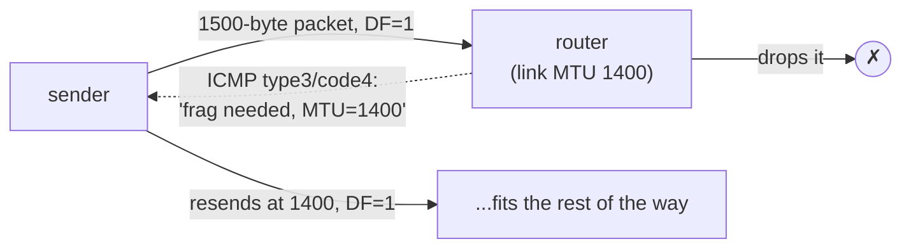

# MTU and fragmentation — when a packet is too big for the wire

In the very first frame diagram of this act, the payload had a ceiling: `46 – 1500` bytes. That `1500` wasn't decoration — it's a hard limit on how much an Ethernet link will carry in one frame. But IP packets can be far larger, and a single packet may cross links with *different* ceilings on its journey.

So the network owes you an answer to a blunt question: what happens when a packet is too big for the next wire? The answer pulls together three things you've already met — the IP header, a one-bit flag, and the ICMP error channel from the last file — into one of the most quietly common failures in all of networking.

## The problem: every link has a maximum frame size

When IP was designed to glue different networks together, each kind of link had its own maximum frame size — Ethernet settled on 1500 bytes of payload, others carried more or far less. A router forwarding a packet from a big-frame network onto a small-frame one faces a packet that physically will not fit.

You could just drop it — but then a sender has no idea why its data vanishes. **That is the bind: a packet that fits one link physically will not fit the next, and dropping it silently tells the sender nothing it could act on.** RFC 791 (1981) gave IP a built-in answer instead: the router may **fragment** the packet, chopping it into pieces that each fit, to be reassembled at the destination. It worked, but it was costly and fragile, which is why the internet later shifted to *avoiding* fragmentation rather than relying on it.

## What MTU, fragmentation, and DF actually are

The **MTU** (Maximum Transmission Unit) is the largest payload a link carries in one frame; for Ethernet it's **1500 bytes**. When an IP packet exceeds the next link's MTU, what happens is decided by one bit in the IP header — the **DF** (Don't Fragment) flag:

- **DF = 0:** the router *fragments* the packet into pieces, each with its own IP header. The pieces share an **Identification** value, each carries a **Fragment Offset** saying where it belongs, and all but the last set the **MF** (More Fragments) flag. Lose *one* fragment and the *entire* packet is lost — there is no partial delivery.
- **DF = 1:** the router must **not** fragment, so it *drops* the packet and sends back an **ICMP "fragmentation needed"** (type 3, code 4 — the same error channel from the last file) reporting the MTU it hit.

<!-- figure -->

```
  IP header fields that make fragmentation work:
   ┌───────────────┬──────────────┬──────────────────────┐
   │ Identification│ Flags: DF MF │ Fragment Offset       │
   │ (same for all │  DF=don't    │ (where this piece     │
   │  fragments)   │  MF=more     │  sits in the original)│
   └───────────────┴──────────────┴──────────────────────┘

  a 4000-byte packet crossing a 1500-MTU link (DF=0):
     [ 4000 bytes ] ──► router ──► [1480][1480][1040]   three fragments → reassembled at dst
```

That second behaviour — drop and report — is the basis of **Path MTU Discovery** (PMTUD): senders set DF, and if a packet is too big somewhere, the offending router names the link's MTU via ICMP, and the sender shrinks. The smallest MTU anywhere on the path becomes the *path MTU*:



## Find the ceiling by hand

A link's MTU is an integer file, exactly like the MAC and counters from the first lesson. And `ping` lets you set the DF bit and choose a payload size, so you can find the ceiling yourself. In the lab:

```bash
docker run --rm -it --privileged --network host --name lab nicolaka/netshoot
```

> **`/sys/class/net/eth0/mtu`** — the link MTU, e.g. `1500`. (`-M do` on `ping` sets the DF bit.)

> **Predict first —** the link MTU is 1500. An ICMP echo costs 8 bytes of ICMP header and 20 bytes of IP header. So with DF set, what's the largest `-s` payload that still fits — and what should happen one byte past it?

```bash
cat /sys/class/net/eth0/mtu
ping -c1 -M do -s 1472 8.8.8.8     # 1472 + 8 (ICMP) + 20 (IP) = 1500 — fits exactly
ping -c1 -M do -s 1473 8.8.8.8     # one byte over — must not fragment, so it fails
```

The 1472-byte ping succeeds; the 1473-byte one fails with `Message too long` / `Frag needed and DF set` — the kernel or a router refusing to fragment and reporting the MTU. You just measured the path's ceiling with nothing but the DF bit and the ICMP channel. (The kernel also remembers a learned path MTU per route — `ip route get <dst>` shows it as an `mtu` field once PMTUD discovers one.)

> **Check yourself —** An SSH session connects fine, then freezes the moment you `cat` a large file. Nothing logs an error. What is the most likely cause?

<details>
<summary>Answer</summary>

An MTU black hole. The handshake's small packets pass, but a large packet exceeds some link's MTU, is dropped with DF set, and the ICMP "fragmentation needed" that would tell your sender to shrink is being filtered too — so the sender keeps retransmitting the same oversized packet into silence. Small things work, big things hang, nothing is logged.

</details>

## The shadow it casts: blocking the honest error breaks everything large

**Block ICMP "to be safe" and you don't get safety — you get large packets that vanish with no error anywhere.**

PMTUD's fatal dependency is ICMP — and ICMP is exactly what nervous administrators love to block. "ICMP is just ping, drop it to be safe" is common firewall advice, and it quietly breaks PMTUD: a too-big packet is dropped, the ICMP "fragmentation needed" that would tell the sender to shrink is *also* dropped, and the sender keeps firing the same oversized packet into a void.

The signature is famous and maddening — an **MTU black hole**: a TCP connection or SSH session *opens* fine (the handshake's small packets pass), then *hangs* the instant a large transfer starts (big packets vanish, with no error logged anywhere). Small things work, big things hang.

The elegance and the horror are the same fact: blocking the network's honest "your packet didn't fit" message — the very candor channel from the last file — doesn't make you safer, it makes large packets disappear silently. (Attackers abuse fragmentation directly too: overlapping or tiny fragments — the classic *teardrop* and fragment-based IDS-evasion attacks — exploit reassembly to slip past inspection.)

## The question you carry into Kubernetes

Here is a trap, set on purpose and deliberately left unsprung.

Suppose that to get a packet from one machine to another, something wraps your entire packet — IP header and all — *inside a second packet* and sends that instead. Your packet is not modified; it travels as cargo. Do the arithmetic you just did, and answer two questions before Act IV asks them:

- On a 1500-byte link, how much room is left for your data once the outer packet has paid for its own headers?
- If the program filling the *inner* packet still believes its MTU is 1500, which of this file's symptoms will you see — and will a health check notice?

Hold the shape, not a number: **an MTU is a fact about one link, and wrapping a packet spends some of it.** The day you meet a network that carries packets inside other packets, that is the first question to ask, not the last.

> **You understand this when you can** read a link's MTU out of `/sys`, compute the exact largest DF-safe `ping -s` payload for *any* MTU you are given by subtracting the two headers, and predict — before you run it — that one byte more will fail while the connection that carried the small packets stays open.

## Where you are now

You can read a link's MTU from `/sys`, compute the largest DF-safe payload for a given MTU, and explain packet-by-packet why one byte more fails. You can describe fragmentation, the DF bit, and Path MTU Discovery — and you can recognise the MTU black hole, the failure where small things work and big things hang while nothing logs an error.

But step back: this whole act has *assumed* every machine already has an IP address. We read addresses, routed by them, sized packets to them. Where does a freshly booted machine — one that has never spoken on this network and has no address at all — get its IP, its gateway, and its DNS server? It can't be told over a network it can't yet use. That chicken-and-egg is the next file.

---

← Prev: **[ICMP, UDP, and TTL](03-icmp-and-udp.md)** · ↑ **[Act II overview](README.md)** · Next: **[DHCP — how a host gets its address](03c-dhcp.md)** →
