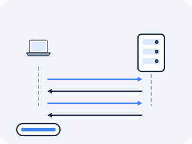
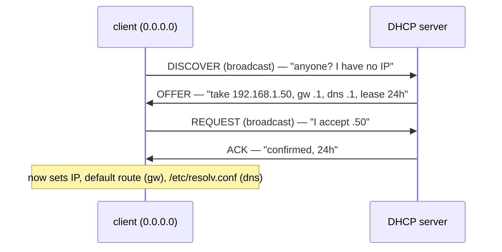

# DHCP — how a host gets its address in the first place

> **Optional track — examined by neither CKA nor CKS.** This is a CCNA topic with zero exam surface.
> Note the contrast with `03b` (MTU and fragmentation), which stays *on* the exam path because VXLAN
> in Act IV pays it off directly — the b-lessons of this act are not one category. The
> [exam path](../../exam-prep/the-exam-path.md) routes around this one; Route A does not.

Every machine in this act has had an IP address, a subnet mask, a default gateway, and a DNS server — and we've quietly assumed they were just *there*. The MTU file even leaned on it out loud.



But where does a freshly booted machine, one that has never spoken on this network, get all of that? It's a genuine chicken-and-egg: a host needs an address to use the network, but it wants to *get* its address *from* the network. The protocol that breaks the loop does it with the bluntest tool on the wire — a broadcast shouted by a machine that doesn't yet know who it is.

## The problem: you can't be told your address over a network you can't use

In the early days every host's address was set by hand — fine when machines were few and stationary. It collapsed as networks filled with workstations and, later, roaming laptops: hand-configuring meant tracking who held which address to avoid collisions, and redoing it every time a machine moved.

And automating it ran straight into the chicken-and-egg. Stop and try to solve it with what this act has given you: to send a packet to a server you need a source address, and to reach it by name you need a resolver whose address you also don't have. Every unicast path is closed. **What is left is the one thing a machine with no address can still do — shout at everyone.** BOOTP and then **DHCP** (RFC 2131, 1997) leaned on exactly that: broadcast a frame to `ff:ff:ff:ff:ff:ff`, which, as you learned with ARP, every card on the wire accepts.

## What DHCP actually is — DORA, over broadcast and UDP

DHCP hands a booting client everything it needs to join, from a server managing a pool of addresses. The exchange is four steps, **DORA**:

- **D**iscover — the client, with source IP `0.0.0.0` (it has none yet), *broadcasts* "is there a DHCP server out there?"
- **O**ffer — a server replies, offering a specific address plus the trimmings: subnet mask, **default gateway**, **DNS servers**, and a **lease** duration.
- **R**equest — the client *broadcasts* "I accept that offer" (broadcast, so any *other* servers that also offered know theirs was declined).
- **A**ck — the server confirms, and the address is the client's for the lease.



It rides on **UDP** (recall the fire-and-forget transport from the ICMP/UDP/TTL file): client on port 68, server on port 67. The address is a **lease**, not a gift — the client renews it (typically at 50% of the lease) or loses it, which is how a pool can be recycled among machines that come and go. Notice what arrives in that one exchange: not just an IP, but the **gateway** (your routing table's default route) and the **DNS server** (the `nameserver` line you'll meet next file). Three things you've been treating as given, all wired up at once.

## See an offer by hand

The lab's container gets its address from Docker's own IP management, not DHCP, so to *see* a real DORA you ask the network directly. `netshoot` ships `nmap`, which can send a Discover and print the offers without actually taking a lease. This lesson needs two shells, so start the lab named:

```bash
docker run --rm -it --privileged --network host --name lab nicolaka/netshoot
```

> **Predict first —** a DHCP server offers more than an IP address. Name the other three things you expect in the offer (hint: the gateway, and two services this act is about).

```bash
nmap --script broadcast-dhcp-discover -e eth0
```

On a network that has a DHCP server, the script broadcasts a Discover and prints each Offer: the offered IP, the **router** (gateway), the **DNS servers**, the subnet mask, and the **lease time** — exactly the prediction. A host that does not know its own address is handed its entire network identity in one exchange. Whether *your* run prints an Offer, though, depends on where Docker is running — read the next paragraph before you conclude anything from what you saw.

> **Whether an offer arrives depends on where Docker is running.** On a **Linux host**, `--network host` puts you on the real LAN and a real server answers — this is your router's actual offer, and the values printed are the ones your machine is genuinely using. On **macOS with Docker Desktop** you are inside Docker's Linux VM, whose addresses are assigned by Docker rather than by a DHCP server, so the Discover goes out and quite possibly nothing answers. That silence is not a broken command, and the next section is built to make it useful: you will read the *shout itself* off the wire, which is the part of the protocol that actually surprises. To see a genuine Offer from your own router, the Mac-native route is [Act II in the wild](in-the-wild.md) — or read your Mac's current lease with `ipconfig getpacket en0`, which prints the very fields listed above.

Where do those values land? In files you already know:

> **`/var/lib/dhcp/dhclient.leases`** — the lease receipt: address, server, gateway, DNS, expiry. **`/etc/resolv.conf`** — the `nameserver` line DHCP filled. **`ip route`** — the default route whose gateway DHCP supplied.

The `ip addr`, `ip route`, and `/etc/resolv.conf` you've read all act are, on a normal machine, simply *what DHCP wrote*.

## Watch the shout on the wire

`nmap` reported the *result* — or, on Docker Desktop, reported nothing, which is a result of a different kind. Either way it kept the interesting part off-screen. The claim at the top of this file — that a host with no address breaks the chicken-and-egg by *broadcasting* — is something you can watch happen, packet by packet, on any platform, with the same `tcpdump` you earned tapping ICMP. DHCP rides UDP on ports 67 (server) and 68 (client), so that pair is the whole filter.

Open a **second shell** into the lab (`docker exec -it lab zsh`, as in Act I) and start the tap there, then fire the Discover from the first:

> **Predict first —** the client has no IP yet. So in the very first packet `tcpdump` prints, what will the **source IP** be, and what **destination IP** must it use to reach a server it can't name? Commit to both before you look.

```bash
# shell 2 — tap the wire
tcpdump -i eth0 -n -v port 67 or port 68
```

```bash
# shell 1 — provoke a DORA
nmap --script broadcast-dhcp-discover -e eth0
```

The first line `tcpdump` prints is the surprise made concrete: `IP 0.0.0.0.68 > 255.255.255.255.67` — a packet **from nowhere, to everyone**. A host with no address (`0.0.0.0`) cannot unicast to a server it hasn't met, so it shouts to the broadcast address (`255.255.255.255`) that every card on the wire accepts — exactly the ARP-era lesson, now carrying a whole identity instead of one MAC.

That first packet is the one that matters, and it appears on **every** platform, because it is your own machine sending it. What comes next depends on whether anybody is out there: on a Linux host on a real LAN you will see the server answer from its real IP and, if a full exchange runs, the Request/Ack pair. Inside Docker Desktop's VM the far more likely result is silence — the shout leaves, nothing answers — which teaches the same point from the other side: the broadcast is real and costs the client nothing, and a network with no DHCP server simply never replies. Either way you didn't take DORA on faith; you read the packet that *can't* have a source address and confirmed it doesn't have one.

> **Check yourself —** The Request step is a **broadcast**, even though by then the client knows the server's address and could perfectly well unicast to it. Why shout the acceptance at the whole wire?

<details>
<summary>Answer</summary>

Because more than one server may have offered. The client can only take one address, and the other servers are holding theirs reserved for a client that is never coming. Broadcasting "I accept `.50` from *that* server" is how every other server on the wire learns its own offer was declined and can put the address back in its pool. The broadcast is not about reaching the chosen server — it is about telling the ones you didn't choose.

</details>

## The shadow it casts: anyone can answer first

**A client believes the first usable answer — so whoever replies fastest becomes that machine's entire view of the network.**

DHCP has the same original sin as ARP and BGP: it **authenticates nothing**. A **rogue DHCP server** — anyone on the LAN — can answer a Discover faster than the real one and hand the victim a poisoned config: *itself* as the gateway and DNS. Now every packet the victim sends to the outside world, and every name it looks up, flows through the attacker first — a complete man-in-the-middle, set up without ever touching the victim, just by being helpful first.

The companion move is **DHCP starvation**: flood the real server with requests from thousands of spoofed MACs until its pool is exhausted and it can't answer, leaving the field to the rogue.

The elegance and the horror are the same fact: the very design that lets a brand-new machine join with zero configuration also lets a stranger volunteer to be that machine's whole view of the network. (The switch-level defence, *DHCP snooping*, trusts offers only from the one port the real server lives on — again, don't trust the wire.)

## The question you carry into Kubernetes

Count what DHCP costs: a broadcast, a wait for whoever answers, a race you can lose, and a lease you must keep renewing. That is a fine price for a laptop that joins a café's Wi-Fi twice a day.

So carry the question: **would you pay it for a workload that is created and destroyed a thousand times an hour?** If not, what would you replace it with — and which parts of DHCP would you *keep*, given that something still has to own a pool of addresses, hand them out one at a time, and remember who holds what? Sketch your answer now. Then, when you meet a system that assigns addresses to short-lived things, check which of DHCP's four steps it kept and which it threw away.

(One part does not go away: whatever machine runs those workloads still had to get *its own* address from somewhere.)

> **You understand this when you can** narrate the four DORA steps, say for each one whether it is broadcast or unicast and why, name every field an Offer carries and the file on the client each one lands in — and explain, from the packet you captured, why the first one *cannot* have a source address.

## Where you are now

You can narrate the four DORA steps, say why a host with no address must broadcast and which UDP ports it uses, name every field a DHCP offer carries and which file on the client each lands in, and explain how a rogue server hijacks a victim through DHCP's trust.

DHCP just handed your machine, among other things, the *address of a DNS server*. Which raises the last question of this act: you've been typing `8.8.8.8` and `google.com` interchangeably, but no human memorises 32-bit integers. How does a name like `google.com` become an IP before any of the routing and ARP and framing of this act can even begin? That's the final file.

---

← Prev: **[MTU and fragmentation](03b-mtu-and-fragmentation.md)** · ↑ **[Act II overview](README.md)** · Next: **[DNS — the distributed naming database](04-dns.md)** →
