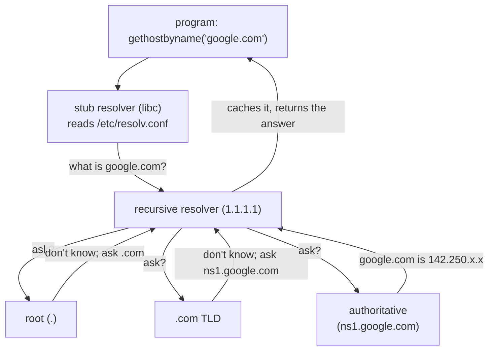

# DNS — the distributed naming database

DHCP just handed your machine, among other things, the address of a DNS server — which is the last admission this act has to make. You've been typing `8.8.8.8` and `google.com` as if they were the same kind of thing, but no human memorises 32-bit integers.

Every name you've ever used to reach a machine — `google.com`, `kubernetes.default`, the host in a URL — had to become an IP *before* any of the routing and ARP and framing of this act could even begin. The thing that performs that translation is the largest distributed database on earth, and it's the final piece of getting `write()` on one machine to `read()` on another.

## The problem: one big file of names couldn't scale

In the early ARPAnet, every machine's name-to-address mapping lived in a single file, `HOSTS.TXT`, maintained at SRI and downloaded by every host. By the early 1980s it was collapsing: the file grew without bound, every change meant everyone re-fetching it, and the central maintainer was a bottleneck and a single point of failure for the whole network's ability to *find* anything.

You could imagine just making the file-server bigger. Try it as a fix and see where it fails: a faster server still means every change to any name on earth has to pass through one organisation's queue. **The real bottleneck was never file size — it was authority.** The people who run `google.com` should answer for `google.com`, without asking SRI's permission. Paul Mockapetris designed DNS in 1983 (RFCs 882 and 883) to replace the one big file with a distributed, hierarchical database in which no single server holds everything and authority is *delegated downward*.

## What DNS actually is — a phone book no one owns

When a program wants the IP for a name, it calls into the **stub resolver** — not a running process but a function inside the C library, linked into the program itself — which reads a config file to learn the IP of a **recursive resolver** and sends it the question.

The recursive resolver does the legwork: if it doesn't already have the answer cached, it asks a **root** nameserver, which doesn't know the answer but knows who runs `.com`; the `.com` **TLD** server doesn't know either but knows who's authoritative for `google.com`; and that **authoritative** server, finally, knows.

**So the whole database is a chain of servers that each answer "I don't know, ask them" until one finally does** — and that is what delegating authority downward *looks like* on the wire.



## The files that govern a name

Three files decide how a name resolves — and one of the three decides the order the other two are consulted in:

> **`/etc/hosts`** — static name→IP overrides, kept locally; the ancestor of `HOSTS.TXT`.
> **`/etc/resolv.conf`** — `nameserver <IP>` (who to ask), `search <domains>`, options.
> **`/etc/nsswitch.conf`** — its `hosts:` line names the sources, in the order the resolver walks them.

In the lab:

```bash
docker run --rm -it --privileged --network host --name lab nicolaka/netshoot
```

> **Predict first —** three files, one lookup. Before you read them, predict which of the three your machine consults *first* — and what happens to the other two if it finds an answer there.

```bash
grep '^hosts:' /etc/nsswitch.conf      # the order — which source is asked first
cat /etc/resolv.conf                    # the recursive resolver's IP + search list
```

The `hosts:` line answers your prediction in two words — read it left to right, because that is exactly the order the resolver walks. Note what kind of thing just decided the order: not a protocol, not a negotiation, a local text file. These are all plain text the libc resolver reads on every single lookup. The tool `dig` deliberately *bypasses* them and queries a server directly — which is why `dig` is the honest way to see what DNS itself returns, versus what your local files override.

## Experiment 1 — watch the hierarchy resolve, by hand

> **Predict first —** how many "I don't know, ask them" delegations will you walk through before reaching the server that actually knows the answer?

```bash
dig +trace google.com
```

`+trace` tells `dig` to start at the root and follow every delegation itself instead of asking your recursive resolver. Read it top to bottom: the first block is the root nameservers (the `.` zone) handing you the `.com` servers; the next is a `.com` TLD server handing you `google.com`'s authoritative nameservers; the final block is an authoritative server returning the actual `A` record. You'll count the same *I don't know, ask them* three times before an answer.

## Experiment 2 — watch a local file beat the whole global database

> **Predict first —** you're adding `my-fake-service` to `/etc/hosts`, a name no DNS server on earth has ever heard of. Will `ping my-fake-service` resolve, or fail?

```bash
echo "127.0.0.1 my-fake-service" >> /etc/hosts
ping -c 1 my-fake-service
```

It resolves to `127.0.0.1` and succeeds — because `nsswitch.conf` says `files` before `dns`, the resolver found it in `/etc/hosts` and never asked anyone. You just watched a local file win against the entire global database. (That's also exactly how `dig` and a program can disagree about a name: `dig` skips the file, libc consults it first.)

> **Check yourself —** `dig example.com` returns one address, but your program connects to a different one. Where is the disagreement coming from?

<details>
<summary>Answer</summary>

`/etc/hosts`. `dig` queries a nameserver directly and skips the local files entirely, while your program goes through the libc stub resolver, which consults `/etc/nsswitch.conf` and finds `files` before `dns`. When a tool and a program disagree about a name, the file is usually why.

</details>

## The shadow it casts: held together by widening a number

**A database the whole world depends on was patched, after its worst flaw, by making a number harder to guess rather than by authenticating anything.**

In 2008 Dan Kaminsky showed how to lie to a recursive resolver. A DNS response is matched to its question only by source port and a 16-bit **query ID** — just 65,536 possibilities. An attacker who can make a resolver ask for a name then floods it with forged replies guessing that ID; land the guess before the real answer arrives and the resolver caches the forgery, poisoning that name for everyone behind it. With only 16 bits and the ability to trigger many queries, this was winnable in *seconds*.

The fix was telling: rather than authenticating responses, resolvers were patched to also randomize the source port, adding ~16 more bits of entropy and turning a seconds-long attack into an impractical one. True authentication of answers — DNSSEC — exists, but adoption is still incomplete, so for most of the internet the real defense remains *more bits to guess*.

The elegance and the horror are the same fact: a database the whole world depends on was held together, after its worst flaw, by widening a number.

## The question you carry into Kubernetes

Look again at the `search` line in `/etc/resolv.conf`. You read past it, because on this machine it does very little. But it is an instruction to the stub resolver: *if the name I was given doesn't resolve, try appending each of these and asking again.*

So hold two questions, and do not let anyone answer them for you yet.

- A name with no dots in it — a bare word — is not a domain name at all. What must a resolver do with one? And if the answer is "try several full names in turn," then **how many queries has one connection attempt just become**, and what happens to the ones that miss?
- Delegation was the whole point of DNS: whoever runs a zone answers for it. So if some system wanted names of its *own* — names that exist nowhere in the global hierarchy — what would it have to stand up, and where would a machine's `/etc/resolv.conf` have to point for those names to resolve at all?

You now have every mechanism needed to answer both from first principles: the `search` list, the `hosts:` order, and a query that costs one UDP round trip and fails by timing out. When you meet a cluster that resolves `my-service` to an address, work out what it did before you are told.

> **You understand this when you can** run `dig +trace` and say which block is the root, which the TLD, and which the authoritative answer — and separately, when handed a machine where a program and `dig` disagree about a name, name the file responsible and the line in it that decided, without guessing.

> **On your own machine —** watch this for real: load one news page and see dozens of strangers get resolved in a single second, then make Cloudflare confess which of its ~300 cities is answering *you*, in [Act II in the wild](in-the-wild.md#watch-dns-happen-in-real-time).

## Where you are now

You can run `dig +trace` and point at which block is the root, which the TLD, and which the authoritative server that finally answered; predict from the `hosts:` line whether a name will be answered by a file or a query; and explain how Kaminsky's attack worked and why widening a number blunted it.

Put it together with the rest of the act and you can now take *any* name a program wants to reach and trace it all the way down: name → IP through DNS, IP → route through the routing table, IP → MAC through ARP, MAC → a frame on the wire.

But every guarantee you've built rests on a quiet assumption: that the wire either delivers your packet or doesn't, cleanly. The internet is not one wire — it's millions of networks stitched together, and the moment a packet crosses more than one of them, packets get **dropped** when a queue fills, **reordered** when two take different paths, **duplicated** when something retransmits.

Nothing in this act recovers from any of that — Ethernet, ARP, IP, and UDP will all happily lose your data and never tell you. Turning that mess back into a reliable, ordered, and eventually *private* conversation is a different problem. That's Act III.

When you've finished, lock it in: **[Test yourself →](test-yourself.md)**, then the **[Diagnose it →](diagnose.md)** drills.

---

← Prev: **[DHCP — how a host gets its address](03c-dhcp.md)** · ↑ **[Act II overview](README.md)** · Next: **[Test yourself](test-yourself.md)** →
