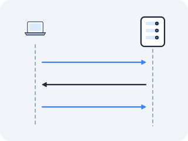

# The three-way handshake

TCP promises an ordered stream of bytes, where every byte has a number. But before the first byte of data can move, the two sides have a problem: neither knows where the other intends to start counting. There is no global clock, no shared origin. They have to *agree*, from scratch, on two numbers — one for each direction of the stream — and they have to do it over the same unreliable network that might drop the agreement itself. That negotiation is the three-way handshake, and it is the first thing any TCP connection does.



### Why can't both sides just start counting at zero?

**Because zero is a number an old, delayed packet might also be carrying — so a fresh connection could not tell new bytes from ghosts.**

A TCP connection is an imaginary byte stream, and every byte has a position in it. But position relative to *what*? If both sides simply started at zero, you would hit an old, terrible bug: a delayed packet left over from a *previous* connection on the same pair of ports — a ghost that took a slow path through the network and arrived late — could carry byte number 5 and be mistaken for byte 5 of the *new* connection, silently corrupting the stream.

The network is allowed to duplicate and delay; the original ARPAnet engineers learned this the hard way. So each side must pick a fresh starting position for every new connection, announce it, and have it acknowledged, before any data flows.

### So how do the two sides agree where to start?

**In three messages — SYN, SYN-ACK, ACK — each one carrying or acknowledging a randomly chosen starting number.**

Before data, both sides agree on an *initial sequence number* (ISN) — their starting position in the imaginary byte stream. The exchange takes three messages. The client sends a **SYN** (synchronize) carrying its chosen start: "I'll begin counting at X." The server replies with a **SYN-ACK**: "I'll begin at Y, and I acknowledge your X (I expect your next byte to be X+1)." The client sends a final **ACK**: "I acknowledge your Y; go." Three messages, two sequence numbers agreed, both directions initialized.

There is a fourth flag worth having now, because the rest of this act reads off it. **RST** (reset) is
how TCP says *no* — "there is no connection here, stop." Act I's SYN scan already used one: the scanner
read the SYN-ACK, learned the port was open, and sent an RST instead of the final ACK to walk away
before the connection existed. The same flag arrives unasked when you connect to a port nothing is
listening on, and it is what your shell prints as `connection refused`. So a SYN has exactly three
possible fates — SYN-ACK, RST, or nothing at all — and that three-way fork is the single most useful
thing in this lesson.

Why are the ISNs *random* rather than zero? Precisely to kill the ghost. If every connection started at zero, the byte numbers of an old connection and a new one on the same ports would overlap exactly, and a delayed duplicate would slot in perfectly. A random starting number makes the old connection's numbers fall in a different range, so a stray ancient packet falls outside the range of numbers the new connection is willing to accept, and is discarded. Randomness breaks the ambiguity.

### What do the three messages look like?

**Two vertical timelines and three diagonal arrows — one per message, each sloping down because a packet takes time to cross a wire.**

Time runs downward. The client and server are vertical lines; each message is a diagonal arrow.

<!-- figure: tcp-handshake -->

```
   CLIENT                                          SERVER
     │                                                │
     │  SYN  seq=X                                    │
     ├───────────────────────────────────────────────►│   "I start at X"
     │                                                │
     │              SYN, ACK  seq=Y, ack=X+1          │
     │◄───────────────────────────────────────────────┤   "I start at Y,
     │                                                │    saw your X"
     │  ACK  ack=Y+1                                  │
     ├───────────────────────────────────────────────►│   "saw your Y, go"
     │                                                │
     │═══════════  connection ESTABLISHED  ═══════════│
     │                                                │
     │  data  seq=X+1  (PSH, ACK)                     │
     ├───────────────────────────────────────────────►│   first real byte
     │                                                │
```

Note the arithmetic: an ACK number is always *the next sequence number expected*, which is why it is X+1, not X. The SYN flag itself consumes one sequence number — that is why the first data byte is X+1, not X.

> **Check yourself —** You capture a connection attempt and see the SYN go out, then nothing at all — no reply of any kind. What does the silence tell you, and how would a *refusal* have looked different?

<details>
<summary>Answer</summary>

Silence means the packet is being **dropped** somewhere — a firewall rule, a missing route, a full connection-tracking table, or (in a cluster) a *NetworkPolicy*, which is Kubernetes' own packet filter and does not arrive until Act V. A refusal sends an **RST**, which means the packet arrived somewhere that actively said no (a closed port). RST versus silence is the most useful fork in network debugging: one is a wrong destination, the other is a blocked path.

</details>

### Where does the kernel record the connection?

**In `/proc/net/tcp` — one row per connection, with the state as a two-digit hex code.**

Once the handshake completes, the connection is a row in the kernel's table:

```
/proc/net/tcp     one row per IPv4 connection, addresses and ports in hex
```

A connection from a client to a listener on port 8080 (0x1F90) appears with state `01` (ESTABLISHED). Next to the state sits a `tx_queue:rx_queue` field — unacknowledged sent bytes and received-but-unread bytes. On a quiet established connection both are zero, which is all you need for now; the third lesson makes that field earn its keep. The tool `ss -tan` reads this table and prints the state by name; `ss -tan state established` filters to exactly these rows.

### Can you watch a whole connection be born and die?

**Yes — three terminals and `tcpdump` show you every packet from the opening SYN to the final ACK of the teardown.**

In `docker run --rm -it --privileged --network host --name lab nicolaka/netshoot`, watch a whole connection be born and die. You need three terminals (two more `docker exec -it lab zsh` into the same container, or `tmux`).

Terminal 1 — sniff the loopback traffic on port 8080, decoding nothing yet:

> **Predict first —** write down ONE number: how many packets total for the whole conversation (connect, one typed line of text, and close)?

```bash
tcpdump -i any -nn tcp port 8080
```

Terminal 2 — start a listener (the server process):

```bash
nc -l 8080
```

Terminal 3 — connect to it (the client process), type one line, then press Ctrl-C:

```bash
nc 127.0.0.1 8080
```

Watch Terminal 1. You will see, in order: a packet with flag `[S]` (SYN) carrying `seq`, then `[S.]` (SYN-ACK) carrying its own `seq` and an `ack`, then `[.]` (ACK) — that is the three-way handshake, exactly the three arrows you drew.

Then when you type a line, a packet with flags `[P.]` (PSH, ACK) carrying your bytes — PSH means "push this to the application now, don't wait to fill a buffer." Then when you hit Ctrl-C, the teardown: `[F.]` (FIN) from the closing side, an ACK, the other side's `[F.]` (FIN), and a final ACK. Map every flag tcpdump prints to a line in your diagram.

The surprising part for most people: the data segment and the teardown each cost their own packets, and the FIN — like the SYN — consumes a sequence number of its own, which is why the closing side's final ACK acknowledges every data byte and then one more for the FIN itself.

Now settle the number you wrote down. **Nine** things have to happen, and here is every one of them:

```
1  [S]   SYN            client → server   "I start at X"
2  [S.]  SYN-ACK        server → client   "I start at Y, saw your X"
3  [.]   ACK            client → server   "saw your Y, go"
4  [P.]  your typed line client → server  the only data in the whole exchange
5  [.]   ACK of it      server → client   "got your bytes"
6  [F.]  FIN            closing side      "I have no more to send"
7  [.]   ACK of that FIN other side
8  [F.]  FIN            other side        "nor have I"
9  [.]   ACK of that FIN closing side
```

Most people guess three, four, or five, and the teardown is what they forget. If you counted **eight** packets rather than nine, you were not miscounting: a stack that has a FIN of its own to send piggybacks the acknowledgement of your FIN onto it, so a single packet does the work of items 7 and 8. Any other shortfall is the same economy at work — an ACK that never travelled alone because it rode along on a segment already heading that way. Account for all nine events and you have read the connection's whole life.

> **You understand this when you can** run this capture and, for every `[S]`, `[S.]`, `[.]`, `[P.]` and `[F.]` tcpdump prints, name which of the nine events it is and say what its `ack` number must be relative to the previous packet's `seq`.

### What happens when the starting number is predictable?

In the early days, many kernels generated ISNs not randomly but with a simple, predictable counter — increment by a fixed amount on a timer. Everything above says randomness exists to fend off *stale packets*. Hold that thought and take the counter seriously for a moment.

> **Predict first —** an attacker can send packets to your server but cannot see one byte of the traffic between your server and the machine it trusts. Nothing they send gets a reply they can read. Given only the ability to *predict the server's next ISN*, what can they do now that they could not do a moment ago? Commit to an answer before reading on.

Consider that attacker — one who cannot *see* the traffic between a trusted host and a server (an off-path attacker). Normally they can't inject packets into the connection, because they can't guess the sequence numbers the server will accept. But if the server's ISN is predictable, the attacker can guess it: they open a normal connection to learn the current ISN, compute what the *next* one will be, then send a SYN with a *forged* source address — that of a trusted host — and follow it with a forged ACK carrying the predicted sequence number. The server believes it is talking to the trusted host, and the attacker never had to see a single reply.

**So a predictable starting number is not a small untidiness: it lets someone who cannot even see your traffic forge a packet your kernel accepts as coming from a machine it trusts.**

This is TCP sequence number prediction, and Robert Morris described it in 1985. In November 1988 his worm used a family of such trust-exploiting tricks to spread, infecting roughly 6,000 machines — about 10% of the internet that existed then — in 24 hours, and Morris became the first person convicted under the Computer Fraud and Abuse Act.

The fix is exactly the randomness above: modern kernels seed the ISN generator from a cryptographic source (on Linux, ultimately from the `/dev/urandom` entropy pool, mixed with the connection's address tuple) so the next ISN cannot be predicted from the last. Look at how the security flaw and the correctness feature are the *same thing*: randomness was always there to defeat stale duplicate packets, and it turned out to defeat forged ones too.

### What will this ask of you in a cluster?

You now own a fork you can read off any handshake: SYN-ACK, RST, or silence. Carry it forward as three unanswered questions rather than three answers.

A Pod cannot reach a Service; nothing appears in any application log. **First:** if the SYN comes back as an RST, something refused it — but a Service IP is an address that belongs to no machine at all, so who was there to refuse? **Second:** if the SYN simply vanishes, what in a cluster is positioned to swallow a packet without a word, and why would anyone *build* something that drops rather than refuses? **Third:** how do you capture a Pod's handshake in the first place, when the Pod is not the machine you are logged into?

Act IV and Act V are where those get settled. Notice that you can already predict the *shape* of each answer from this lesson alone.

---

↑ **[Act III overview](README.md)** · Next: **[TCP states and conntrack](02-tcp-states.md)** →
