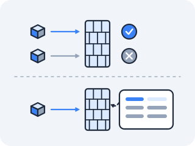

# conntrack — the kernel's flow table

The last lesson was a kernel keeping books on its own conversations: a socket this machine opened, a state this machine is in. Now put the machine somewhere else. Put it *in the middle* — a home router, a cloud gateway, a laptop sharing its connection — forwarding other people's packets and rewriting their addresses on the way past. The conversation is no longer its own. It still has to get every reply back to the right place. What does that cost in memory, and where does the kernel write it down?

### First — what is the rewriting, and why does anyone do it?

**Some addresses are agreed to be unroutable on the public internet, so a machine holding one borrows a routable address from the router in front of it.**

Act II gave every machine an address and every destination a route. What it did not say is that three ranges are reserved by agreement for private use — `10.0.0.0/8`, `172.16.0.0/12`, `192.168.0.0/16` — and there is an asymmetry in your own command history worth noticing. Every address that has belonged to a *machine* in this course came out of those three: `192.168.1.5`, `10.244.6.37`, the container addresses in Act I. Every address you *dialled* — `8.8.8.8`, `1.1.1.1`, `93.184.216.34` — did not. And the private ones are private in a very literal sense: **no router on the internet will carry a reply to one**, because the same `10.0.0.7` exists on millions of networks and none of them is the answer to "which one?"

So the machine in the middle rewrites the packet. `10.0.0.7:41000` leaves as `203.0.113.9:41000`, the router's own routable address, and the reply comes back to an address that genuinely resolves to somewhere. That rewrite is **NAT** — network address translation. **Act IV builds it**, with the `iptables` rules that perform the rewrite and the reason a container gets the same treatment as a laptop. This lesson needs only the fact that the rewrite happens, because the question here is what it *costs*.

### How does a NAT reply find its way back to the right machine?

**It cannot, unless the kernel wrote the translation down — so it does, in a table called `conntrack`.**

Follow the reply. It arrives addressed to `203.0.113.9:41000`, the *public* address — and the kernel has to know which private machine that reply really belongs to, and undo the rewrite. Nothing in the packet says so.

A stateless rewrite cannot do this; there is nothing in the reply packet that says "I was originally for 10.0.0.7." The kernel must *remember* every translation it made, match each returning packet to the original, and reverse the translation. Without that memory, NAT would be a one-way street and no reply could ever find its way home.

### So what does conntrack actually store?

**Two tuples per connection: the addresses as the packet first appeared, and the addresses the reply is expected to carry.**



`conntrack` (connection tracking) is the kernel subsystem that maintains a table of every active connection passing through it, along with the NAT translation applied to each. Every packet that traverses the kernel's NAT machinery — the `iptables` chains Act IV takes apart — is recorded: the kernel notes the *original tuple* (the addresses and ports as the packet first appeared) and the *reply tuple* (the addresses and ports it expects the reply to carry, after translation).

When a packet arrives, the kernel looks it up in this table; if it matches the reply side of an existing entry, the reverse translation is applied automatically and the packet is sent to the right private host. `conntrack` is what makes NAT work at all.

### What does a conntrack row look like?

**Two tuples side by side, and the one field where they disagree is the NAT mapping.**

The table is a file:

```
/proc/net/nf_conntrack     one row per tracked connection
```

A live row for an outbound HTTPS connection, decoded field by field:

<!-- annotate: conntrack-row -->

```
 ipv4 2 tcp 6 117 ESTABLISHED \
   src=10.0.0.7 dst=93.184.216.34 sport=51920 dport=443 \
   src=93.184.216.34 dst=203.0.113.5 sport=443 dport=51920 \
   [ASSURED] mark=0 use=1

   ipv4 2          address family
   tcp 6           protocol (6 = TCP)
   117             TTL: seconds until this entry expires if idle
   ESTABLISHED     the tracked TCP state (conntrack's own view)
   ── original tuple (what the host actually sent) ──
   src=10.0.0.7    the private source
   dst=93.184...   the real destination
   sport=51920     ephemeral source port
   dport=443       destination port
   ── reply tuple (how the reply will look, reverse-NATted) ──
   src=93.184...   reply comes from the server
   dst=203.0.113.5 addressed to the PUBLIC (NATted) source — note it differs
   sport=443
   dport=51920
   [ASSURED]       seen traffic both ways; won't be evicted early
```

The crucial detail: in the original tuple the source is the private `10.0.0.7`, but in the reply tuple the *destination* is the public `203.0.113.5`. That mismatch is the NAT mapping, written down. When a reply arrives for `203.0.113.5:51920`, the kernel finds this row and rewrites the destination back to `10.0.0.7:51920`.

> **Check yourself —** You find a row whose reply tuple is the exact mirror of its original tuple — source and destination simply swapped, ports swapped, not one address changed. No translation happened. Is that row wasted memory?

<details>
<summary>Answer</summary>

No. A mirrored pair means *this* flow was not NATted — and the kernel still tracks it, because the table's job is bigger than undoing rewrites. It is the kernel's answer to "have I seen this flow before?", which is what lets it call a packet part of an established conversation rather than a fresh one. NAT is the reason the table has to exist; matching replies to flows is what it does for every flow, translated or not. That is also why the row consumes a slot whether or not any address was rewritten.

</details>

### Can you watch an entry outlive its connection?

In `docker run --rm -it --privileged --network host --name lab nicolaka/netshoot` (the `--privileged` is what lets you read the conntrack table), watch an entry live its whole life. In one terminal, stream new entries as they appear:

> **Predict first —** once `curl` finishes and closes the connection, will its conntrack row vanish immediately, or linger? If it lingers, what is the kernel still waiting for?

```bash
conntrack -E -p tcp
```

In a second terminal (`docker exec -it lab zsh`), make a connection:

```bash
curl -s https://example.com > /dev/null
```

Watch the first terminal. You see the entry created (`[NEW]`), promoted as the handshake completes (`[UPDATE]` to `ESTABLISHED`), and then, after `curl` closes, transition through the closing states and finally `[DESTROY]` when its TTL runs out. You can also snapshot the whole table at any moment with `conntrack -L`.

The surprise: a connection you finished seconds ago still occupies a row, ticking down its TTL — `conntrack` outlives the connection just as `TIME_WAIT` does, and for the same family of reasons. A late packet from a flow you have forgotten is still a packet the kernel has to classify.

**So `conntrack -E` streams the whole life of a row, and the row is not a description of a live connection — it is a memory with an expiry date.**

> **You understand this when you can** run a `curl`, find its row in `conntrack -L`, point to the single field where the original tuple and the reply tuple disagree and say that disagreement *is* the NAT mapping — then say what the row's TTL number will do over the next minute and why the row does not vanish the instant the connection closes.

### What happens when the table fills?

The table is a *table*: finite, sized at boot, with a hard ceiling. Two numbers on your own machine tell you the whole story:

```bash
conntrack -C                                    # how many flows are tracked right now
sysctl net.netfilter.nf_conntrack_max           # the ceiling
```

When the count reaches the ceiling, the kernel cannot record a new flow — and a packet it cannot record is a packet it drops. Not refuses. *Drops.* No RST, no error, nothing in any log the application can see: exactly the "SYN with no reply" you learned to read in the first lesson, arriving only when the machine is busy enough to fill the table and clearing itself the moment entries expire and free slots. When those two numbers get close, you have found your outage.

That is a fact about any Linux box. Now hold it as a question about the ones you do not run yet.

### What will this ask of you later?

`conntrack` is the idea in this act with the longest reach, so leave it holding questions rather than answers.

Every flow costs a slot, and the ceiling is a fixed number chosen by whoever built the machine. **First:** what happens to that arithmetic on a host running hundreds of programs that each open short connections every few seconds — and who, in such a system, is even in a position to notice the count climbing? **Second:** a table that must be consulted for every packet is also a table that *decides* where every packet goes. If you could write entries into it deliberately, what could you make a single address do? **Third:** this is a per-machine table. If a conversation's packets can arrive at more than one machine, which machine holds the memory — and what breaks when the reply lands on the other one?

Act IV builds the machinery that writes these rows on purpose, and Act V runs a whole cluster on top of it. You will meet this table twice more, and both times it will be an old friend with a bad temper.

---

← Prev: **[TCP states](02-tcp-states.md)** · ↑ **[Act III overview](README.md)** · Next: **[TCP and reliability](03-tcp-reliability.md)** →
