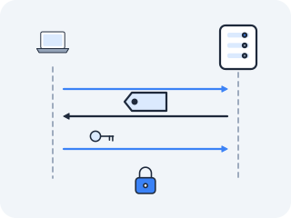
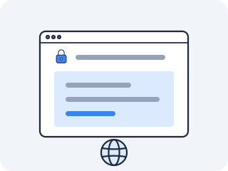

# TLS

HTTP is a conversation in plain text, and that was its genius — anyone could read it, debug it, implement it. But "anyone could read it" is also a catastrophe, because the conversation crosses dozens of routers owned by strangers, any of which can read every byte and change it. Your password, sent as `password=hunter2` in a request body, is visible to every machine on the path. The web needed a way to keep the simple text model while making the bytes on the wire unreadable and untamperable to everyone except the intended server. That is TLS.



### Why couldn't the web just stay plain text?

**Because every router on the path could read your password and quietly rewrite the page — and the web started carrying money.**

In the early 1990s the web started carrying things people wanted to keep private — logins, then credit-card numbers. Over plain HTTP, every router between client and server saw all of it in the clear, and could quietly alter it (injecting ads, stealing sessions). Netscape's answer in 1994–95 was SSL, later standardized and renamed TLS.

The requirement was threefold and exact: the bytes must be *secret* (only the two endpoints can read them), *authentic* (the client must know it is really talking to `example.com` and not an impostor), and *tamper-evident* (any change in flight is detected). And it had to slot underneath HTTP without HTTP knowing, so the whole existing web could keep working.

### So what is TLS, really?

**A handshake between TCP and HTTP that ends with both sides holding the same secret key — and an eavesdropper who saw everything holding nothing.**

TLS sits between TCP and HTTP. After the TCP three-way handshake completes, before any HTTP byte flows, the two sides perform a *TLS handshake*. They negotiate a *cipher suite* (which encryption and integrity algorithms to use), the server presents a *certificate* proving its identity, the two sides use public-key cryptography to agree on a shared *symmetric key* that no eavesdropper can derive, and from that point on every byte — every HTTP request and response — is encrypted with that key and authenticated so tampering is detected.

The certificate is the part that answers "prove you are really `example.com`": it is a document binding the name `example.com` to a public key, *signed* by a **Certificate Authority** (CA) that both sides trust.

The trust is transitive through a chain — the server's *leaf* certificate is signed by an *intermediate* CA, whose certificate is signed by a *root* CA, whose certificate is pre-installed in your operating system or browser's trust store. The client verifies each signature up the chain until it reaches a root it already trusts. If any link fails, the lock does not close.

### What does the handshake look like?

**Hello, hello back, here is my certificate, here is key material — then "everything after this is encrypted."**

The TLS 1.2 handshake (1.3 compresses these into fewer round-trips, but the same events happen). Time runs downward; this all happens *after* TCP is established.

<!-- figure: tls-handshake -->

```
   CLIENT                                          SERVER
     │   (TCP already ESTABLISHED)                   │
     │                                                │
     │  ClientHello                                   │
     │  "TLS versions I support, cipher suites I      │
     ├───  offer, a random number, the hostname  ────►│
     │   I want (SNI: example.com), and the app       │
     │   protocols I speak (ALPN: h2, http/1.1)"      │
     │                                                │
     │            ServerHello                         │
     │◄── "chosen TLS version + cipher suite,  ───────┤
     │     chosen app protocol (ALPN: h2),            │
     │     my random number"                          │
     │                                                │
     │            Certificate                         │
     │◄── "my leaf cert + intermediate chain"  ───────┤
     │                                                │
     │            ServerHelloDone                     │
     │◄── "your turn"  ───────────────────────────────┤
     │                                                │
     │  ── client verifies the cert chain up to a ──  │
     │     trusted root in its store; aborts if bad   │
     │                                                │
     │  ClientKeyExchange                             │
     ├── key material (encrypted to server's pubkey)─►│
     │                                                │
     │  ChangeCipherSpec                              │
     ├── "everything after this is encrypted" ───────►│
     │  Finished (first encrypted message)            │
     ├────────────────────────────────────────────────►│
     │                                                │
     │            ChangeCipherSpec, Finished          │
     │◄────────────────────────────────────────────────┤
     │                                                │
     │═══  encrypted channel ready; HTTP can flow  ═══│
```

Both sides derived the same symmetric key from the two random numbers and the key material, but an eavesdropper who saw every packet still cannot derive it — that asymmetry is the whole trick.

And there is the answer to the question you carried out of the HTTP lesson. `ClientHello` is an extensible message: alongside the cipher suites it can carry a list of *application* protocol names, and the server echoes its choice back in `ServerHello`. That is the `ALPN` line you watched settle on `h2` — two machines agreeing which HTTP to speak, inside a handshake they were going to perform anyway, for the price of a few bytes in a message already in flight. HTTP could not have negotiated it, because HTTP had not started; TLS could, because TLS goes first. Note the same trick twice in one message: `SNI` tells the server which *name* you want before you can ask in HTTP, and `ALPN` tells it which *language* you want before you can ask in HTTP.

### How do you read a handshake by hand?

**`openssl s_client` performs a real handshake and prints every part of it — chain, version, cipher suite — as text.**

There is no `/proc` file for a TLS session, but you can perform the handshake by hand and read every part of it:

```bash
openssl s_client -connect example.com:443 -servername example.com
```

(`-servername` sends the SNI, the hostname inside `ClientHello`, so a server hosting many sites presents the right certificate.) Read the output in sections.

The **certificate chain** at the top lists each cert as `s:` (subject — who it is) and `i:` (issuer — who signed it); follow the `i:` of the leaf to the `s:` of the next cert up, and you are walking the chain of trust the client just verified — leaf, then intermediate, toward a root in your store.

Further down, `Protocol :` shows the negotiated version (e.g. `TLSv1.3`) and `Cipher :` shows the negotiated suite (e.g. `TLS_AES_256_GCM_SHA384` — AES-256 in GCM mode for encryption-with-integrity, SHA-384 for the handshake hash). Near the end, the session details show whether the session can be *reused* (resumed without a full handshake next time). This single command lays the entire HTTPS security model out as readable text.

> **Check yourself —** `openssl s_client` reports `Verify return code: 0`. What has that actually proved, and what has it not?

<details>
<summary>Answer</summary>

It proves the server presented a certificate chain that your machine verified up to a root already in its trust store — a CA you trust vouched for the binding between that hostname and that public key, and the channel is encrypted and tamper-evident. It does **not** prove the operator is honest, the site is safe, or that anything beyond the TLS terminator is encrypted.

</details>

### Why trust a certificate signed by a stranger?

In `docker run --rm -it --privileged --network host --name lab nicolaka/netshoot`, inspect a real chain and watch verification succeed:

> **Predict first —** whose name will the leaf certificate's *issuer* line carry — and what does it take for your machine to trust that issuer all the way up to a root?

```bash
echo | openssl s_client -connect example.com:443 -servername example.com 2>/dev/null | openssl x509 -noout -issuer -subject -dates
```

It prints the leaf certificate's subject (the name being proven), its issuer (the CA that signed it), and its validity dates.

The surprising result for many people: the subject is `example.com` but the issuer is *not* `example.com` — it is some CA you've never heard of, and yet your browser trusts the connection completely. Why? Because trust does not come from the server claiming its own identity; it comes from a CA *in your trust store* having signed the claim.

Now try the same command against a host with an expired or self-signed certificate and watch `openssl s_client` report `verify error` — the chain did not reach a trusted root, and the lock refused to close.

**So one command prints the whole trust question in three lines — and the answer is that the name you don't recognize is the one doing the work.**

### What breaks, and how is it abused?

**The very first request, sent before any redirect to HTTPS — intercept that one and you can keep the victim on plain HTTP forever.**

TLS protects the conversation, but only *after* it starts. A user typing `example.com` (no `https://`) into a browser first makes a plain *HTTP* request, expecting the server to redirect them to HTTPS.

An attacker positioned between client and server — on the same coffee-shop Wi-Fi, say — can intercept that initial cleartext request and simply *never deliver the upgrade*: they talk HTTPS to the real server, but serve the victim a plain-HTTP version of the page, silently stripping every `https://` link down to `http://`. The victim sees a normal-looking page; the padlock never appears (but who checks?); and every byte, including the password, flows in clear to the attacker.

This is **SSL stripping**, automated by Moxie Marlinspike's `sslstrip` tool in 2009, and it works because the very first request was never protected.

The defense is **HSTS** (HTTP Strict Transport Security): a server sends a header telling the browser "for the next year, *never* connect to me without TLS, not even for the first request" — the browser caches this and upgrades to HTTPS before any cleartext request can be intercepted. The second-layer defense is **HSTS preloading**: major browsers ship a hardcoded list of domains that must *always* use HTTPS, so even the very first visit is protected before any header is seen.

Both the window and the shutter are one header each, and you can look at them. First the window — the unprotected request an attacker wants:

```bash
curl -sI http://github.com | head -3
```

A `301` and a `location:` pointing at `https://`. That redirect is the whole vulnerability: to *receive* it you had to send a cleartext request, and an attacker in the middle simply answers it themselves and never sends you on. Now the shutter:

> **Predict first —** a site that redirects you to HTTPS is not the same as a site that forbids plain HTTP. Two hosts, one that handles logins and one that is a demonstration page: guess which of them carries a `strict-transport-security` header, before you look.

```bash
curl -sI https://github.com   | grep -i strict-transport
curl -sI https://example.com  | grep -i strict-transport
```

One prints a `max-age` measured in tens of millions of seconds — a year of "never come back in cleartext" — often with `preload`, meaning the domain is on the hardcoded list browsers ship. The other most likely prints nothing at all, and that silence is the finding: the site answers on both plain HTTP and HTTPS, tells the browser nothing about which to prefer, and leaves the stripping window open on every first visit.

> **You understand this when you can** run `s_client` against any HTTPS host, walk the printed chain by matching each certificate's `i:` line to the `s:` line above it until you reach a name your machine already trusts, say what `Verify return code: 0` proves and what it does not — and then say which single request in a browser session that verified chain never protected at all.

### What will this ask of you in a cluster?

Two questions, and you have everything you need to feel their weight without being told the answers.

**First:** the handshake you just drew requires a private key, and whichever machine performs the handshake must hold that key in memory. In a cluster of hundreds of interchangeable Pods behind one hostname, how many copies of that key exist, on which machines, and who put them there? **Second:** certificates expire — you read the dates yourself. Nothing in TLS renews anything. So in a system nobody logs into by hand, what has to be watching the clock, and what does it do at 3am on the day of expiry?

Both are settled in Act V. Notice that the second one is not really about cryptography at all: it is about something continuously comparing "what is" against "what should be" — a shape you will meet again and again.

### What's inside the lock we didn't open?

**The cryptography itself — and it is a deliberate hole, not an oversight.**



Notice what you just did: you *used* the lock, read its label, and trusted it — but you never looked inside. What is a "cipher suite" actually doing? How does `TLS_AES_256_GCM_SHA384` turn a wire that any router can read into a secret only two endpoints share, when they've never met and the whole handshake crossed the network in the clear? How can a signature prove a stranger's identity?

Every one of those is a *deliberate* hole in this act. Opening the lock — hashes, HMAC, symmetric vs. asymmetric keys, Diffie–Hellman, signatures and the chain of trust, then the full TLS 1.3 handshake rebuilt from those parts — is **Stage 4, [Act VIII](../act-8-trust/README.md)**, which opens by quoting the paragraph above.

Do not go there yet, though, unless you are only here for cryptography. Act VIII sits five acts further on for a reason: containers, Kubernetes and its control plane all build directly on what you have just finished, and none of them need the lock opened first. Sit with the cliffhanger honestly instead — you can drive TLS today, and you know exactly which door you have not walked through.

### So which door do you walk through now?

Not that one — and the reason is worth noticing, because it is a second crack, wider than the first.

Every single thing in this act rested on one quiet assumption: an endpoint is a machine, and it owns its address. The handshake worked because the SYN reached a host that answered *as itself*. `conntrack` worked because each flow had one honest source. The certificate proved a name belonged to the machine holding the key. Pull that assumption and ask the questions you have been collecting all act — who refuses a connection to an address no machine owns; which machine holds the flow table when the reply could land on either; how many copies of a private key exist behind a single hostname. Every one of them was really the same question wearing different clothes: **what happens when one machine pretends to be many, and one address stands in for a crowd?**

That is Act IV, and it is built out of kernel features rather than cryptography, so you can walk in today. First, two pages to consolidate: recall this act from memory in **[Test yourself](test-yourself.md)**, then use it under fire on the symptom-first **[Diagnose it](diagnose.md)** drills. Then **[Act IV — one machine pretends to be many](../act-4-one-pretends-many/README.md)**, where the lock stays shut and the ground moves instead.

---

← Prev: **[HTTP](04-http.md)** · ↑ **[Act III overview](README.md)** · Next: **[Test yourself](test-yourself.md)** →
