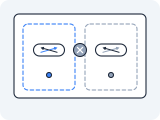

# Namespaces

A process already has a private view of memory and a private list of open files. The natural next question — the one that took Linux until 2002 to start answering and 2009 to finish — is: can a process have a private view of *the network* too?



### Linux network namespaces — isolation as a file

> **On your own machine —** none of this exists on a Mac: Docker Desktop runs a hidden Linux VM, and the namespaces live in there. Open a shell inside that VM and find them yourself in [Act IV in the wild](in-the-wild.md#peek-into-the-vm-where-the-primitives-actually-live).

**The problem that made this necessary** — By the early 2000s, people were cramming many independent services onto one Linux box to save money, and they kept colliding. Two services both wanted to bind port 80. Two tenants both wanted `eth0` configured their own way. One tenant's firewall rules clobbered another's. The kernel had exactly one networking stack — one set of interfaces, one routing table, one iptables ruleset, one socket table — and everyone had to share it, which meant everyone could see and step on everyone else. The fix, merged into the kernel over several years and made whole around 2009, was to do for the network what the kernel had long done for memory: give each group of processes its own private copy. A process already lives inside two illusions the kernel maintains for it: that it owns its address space, and that it owns the machine. A network namespace is the third illusion — that it owns the network.

**What it actually is** — A network namespace is a complete, isolated copy of the kernel's networking subsystem. Each one has its own network interfaces, its own routing table, its own iptables rules (that is the packet-rewriting machinery of lesson 3 — for now, just note that each namespace gets a private copy), its own socket table, and — this is the detail that makes it click — its own `127.0.0.1`. A process inside one namespace literally cannot reach a socket opened by a process in another, because as far as the kernel is concerned they are on different machines that happen to share a CPU and a disk. "Namespace" is just the jargon for *this private view of one kind of system resource*; there are several kinds (PID, mount, user, network, and more). The network one carries this act, and two others get a lesson of their own: the mount namespace is what makes a container's filesystem its own, and the **user** namespace — which decides what "root" refers to — is [lesson 05c](05c-who-am-i.md), once you have a container in front of you to ask the question about.

**Draw it** — One kernel, one CPU, one disk — but several private network stacks that cannot see each other. The only thing distinguishing them is the inode number on each `net:` file:

<!-- figure -->

```
                       ONE LINUX KERNEL (one CPU, one disk)
  ┌──────────────────────────────────────────────────────────────────┐
  │                                                                    │
  │   netns: net:[4026531992]      netns: net:[4026532101]            │
  │   ┌───────────────────┐        ┌───────────────────┐             │
  │   │ host (default)    │        │ ns1               │             │
  │   │  eth0  10.0.0.5   │        │  lo   127.0.0.1   │             │
  │   │  lo    127.0.0.1  │   ✗    │  (no eth0)        │             │
  │   │  routes: default… │ ──╳────│  routes: NONE     │             │
  │   │  iptables: …      │        │  iptables: empty  │             │
  │   └───────────────────┘        └───────────────────┘             │
  │                                                                    │
  │   each box = its own interfaces, routes, iptables, socket table,   │
  │   AND its own 127.0.0.1.  ✗ = a socket in one box is unreachable   │
  │   from another, even though both live in this one kernel.          │
  └──────────────────────────────────────────────────────────────────┘
       Same inode ⇒ same network.    Different inode ⇒ different machine.
```

**The file** — Per the spine, the first question is *what is the file here?* The namespace is a file:

```
/proc/self/ns/net      a symlink whose target encodes the namespace's inode
/proc/self/ns/         the directory of all namespace types this process is in
```

The identity of a network namespace **is its inode number**. That's not a metaphor — two processes are in the same network namespace if and only if `/proc/self/ns/net` points at the same inode for both. Read it raw:

```bash
ls -la /proc/self/ns/
```

> **eza twin:** `eza -la --classify /proc/self/ns/` — `--classify` marks each namespace symlink with `@`. (This act runs in plain netshoot, so `apk add eza` first if you want the twin; the `net:[...]` inode in the link target reads identically either way.)

Each entry looks like `net -> net:[4026531992]`. That number in brackets is the inode. Run the same command inside a different namespace and compare the two numbers — a single integer is the entire basis of network isolation. Same inode, same network; different inode, different network. The `ip netns` tool is just bookkeeping on top of these inodes.

**The experiment** — In `docker run --rm -it --privileged --network host nicolaka/netshoot`, make a brand-new network from nothing:

> **Predict first —** the diagram above shows a fresh namespace has a `lo` and nothing else. Commit to the details it does not tell you: will that `lo` be `UP` or `DOWN`, what inode will this namespace's `net:` file carry compared to the host's, and when you ping `8.8.8.8` will you get a timeout or an immediate error? (Modern kernels may also show tunnel pseudo-interfaces like `tunl0`, `gre0`, etc. — all `DOWN` — which do not affect isolation.)

```bash
ip netns add test
ip netns exec test ip addr
ls -la /proc/self/ns/net                       # the host's inode
ip netns exec test ls -la /proc/self/ns/net     # and this namespace's
```

The new namespace contains exactly one interface — `lo`, loopback — and it is `DOWN`. No `eth0`. No routes (`ip netns exec test ip route` prints nothing). It is a freshly built machine that has never been plugged into anything.

> **Newer kernels add tunnel pseudo-devices** — Modern Linux kernels (5.10+) include tunnel pseudo-interfaces by default in every namespace: `tunl0`, `gre0`, `gretap0`, `erspan0`, `ip_vti0`, `ip6_vti0`, `sit0`, `ip6tnl0`, `ip6gre0`. They are all `DOWN` and have no addresses or routes. They do not change the isolation — you still cannot reach anything, and they are not functional until explicitly configured. If you see them, that is normal.

And the two `net:[…]` inodes differ, which is the difference you were promised: that single integer, not any interface or address, is what makes these two stacks two machines. Now prove the isolation bites:

```bash
ip netns exec test ping 8.8.8.8
```

It fails — "Network is unreachable" — not because the internet is down, but because *this namespace has no route to anywhere and no interface to leave by*. The host can ping 8.8.8.8 fine; this namespace, living in the same kernel, cannot reach it at all. We have manufactured isolation. The rest of the act is about manufacturing *connection*, because isolation alone is just a very lonely machine.

**Tear it down** — every build in this act ends by removing what it made, so the next one starts on a clean host. Deleting the namespace deletes everything inside it:

```bash
ip netns del test
ip netns list          # test is gone
```

> **Check yourself —** A fresh namespace could reach nothing at all. Why is that the *correct* starting state for the kernel to hand you, rather than a bug worth fixing?

<details>
<summary>Answer</summary>

Because isolation is the thing being manufactured, and connectivity is what you build on top of it. If a new namespace arrived pre-wired to the host's network, it would leak in both directions the instant it existed, and there would be no way to *choose* what it can reach. The empty stack is the only honest default: nothing crosses the wall until you deliberately build something that crosses it. Every remaining lesson in this act is one of those deliberate crossings.

</details>

> **You understand this when you can** read the inode out of `ls -la /proc/self/ns/net`, explain why two processes sharing that inode share a network while two with different inodes cannot reach each other's sockets, and predict that a fresh `ip netns` has a downed `lo`, possibly tunnel pseudo-devices (all `DOWN`), and an empty routing table before you run `ip addr`.

**Kubernetes sees this as** — Every Pod *is* one of these namespaces. That is the whole reason two containers in a Pod reach each other on `localhost` while two Pods cannot: same Pod means same inode means the same `127.0.0.1` and the same socket table. `kubectl exec mypod -- ip addr` is you looking inside that Pod's namespace, exactly as `ip netns exec` looked inside `test`.

Which leaves something uncomfortable. A namespace exists only while something is in it — delete the last process and the inode goes with it. But containers in a Pod are restarted independently all the time, and the Pod keeps its IP across those restarts. So *what is holding the namespace open* between the death of one container and the birth of the next? There is a process on every node whose entire job is to answer that, and it does nothing else. Carry the question.

**Where you are now** — You can create a private network stack from nothing, prove its isolation with a failed ping, and point at the single integer that *is* its identity. You can also read that integer for any running process.

But an isolated machine that can reach nothing is useless, and you have no way yet to reach *in* or let it reach *out*. Before we build that wiring, there is a second half to the isolation story you have already half-noticed: a namespace controls what a process can **see**. Nothing you have touched so far controls how much of the machine it can **use** — one process in one namespace can still eat every byte of RAM on the box and take every other tenant down with it. So what stops it?

---

↑ **[Act IV overview](README.md)** · Next: **[cgroups](01b-cgroups.md)** →
