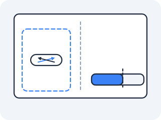

# cgroups

A namespace answered one question: **what can this process see?** It said nothing about a second question you can now ask on purpose — *how much of the machine can it use?* One namespace is not a smaller computer. It is the same computer with the view narrowed, and a process with a narrowed view can still eat all of it.



### cgroups — the other half of a container

**The problem that made this necessary** — Cramming tenants onto one box gave the isolation problem two halves, and namespaces only solve the first. Suppose you have wired up ten perfectly isolated namespaces. Tenant 3 runs a program with a memory leak. It allocates until the kernel is out of RAM, and then the kernel — which cares about the machine, not about your tenancy scheme — starts killing whatever process looks worst, anywhere on the box. Tenant 7's database dies for something tenant 3 did. Nothing was breached, no view leaked, and the isolation still failed, because two processes that cannot see each other are still competing for one CPU and one pool of memory. What was needed was a way to say *this group of processes may use at most this much*, enforced by the kernel, with the group defined once and inherited by every child. That is a **control group** — `cgroups`, merged in 2007 and rebuilt as "cgroup v2" a decade later.

**What it actually is** — A cgroup is a node in a tree. Every process on the machine belongs to exactly one cgroup, children inherit their parent's cgroup, and each node carries a set of limits that apply to every process inside it *collectively*. The tree is exposed as a directory tree: make a directory, and you have made a cgroup; write a number into a file in that directory, and you have set a limit; write a PID into `cgroup.procs`, and that process is now inside it. The controllers that matter here are **memory** (a hard ceiling, past which the kernel kills something inside the group) and **cpu** (a quota per period, which throttles rather than kills).

**Draw it** — the same isolation story, twice, on one kernel:

<!-- figure -->

```
                       ONE LINUX KERNEL (one CPU, one RAM)
  ┌──────────────────────────────────────────────────────────────────┐
  │                                                                  │
  │   NAMESPACE — what you SEE        CGROUP — how much you USE       │
  │   ┌──────────────────────┐        ┌───────────────────────────┐   │
  │   │ /proc/self/ns/net    │        │ /sys/fs/cgroup/           │   │
  │   │   net:[4026532101]   │        │   memory.max   67108864   │   │
  │   │ own interfaces       │        │   cpu.max  50000 100000   │   │
  │   │ own routes, own lo   │        │   memory.current    ...   │   │
  │   └──────────────────────┘        └───────────────────────────┘   │
  │            ▲                                 ▲                   │
  │            │ narrows the VIEW                │ caps the SHARE     │
  │            └────────── one container ────────┘                    │
  └──────────────────────────────────────────────────────────────────┘
     A container is not one kernel feature. It is these two, plus a private filesystem.
```

**The file** — Per the spine, the limits are not settings held in a daemon somewhere. They are files:

```
/proc/self/cgroup                  which cgroup this process is in
/sys/fs/cgroup/cgroup.controllers  which controllers are available here
/sys/fs/cgroup/memory.max          the hard memory ceiling (bytes, or "max")
/sys/fs/cgroup/memory.current      how many bytes the group is using right now
/sys/fs/cgroup/memory.events       counters, including how many times it was OOM-killed
/sys/fs/cgroup/cpu.max             "<quota> <period>" in microseconds, or "max"
/sys/fs/cgroup/pids.max            the most processes this group may have, or "max"
/sys/fs/cgroup/pids.current        how many it has right now
/sys/fs/cgroup/pids.events         a counter of times a fork was refused
```

**The experiment** — Two containers from the same image, differing only in one flag. Start with an unrestricted one — no `--privileged` needed this time, because you are only reading files:

> **Predict first —** you start a container with `--memory 64m` on a machine with gigabytes of RAM. What will `free -h` — the usual way to ask a machine how much memory it has — report as the total *inside* that container, and what will `/sys/fs/cgroup/memory.max` say? Can both numbers be true at once?

```bash
docker run --rm nicolaka/netshoot cat /sys/fs/cgroup/memory.max
docker run --rm --memory 64m --memory-swap 64m nicolaka/netshoot cat /sys/fs/cgroup/memory.max
```

The first prints `max` — no ceiling. The second prints `67108864`, which is 64 MiB in bytes. One image, one file, two different numbers: the limit is not a property of the program, it is a property of the box you put the program in. (`--memory-swap 64m` says "and no swap beyond that either," which makes the ceiling a wall rather than a slowdown — without it the kernel is allowed to page you out instead of stopping you.)

Now go inside the limited one and look around:

```bash
docker run --rm -it --memory 64m --memory-swap 64m --cpus 0.5 nicolaka/netshoot
```

```bash
cat /proc/self/cgroup            # 0::/  — this process's cgroup, seen from inside
cat /sys/fs/cgroup/memory.max    # 67108864
cat /sys/fs/cgroup/cpu.max       # 50000 100000  — 50ms of CPU per 100ms period
cat /sys/fs/cgroup/memory.current
free -h                          # reports the WHOLE machine's RAM
```

`free` lies, and it is worth knowing exactly how. It reads `/proc/meminfo`, which reports the *machine*, and `/proc/meminfo` is not namespaced — there is no "memory namespace" for it to consult. So the container sees all the host's RAM and none of its own ceiling. Every runtime that sizes a heap by asking the operating system how much memory exists has been burned by this: it reads gigabytes, sizes itself accordingly, grows past 64 MiB, and dies without ever having done anything wrong. `memory.max` is the number that is actually true.

*(If `ls /sys/fs/cgroup/` shows directories named `memory`, `cpu`, `pids` instead of the files above, you are on the older cgroup v1 layout: the equivalents are `memory/memory.limit_in_bytes` and `cpu/cpu.cfs_quota_us`.)*

**The shadow it casts** — A ceiling enforced by the kernel is enforced the only way the kernel knows how. Ask for more than the group is allowed, still inside that container:

```bash
python3 -c 'x = bytearray(200 * 1024 * 1024); print("got it")'
```

It never prints `got it`. The shell reports `Killed` (on some kernels Python raises `MemoryError` first — either way, the 200 MB never arrives), and the kernel records what it did:

```bash
cat /sys/fs/cgroup/memory.events     # oom_kill is no longer 0
```

Nothing crashed. Nothing was buggy. A process asked for memory it was not entitled to, and the kernel resolved the conflict by killing it — silently as far as the program was concerned, with no exception it could catch and no log line of its own.

The other limit fails differently, and you can feel that too. Time a fixed lump of arithmetic inside this container (the one holding `--cpus 0.5`):

```bash
python3 -c 'import time; t=time.time(); sum(range(50000000)); print(round(time.time()-t,1), "s")'
cat /sys/fs/cgroup/cpu.stat        # nr_throttled and throttled_usec are no longer 0
```

Then run exactly the same lump with no CPU limit at all — this one from your host shell, since it starts a fresh container:

```bash
docker run --rm nicolaka/netshoot python3 -c 'import time; t=time.time(); sum(range(50000000)); print(round(time.time()-t,1), "s")'
```

The same loop, on the same machine, takes markedly longer inside the capped container — roughly twice as long, since it is allowed roughly half a CPU — and `cpu.stat` counts exactly how many periods the kernel stopped it and for how many microseconds. Note what the program experienced: no error, no signal, no message. It was paused, repeatedly, and never told. One limit kills you, the other slows you down, and neither writes a line in the application's own logs.

You have now met both halves of container isolation from the inside, one by a failed ping and one by a dead process, so the split is worth writing down — it decides which subsystem you open first for the rest of your career:

| | question it answers | how it fails |
|---|---|---|
| namespace | what can this process **see**? | "it cannot reach it / cannot find it" |
| cgroup | how much can it **use**? | "it was killed" / "it is inexplicably slow" |

**Tear it down** — Type `exit` in the capped container. Because you started these with `--rm`, the container and its cgroup are removed together; a cgroup only exists while something is in it, exactly like the namespace inode in [Namespaces](01-namespaces.md).

> **Check yourself —** Two containers run the same image and the same code on the same host. One is killed within a minute; the other runs for weeks. Both are in their own namespaces. Which file would settle it in one read, and what would each container's copy of that file say?

<details>
<summary>Answer</summary>

`/sys/fs/cgroup/memory.max` inside each one. The killed container has a number there small enough that its normal working set crosses it; the healthy one has a larger number, or `max`. Nothing about the *view* — interfaces, routes, mounts, the namespace inode — can explain a killing, because a namespace never denies a process memory. Only a cgroup does. `memory.events` in the dead one confirms it by showing a non-zero `oom_kill`.

</details>

> **You understand this when you can** name the file holding a container's memory ceiling and the file holding its current usage, explain why `free` inside a container disagrees with both, give the three limits' three symptoms — killed, slowed, refused — and decide from a bare symptom whether you are chasing a namespace problem (it cannot *see* something) or a cgroup problem (it was *killed*, *slow*, or *refused*).

### The third limit, and the one you cannot ask for

Memory and CPU are the two everybody knows. There is a third, and it is the only cgroup limit that
defends against a specific attack rather than a specific appetite.

> **Predict first —** a process inside a container calls `fork()` in a loop, forever. Memory and CPU are
> both capped. What stops it, and what does the *failure* look like from inside — an OOM kill, a hang,
> or something else?

```bash
docker run --rm --pids-limit 20 nicolaka/netshoot sh -c '
  cat /sys/fs/cgroup/pids.max
  i=0; while [ $i -lt 40 ]; do sleep 30 & i=$((i+1)); done
  echo "pids.current: $(cat /sys/fs/cgroup/pids.current)"
  cat /sys/fs/cgroup/pids.events'
```

```
20
sh: can't fork: Resource temporarily unavailable
pids.current: 2
max 1
```

Three things in that output. `pids.max` is `20` because you asked for it — without the flag it reads
`max`, and a fork bomb in an unrestricted container takes the *machine*, not the container. The
refusal is **`can't fork`**, not an OOM kill and not a hang: `fork()` returned `EAGAIN`, which is a
number the program has to check, so a process that ignores the return value of `fork()` carries on
believing it succeeded. And `pids.current` never left `2` — none of the forty children was ever
created, so there is nothing to see afterwards. The evidence is `pids.events`, whose `max 1` counts
the times the limit was hit, exactly as `memory.events` counted the OOM kills.

So the third limit completes a set worth memorising by its *symptom*, because that is how it arrives:

```
  memory.max  crossed  ->  the process is KILLED          (SIGKILL, exit 137)
  cpu.max     crossed  ->  the process is SLOWED          (throttled, no error anywhere)
  pids.max    crossed  ->  the next syscall is REFUSED    (EAGAIN, and only if it checks)
```

**Kubernetes sees this as** — When you write `resources.limits.memory: 64Mi` on a container, nothing clever happens: something on the node writes `67108864` into that container's `memory.max`, and from then on the kernel is the enforcement. `OOMKilled` in `kubectl describe pod` is the `oom_kill` counter you just read, given a name. CPU limits become `cpu.max`, which is why a Pod at its CPU limit gets slower and a Pod at its memory limit gets *dead*.

`pids.max` is the interesting one, because **there is no field for it.** `kubectl explain
pod.spec.containers.resources` has no `pids`, and no manifest you can write sets it. It is a *node*
setting — the kubelet's `podPidsLimit` — so the one limit that stops a fork bomb is the one a workload
author cannot request and cannot see in their own YAML. Read what your Pods actually got:

> **Start a cluster first** — if you don't have one already:
> ```bash
> kind create cluster
> ```

```bash
kubectl run pidprobe --image=busybox:1.36 --restart=Never \
  --command -- sh -c 'cat /sys/fs/cgroup/pids.max; sleep 20'
kubectl logs pidprobe
```

```
9563
```

Not `max`. `podPidsLimit` is unset in this cluster's kubelet configuration and the Pod still got a
ceiling, because something below the kubelet applied a default share of the node's `threads-max`. Which
is the useful shape of the finding rather than the number: **a limit you did not set, cannot write, and
would not have found by reading your manifest.**

But that same block of YAML carries **two** numbers, not one — a `limits` and a `requests` — and you have just seen the machinery for only one of them. A ceiling is a file on a machine that already exists. The other number is a claim made before any machine has been chosen, and no file on any host can satisfy it: ask for 8 GiB where there are 4, and the kernel you have been reading all lesson has nothing to say, because it only knows about *this* box. So who reads that second number, and what do they have to know that a kernel does not? Carry the question.

**Where you are now** — You can state the two halves of a container in one sentence each: a namespace narrows what a process sees, a cgroup caps what it uses. You can read a live container's memory ceiling, its current usage, its CPU quota, and the counter that proves the kernel killed something. You can look at "it was killed" versus "it cannot reach" and know which subsystem to open first.

What you still cannot do is get a packet in or out. The namespace you built in [Namespaces](01-namespaces.md) is still a machine with no cable, and capping its memory did not give it one. On real hardware you would plug a cable between two network cards — but there is one kernel here, one NIC, and two namespaces that cannot see each other. What could possibly play the part of a cable?

---

← Prev: **[Namespaces](01-namespaces.md)** · ↑ **[Act IV overview](README.md)** · Next: **[veth and bridge](02-veth-and-bridge.md)** →
