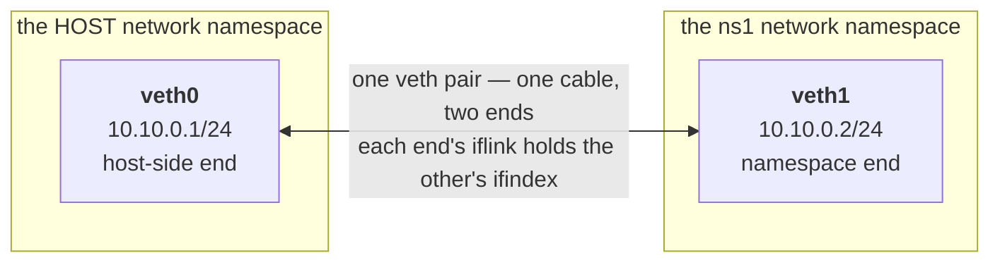
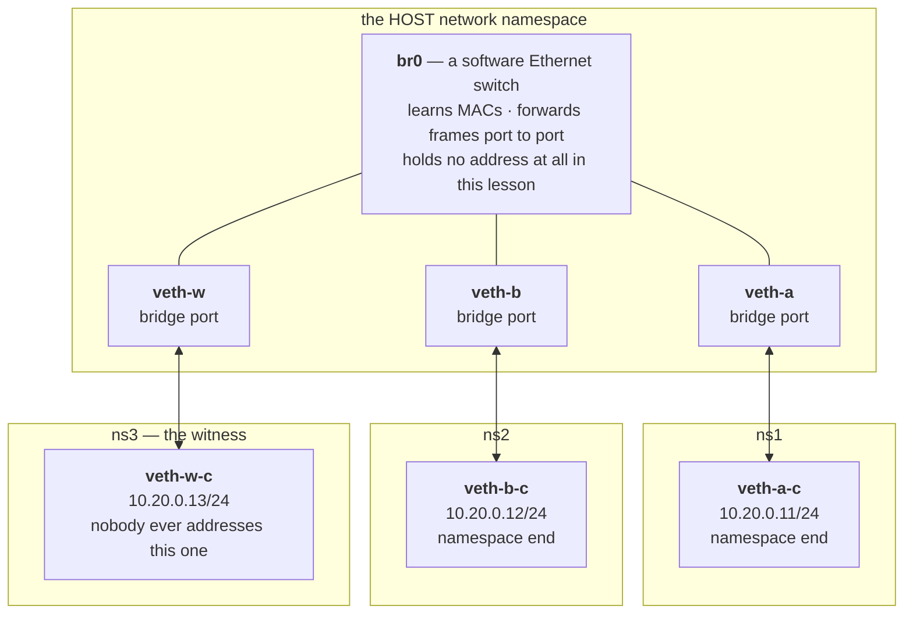

# veth and bridge

A namespace is an isolated machine, and a cgroup fixes how big a bite of the host it may take. Neither gives it a way to talk. Now we build the cable to plug it in, and then the switch to plug many cables into.


### The objects in play

Four different things get made or read in this lesson, and the easiest way to get lost is to lose track of *when* one exists and *where* it actually lives. This is the ledger you'll be filling in as you go — two rows are still blank on purpose, because the whole point of the next two sections is watching you fill them in yourself instead of being told:

| Object | Made by | Lives in | Verify with |
|---|---|---|---|
| a namespace | `ip netns add ns1` | its own file, bind-mounted at `/var/run/netns/ns1` | `ip netns list` |
| a veth pair | `ip link add ... type veth peer name ...` | *(watch for this)* | `ip link show`; `/sys/class/net/<iface>/` |
| a bridge | `ip link add ... type bridge` | wherever it was created, forever — a bridge never moves, only the ports plugged into it do | `ip link show type bridge`; `/sys/class/net/<bridge-name>/brif/` |
| the bridge's forwarding table (the fdb) | nobody — the kernel fills it in on its own, as ports come up and frames cross | *(watch for this)* | `bridge fdb show` |

Come back to this table once you've built both. If you can fill in the two blanks from memory, you've actually understood this lesson rather than skimmed it.

### The words, and what wears them

Seven words do all the work in this lesson, and the trap is that two of them name the *same object* at different moments. Read this once now and once more after you have built everything:

| the word | what it is | where it lives |
|---|---|---|
| **the host** | the machine's own network namespace — the one your shell is in when it has not entered another | — |
| **a namespace** (`ns1`) | a private, empty network stack: its own interfaces, its own routes, its own everything | `/var/run/netns/ns1` |
| **a veth pair** | one cable. Always two ends, created together, permanently bonded | both ends start in the host |
| **the namespace end** | the end you shove into `ns1`. **This one gets an address** — it is how `ns1` is present on the wire | inside `ns1` |
| **the host-side end** | the end left behind. By itself, just another host interface | the host |
| **a bridge** (`br0`) | a software Ethernet switch | the host, forever — a bridge never moves |
| **a bridge port**, or *switch port* | what a host-side end **becomes** the moment you run `ip link set <that end> master br0`: it carries frames and holds no address | the host |

The last two rows are one object photographed before and after a single command. `master br0` creates nothing — it changes what an existing interface is *for*. That is the whole reason "the host end of the cable" and "a port on the switch" can both be true of `veth-a`, and it is where most confusion about this lesson starts.

### veth pairs — the virtual wire between namespaces

**The problem that made this necessary** — Once you can create an isolated network namespace, you immediately want to *un*-isolate it, just a little — to run one wire from this private machine to the outside so packets can flow. On real hardware you'd run an Ethernet cable between two NICs. But there is no second NIC, and there is no cable; there's just one kernel holding two namespaces that can't see each other. The kernel needed a software object that behaves like a cable: a thing with two ends, where whatever goes in one end comes out the other, and where the two ends can live in two different namespaces. That object is the **veth pair** (virtual Ethernet).

**What it actually is** — A veth pair is two virtual network interfaces that are always created together and are permanently bonded: anything written to one end is immediately readable at the other, exactly like the two plugs of a patch cable. You create them as a pair, then move one end into your namespace and leave the other in the host. Now you have a wire: the host end and the namespace end, each can get its own IP, and a packet sent into one surfaces out the other with no routing, no switching, nothing in between — because they *are* the two ends of one cable.

**Draw it** — one veth pair bridging the host namespace and a container namespace. There is no switch in this picture yet, so the host's end of the cable *is* the host's presence on the wire, and it holds an address:



Two facts to keep hold of while you build it. Each side gets a route it never asked for — `10.10.0.0/24 dev veth0` in the host, `10.10.0.0/24 dev veth1` in `ns1`, both installed by `ip addr add` rather than by any `ip route` command. And the trip is as short as it looks: `ping 10.10.0.1` from `ns1` goes out `veth1`, in at `veth0`, and the reply comes straight back. No switch, no routing decision, nothing in between.

**The file** — Each end of a veth pair is its own interface, and an interface is a directory under `/sys`. `/sys/class/net/veth0/iflink` holds exactly one integer: the ifindex of whichever interface is bonded to the far end of this cable — the kernel's own record of the wiring, independent of any name. That's a true fact about a file that doesn't exist yet. The next block builds the pair and reads it for real, at the moment it's real.

**The experiment** — In `docker run --rm -it --privileged --network host nicolaka/netshoot`, build the whole wire by hand and verify each step as you go. `--network host` means these objects are made in the *real* host's (or, on Docker Desktop, the VM's) network namespace, not a private one that vanishes with the container — so if `ns1` or `veth0` already exists from a run you didn't clean up, `ip netns add ns1` fails with "File exists" rather than building anything. Run the **Tear it down** block below first if that happens.

> **Predict first —** `ip link add veth0 type veth peer name veth1` is about to create two interfaces in one line. Which namespace does *each* one land in — does naming one `veth1` put it anywhere near a namespace called `ns1`, which doesn't even exist as a target on this line?

```bash
ip netns add ns1
ip link add veth0 type veth peer name veth1
ip link show veth0                              # both ends visible here — still just two host interfaces
cat /sys/class/net/veth0/iflink                  # veth0's claim: "my far end has this ifindex" — note the number
```

> **Predict first —** after the next line moves `veth1` into `ns1`, will `ls /sys/class/net/ | grep veth` on the *host* still show it?

```bash
ip link set veth1 netns ns1
ls /sys/class/net/ | grep veth                        # veth1 is gone from the host's own view
ip netns exec ns1 cat /sys/class/net/veth1/ifindex     # veth1's own ifindex, read from inside ns1
ip addr add 10.10.0.1/24 dev veth0
ip netns exec ns1 ip addr add 10.10.0.2/24 dev veth1
ip link set veth0 up
ip netns exec ns1 ip link set veth1 up
ip netns exec ns1 ip link set lo up
ip netns exec ns1 ping 10.10.0.1
```

The two ifindex numbers you just read match — that's not a coincidence, it's the definition. `iflink` isn't a name lookup or a convention someone agreed on; it's the kernel reporting, in one integer, which interface this cable is actually wired to, regardless of which namespace either end currently sits in. That's the raw fact under `ip link`'s `veth0@veth1` notation.

The ping replies. A namespace that minutes ago could reach *nothing* (you proved that in [Namespaces](01-namespaces.md)) now talks to the host, and the host can talk back.

Look closely at what each line did, and *where each object lived the moment it was made* — the table at the top of this page, made concrete: `ip link add veth0 type veth peer name veth1` created **both** ends at once, and both landed in the current namespace, the host — you confirmed that yourself with `ip link show veth0` before anything moved. `ip link set veth1 netns ns1` was the only line that moved anything, and you watched it happen: `veth1` vanished from the host's `/sys/class/net/` and reappeared, same ifindex, inside `ns1`'s own view of the world. And the two `ip addr add` lines did double duty — they assigned IPs *and* silently installed the `10.10.0.0/24` route on each side, because adding an address to an interface tells the kernel "this whole subnet is directly reachable out this device." That implicit route is what makes the ping find its way.

**Tear it down** — deleting either end of a veth destroys the pair, and deleting the namespace takes everything left in it. Do both, in this order, so the next build starts clean (and so `ns1` is free to be created again):

```bash
ip link del veth0
ip netns del ns1
```

> **You understand this when you can** build this from memory without looking, read `iflink` on one end and match it against the other end's own `ifindex` without being told to, and point at the exact command that created the route — it is the `ip addr add`, not any `ip route` command, because assigning the address is what installs the directly-connected route.

> **Check yourself —** ns1 could ping the host. Would `ip netns exec ns1 ping 8.8.8.8` have worked? Name everything that is still missing.

<details>
<summary>Answer</summary>

No. Three things are missing, and they are three different subsystems. The cable only reaches the host, so ns1 has no route to anywhere except `10.10.0.0/24` — that one you could fix right now with a default route via `10.10.0.1`. Then the host would have to be *willing* to pass a packet that is neither addressed to it nor from it. And even then, the packet would arrive at Google carrying the source address `10.10.0.2`, which no router on the internet can send a reply to. A cable is necessary and nowhere near sufficient.

</details>

> **On your own machine —** you have already done this by hand hundreds of times without noticing: every `docker run` builds exactly this veth-and-bridge pair for you. Watch one appear as a container starts in [Act IV in the wild](in-the-wild.md#every-docker-run-is-act-iv-performed-for-you).

**Kubernetes sees this as** — Nine commands, and on a live node nobody types them. Something runs exactly this sequence the instant a Pod is created: make the pair, shove one end through the wall, bring both ends up, put an address on the inside. Same commands, same kernel objects; the only difference is that there a binary runs them.

Which makes the interesting question *what that binary has to be told*. It cannot guess which namespace to shove the end into. It certainly cannot pick `10.10.0.2` out of the air on a cluster where every Pod address must be unique across hundreds of machines, none of which are talking to you. So there is a contract at this exact line — someone hands over a namespace and expects a working interface and an address back — and a half-finished handover leaves a Pod that exists but cannot speak. Notice the shape of the problem now; you will meet the contract itself in Act V.

---

### Linux bridge — the software Ethernet switch

**The problem that made this necessary** — One veth pair connects one namespace to the host. But put ten containers on a host and you have ten dangling wires, and the containers can't talk to *each other* — only to the host, point to point. On real hardware you'd plug ten cables into a switch, and the switch would learn which machine is on which port and forward frames accordingly. The kernel needed that switch in software: a thing you plug many veth ends into, that learns MAC addresses and forwards Ethernet frames between ports. That's the **Linux bridge**.


**What it actually is** — A Linux bridge is a software Ethernet switch that lives in the kernel. You create it, plug interfaces into it (each veth end becomes a "port"), and it does what every switch does: it learns which MAC address it last saw on which port, builds a forwarding table, and forwards each frame only to the port where its destination lives. Containers plugged into the same bridge talk to each other at Layer 2 — frame to frame — without the packet ever leaving the host or touching IP routing. `docker0` and `cni0` are exactly this: bridges with a bunch of container veths plugged in.

**Draw it** — the picture you are about to build, with every role from the vocabulary table labelled. Three cables, six ends, one switch:



**The two kinds of line in that diagram are not the same thing, and telling them apart is most of this lesson.** The three long links are cables — real veth pairs, host-side end above and namespace end below, and a frame physically travels along them from one namespace to another. The three short links inside the host are not cables at all; they are **membership**. `ip link set veth-a master br0` moves no data and creates nothing: it tells the kernel that this interface's frames are now the switch's business. Delete a cable and a namespace goes deaf. Undo a membership with `ip link set veth-a nomaster` and the interface is still there, still up, still holding the same cable — it has simply stopped being a port.

Notice too that no address in the host appears anywhere in that picture. All three addresses are inside namespaces, on namespace ends. `br0` has none, because a switch does not need one to switch — and `.1`, the number every network reserves for its gateway, is deliberately left unclaimed. Nothing here is a gateway yet.

A ping from `ns1` to `ns2` therefore takes the long way through six objects: `10.20.0.12` leaves `veth-a-c`, arrives at `veth-a`, is handed to `br0`, goes out `veth-b`, arrives at `veth-b-c`, and lands in `ns2`. Two ports would have been enough for that ping. The third is in the diagram on purpose, and nobody will ever address traffic to it — it is how you'll actually *see* the bridge behave like a switch instead of taking the word "switch" on faith.

**The file** — A bridge's members are a real file. Its learned MAC table is not:

```
# /sys/class/net/br0/brif/      one entry per interface plugged into the bridge
```

`ls /sys/class/net/br0/brif/` (eza twin: `eza /sys/class/net/br0/brif/`) lists the bridge's ports — every interface currently plugged in, the same way `ls` on any directory lists what's inside it. Docker's own bridges are exactly this file, with a naming quirk worth its own page — that's [Docker networks →](02b-docker-networks.md), right after this lesson.

The learned MAC table (the fdb) has no file at all — there is nothing under `/sys` to `cat`. It lives only in kernel memory, and the only door in is a netlink query, which is what the separate `bridge` command speaks (`ip` cannot read it — that's the whole reason this lesson reaches for a second tool). `bridge fdb show br br0` asks the kernel "what have you learned," one bridge at a time, and gets back a MAC-to-port list built by watching real frames arrive — the kernel telling you "MAC X is reachable out port Y," the same table a hardware switch keeps in silicon.

But "what have you learned" is a strange question to ask a table you haven't built yet. Before running anything, sit in the actual question a switch has to answer: three cables plug into one bridge, and a frame arrives addressed to a MAC the bridge has never seen before. What does it do — guess, drop, or something else? A hub (the switch's dumb ancestor) would just repeat the frame out every other port and let each machine sort out for itself whether the frame was addressed to it. A switch is supposed to be smarter than that. Build three ports and watch it prove it.

**The experiment** — In netshoot, build a three-namespace switched network, with the third namespace wired in but never addressed:

> **Predict first —** `bridge fdb show` on a bridge that was *just* created, before any traffic crosses it — empty, or not? And when `ns1` pings `ns2`, will the *third* namespace's interface see anything at all, even though nothing is addressed to it or from it?

```bash
ip netns add ns1
ip netns add ns2
ip netns add ns3
ip link add br0 type bridge
sysctl -qw net.ipv6.conf.br0.disable_ipv6=1
ip link set br0 up
ip link add veth-a type veth peer name veth-a-c
ip link add veth-b type veth peer name veth-b-c
ip link add veth-w type veth peer name veth-w-c
ip link set veth-a master br0
ip link set veth-b master br0
ip link set veth-w master br0
sysctl -qw net.ipv6.conf.veth-a.disable_ipv6=1
sysctl -qw net.ipv6.conf.veth-b.disable_ipv6=1
sysctl -qw net.ipv6.conf.veth-w.disable_ipv6=1
ip link set veth-a up
ip link set veth-b up
ip link set veth-w up
ip link set veth-a-c netns ns1
ip link set veth-b-c netns ns2
ip link set veth-w-c netns ns3
ip netns exec ns1 sysctl -qw net.ipv6.conf.veth-a-c.disable_ipv6=1
ip netns exec ns2 sysctl -qw net.ipv6.conf.veth-b-c.disable_ipv6=1
ip netns exec ns3 sysctl -qw net.ipv6.conf.veth-w-c.disable_ipv6=1
ip netns exec ns1 ip addr add 10.20.0.11/24 dev veth-a-c
ip netns exec ns2 ip addr add 10.20.0.12/24 dev veth-b-c
ip netns exec ns3 ip addr add 10.20.0.13/24 dev veth-w-c
ip netns exec ns1 ip link set veth-a-c up
ip netns exec ns2 ip link set veth-b-c up
ip netns exec ns3 ip link set veth-w-c up
sleep 2
```

> **Why every line here is `sysctl`, and why IPv6 gets turned off** — `-w` writes a value instead of reading one, and `-q` suppresses the "key = value" echo so the build stays quiet; both are plain flags on the same tool you already read from in [Act III's conntrack lesson](../act-3-the-internet/02b-conntrack.md), just used to write this time instead of read. Turning IPv6 off on every interface, including `br0` itself, isn't about IPv6 mattering here — it's about silence. A live IPv6 stack joins multicast groups and runs neighbor discovery on its own the instant an interface comes up, entirely unprompted, and those frames would otherwise land in the fdb table below and look exactly like something the bridge "learned" from a ping it never actually saw. That, plus the trailing `sleep 2` giving that one-time startup chatter a couple of seconds to finish, is what makes the next command's output mean only what it claims to mean — not a promise that IPv6 itself matters to anything below.

Now, before a single ping:

```bash
bridge fdb show br br0 | grep -v permanent
```

Nothing. But run the same command *without* filtering:

```bash
bridge fdb show br br0
```

Over a dozen lines appear, every one flagged `permanent`. That flag is the whole story: the instant a port joins a bridge, the kernel registers that port's own MAC address (so a frame addressed to the port itself is delivered directly instead of flooded) and a couple of default multicast-group memberships — bookkeeping installed the moment the port came up, none of it learned from a frame. `permanent` means "the kernel put this here"; its absence means "a real frame taught the switch this." Filter it out and the *learned* table really is empty, exactly as you'd expect from a switch that hasn't seen a single packet yet.

Now answer the question from before you built anything — will `ns3`'s interface see a frame that isn't addressed to it, isn't from it, and has nothing to do with it? (The filter below keeps the capture to ARP and ICMP only — plain background multicast chatter, unrelated to this ping, is still floating around at interface-up and would otherwise be a red herring here.)

```bash
ip netns exec ns3 tcpdump -i veth-w-c -n -c 1 arp or icmp &
sleep 1
ip netns exec ns1 ping -c1 10.20.0.12
wait
```

It does. `ns3` sees the ARP request cross its interface anyway, because the bridge does not yet know which port holds `10.20.0.12`'s MAC address, so it does exactly what a hub always does: floods the frame out every port except the one it arrived on. For as long as it's ignorant, the switch behaves *no better than a dumb repeater* — the "smart" part hasn't happened yet.

```bash
bridge fdb show br br0 | grep -v permanent
```

Two new lines now — one for `veth-a`, one for `veth-b` — neither flagged `permanent`, both installed by the kernel from watching that one frame go by. Send another ping and check the witness again:

```bash
ip netns exec ns3 timeout 3 tcpdump -i veth-w-c -n arp or icmp &
sleep 1
ip netns exec ns1 ping -c2 10.20.0.12
sleep 3
```

Silence. Not "less traffic" — nothing crosses `veth-w-c` at all. The bridge now knows exactly which port to send the reply out, and a switch that knows stops repeating. Flood while ignorant, forward once it's learned — that transition *is* what a MAC forwarding table is for, and you just watched both halves of it happen on a table that, a few minutes ago, you confirmed has no file behind it whatsoever.

Look closely at what each line did, and *where*, because four objects were created and wired together this time, and the order was not arbitrary. `ip link add br0 type bridge` and every `ip link add veth-... type veth peer ...` line ran before any namespace move — `br0` and all six veth ends existed in the host namespace at that point, ordinary host interfaces you could have listed with a plain `ip link show`. `ip link set veth-a master br0` plugged `veth-a` into the switch *while it was still a host interface* — the bridge only ever receives a host-side end handed to it; it never reaches into a namespace itself. Only after that did `ip link set veth-a-c netns ns1` take the *other* end of that same cable — the one nobody had touched yet — and shove it through the wall into `ns1`. Repeat that for `veth-b`/`ns2` and `veth-w`/`ns3`, and the shape is: three cables, six ends, three plugged into `br0` and staying in the host forever, the other three relocated into the namespaces they'd live in. The bridge itself is never moved and never could be — it's a switch, not a cable end. `veth-w` was wired in exactly the same way as the other two; the only thing that made it a "witness" is that nobody ever addressed traffic to it, which is precisely why it was the right place to stand and watch.

**Tear it down** — delete the host-side end of each cable, then the switch, then the namespaces:

```bash
ip link del veth-a
ip link del veth-b
ip link del veth-w
ip link del br0
ip netns del ns1
ip netns del ns2
ip netns del ns3
```

> **You understand this when you can** explain why `permanent` is the flag that separates kernel bookkeeping from something the switch actually learned, reproduce the flood-then-silence you watched happen on the witness port, and explain why `ns1` and `ns2` reach each other without any `ip route` entry pointing one at the other — the bridge forwards by MAC, beneath routing entirely.

**Kubernetes sees this as** — Every node runs a bridge (named `docker0`, `cni0`, or something plugin-specific), and every Pod on that node has its host-side veth plugged into it. That is the entire reason **same-node** Pods reach each other for free, at Layer 2, with no overlay and no encapsulation: they are ports on one software switch, exactly like `ns1` and `ns2` above — and exactly like `ns3`, every Pod that never talks to a given other Pod is still a silent port on the same switch, capable of seeing a flood it has no reason to care about.

Now hold two of these pictures side by side, one per machine. Two bridges, two sets of private addresses, and between them a physical network that has never heard of either. A frame that leaves ns1 on this host has no way to become a frame arriving at a namespace on that host — bridges do not span machines, and the switches in between would drop a `10.20.0.0/24` packet as unroutable garbage. Something has to make two software switches on two boxes behave as one wire. Sit with how impossible that sounds.

**Where you are now** — You can build a virtual cable between two namespaces and a virtual switch between many, from memory, and you can point at the command that quietly created the route rather than guessing. You can tell a kernel-installed fdb entry from a genuinely learned one by a single flag, and you've proven forwarding is selective by standing at a silent third port and watching it go from noisy to silent.

But everything you have connected so far only talks *inside* the box. The checkpoint above named the reason: a packet from `10.10.0.2` heading for the internet carries a source address the internet cannot reply to, and no amount of cable and switch fixes that — the address itself has to change on the way out, and change back on the way in. What in the kernel is even allowed to rewrite a packet mid-flight?

---

← Prev: **[cgroups](01b-cgroups.md)** · ↑ **[Act IV overview](README.md)** · Next: **[Docker networks](02b-docker-networks.md)** →
