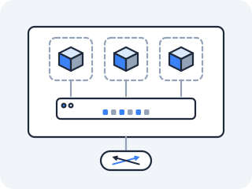
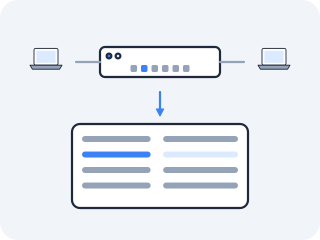

# veth and bridge

A namespace is an isolated machine, and a cgroup fixes how big a bite of the host it may take. Neither gives it a way to talk. Now we build the cable to plug it in, and then the switch to plug many cables into.



### veth pairs — the virtual wire between namespaces

**The problem that made this necessary** — Once you can create an isolated network namespace, you immediately want to *un*-isolate it, just a little — to run one wire from this private machine to the outside so packets can flow. On real hardware you'd run an Ethernet cable between two NICs. But there is no second NIC, and there is no cable; there's just one kernel holding two namespaces that can't see each other. The kernel needed a software object that behaves like a cable: a thing with two ends, where whatever goes in one end comes out the other, and where the two ends can live in two different namespaces. That object is the **veth pair** (virtual Ethernet).

**What it actually is** — A veth pair is two virtual network interfaces that are always created together and are permanently bonded: anything written to one end is immediately readable at the other, exactly like the two plugs of a patch cable. You create them as a pair, then move one end into your namespace and leave the other in the host. Now you have a wire: the host end and the namespace end, each can get its own IP, and a packet sent into one surfaces out the other with no routing, no switching, nothing in between — because they *are* the two ends of one cable.

**Draw it** — one veth pair bridging the host namespace and a container namespace:

<!-- figure -->

```
   HOST namespace                          ns1 namespace
  ┌────────────────────┐                  ┌────────────────────┐
  │                     │                  │                     │
  │   veth0             │  ←── wire ──→     │            veth1    │
  │   10.10.0.1/24  ●═══╪══════════════════╪═══●  10.10.0.2/24    │
  │                     │   (the pair)     │                     │
  └────────────────────┘                  └────────────────────┘

  route in HOST:  10.10.0.0/24  dev veth0   ← created by `ip addr add`
  route in ns1:   10.10.0.0/24  dev veth1   ← created by `ip addr add`

  ping 10.10.0.1 from ns1  →  out veth1  →  in veth0  →  reply  →  back
```

**The file** — Each end is an interface, and an interface is a directory under `/sys`:

```
/sys/class/net/veth0/        the host end — read carrier, mtu, address here
/sys/class/net/veth0/iflink  the ifindex of the OTHER end of the pair
```

`cat /sys/class/net/veth0/iflink` prints the interface index of the far end — the kernel telling you, in one integer, which interface this cable is wired to. That's the raw fact under `ip link`'s `veth0@veth1` notation.

**The experiment** — In `docker run --rm -it --privileged --network host nicolaka/netshoot`, build the whole wire by hand:

> **Predict first —** after which single command does the ping become possible, and which command quietly created the route that makes it work?

```bash
ip netns add ns1
ip link add veth0 type veth peer name veth1
ip link set veth1 netns ns1
ip addr add 10.10.0.1/24 dev veth0
ip netns exec ns1 ip addr add 10.10.0.2/24 dev veth1
ip link set veth0 up
ip netns exec ns1 ip link set veth1 up
ip netns exec ns1 ip link set lo up
ip netns exec ns1 ping 10.10.0.1
```

The ping replies. A namespace that minutes ago could reach *nothing* (you proved that in [Namespaces](01-namespaces.md)) now talks to the host, and the host can talk back.

Look closely at what each line did: `ip link add ... type veth peer ...` manufactured the cable; `ip link set veth1 netns ns1` shoved one end through the wall into the private namespace; and the two `ip addr add` lines did double duty — they assigned IPs *and* silently installed the `10.10.0.0/24` route on each side, because adding an address to an interface tells the kernel "this whole subnet is directly reachable out this device." That implicit route is what makes the ping find its way.

**Tear it down** — deleting either end of a veth destroys the pair, and deleting the namespace takes everything left in it. Do both, in this order, so the next build starts clean (and so `ns1` is free to be created again):

```bash
ip link del veth0
ip netns del ns1
```

> **You understand this when you can** build this from memory without looking, and point at the exact command that created the route — it is the `ip addr add`, not any `ip route` command, because assigning the address is what installs the directly-connected route.

> **Check yourself —** ns1 could ping the host. Would `ip netns exec ns1 ping 8.8.8.8` have worked? Name everything that is still missing.

<details>
<summary>Answer</summary>

No. Three things are missing, and they are three different subsystems. The cable only reaches the host, so ns1 has no route to anywhere except `10.10.0.0/24` — that one you could fix right now with a default route via `10.10.0.1`. Then the host would have to be *willing* to pass a packet that is neither addressed to it nor from it. And even then, the packet would arrive at Google carrying the source address `10.10.0.2`, which no router on the internet can send a reply to. A cable is necessary and nowhere near sufficient.

</details>

> **On your own machine —** you have already done this by hand hundreds of times without noticing: every `docker run` builds exactly this veth-and-bridge pair for you. Watch one appear as a container starts in [Act IV in the wild](in-the-wild.md#every-docker-run-is-act-iv-performed-for-you).

**Kubernetes sees this as** — Nine commands, and on a live node nobody types them. Something runs exactly this sequence the instant a Pod is created: make the pair, shove one end through the wall, bring both ends up, put an address on the inside. Same commands, same kernel objects; the only difference is that there a binary runs them.

Which makes the interesting question *what that binary has to be told*. It cannot guess which namespace to shove the end into. It certainly cannot pick `10.10.0.2` out of the air on a cluster where every Pod address must be unique across hundreds of machines, none of which are talking to you. So there is a contract at this exact line — someone hands over a namespace and expects a working interface and an address back — and a half-finished handover leaves a Pod that exists but cannot speak. Notice the shape of the problem now; you will meet the contract itself in Act V.

---

### Linux bridge — the software Ethernet switch

**The problem that made this necessary** — One veth pair connects one namespace to the host. But put ten containers on a host and you have ten dangling wires, and the containers can't talk to *each other* — only to the host, point to point. On real hardware you'd plug ten cables into a switch, and the switch would learn which machine is on which port and forward frames accordingly. The kernel needed that switch in software: a thing you plug many veth ends into, that learns MAC addresses and forwards Ethernet frames between ports. That's the **Linux bridge**.



**What it actually is** — A Linux bridge is a software Ethernet switch that lives in the kernel. You create it, plug interfaces into it (each veth end becomes a "port"), and it does what every switch does: it learns which MAC address it last saw on which port, builds a forwarding table, and forwards each frame only to the port where its destination lives. Containers plugged into the same bridge talk to each other at Layer 2 — frame to frame — without the packet ever leaving the host or touching IP routing. `docker0` and `cni0` are exactly this: bridges with a bunch of container veths plugged in.

**Draw it**:

<!-- figure -->

```
            ┌──────────────── br0 (software switch) ───────────────┐
            │   learns MACs, forwards frames port-to-port           │
            └───●──────────────────────────●───────────────────────┘
                │ veth-a (host end)         │ veth-b (host end)
                │                           │
        ┌───────╪────────┐          ┌───────╪────────┐
        │ ns1   ●        │          │ ns2   ●        │
        │ 10.20.0.1/24   │          │ 10.20.0.2/24   │
        └────────────────┘          └────────────────┘
              ping 10.20.0.2 from ns1 → veth-a → br0 → veth-b → ns2
```

**The file** — A bridge's members and its learned MAC table are both readable:

```
/sys/class/net/br0/brif/      one entry per interface plugged into the bridge
/sys/class/net/docker0/brif/  Docker's bridge — its container veths appear here
```

`ls /sys/class/net/docker0/brif/` (eza twin: `eza /sys/class/net/docker0/brif/`) lists the ports of Docker's bridge — every running container's host-side veth shows up here. The learned MAC forwarding table (the fdb) is exposed by `bridge fdb`, which is the kernel telling you "MAC X is reachable out port Y," the same table a hardware switch keeps in silicon.

**The experiment** — In netshoot, build a two-container switched network:

> **Predict first —** what will `bridge fdb` show BEFORE any ping versus AFTER the first ping crosses the bridge?

```bash
ip netns add ns1
ip netns add ns2
ip link add br0 type bridge
ip link set br0 up
ip link add veth-a type veth peer name veth-a-c
ip link add veth-b type veth peer name veth-b-c
ip link set veth-a master br0
ip link set veth-b master br0
ip link set veth-a up
ip link set veth-a-c netns ns1
ip link set veth-b-c netns ns2
ip link set veth-b up
ip netns exec ns1 ip addr add 10.20.0.1/24 dev veth-a-c
ip netns exec ns2 ip addr add 10.20.0.2/24 dev veth-b-c
ip netns exec ns1 ip link set veth-a-c up
ip netns exec ns2 ip link set veth-b-c up
bridge fdb show br br0
ip netns exec ns1 ping 10.20.0.2
bridge fdb show br br0
```

Run `bridge fdb show` *before* the ping and the table is nearly empty — the switch has learned nothing. Run the ping, then `bridge fdb show` *again*, and you'll see new entries appear: the bridge has now learned which MAC lives behind which port, exactly by watching the frames flow, the same way a physical switch learns. Two isolated namespaces just talked to each other at Layer 2 without a single IP route between them, because the bridge forwarded the frames directly.

**Tear it down** — delete the host-side end of each cable, then the switch, then the namespaces:

```bash
ip link del veth-a
ip link del veth-b
ip link del br0
ip netns del ns1
ip netns del ns2
```

> **You understand this when you can** explain why the fdb is empty before traffic and populated after, and why ns1 and ns2 reach each other without any `ip route` entry pointing one at the other — the bridge forwards by MAC, beneath routing entirely.

**Kubernetes sees this as** — Every node runs a bridge (named `docker0`, `cni0`, or something plugin-specific), and every Pod on that node has its host-side veth plugged into it. That is the entire reason **same-node** Pods reach each other for free, at Layer 2, with no overlay and no encapsulation: they are ports on one software switch, exactly like ns1 and ns2 above.

Now hold two of these pictures side by side, one per machine. Two bridges, two sets of private addresses, and between them a physical network that has never heard of either. A frame that leaves ns1 on this host has no way to become a frame arriving at a namespace on that host — bridges do not span machines, and the switches in between would drop a `10.20.0.0/24` packet as unroutable garbage. Something has to make two software switches on two boxes behave as one wire. Sit with how impossible that sounds.

**Where you are now** — You can build a virtual cable between two namespaces and a virtual switch between many, from memory, and you can point at the command that quietly created the route rather than guessing. You can read the bridge's learned MAC table and watch it fill as the first frame crosses.

But everything you have connected so far only talks *inside* the box. The checkpoint above named the reason: a packet from `10.10.0.2` heading for the internet carries a source address the internet cannot reply to, and no amount of cable and switch fixes that — the address itself has to change on the way out, and change back on the way in. What in the kernel is even allowed to rewrite a packet mid-flight?

---

← Prev: **[cgroups](01b-cgroups.md)** · ↑ **[Act IV overview](README.md)** · Next: **[iptables and NAT](03-iptables-and-nat.md)** →
