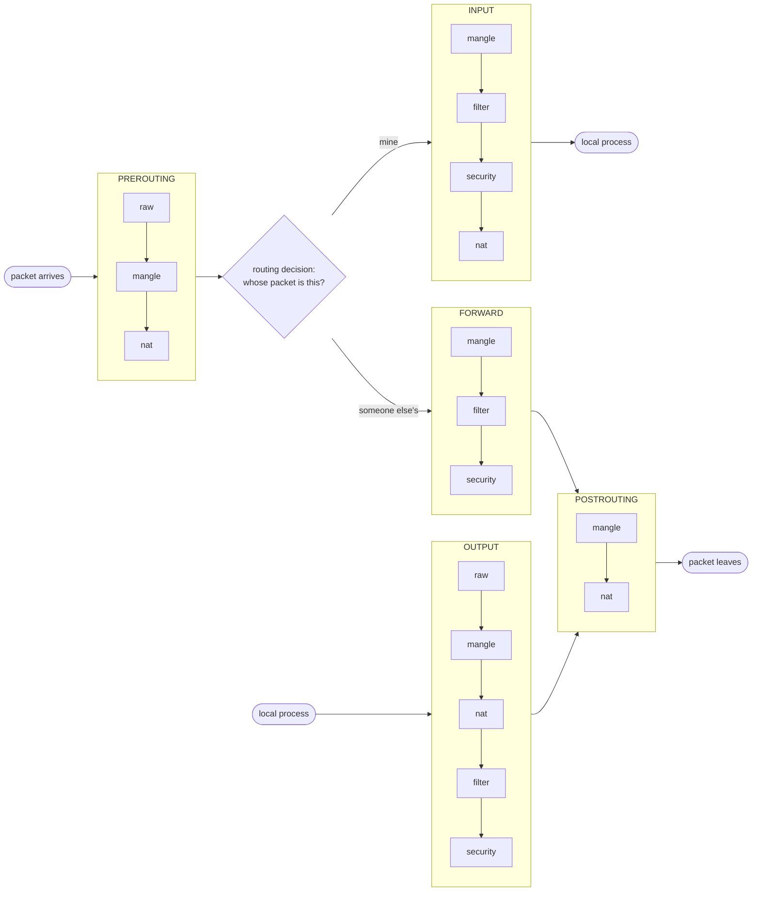
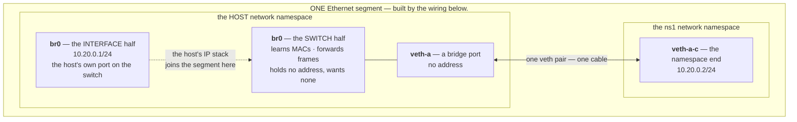

# iptables — the five hooks

Two lessons ago you built a cable, then a switch, and `ns1` could reach the host and its neighbours. That lesson's *Check yourself* asked whether `ping 8.8.8.8` would work from in there, and the answer named three separate things that were missing, in three different subsystems. One was a route. One was the host's willingness to pass a packet that is neither from it nor for it. The third was the killer: a packet leaving with a private source address is a packet no router on earth can reply to.

This lesson pays the first two and walks you up to the wall the third is behind. Every one of them is fixed — or refused — by `iptables`, so that is where we start: not with a rule to copy, but with the shape of the thing. Almost everything people find baffling about `iptables` is a consequence of its structure being three separate ideas wearing one command name.

### The structure: two axes, and a chain where they cross

`iptables` is not a firewall. It is a way of attaching rules to **fixed points in the kernel's packet path**, and a firewall is one of the things you can build with it. Four words carry the whole model:

- A **hook** answers ***when*** — at which point in a packet's journey the kernel stops to consult your rules. There are **five**, they are kernel-owned, and you cannot add one.
- A **table** answers ***what kind of edit*** the rules there are allowed to make — decide the packet's fate, rewrite its addresses, tag it. There are **five**, also fixed.
- A **chain** is ***the actual list of rules*** sitting at **one (table, hook) crossing**. A rule lives in a chain, so a rule's full address is a table *and* a hook — never just one of them.
- A **policy** is a chain's ***default verdict*** — what happens to a packet that reaches the end of that chain with no rule having decided it. Exactly **one per built-in chain**, always. `iptables` prints it as a `-P` line.

Tables and hooks are **two independent axes, not a hierarchy**, and that is the single most useful thing to know about this tool. `filter`'s `INPUT` and `nat`'s `INPUT` are two different lists that happen to share a name: walked at the same moment, holding different rules, keeping separate counters.

All four numbers are worth holding at once:

<!-- figure -->

```
   5 hooks  ×  5 tables   =  25 possible crossings
                             17 of them actually exist as chains
                              1 policy per chain, no more, no less
                              0 rules on a machine nobody has configured
```

**Draw it** — the five hooks, and the routing decision that chooses between the middle three:

<!-- figure: iptables-hooks -->

```
   packet                                                          packet
   arrives                                                          leaves
     │                                                                ▲
     ▼                                                                │
 ┌────────────┐     ┌──────────┐                          ┌─────────────┐
 │ PREROUTING │ ──▶ │ routing  │                          │ POSTROUTING │
 └────────────┘     │ decision │                          └─────────────┘
                    └────┬─────┘                                 ▲
          ┌──────────────┴───────────────┐                        │
          ▼ "for me"                      ▼ "for someone else"    │
     ┌─────────┐                     ┌──────────┐                 │
     │  INPUT  │ ─▶ local process    │ FORWARD  │ ────────────────┤
     └─────────┘                     └──────────┘                 │
                                                                  │
     local process ──────────────────▶  ┌────────┐ ──────────────┘
                                        │ OUTPUT │
                                        └────────┘

  The routing decision is the fork, and it is why there are three middle
  hooks rather than one. A packet visits exactly one of INPUT, FORWARD or
  OUTPUT — never two — and which one is a fact about the packet, not a
  choice you make.

  Your ns1 ping took:   PREROUTING → routing → FORWARD → POSTROUTING
  A curl from this box: OUTPUT → POSTROUTING, and the reply comes back
                        PREROUTING → routing → INPUT
```

**The five tables**, one verb each — and the verb predicts which hooks a table bothers to have a chain at:

| Table | Its verb | A real job it does | Its chains | # |
|---|---|---|---|---|
| **`filter`** | *decide* — accept or drop | a server that admits SSH and silently drops everything else | `INPUT` · `FORWARD` · `OUTPUT` | 3 |
| **`nat`** | *rewrite* — change an address | your home router letting ten devices share one public IP | `PREROUTING` · `INPUT` · `OUTPUT` · `POSTROUTING` | 4 |
| **`mangle`** | *annotate* — tag or tweak a packet | tagging video-call packets so the machine handles them specially | all five | 5 |
| **`raw`** | *exempt* — act before conntrack | a busy DNS server asking the kernel not to keep a ledger row per query | `PREROUTING` · `OUTPUT` | 2 |
| **`security`** | *label* — for SELinux | only the web server's process may receive port-80 packets | `INPUT` · `FORWARD` · `OUTPUT` | 3 |

`filter` and `nat` explain themselves. The other three lean on machinery outside `iptables`:

- **`raw`** tells the connection tracker — Act III's `nf_conntrack` — to skip a packet, so it gets no ledger row. Why would a busy DNS server want that, and why can `raw` only sit at the two hooks where packets *enter*? [When NAT runs out](03d-when-nat-runs-out.md) has you hit the wall that answers both.
- **`security`** stamps a label that **SELinux** reads — a Linux access-control system that labels every process and file and allows only the pairings its policy lists. That is how an SELinux machine lets only the web server read port-80 traffic, even against another program running as root. It runs just after `filter`, because labelling a packet that is about to be dropped is wasted work.
- **`mangle`** also tags, so tell it apart from `security` by **who reads the tag**. A `security` label is read by SELinux alone and never changes where a packet goes. A `mangle` mark is read by the kernel itself — which part, and what it does with it, is 03d's question.

**3 + 4 + 5 + 2 + 3 = 17.** The other **8** crossings are each a verb with nothing to do at that hook:

| Missing chains | Why that verb has nothing to do there |
|---|---|
| `filter`, `security` at `PREROUTING` | The routing decision has not said whose packet this is, so there is no owner to judge or label against. |
| `filter`, `security` at `POSTROUTING` | The verdict was already given at whichever of `INPUT`/`FORWARD`/`OUTPUT` applied. |
| `nat` at `FORWARD` | An address edit only matters as a packet **arrives** or **leaves**; mid-transit it changes nothing about where it goes. |
| `raw` at `INPUT`, `FORWARD`, `POSTROUTING` | Conntrack runs straight after `PREROUTING`/`OUTPUT`, so by now the packet is tracked and there is nothing left to exempt. |

Only `mangle` has no blanks: a tag is useful at any moment.

**Draw it** — all seventeen chains in the order a packet walks them. Each cluster is one hook; the tables inside it run top to bottom:



`raw` before `mangle` before `filter` never varies: exempt from tracking before you tag, and tag before you decide. What moves is **`nat`, which sits on both sides of the verdict**. Its destination edits (`PREROUTING`, `OUTPUT`) run *before* `filter`, so the firewall judges where the packet is really going; its source edits (`INPUT`, `POSTROUTING`) run *after*, because there is no point rewriting the sender of a packet that has just been dropped. The kernel will print this order for you in [a later lesson](03b-reading-a-ruleset-you-did-not-write.md).

**This lesson lives entirely in `filter` and `nat`**, which carry almost every rule you will ever meet — including all of Docker's and all of Kubernetes'. And `iptables -L` with no `-t` shows you only `filter`'s three chains.

Finally the command shape. Every `iptables` command on this page is these five parts:

```
  iptables  -t filter  -A  FORWARD  -s 10.20.0.0/24  -j DROP
            └────┬───┘ └┬┘ └───┬──┘ └───────┬──────┘ └───┬──┘
               table    │    chain        match        target
                        │
                  what to do to that list:
                    -A  append a rule to the end        -D  delete a rule
                    -I  insert at a position            -Z  zero the counters
                    -S  show it as the rules that would recreate it
                    -L  list it (add -n numeric, -v counters, --line-numbers)
                    -P  set the chain's policy

  -t  picks the table and defaults to `filter` — which is why the rules
      actually rewriting your packets are invisible to most people.

  -j  is "jump": where the packet goes when the match hits. ACCEPT and DROP
      are *verdicts*, and a verdict ends the packet's walk through the table.
      Something that is not a verdict can also go here — hold that thought.
```

Two of those are new to you (`-Z` and `-S`); the rest arrive as you need them. If you would rather work a command out than look one up, [the grammar](../../reference/01-the-grammar.md) teaches the shape of any command in this course, and [the map](../../reference/03-the-map.md) ties each tool to the kernel state it reads.

> **Predict first —** you have the model before the machine. On a container nobody has configured, `iptables -t nat -S` and `iptables -S` will each print some `-P` lines and nothing else. **Commit to two numbers** — how many lines from each — and say why they differ.

### Read it on a kernel that has none of it

Start the lab. **Note the absence of `--network host`** — that is deliberate. A plain `--privileged` container gets its *own* network namespace, so everything below happens on a clean slate no Docker daemon and no half-cleaned-up previous lesson has touched, and `exit` destroys all of it:

```bash
docker run --rm -it --privileged --name gw nicolaka/netshoot
```

```bash
ip -brief addr show                 # every interface and its addresses, one line each
iptables -t nat -S                  # the nat table
iptables -S                         # no -t, so: filter
```

```
lo               UNKNOWN        127.0.0.1/8 ::1/128
tunl0@NONE       DOWN
gre0@NONE        DOWN
...
eth0@if363       UP             172.17.0.2/16
```

```
-P PREROUTING ACCEPT        ← iptables -t nat -S
-P INPUT ACCEPT
-P OUTPUT ACCEPT
-P POSTROUTING ACCEPT

-P INPUT ACCEPT             ← iptables -S
-P FORWARD ACCEPT
-P OUTPUT ACCEPT
```

**Four and three.** Each `-P` line is one chain announcing its default verdict, so counting them counts chains — and `nat` has a `PREROUTING` and a `POSTROUTING` exactly where `filter` has a `FORWARD`. Not one actual rule anywhere: every line that appears for the rest of this lesson is one you put there.

Ask all five tables at once:

```bash
for t in filter nat mangle raw security; do
  printf '%-9s ' "$t"
  iptables -t $t -S | grep '^-P' | awk '{print $2}' | tr '\n' ' '
  echo
done
```

```
filter    INPUT FORWARD OUTPUT
nat       PREROUTING INPUT OUTPUT POSTROUTING
mangle    PREROUTING INPUT FORWARD OUTPUT POSTROUTING
raw       PREROUTING OUTPUT
security  INPUT FORWARD OUTPUT
```

The table's seventeen chains, printed by the kernel. Now prove the two axes are independent: write what looks like the same rule twice, then delete it from one place.

```bash
iptables -t filter -A INPUT -d 10.99.0.7 -j ACCEPT
iptables -t nat    -A INPUT -d 10.99.0.7 -j ACCEPT
iptables -t filter -S INPUT
iptables -t nat    -S INPUT
```

Both print `-A INPUT -d 10.99.0.7/32 -j ACCEPT`, identical. They are not the same rule:

```bash
iptables -t filter -D INPUT -d 10.99.0.7 -j ACCEPT
iptables -t filter -S INPUT      # gone
iptables -t nat    -S INPUT      # still there
```

**One deletion, one survivor.** `-t` is not a display filter — it is part of the address of the rule. So run the command everybody runs, and note what it is *not* showing you:

```bash
iptables -L -n
```

Your surviving `nat` rule is nowhere in that output, and nothing in it admits the rule exists. Remember that the next time a machine is plainly rewriting your packets while "the firewall" looks empty.

A missing chain is not an empty list — the chain is *absent*, and asking for it is an error:

```bash
iptables -t filter -S PREROUTING ; echo "exit=$?"
iptables -t nat    -S FORWARD    ; echo "exit=$?"
```

```
iptables: No chain/target/match by that name.
exit=1                                       ← "the command failed"
```

Both fail: the verb table above, enforced by the kernel. Clean up the survivor before moving on:

```bash
iptables -t nat -D INPUT -d 10.99.0.7 -j ACCEPT
```

One caution about the word *chain*. Every chain so far is a **built-in**: named after a hook, called by the kernel, carrying a policy. A program can also create extra *named* chains and jump into them from one of the five — those have no hook and no policy, and `-L` prints `(2 references)` where a built-in prints `(policy ACCEPT)`. That is what `DOCKER` is when you meet it two lessons from now. Sit with the question it raises — *what happens to a packet that jumps somewhere and is not decided there?* — because [the stateful firewall](03c-the-stateful-firewall.md) has you build one to find out.

### The gateway that is not one yet

Rebuild the minimum from [veth and bridge](02-veth-and-bridge.md) — one bridge, one namespace, one cable — and this time give the namespace what it lacked:

```bash
ip netns add ns1
ip link add br0 type bridge
ip addr add 10.20.0.1/24 dev br0        # NEW — the HOST's address on this segment
ip link set br0 up
ip link add veth-a type veth peer name veth-a-c
ip link set veth-a master br0           # veth-a is now a switch port: no address
ip link set veth-a up
ip link set veth-a-c netns ns1
ip netns exec ns1 ip addr add 10.20.0.2/24 dev veth-a-c   # ns1's address
ip netns exec ns1 ip link set veth-a-c up
```

Ten lines, and only the **third** is new; the other nine are lesson 02's, with the roles its [vocabulary table](02-veth-and-bridge.md#the-words-and-what-wears-them) named. (Lesson 02 also brought `lo` up inside the namespace; nothing here uses it, so that line is gone.)

**`ip addr add 10.20.0.1/24 dev br0` puts the host on its own switch.** A bridge is two objects wearing one name: a *switch*, which forwards frames and wants no address, and an *interface* called `br0` that the host's IP stack can own like any other. Addressing the interface gives the host one port on the segment, at `.1` — the number networks reserve for the way out. Lesson 02's namespaces only talked to each other and never needed it; `ns1` now wants something only the host can fetch.

**Draw it** — the segment as it now stands, with both halves of `br0` drawn as the separate objects they are, and the one interface that deliberately holds no address:



**Where does `10.20.0.0/24` come from?** Nobody typed it. Both addresses were given with `/24`, which means the first 24 bits name the *network* and the rest pick a machine on it. The kernel names the network by keeping those 24 bits and zeroing the rest:

```
  10.20.0.2       00001010 00010100 00000000 00000010
  /24 netmask     11111111 11111111 11111111 00000000
  AND        =    00001010 00010100 00000000 00000000    → 10.20.0.0
                  └────── network: 24 bits ──────┘└host┘
```

So `10.20.0.0/24` is not an address anyone holds — it is the name for *every address from `10.20.0.0` to `10.20.0.255`*, and you will write it as a match (`-s 10.20.0.0/24`, "from anything on this segment") later in this lesson.

Both ends are in `10.20.0.0/24`, so **no router is involved between them.** The route `ip addr add` installed for free, `10.20.0.0/24 dev br0 scope link`, means "these addresses are on my wire": the host ARPs for `10.20.0.2` directly and hands the frame to the switch. Note it says `dev br0`, not `dev veth-a` — the host's presence on this segment is now `br0`, and `veth-a` is plumbing that carries frames and holds no address:

```bash
ip -brief addr show br0        # the interface half: it holds 10.20.0.1/24
ip -brief addr show veth-a     # a port: no IPv4 address, and it needs none
ip route                       # 10.20.0.0/24 dev br0 ... scope link
```

That route only answers for `10.20.0.0/24`. The interesting case is a destination outside it.

> **Predict first —** `ns1` has an address, a cable, a switch, and a host on the far side with working internet. Run `ping 1.1.1.1` from `ns1`. It will fail. **Name the error message you expect**, and be specific about one thing: does the packet leave `ns1` at all?

```bash
ip netns exec ns1 ping -c1 -W2 1.1.1.1 ; echo "exit=$?"
```

```
ping: connect: Network unreachable
exit=2                          ← "I could not even try"
```

`ping` spends its three exit codes carefully, and they are worth learning as words rather than numbers, because the number alone answers the question this drill is asking:

| Code | In words | What it tells you |
|---|---|---|
| `0` | *a reply came back* | the whole round trip worked |
| `1` | *I tried, and got silence* | packets **were sent**; nothing answered |
| `2` | *I could not even try* | something stopped it **before** it was sent |

So `exit=2` has already answered the "does the packet leave `ns1` at all?" half of the prediction, before you read a word of the error. (These are `ping`'s own convention, not a universal one — `iptables` used `1` above for nothing more specific than "the command failed".)

**Instant, and it never left.** Not a timeout — nothing was sent. `ns1`'s routing table has one entry, for `10.20.0.0/24`, and `1.1.1.1` is not in it, so `ns1`'s kernel had nowhere to send the packet and refused before a byte hit the wire. That is [Act II's routing table](../act-2-two-machines/02-ip-and-routing.md) doing exactly what Act II said it does, now inside a namespace of its own. Fix it the way Act II taught:

```bash
ip netns exec ns1 ip route add default via 10.20.0.1
ip netns exec ns1 ping -c2 -W2 1.1.1.1 ; echo "exit=$?"
```

```
2 packets transmitted, 0 received, 100% packet loss, time 1024ms
exit=1                          ← "I tried, and got silence"
```

A **completely different failure**, and the change is the lesson in miniature. The exit code moved from *could not try* to *tried and heard nothing*, which is the single fact you bought with that route: the packets are now leaving. No error, no refusal — two seconds of nothing. The packet was accepted by `ns1`'s routing table, handed down the cable to `br0`, and then something happened to it that nobody reported to anybody.

You have two suspects and no way to choose between them. Either this host is refusing to pass a packet not addressed to it, or it is passing it perfectly and the *reply* never came. **Those two produce identical output.** Go and look.

> **Predict first —** take the first suspect. A host that forwards other people's packets is doing a different job from one that only sends its own, and Linux keeps that as a setting. Guess whether it is on or off in this container before you read it.

```bash
sysctl net.ipv4.ip_forward
```

```
net.ipv4.ip_forward = 1
```

**Already on** — Docker turns it on, because a container host that could not forward would be useless. So the first suspect is eliminated without being fixed. Prove it is the switch it claims to be by turning it *off* and watching the failure change shape. Watch the uplink while you do it — `eth0` is the only way out of this machine, so a forwarded packet has to appear there:

```bash
sysctl -qw net.ipv4.ip_forward=0
timeout 4 tcpdump -i eth0 -n icmp &
sleep 1
ip netns exec ns1 ping -c2 -W1 1.1.1.1 >/dev/null 2>&1
wait
```

```
0 packets captured
```

**Nothing.** Not a dropped reply — the packet never reached the uplink. With forwarding off, the host took delivery of a packet addressed to `1.1.1.1`, noticed it was not for itself, and discarded it silently. Put it back:

```bash
sysctl -qw net.ipv4.ip_forward=1
timeout 4 tcpdump -i eth0 -n icmp &
sleep 1
ip netns exec ns1 ping -c2 -W1 1.1.1.1 >/dev/null 2>&1
wait
```

```
04:37:24.328898 IP 10.20.0.2 > 1.1.1.1: ICMP echo request, id 33, seq 1, length 64
04:37:25.378919 IP 10.20.0.2 > 1.1.1.1: ICMP echo request, id 33, seq 2, length 64
2 packets captured
```

**There it is, and there is the problem, printed in the first column.** The packet is leaving — forwarding works, the bridge works, the cable works, the route works — and it is leaving with the source address `10.20.0.2`, which exists nowhere except inside a namespace on this box. Cloudflare will receive it, compose a perfectly good reply, address that reply to `10.20.0.2`, and hand it to an internet with no idea such a place exists. The reply is not slow. It is not blocked. **It was never deliverable.**

Two identical silences, one on each side of a `sysctl`, told apart only by putting `tcpdump` on the wire. Two of the three missing things are now paid. The third cannot be fixed by routing, by switching, or by any setting, because nothing in the packet is *wrong*: it is a truthful report of where it came from, and the truth is unroutable. **The address itself has to change on the way out, and change back on the way in.**

### Which hook did the packet actually walk?

Every rule carries two counters — packets and bytes matched — and `-v` prints them. That turns a chain into an instrument: instead of believing a diagram about where your packet went, leave a marker at each hook and read which ones it tripped.

Set three, one per `filter` chain. Each is an `ACCEPT`, and each is deliberately a **no-op** — the policies are already `ACCEPT`, so these change the fate of nothing and exist purely to be counted:

```bash
sysctl -qw net.ipv4.ip_forward=1        # you switched this off above; it must be back on
iptables -A INPUT   -s 10.20.0.0/24 -j ACCEPT
iptables -A FORWARD -s 10.20.0.0/24 -j ACCEPT
iptables -A OUTPUT  -d 1.1.1.1      -j ACCEPT
iptables -Z
iptables -L -n -v --line-numbers
```

The `sysctl` line matters: with forwarding off, every counter below stays `0` and the instrument reads as though nothing happened. `-Z` zeroes every counter so the next reading means only what it claims to.

> **Predict first —** two experiments: a `ping` from **inside `ns1`**, then a `curl` from **this container's own shell**. For each, say which of the three counters moves. Do not answer "the relevant ones" — commit to three numbers per experiment, including the zeros, and be ready to be wrong about which chain a *reply* arrives on.

```bash
ip netns exec ns1 ping -c2 -W2 1.1.1.1 >/dev/null 2>&1
iptables -L -n -v --line-numbers | grep -E "Chain|ACCEPT"
```

```
Chain INPUT (policy ACCEPT 0 packets, 0 bytes)
1        0     0 ACCEPT     all  --  *      *       10.20.0.0/24         0.0.0.0/0
Chain FORWARD (policy ACCEPT 0 packets, 0 bytes)
1        2   168 ACCEPT     all  --  *      *       10.20.0.0/24         0.0.0.0/0
Chain OUTPUT (policy ACCEPT 0 packets, 0 bytes)
1        0     0 ACCEPT     all  --  *      *       0.0.0.0/0            1.1.1.1
```

`FORWARD`'s rule has **2 packets, 168 bytes**. `INPUT` and `OUTPUT` are untouched: those two packets were not for this machine and not from it. (And nothing came *back*, because the reply is still undeliverable — that changes in one line, next lesson.)

Note that `FORWARD`'s *policy* counter reads zero while its rule reads two. The policy counter counts **packets the policy itself had to dispose of** — not packets that entered the chain. `ACCEPT` is a *terminating* target, so both packets left at rule 1 and the policy was never consulted. Swap the target for `-j LOG`, which matches without deciding, and the same two packets are counted **twice**: once by the rule, then again by the policy that still has to dispose of them.

> **If your `FORWARD` rule reads `0`** — and its policy counter reads `0` too — the packet never reached the chain at all. Drop the `>/dev/null` and let `ping`'s exit code say why:
>
> ```bash
> echo "ip_forward = $(cat /proc/sys/net/ipv4/ip_forward)"
> ip netns exec ns1 ip route
> ip netns exec ns1 ping -c1 -W2 1.1.1.1 ; echo "exit=$?"
> ```
>
> `exit=2`: it never left `ns1` — re-add the default route. `exit=1`: it left and died here with forwarding off — re-run the `sysctl` line.

A policy line elsewhere may show a stray packet you cannot account for; a container is never completely silent. The numbers on *your rules* are the measurement, because you chose what they match. Now the other case:

```bash
iptables -Z
curl -s -o /dev/null -m 5 http://1.1.1.1
iptables -L -n -v --line-numbers | grep -E "Chain|ACCEPT"
```

```
Chain INPUT (policy ACCEPT 5 packets, 732 bytes)
1        0     0 ACCEPT     all  --  *      *       10.20.0.0/24         0.0.0.0/0
Chain FORWARD (policy ACCEPT 0 packets, 0 bytes)
1        0     0 ACCEPT     all  --  *      *       10.20.0.0/24         0.0.0.0/0
Chain OUTPUT (policy ACCEPT 0 packets, 0 bytes)
1        6   391 ACCEPT     all  --  *      *       0.0.0.0/0            1.1.1.1
```

**The mirror image.** `OUTPUT`'s **rule** counted six and its policy zero — the rule matched every outbound packet, so none reached the end of the chain. `INPUT` is the reverse: its **policy** counted five and its rule zero, because the replies came *from* `1.1.1.1`, did not match a rule written for traffic *from* `10.20.0.0/24`, and reached the end of the chain, where the `ACCEPT` policy let them through to `curl`. Reaching the end is not being dropped — here, the policy is what accepted them. `FORWARD` stayed at zero — nothing was passing through.

**The number on the `Chain` line and the number on a rule line are different measurements.** Confusing them is how people conclude a rule fired when it did not. When someone insists their rule is not working, the counters answer the real question first: did the packet ever *arrive* at that hook?

**The file** — and here the creed does not hold, in a way worth stopping on. The rules are not in `/proc`. Check for yourself, after writing a rule so there is definitely something to find:

```bash
iptables -A FORWARD -s 10.20.0.9 -j DROP
iptables -S FORWARD
cat /proc/net/ip_tables_names ; echo "[end of file]"
wc -c < /proc/net/ip_tables_names
```

```
-P FORWARD ACCEPT
-A FORWARD -s 10.20.0.9/32 -j DROP
[end of file]
0
```

**A file with exactly the right name, readable, and zero bytes — while `iptables` shows the rule it should describe.** That is stranger than "there is no file": something in this kernel still publishes that filename, and whatever `iptables` just wrote to is not behind it. Hold on to that thread; [Reading a ruleset you did not write](03b-reading-a-ruleset-you-did-not-write.md) pulls on it and finds something that changes how much you trust the `iptables` command itself.

For now, the practical half: the ruleset lives in kernel memory, and the only door in is a **netlink** query — the same situation as the bridge's learned MAC table in [veth and bridge](02-veth-and-bridge.md). `iptables` is that command for the ruleset.

**Tear it down** — everything on this page lives in the container, so leaving destroys the namespace, the bridge, the cable and the ruleset. That is why we did not use `--network host`.

```bash
exit
```

> **You understand this when you can** give a rule's full address as a table *and* a hook, say why 8 of the 25 crossings cannot exist, and name for a given packet which of INPUT/FORWARD/OUTPUT it visits and why never two — proving it from rule counters rather than a diagram, and telling a rule's own counter apart from its chain's policy counter.

> **Check yourself —** with `ip_forward=0`, the packet from `ns1` never appeared on `eth0`. Which of the five hooks did it still reach, and which did it never get to?

<details>
<summary>Answer</summary>

It reached **PREROUTING** — that hook runs before any routing decision, so a packet the host is about to refuse to forward has already been through it. Then the routing decision classified it as "for someone else," and that is where it died: with forwarding disabled the kernel does not pass it on, so it never reached **FORWARD**, and therefore never reached **POSTROUTING** either. Which is exactly why the counters matter more than the diagram — "it left `ns1`" and "it was forwarded" are two different claims, one hook apart.

</details>

> **On your own machine —** the container you just used stands in for a real Linux host, because macOS has no netfilter at all: no hooks, no tables, nothing to read. Where that machinery actually lives on a Mac, and why the answer is "inside a Linux VM," is in [Act IV in the wild](in-the-wild.md#peek-into-the-vm-where-the-primitives-actually-live).

**Kubernetes sees this as** — These five hooks are the whole stage on which Kubernetes performs. It adds no new place for a packet to be touched, because there is nowhere to add one: every `KUBE-`something chain you will meet in Act V is an ordinary named chain, jumped into from one of these five points, in one of these tables, readable with the command you just ran and countable with the `-v` you just used. So the entire iptables side of a cluster reduces to one question you can already ask of any packet — *which hook, which chain, which rule?*

**Where you are now** — You can state a rule's address on both axes, read a bare `-P` listing as a census of chains, and say which of the 25 crossings exist and why. You can name the five hooks, say which of the three middle ones a packet visits, and prove it from counters without mistaking a policy's count for a rule's. And you have a namespace that reaches the internet's doorstep and dies there, for one reason you can point at.

Which leaves exactly one of the three missing things unpaid, and it is the one no route and no setting can fix. You have watched `10.20.0.2` leave on the wire. You know the name of the table whose verb is *rewrite*, you know it has a chain at `POSTROUTING`, and you know `POSTROUTING` runs *after* the routing decision has already chosen the packet's path. That is a table, a hook, and a verb. Put them together before you turn the page: if you were the kernel, allowed exactly one edit to that packet at that moment, what would you change — and what would you have to write down in order to ever get the reply back where it belongs?

---

← Prev: **[Docker networks](02b-docker-networks.md)** · ↑ **[Act IV overview](README.md)** · Next: **[Publishing a port](03a-publishing-a-port.md)** →
