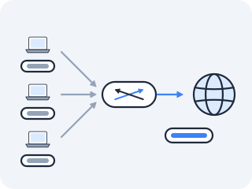
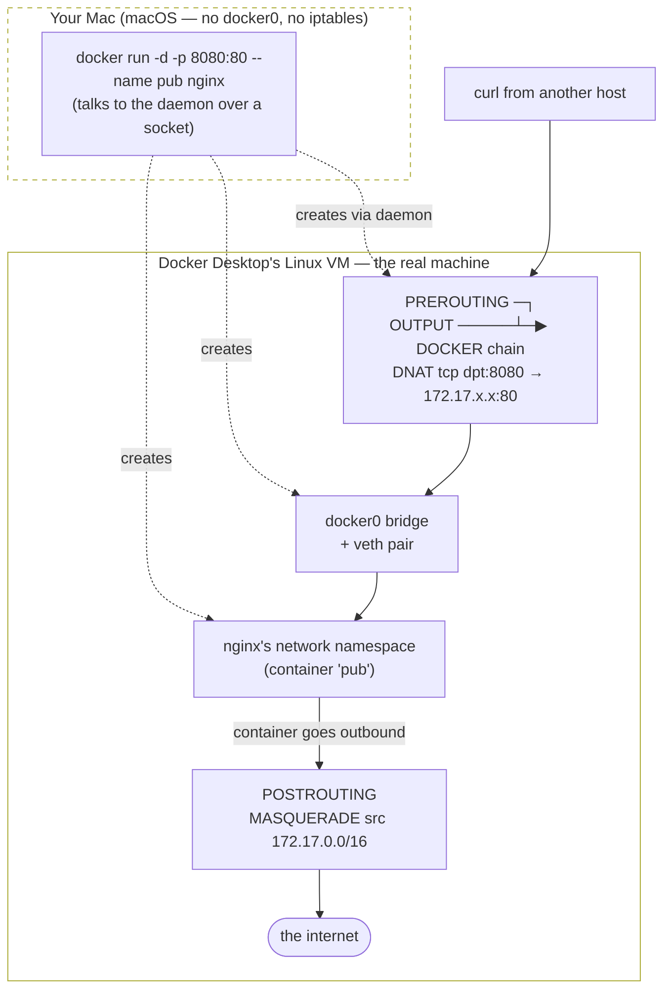

# Publishing a port

**The wall** — You left a packet dying on the wire. `ns1` sends, the host forwards, the packet appears on `eth0` carrying `src=10.20.0.2`, and Cloudflare's reply goes to an address that exists on no network anywhere. You know the hook where a packet is last touched before it leaves — POSTROUTING, after the routing decision — and you know the name of the table whose job is rewriting addresses. Everything is in place except the edit itself.



This lesson makes that edit, twice, in opposite directions. Outbound so a private address can reach the internet, and inbound so a knock at this host's door lands inside a namespace. The second one is `docker run -p 8080:80`, and by the end you will have written it by hand — including a hole in it that Docker patched years ago and that you will find yourself, the hard way, before you are told it exists.

### NAT — sharing one address across many private ones

**The problem that made this necessary** — Here is the puzzle in its general form, because it is much older than containers. A house has forty devices and one address from its ISP. An office has two thousand machines and a handful. Your host has `172.17.0.2` and a namespace with `10.20.0.2`. In every case the inside addresses are **private** — reusable by anybody, routable by nobody — and the outside address is the only one the internet will deliver to. So somebody in the middle has to *lie on the inside's behalf*: rewrite the source so replies come back to an address that exists, then quietly undo the lie on the way back. That is **NAT** (Network Address Translation), and it is the single most consequential hack in the history of IP — the reason the internet did not run out of addresses in 1996 and the reason so much of it now assumes it is behind something.


**What it actually is** — Two directions, and the hooks are forced on you rather than chosen. Read them against the diagram you drew last lesson:

- **SNAT (Source NAT)** rewrites the **source** address on the way out, at **POSTROUTING**. The routing decision has already picked a path; changing the source cannot change it. So this edit is safe to do last, and last is where it happens.
- **DNAT (Destination NAT)** rewrites the **destination** on the way in, at **PREROUTING**. This one *must* come first, because the routing decision is about to be made using the destination, and the whole point is to make that decision about a different address than the one on the packet.

**MASQUERADE** is SNAT with the address left blank: instead of naming `172.17.0.2` in the rule, it says *use whatever address the outgoing interface has right now.* Which sounds like a convenience and is actually the reason it is the rule everybody uses; the *Check yourself* below asks you to name the case where the difference bites.

**Draw it** — the same five hooks, with the two edits placed where they are forced to go:

<!-- figure -->

```
   packet in                                                     packet out
       │                                                              ▲
       ▼                                                              │
 ┌────────────┐      ┌──────────┐                        ┌─────────────┐
 │ PREROUTING │ ───▶ │ routing  │                        │ POSTROUTING │
 │   DNAT     │      │ decision │                        │    SNAT     │
 │ dst ← new  │      └────┬─────┘                        │ src ← new   │
 └────────────┘           │                              └─────────────┘
       ▲                  │                                     ▲
       │                  ▼                                     │
  "rewrite it BEFORE  the fork uses the             "the path is already
   the fork looks     destination we just            chosen; the source
   at the address"    rewrote"                        never affected it"

  DNAT before the routing decision, SNAT after it. Swap them and each
  breaks: DNAT after the fork sends the packet to a path chosen for an
  address it no longer has, and SNAT before the fork changes a field the
  fork was never reading anyway.
```

**The experiment** — Rebuild last lesson's gateway: the same clean container, the same build, plus the default route you added to `ns1`. Still no `--network host`:

```bash
docker run --rm -it --privileged --name gw nicolaka/netshoot
```

```bash
ip netns add ns1
ip link add br0 type bridge
ip addr add 10.20.0.1/24 dev br0
ip link set br0 up
ip link add veth-a type veth peer name veth-a-c
ip link set veth-a master br0
ip link set veth-a up
ip link set veth-a-c netns ns1
ip netns exec ns1 ip addr add 10.20.0.2/24 dev veth-a-c
ip netns exec ns1 ip link set veth-a-c up
ip netns exec ns1 ip link set lo up
ip netns exec ns1 ip route add default via 10.20.0.1
ip netns exec ns1 ping -c1 -W2 1.1.1.1 ; echo "exit=$?"
```

Confirm you are back where you were — `100% packet loss`, `exit=1`. The silence you now understand.

> **Predict first —** one rule is coming. It matches source `10.20.0.0/24` going out of `eth0`, and its target is `MASQUERADE`. Before you run it: the reply from `1.1.1.1` will arrive addressed to this host's `eth0` address, which is also the address of every *other* thing this host does. **How will the kernel know that particular reply belongs to `ns1` and not to a process on this box?** Name the thing that has to remember.

```bash
iptables -t nat -A POSTROUTING -s 10.20.0.0/24 -o eth0 -j MASQUERADE
ip netns exec ns1 ping -c2 -W2 1.1.1.1
```

```
64 bytes from 1.1.1.1: icmp_seq=1 ttl=62 time=11.7 ms
64 bytes from 1.1.1.1: icmp_seq=2 ttl=62 time=13.1 ms
2 packets transmitted, 2 received, 0% packet loss
```

**One line.** A namespace that has failed to reach the internet three times, in three different ways, now does it in about twelve milliseconds. Prove it is more than ping, and check the rule's own counter while you are there:

```bash
ip netns exec ns1 curl -s -o /dev/null -m 8 -w 'from ns1: %{http_code}\n' http://example.com
iptables -t nat -L POSTROUTING -n -v
```

```
from ns1: 200
```

```
Chain POSTROUTING (policy ACCEPT 0 packets, 0 bytes)
 pkts bytes target     prot opt in     out     source               destination
    3   224 MASQUERADE  all  --  *      eth0    10.20.0.0/24         0.0.0.0/0
```

DNS resolved, TCP connected, TLS-free HTTP came back with a 200 — from a namespace whose address the internet cannot route to. And the counter on your one rule is the receipt.

### Where the lie is written down

Answer the prediction now, by reading the thing that remembers. You met this table an act ago and read it as a NAT ledger without having any NAT to look at:

```bash
conntrack -L 2>/dev/null | grep 10.20.0.2
```

```
icmp     1 29 src=10.20.0.2 dst=1.1.1.1 type=8 code=0 id=21 src=1.1.1.1 dst=172.17.0.2 type=0 code=0 id=21 mark=0 use=1
tcp      6 59 CLOSE_WAIT src=10.20.0.2 dst=104.20.23.154 sport=52700 dport=80 src=104.20.23.154 dst=172.17.0.2 sport=80 dport=52700 [ASSURED] mark=0 use=1
```

(Your ports will differ, the TTL counts down as you watch, and the TCP row's state depends on how long ago the `curl` finished — Act III's state machine, still running. The addresses are the part that matters.)

**Read the two halves of one of those rows, because the disagreement between them *is* the translation.** Take the TCP row. The first tuple is what `ns1` believes: `src=10.20.0.2 → dst=104.20.23.154:80`. The second is the reply the kernel expects to see coming back: `src=104.20.23.154:80 → dst=172.17.0.2`. Not `10.20.0.2`. **`172.17.0.2`** — this host's own `eth0` address, the one MASQUERADE substituted on the way out.

That is the entire mechanism, and it is a row in a table. On the way out, POSTROUTING swaps the source and conntrack writes the pair down. On the way back, a packet arrives for `172.17.0.2:58160`, the kernel finds the row whose reply tuple matches, and rewrites the destination back to `10.20.0.2:58160` before the routing decision sends it down the bridge. `ns1` never sees any of it. Ask `ns1` what its address is and it will tell you `10.20.0.2`, and it will be right about its own interface and wrong about every packet it has ever sent.

This is Act III's promissory note paid in full. That lesson had you find a conntrack row, point at the field where the two tuples disagree, and call it the NAT mapping — and its *Check yourself* asked about a row whose tuples were an exact mirror, with no translation at all, and answered that the kernel tracks it anyway. Now you have both kinds in front of you and can see why one table serves both purposes.

> **Check yourself —** you wrote `MASQUERADE`, not `SNAT --to-source 172.17.0.2`, and both would have worked just now. Name a situation where the second one silently stops working and the first one keeps going.

<details>
<summary>Answer</summary>

Any time the outgoing address changes without the ruleset changing — which is most real networks. A DHCP lease renewing onto a different address, a laptop moving between networks, a cloud instance replaced behind the same rule, a failover onto a second uplink. `SNAT --to-source` names an address at the moment you write the rule, which is the moment of least information; `MASQUERADE` asks the outgoing interface at the moment each packet leaves. The cost is that asking is not free — it is a lookup per connection rather than a constant — which is exactly why explicit `SNAT` still exists and why you would choose it on a machine whose address genuinely never changes.

</details>

> **You understand this when you can** trace a packet from `ns1` to the internet and back, naming the hook where the source is rewritten, the hook where the reply's destination is restored, and the row that connects them — and explain why the reply tuple contains an address `ns1` has never heard of.

### Now the other direction: a knock from outside

Outbound works. But a namespace nobody can dial is half a machine, and the inbound direction is a genuinely harder problem than it looks. Nothing outside this host knows `10.20.0.2` exists. There is no address anyone can type that reaches it. The only address the outside world can reach is the host's own — so a caller has to dial *the host*, and the host has to send the connection somewhere else.

Put something in `ns1` worth dialling:

```bash
ip netns exec ns1 python3 -m http.server 80 --bind 0.0.0.0 >/tmp/ns1.log 2>&1 &
sleep 1
ip netns exec ns1 curl -s -o /dev/null -w 'from inside ns1: %{http_code}\n' http://10.20.0.2
```

```
from inside ns1: 200
```

It serves, and right now exactly one machine on earth can reach it. Get this container's own address, which is the one an outsider would dial. Run this in **your normal terminal**, not in the container — `docker inspect` talks to the daemon over a socket, as [the Docker networks lesson](02b-docker-networks.md) established, so it needs no namespace of its own:

```bash
docker inspect -f '{{range .NetworkSettings.Networks}}{{.IPAddress}}{{end}}' gw
```

Call that `$GW` — it will be something like `172.17.0.2`. Confirm the door is shut before you open it, from a throwaway container standing in for "somewhere else on the network":

```bash
docker run --rm nicolaka/netshoot \
  curl -s -o /dev/null -m 4 -w 'outside -> :8080 = %{http_code}\n' http://<GW>:8080 ; echo "exit=$?"
```

```
outside -> :8080 = 000
exit=7
```

Nothing is listening on 8080 on this host, so the connection is refused instantly — `000` means `curl` never got a response code at all. Now the rule, back in the `gw` container:

> **Predict first —** the rule rewrites the destination of anything arriving for port 8080 to `10.20.0.2:80`. After it exists, **two** dials will happen: one from the outside container, and one from `gw`'s own shell to its own address. Predict both. If you think they behave the same, say so and commit to it.

```bash
iptables -t nat -A PREROUTING -p tcp --dport 8080 -j DNAT --to-destination 10.20.0.2:80
```

From the outside container:

```bash
docker run --rm nicolaka/netshoot \
  curl -s -o /dev/null -m 4 -w 'outside -> :8080 = %{http_code}\n' http://<GW>:8080
```

```
outside -> :8080 = 200
```

**A port is published.** A caller who has never heard of `10.20.0.2` dialled this host on 8080 and was served by a process in a namespace. One rule, one hook — and do not take the return trip on faith, because you have a way to read it. Go and find this flow's row:

```bash
conntrack -L 2>/dev/null | grep 8080
```

```
tcp 6 113 TIME_WAIT src=172.17.0.3 dst=172.17.0.2 sport=37338 dport=8080 src=10.20.0.2 dst=172.17.0.3 sport=80 dport=37338 [ASSURED]
```

**Read the two tuples again, and notice the disagreement has moved.** In the MASQUERADE row it was the reply tuple's *destination* that had been swapped. Here the caller's tuple is what it actually sent — `dst=172.17.0.2 dport=8080`, the address and port it dialled — and the reply the kernel expects is `src=10.20.0.2 sport=80`: an address the caller has never heard of, on a different port. So when `ns1`'s answer comes back from `10.20.0.2:80`, the kernel finds this row and rewrites the source to `172.17.0.2:8080` before it goes out, and the caller receives a reply from exactly the socket it dialled.

Same table, same two-tuple trick, opposite field. **DNAT and SNAT are one mechanism seen from two ends**, and the row is where they meet.

Now the second dial, from `gw`'s own shell:

```bash
curl -s -o /dev/null -m 4 -w 'from gw itself -> :8080 = %{http_code}\n' http://<GW>:8080 ; echo "exit=$?"
```

```
from gw itself -> :8080 = 000
exit=7
```

**Refused, instantly, on the same machine that just served an outsider.** Not a timeout — `exit=7` is `Couldn't connect`, the kernel refusing on the spot. And the reason is on your diagram, in the position of the rule you wrote. `PREROUTING` is the hook for packets that **arrived on an interface**. This packet did not arrive; it was *born here*, in a local process, and a locally-generated packet's first hook is `OUTPUT`. It never went anywhere near your rule.

Read the counters and watch that be true rather than take it on faith:

```bash
iptables -t nat -L -n -v
```

The `PREROUTING` rule shows the outsider's packets. Nothing else in the table has counted anything, because there is nothing else in the table. So write the missing half:

```bash
iptables -t nat -A OUTPUT -p tcp --dport 8080 -j DNAT --to-destination 10.20.0.2:80
curl -s -o /dev/null -m 4 -w 'from gw itself -> :8080 = %{http_code}\n' http://<GW>:8080
```

```
from gw itself -> :8080 = 200
```

**Two rules, identical except for the chain, because "a packet for port 8080" is two different events depending on where it was born.** This is the first genuinely load-bearing consequence of the fork in last lesson's diagram: the routing decision splits the world into arrived-here and born-here, and any rule that wants to catch both has to be written twice.

Hold on to the shape of that, because it is about to explain a thing that looks like nonsense. And do not go looking for the last gap yet:

```bash
curl -s -o /dev/null -m 4 -w 'from gw, via localhost = %{http_code}\n' http://127.0.0.1:8080 ; echo "exit=$?"
```

```
exit=28
```

That one still times out, and it will keep timing out no matter which of the five hooks you add a rule to. It is not the same problem as the one you just fixed, and it has a name and a whole section in [When NAT runs out](03d-when-nat-runs-out.md). Notice it, write it down, leave it.

### The recognition — you just wrote `-p 8080:80`

Everything above was built by hand for one reason: so that when you meet it pre-assembled you *recognise* it instead of trusting it. Publish a port with Docker, from your **normal terminal**:

```bash
docker run -d -p 8080:80 --name pub nginx
```

> **Predict first —** which of the pieces you have built by hand — namespace, veth, bridge, MASQUERADE, DNAT — did that one command create? And you wrote your DNAT into *two* chains. How many will Docker's be in?

```bash
docker run --rm --privileged --network host nicolaka/netshoot sh -c '
  ip link show docker0
  ls /sys/class/net/docker0/brif/
  iptables -t nat -L DOCKER -n -v'
```

Three things, and none of them new to you. `docker0` is a bridge — lesson 02's object, made for you. The entry under `brif/` is the host-side end of a veth pair whose far end is inside nginx's namespace. And the third:

```
Chain DOCKER (2 references)
 pkts bytes target     prot opt in     out     source               destination
    0     0 DNAT       tcp  --  *      !docker0  0.0.0.0/0            0.0.0.0/0            tcp dpt:8080 to:172.17.0.2:80
```

**`(2 references)`.** You know what those two are, because you wrote them: `PREROUTING` for packets that arrive, `OUTPUT` for packets born here. Docker did not find a cleverer way — it hit the same fork you hit, needed the same rule twice, and rather than duplicating the rule it put the rule in a *named* chain and jumped to that chain from both hooks. That is what the reference count counts. Confirm it:

```bash
docker run --rm --privileged --network host nicolaka/netshoot \
  sh -c 'iptables -t nat -S | grep DOCKER'
```

```
-N DOCKER
-A PREROUTING -m addrtype --dst-type LOCAL -j DOCKER
-A OUTPUT -m addrtype --dst-type LOCAL -j DOCKER
```

(`-m <name>` loads an extra match module, which is how `iptables` grows matches beyond the built-in address/port/protocol set. You can ignore this particular one: `--dst-type LOCAL` narrows the jump to packets addressed to one of this machine's *own* addresses, so Docker's chain is not consulted for transit traffic.)

There is the whole answer to a question the last lesson told you to sit with. `DOCKER` is not a sixth hook and never could be; it is a list of rules, hanging off two of the five, in the `nat` table, doing the job you did by hand ten minutes ago. `-p 8080:80` is not a feature. **It is that `DNAT` line, written by a program instead of by you.**



**Tear it down:**

```bash
docker rm -f pub
```

…and `exit` the `gw` container, which takes the namespace, the bridge, the cable and both of your NAT rules with it.

> **You understand this when you can** publish a port from a namespace with two `iptables` lines from memory, say why one line is not enough, and explain what `(2 references)` on Docker's `nat` chain is counting.

> **On your own machine —** every `docker run` on your Mac performs this whole act for you, one layer down in a Linux VM. Prove the DNAT with a `curl` and see where macOS hides the machinery, in [Act IV in the wild](in-the-wild.md#publishing-a-port-is-a-dnat-rule).

**Kubernetes sees this as** — A Service is this, generalised in the one direction that makes it hard. You DNAT'd a port to *one* address you typed in by hand. Now make the target a set that changes without warning, on machines you did not pick, and make the address you dial not exist on any interface anywhere. Every mechanism in that sentence is on this page; the only thing missing is a program to rewrite the rules as the set changes. Act V is that program.

**Where you are now** — You can build a NAT gateway from nothing: a bridge, a namespace, a default route, one `MASQUERADE` line outbound and one `DNAT` line inbound — and you can read the conntrack row that makes the return trip possible, pointing at the exact field where the kernel's two tuples disagree. You know why the inbound rule has to be written twice, and you can look at `docker run -p` and name the kernel object behind the flag.

Which means you can now read Docker's `nat` table as a colleague's work rather than as magic — and that is worth doing, because you have only looked at one chain of it. Go and look at the rest and it stops being two tidy rules: there is a whole tree in there, six `MASQUERADE` lines where you wrote one, and rules on a hook you have not touched at all. Somewhere in that tree is a firewall you did not write, protecting — or not protecting — the port you just published. **You have a published port and no idea who is allowed to reach it.**

---

← Prev: **[iptables and NAT](03-iptables-and-nat.md)** · ↑ **[Act IV overview](README.md)** · Next: **[Reading a ruleset you did not write](03b-reading-a-ruleset-you-did-not-write.md)** →
