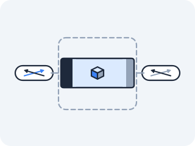

# Overlay and VXLAN

The bridge connected containers on one machine. But the Pod on this node and the Pod on that node are on two different bridges, separated by a physical network that has never heard of their addresses. To join them, we're going to do something that sounds absurd until you see it: put a packet inside another packet.



### Overlay networking — a packet inside a packet

**The problem that made this necessary** — Same-node containers talk through the bridge, at Layer 2, for free. But give a Pod the address `10.244.1.5` and ask it to reach `10.244.2.7` on another node, and the physical network just shrugs: `10.244.x.x` is the cluster's private pod CIDR, and the switches and routers between the two nodes have no routes for it and no idea such addresses exist. The Pod-to-Pod packet is unroutable the moment it leaves the node. You could try to teach the entire physical network about every Pod IP (some setups do — hold that thought), but a simpler, more portable answer is to *hide* the Pod packet from the physical network entirely: wrap it inside a normal packet addressed to the real nodes, which the physical network already knows how to route.

**What it actually is** — An overlay network carries Pod packets by **encapsulation**. The original Pod-to-Pod packet — source `10.244.1.5`, destination `10.244.2.7` — becomes the *inner* packet. The kernel wraps it inside an *outer* UDP packet whose source and destination are the **real node IPs** (`192.168.1.10 → 192.168.1.11`). The physical network sees only the outer packet, addressed to a real node it knows how to reach, and routes it normally. When it arrives, the receiving node strips off the outer UDP wrapper, recovers the inner Pod packet intact, and hands it to the right Pod. The most common form is **VXLAN** (Virtual Extensible LAN), whose registered port is **UDP 4789**. (Flannel, for historical reasons, runs its VXLAN on **8472** instead. The port is a knob; the wrapping is the mechanism.)

**Draw it** — the packet-in-packet, encapsulated then decapsulated:

<!-- figure: vxlan-encap -->

```
  NODE A (192.168.1.10)                              NODE B (192.168.1.11)
  Pod 10.244.1.5                                     Pod 10.244.2.7
        │                                                  ▲
        │ inner packet                                     │ inner packet
        ▼ [src 10.244.1.5 → dst 10.244.2.7]                │ delivered
   ┌─────────────────── ENCAPSULATE ──────────────┐        │
   │  ┌─────────── outer UDP packet ───────────┐   │   ┌── DECAPSULATE ──┐
   │  │ src 192.168.1.10 → dst 192.168.1.11    │   │   │ strip outer UDP │
   │  │ UDP dport 4789 (VXLAN)                 │   │   │ recover inner   │
   │  │ ┌── VXLAN hdr ──┐                       │   │   └─────────────────┘
   │  │ │ [inner packet:                ]       │   │           ▲
   │  │ │ [10.244.1.5 → 10.244.2.7      ]       │   │           │
   │  │ └───────────────────────────────┘      │   │           │
   │  └─────────────────────────────────────────┘  │           │
   └─────────────────┬───────────────────────────┘             │
                     │ physical network routes the OUTER packet │
                     └──────────────────────────────────────────┘
            (the network sees only 192.168.1.10 → 192.168.1.11)
```

The byte cost of the wrapping: **20 bytes outer IP + 8 bytes UDP + 8 bytes VXLAN header + 14 bytes inner Ethernet = 50 bytes** added to every single packet, plus the work of wrapping and unwrapping on both ends. Keep that number in mind rather than filed away — you are about to watch the kernel spend it, and then watch what happens to somebody who forgets it.

**The file** — VXLAN traffic is just UDP, so you watch it the same way you'd watch any UDP: by sniffing the interface the *outer* packet rides on.

```
tcpdump -ni <underlay> udp port 4789    the outer VXLAN packets (Flannel: 8472)
/sys/class/net/vxlan0/mtu               the tunnel device's own MTU
```

**The experiment** — You have no second machine, and you don't need one. A "node" in this story is just a network stack with an address the other side can reach — and you can make two of those on one kernel, which is the whole point of this act. So build a real VXLAN tunnel by hand, between two namespaces, on one host.

First the **underlay**: two namespaces joined by a plain veth pair, exactly as in [veth and bridge](02-veth-and-bridge.md). These two addresses stand in for the node IPs; this cable stands in for the physical network.

```bash
ip netns add vx1
ip netns add vx2
ip link add vu1 type veth peer name vu2
ip link set vu1 netns vx1
ip link set vu2 netns vx2
ip netns exec vx1 ip addr add 172.31.0.1/24 dev vu1
ip netns exec vx2 ip addr add 172.31.0.2/24 dev vu2
ip netns exec vx1 ip link set vu1 up
ip netns exec vx2 ip link set vu2 up
ip netns exec vx1 ping -c1 172.31.0.2        # the underlay works
```

Now the **overlay**. Each side gets a `vxlan` device: a VNI (`id 42` — the tunnel's identifier, so several overlays can share one wire), the peer's underlay address as `remote`, the VXLAN port, and the underlay interface to ride on. Then give each `vxlan0` an address from a subnet the underlay has never heard of.

> **Predict first —** `10.200.0.0/24` appears in no routing table on this host, and the veth underneath knows nothing about it. Will `ping 10.200.0.2` work? And if it does, what will the underlay veth actually be carrying — ICMP, or something else?

```bash
ip netns exec vx1 ip link add vxlan0 type vxlan id 42 local 172.31.0.1 remote 172.31.0.2 dstport 4789 dev vu1
ip netns exec vx1 ip addr add 10.200.0.1/24 dev vxlan0
ip netns exec vx1 ip link set vxlan0 up
ip netns exec vx2 ip link add vxlan0 type vxlan id 42 local 172.31.0.2 remote 172.31.0.1 dstport 4789 dev vu2
ip netns exec vx2 ip addr add 10.200.0.2/24 dev vxlan0
ip netns exec vx2 ip link set vxlan0 up
ip netns exec vx1 ping -c3 10.200.0.2
```

The ping replies. Two namespaces that share no cable in the `10.200.0.0/24` sense now behave as if they were on one wire, and the only thing between them is a veth that has never heard of those addresses.

<!-- figure -->

```
     ONE HOST, ONE KERNEL — two namespaces playing the part of two nodes

  netns vx1                                          netns vx2
 ┌──────────────────────────┐                ┌──────────────────────────┐
 │ vxlan0  10.200.0.1/24    │  the OVERLAY   │ vxlan0  10.200.0.2/24    │
 │   ▲  id 42, dport 4789   │ ─ ─ ─ ─ ─ ─ ─ ─│   ▲  id 42, dport 4789   │
 │   │  encap / decap       │                │   │  decap / encap       │
 │   ▼                      │                │   ▼                      │
 │ vu1  172.31.0.1/24  ●════╪════════════════╪════●  172.31.0.2/24  vu2 │
 └──────────────────────────┘  the UNDERLAY  └──────────────────────────┘
                            (a plain veth pair)

  ping 10.200.0.2 → vxlan0 wraps it → UDP 172.31.0.1 → 172.31.0.2:4789
                  → vu1 → vu2 → vxlan0 unwraps → 10.200.0.2 replies
```

**Watch the wrapper** — Sniff the underlay while the overlay is in use. Start the capture in the background, then generate traffic:

```bash
ip netns exec vx2 tcpdump -ni vu2 -c 4 udp port 4789 &
sleep 1
ip netns exec vx1 ping -c 2 10.200.0.2
```

Each captured packet prints as two lines — the outer packet and, indented beneath it, the inner one `tcpdump` recovered from inside it:

```
IP 172.31.0.1.<port> > 172.31.0.2.4789: VXLAN, flags [I] (0x08), vni 42
IP 10.200.0.1 > 10.200.0.2: ICMP echo request, id 9, seq 1, length 64
```

Sit with what that shows. The wire is carrying **UDP**, from one underlay address to another, and nobody asked for UDP — the ping was ICMP. The ICMP is *cargo*: bytes in a payload, addressed to a subnet the wire cannot route, riding inside a packet the wire can. Filter the same capture for `host 10.200.0.2` and you match nothing at all, because a filter reads headers, and those addresses are not in a header any more.

**Now the tax comes due** — The 50 bytes above are not an anecdote. Ask the kernel what it did with them:

> **Predict first —** the veth underneath is a normal 1500-byte interface. What MTU did the kernel give `vxlan0` when you created it on top of that veth, and why that number?

```bash
ip netns exec vx1 ip -d link show vxlan0
```

`mtu 1450`. You never asked for that. The kernel subtracted the wrapper's cost from the wire beneath and handed you an interface that is *deliberately smaller than the cable it rides on* — 1500 minus the outer IP (20), UDP (8) and VXLAN (8) headers and the inner Ethernet header (14). Those are the 50 bytes from the paragraph above, and 1450 is what is left. The tax is not a metaphor; it is a number, and the kernel already paid it on your behalf.

Which is fine until one link in the path is smaller than you believe. That happens constantly in real networks: a VPN, a cloud interconnect, one switch port set wrong. Take the far end of the underlay down to 1400 — and note that nothing tells the sending side:

```bash
ip netns exec vx2 ip link set vu2 mtu 1400
ip netns exec vx1 ping -c2 10.200.0.2                 # small: fine
ip netns exec vx1 ping -c2 -W2 -s 1400 10.200.0.2     # large: silence
```

Small pings reply as though nothing is wrong. The 1400-byte one gets nothing: no reply, no `unreachable`, no `message too long`, 100% loss and no error to grep for. This is the black hole [Act II promised Act IV would spring on you](../act-2-two-machines/03b-mtu-and-fragmentation.md), and here it is, sprung. The mechanism is now fully visible to you: `vx1` still believes the path is 1500 wide, so it does not fragment and has nothing to complain about; it wraps your 1428-byte inner packet into a 1492-byte frame and puts it on the wire. The far end accepts nothing over its own MTU and drops the frame before it is ever a packet — at the link layer, where nothing generates an ICMP error. The count of that silence is readable:

```bash
ip netns exec vx2 ip -s link show vu2      # the RX dropped counter climbs with each large ping
```

Now fix it the way every cluster network plugin does — not by touching the underlay, which in real life is not yours to touch, but by shrinking the *inner* interface until the wrapped frame fits the smallest link in the path. 1400 minus the 50-byte tax is 1350:

```bash
ip netns exec vx1 ip link set vxlan0 mtu 1350
ip netns exec vx2 ip link set vxlan0 mtu 1350
ip netns exec vx1 ping -c2 -s 1400 10.200.0.2         # replies again
```

The large ping comes back. Nothing about the underlay changed; the sender stopped handing the tunnel packets it could not wrap and still fit. The fix always has this shape: **inner MTU = smallest MTU on the path − encapsulation overhead**. Get it wrong and you do not get an error, you get a service that works for small responses and hangs for big ones.

> **Check yourself —** A cluster's nodes all have a 1500-byte MTU. You enable a VXLAN overlay and leave the Pod MTU at 1500. Which traffic works and which hangs — and why will the first three teams to look at it be convinced it is an application bug?

<details>
<summary>Answer</summary>

Everything small works: the TCP handshake, DNS lookups, health checks, `curl` of a small page, a Service that answers `200` on `/healthz`. Anything that fills a full packet — a large response body, a file upload, a big query result — hangs and eventually times out, because the wrapped frame exceeds the node's link and dies without an error. It reads as an application bug because the failure is *size-dependent and endpoint-independent*: the connection establishes fine, the logs show the request received and the response written, and it reproduces only on the responses big enough to matter. Nothing in either application is wrong. The fix is one number on an interface: set the Pod MTU below the node MTU by the overhead.

</details>

**Tear it down** — both vxlan devices and both veth ends live inside those namespaces, so deleting the namespaces removes everything you built:

```bash
ip netns del vx1
ip netns del vx2
ip netns list        # empty
```

> **You understand this when you can** build a working VXLAN tunnel between two namespaces from memory, point at a `udp port 4789` packet in `tcpdump` and say which addresses are the wire's and which are cargo, state why the kernel gave the tunnel a 1450-byte MTU on a 1500-byte wire, and — given "small requests fine, large ones hang" — name the number you would change and in which direction.

**When you have a cluster (Act V) —** The same capture, on a real node running Flannel, needs one change: Flannel's VXLAN uses port 8472, so sniff `udp port 8472` on the node's uplink while Pods on two different nodes talk to each other. You will see the same thing you just saw — a stream of UDP between *node* addresses that no application asked for, carrying Pod-to-Pod traffic as payload. One difference is worth predicting in advance: the inner packet may be application-encrypted (TLS), so you can see *that* two Pods are talking and *which nodes* carry it, without reading a word of it. The overlay is fully visible; its cargo need not be.

**Kubernetes sees this as** — Flannel is the tunnel you just built, run for you on every node, with the VNI and the remote addresses filled in from the cluster's own records instead of typed by hand. If that were the end of the story, this lesson would be the last one.

But you have now *felt* what the wrapping costs: 50 bytes off every packet, encap and decap work on both ends, and an MTU trap waiting for whoever forgets the arithmetic. So carry two questions into Act V. First: back in [Act II](../act-2-two-machines/02b-routing-and-bgp.md) you watched routers teach each other routes for prefixes they don't own — so why not just *teach the physical network* the Pod routes and pay no tax at all? What would you need from the network to do that, and what would it cost you politically rather than technically? Second: encapsulation is code the kernel runs on every packet, and so is the rule-walk through the five hooks in [iptables and NAT](03-iptables-and-nat.md). If that code could be replaced with something faster, would any of this machinery still be the right answer?

The three plugins that wire real clusters split almost exactly along those two questions. Which one wires yours, and what it charges you for the choice, is a thing you should be able to argue about by the end of Act V rather than be told.

**Where you are now** — You can build an overlay network by hand: a tunnel device, a VNI, an underlay address pair, and an inner subnet that exists nowhere on the wire. You can prove the encapsulation with a capture and read the outer and inner headers apart. You can compute an overlay's MTU, reproduce the black hole it causes when the arithmetic is wrong, and fix it on the correct interface.

That completes the substrate. Namespace, cgroup, veth, bridge, NAT, tunnel — six primitives, and every one of them is a thing you have now made yourself, on one host, with `ip` and `iptables`. Which is exactly where the method runs out. A cluster runs thousands of these, appearing and vanishing every second across hundreds of machines, and each one needs a namespace created, a veth wired, an address allocated from a pool nobody else may use, a route installed, and every bit of it torn down again when the workload dies. Nobody types that. So *who does* — and how does whoever it is know what "correct" looks like at any given moment?

---

← Prev: **[The transparent proxy](03e-the-transparent-proxy.md)** · ↑ **[Act IV overview](README.md)** · Next: **[Who does this for you](05-who-does-this-for-you.md)** →
