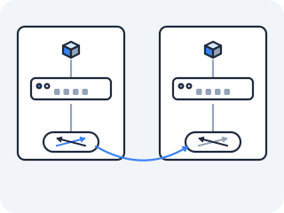

# CNI — the veth-pair installer

At the end of Act IV you asked the question that this file answers: we can wire up namespaces on one host by hand, so who does it automatically, every time a Pod is born, across hundreds of machines? Act IV also gave you its own answer in one line — *"this is precisely, line for line, what a CNI plugin does when a Pod is scheduled"* — and left you to check it.

Checking it is this lesson, and there is a specific claim on the table: that a CNI plugin runs the exact commands you typed, with no extra magic. If that is true, then the plugin's output must be visible in files you already know how to read — a veth, a bridge port, a route — and nothing else. Go look.



### Who wires up a Pod's network, every time one is born?

A Pod is a network namespace (you proved that two files ago), and a namespace with no wire reaches nothing (you proved that in Act IV). So at the instant kubelet creates a Pod, something must build the wire: create a veth pair, push one end into the Pod's namespace, assign an IP, bring the interfaces up, install the route.

You did every one of those steps with `ip` commands in Act IV. Doing them by hand once is instructive; doing them thousands of times a second is impossible. Kubernetes needed a standard, pluggable program it could invoke for exactly this, handed the Pod's namespace path, returning the configured interface. That standard is **CNI** — the Container Network Interface.

### So what is CNI, really?

CNI is a contract: kubelet runs a plugin *binary* (it lives on the node, often in `/opt/cni/bin/`), passing it the Pod's network namespace path and a JSON config, and the plugin sets up networking and prints back the result as JSON. What the plugin *does* on the local node is, line for line, your Act IV session:

```
ip link add veth0 type veth peer name eth0       create the cable
ip link set eth0 netns <pod-ns>                  push one end into the Pod
ip netns exec <pod-ns> ip addr add 10.244.1.7/24 dev eth0   assign the Pod IP (from node CIDR)
ip netns exec <pod-ns> ip link set eth0 up       bring it up
ip netns exec <pod-ns> ip route add default ...  add the Pod's default route
ip link set veth0 up                             bring up the host end (often into a bridge)
```

The IP comes from the node's allocated slice of the cluster's pod CIDR (this is **IPAM** — IP address management — another CNI sub-job), instead of a number you picked. The one cosmetic difference from your Act IV session is the naming: the plugin calls the Pod-side end `eth0` — the conventional primary-interface name a Pod expects to find — rather than the `veth1` you used by hand. The plugin is a binary kubelet invokes; you were the binary in Act IV. Same object, same commands, different hand on the keyboard — so the claim holds, and the CNI "contract" turns out to be nothing more than *kubelet hands over a namespace path and a JSON config; the plugin hands back a configured interface.*

### Where do the plugins actually differ, then?

Act IV's overlay lesson refused to hand you the plugin landscape. It left you two questions instead: why pay the encapsulation tax at all, when you already watched routers teach each other routes for prefixes they don't own — and if the per-packet work is just kernel code, what happens when that code is replaced with something faster? It then said the plugins that wire real clusters split almost exactly along those two questions, and that you should be able to *argue* the choice rather than be told it.

This is where you settle it yourself. All three of the plugins you are about to meet implement the same CNI contract — the same binary interface, invoked at the same moment, doing the same four jobs. So the interesting question is not what they have in common. It is: *if the contract is identical, what is actually different, and which of Act IV's two questions is each one answering?*

Here is the part the marketing obscures: locally, nothing is. Every CNI plugin does the same veth dance you just read. They differ in how they solve the *hard* problem from the end of Act IV — making Pod IPs routable **across** nodes, where two bridges sit on two machines with a physical network in between that has never heard of Pod IPs. Three common answers, each something you already met:

**Flannel** uses **VXLAN** — the overlay from the last file of Act IV. It wraps each Pod-to-Pod packet bound for another node inside a UDP packet addressed node-to-node, ships it over the real network, and unwraps it on the far side. The underlay only ever sees ordinary node-to-node UDP; the Pod packet rides inside. It works anywhere, including networks you don't control, because the physical network never has to learn a single Pod route. The cost is per-packet overhead: every packet gets an extra header and an encapsulate/decapsulate step.

**Calico** uses **BGP** — real routing, no encapsulation. Each node runs a BGP speaker that advertises "I own Pod CIDR 10.244.1.0/24" to its peers, and the result is genuine kernel routes: a packet for `10.244.1.7` is routed natively to the right node, no wrapping, no extra header. Lower latency and overhead than VXLAN, and the packet on the wire is just the Pod packet. The cost is a requirement: the surrounding network (or a route reflector) must speak BGP and permit those Pod routes, which a locked-down cloud network may not.

**Cilium** uses **eBPF** — and it is the one that changes the local story too, for the reasons you worked out in [the Services lesson](03-services.md): you counted the rules kube-proxy writes, found the per-Service constant, and saw that the chain is a list walked in order and blind above L4. Cilium loads programs into the kernel that make the forwarding and policy decisions in the datapath directly, so the rules you counted are not there to count. For cross-node traffic it can use either encapsulation or native routing — that part is a configuration choice, not its identity. Its identity is the missing chains, and you can check that claim directly on a Cilium node:

```bash
iptables -t nat -L KUBE-SERVICES -n        # on a Cilium node: absent, or nearly empty
cilium service list                         # the same Services, as map entries instead
cilium monitor --type drop                  # why a packet died, from inside the datapath
```

If the `KUBE-SERVICES` chain is missing and `cilium service list` shows the Services anyway, you have found the whole point: the Service definition moved out of a rule table and into a map, so the linear walk has nothing to walk. Cluster-wide, the same shift is why Cilium ships **Hubble** — once the decisions live in programs, the flow record has to come from the programs too.

All three are answering the one Act IV question — *how do Pod IPs route across nodes?* — with the three tools you already have names for: an overlay, real routes, or kernel programs. Only the third also answers the *other* question, the one the rule count raised.

> **Check yourself —** Two Pods on the *same* node talk to each other. How much of the CNI's cross-node machinery — VXLAN, BGP, eBPF redirection — is involved?

<details>
<summary>Answer</summary>

None of it. Both veth pairs are plugged into the same `cni0` bridge, so the frame is forwarded at Layer 2 and never leaves the node — exactly the Act IV bridge, for free. The overlay or the BGP route only matters when there is no L2 path, which is why "which CNI?" is the *last* question you ask, not the first.

</details>

### What does that look like across two nodes?

<!-- figure: cni-cross-node -->

```
        NODE A                                      NODE B
  ┌────────────────────┐                      ┌────────────────────┐
  │ Pod 10.244.1.7      │                      │ Pod 10.244.2.3      │
  │   eth0 ●            │                      │            ● eth0   │
  │       veth│         │                      │       │veth         │
  │     ┌────┴┐ cni0    │                      │    cni0 ┌┴────┐     │
  │     │bridge│        │                      │         │bridge│    │
  │     └────┬┘         │                      │         └┬────┘     │
  │      nic ──────────┼── physical network ──┼────────── nic       │
  └────────────────────┘    (knows no Pod IPs) └────────────────────┘
        SAME-NODE: bridge forwards at L2 (free, Act IV)
        CROSS-NODE:  Flannel → wrap in VXLAN/UDP   |   Calico → BGP kernel route   |   Cilium → eBPF
```

### Where does the CNI's work show up?

On any node, the CNI's work shows up as routes:

```
ip route                                     one /32 (or subnet) per reachable Pod/node
ip route get 10.244.2.3                       which device + nexthop reaches this Pod
ls /opt/cni/bin/                              the plugin binaries kubelet invokes
ls /etc/cni/net.d/                            the CNI config kubelet hands the plugin
```

(These run inside a kind node, which doesn't ship `eza` — so unlike the lab-container lessons, there's no eza twin here. `eza /opt/cni/bin/` works only if you `apt-get install -y eza` on the node first.)

```
/sys/class/net/cni0/brif/                     the node's bridge — Pod veths plugged in (Act IV)
```

Run `ip route` on a node and you are reading the CNI plugin's output as a routing table: each entry pointing a Pod IP (or a Pod subnet on another node) at a veth, the bridge, or — for cross-node traffic — a tunnel device or a node nexthop. That table is the difference between the three plugins made visible: Flannel points cross-node Pod subnets at a `flannel.1` VXLAN device; Calico points them at the real node as a nexthop; Cilium may show little because the decision lives in eBPF.

### Can you see the cross-node strategy in the routes?

On a node, ask the kernel how it would reach a Pod on *this* node versus a Pod on *another* node, and watch the CNI's strategy fall out of the answer:

> **Predict first —** will the route to a Pod on THIS node and a Pod on ANOTHER node look the same — and if they differ, what about them will differ?

```bash
ip route get <local-pod-ip>      # a Pod scheduled here
ip route get <remote-pod-ip>     # a Pod on a different node
```

The surprise is the contrast. The local Pod resolves to `dev cali… / dev veth… / dev cni0` — a veth straight into the namespace, exactly the wire you built in Act IV. The remote Pod, on the same `ip route get`, comes back differently depending on the plugin: with Flannel it leaves via `dev flannel.1` (the VXLAN tunnel device — your packet is about to be wrapped, per the overlay file), with Calico it points at the remote node as a plain nexthop (`via 192.168.1.11` — a real route, no wrapping), and with Cilium it may show almost nothing because the forwarding decision lives in an eBPF program, not the routing table. One command, and the plugin's whole cross-node philosophy is visible in the difference between two lines.

> **You understand this when you can** look at `ip route` on a node and say which entry the CNI created for a local Pod versus a remote one, and explain that all three plugins do the identical veth setup locally and differ only in how they answer the cross-node routing question — overlay, BGP, or eBPF — which is the exact question Act IV ended on.

---

← Prev: **[Service shapes](04b-service-shapes.md)** · ↑ **[Act V overview](README.md)** · Next: **[Ingress — the front door](06-ingress.md)** →
