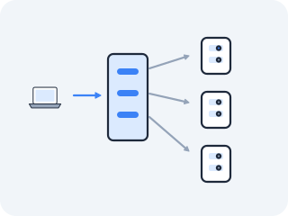
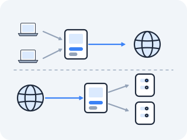

# Ingress — the front door

A ClusterIP lives only inside the cluster. NodePort and LoadBalancer punch a hole to the outside, but they are blunt: one IP (or one port) per Service, no understanding of hostnames, no understanding of URL paths, and no TLS unless you build it yourself. Real web traffic doesn't work that way. You have one public IP and dozens of sites and APIs behind it, told apart by `Host:` headers and paths, all on port 443, all encrypted. Ingress is the cluster's HTTP front door.



### Why not just give every site its own LoadBalancer?

Exposing every Service as its own LoadBalancer is wasteful and crude: each one burns a cloud load balancer and a public IP, and none of them can route on HTTP semantics. The web solved this decades ago with name-based virtual hosting and reverse proxies — one server on port 443 that reads the `Host:` header and the path and forwards to the right backend. Kubernetes needed that reverse proxy as a first-class, declarative object: state the routing rules, and have something implement them, terminate TLS at the edge, and forward plain HTTP to the right Service inside.

### So what is an Ingress, really?

**Ingress** is two things. First, the *Ingress resource*: a declarative routing table you write, mapping hostnames and paths to Services:



```
host api.example.com  path /v1  ─►  Service api-service:8080
host app.example.com  path /    ─►  Service app-service:80
```

Second, the *Ingress controller*: an actual reverse-proxy program (commonly nginx, Traefik, or HAProxy) running as Pods in the cluster, fronted by a single LoadBalancer Service. The controller watches Ingress resources via the API and programs its own routing config from them — it *is* a reverse proxy, configured by Kubernetes objects instead of an `nginx.conf` you edit.

It terminates TLS at the edge using certificates stored in Kubernetes **Secrets** (most often issued automatically by cert-manager talking to Let's Encrypt), reads the decrypted HTTP request, decides the backend from host and path, and forwards plain HTTP to the chosen ClusterIP — where, as always, kube-proxy's DNAT takes it the rest of the way to a Pod.

### What does the path look like?

<!-- figure: k8s-ingress-path -->

```
  client                                                            cluster
    │  HTTPS to api.example.com/v1                                     │
    ▼                                                                  │
  ┌───────────────┐                                                    │
  │ LoadBalancer  │  one public IP, port 443                           │
  │  (cloud)      │                                                    │
  └──────┬────────┘                                                    │
         ▼                                                             │
  ┌──────────────────── Ingress controller Pod (nginx/traefik) ──────────────┐
  │  ── TLS HANDSHAKE TERMINATES HERE ──   (holds private key + cert from a   │
  │     Act III handshake; decrypts the stream)                Secret)        │
  │  read Host: api.example.com,  path: /v1                                   │
  │  route decision  ──►  Service api-service:8080                            │
  └───────────────────────────────────┬──────────────────────────────────────┘
                                       │  plain HTTP (inside the cluster)
                                       ▼
                              ClusterIP 10.96.x.y:8080
                                       │  kube-proxy DNAT  (Services file)
                                       ▼
                              backend Pod 10.244.a.b:8080  →  read()
```

### Where does the TLS handshake actually happen?

**At the Ingress controller, and nowhere else by default — which is why "is it HTTPS end to end?" usually answers no.**

Everything you learned about TLS in Act III happens *here*, at the Ingress controller. The controller is the party that holds the private key and the certificate (loaded from a Kubernetes Secret), so the full handshake — ClientHello, certificate, key exchange, the lot — completes between the outside client and the controller Pod.

From that point inward, the traffic is usually **plain HTTP**: the controller forwards the decrypted request to the backend Service over the cluster's private network, which is assumed trusted. If you *do* want encryption all the way to the Pod, that is what a service mesh adds: mutual TLS (mTLS) on the controller-to-backend hop too, a second handshake inside the cluster. But the baseline is one handshake, at the door.

### Building the front door yourself

**This is the one lesson in Act V that needs something installed.** Every other lesson reads machinery a kind cluster already runs — kube-proxy, CoreDNS, a CNI. There is no ingress controller in a fresh cluster and no cloud load balancer behind it, so there is nothing to read until you supply both. Four steps: a controller, two backends, a certificate, and the routing table.

It also needs the cluster from [the lab lesson](01-lab-with-kind.md), whose config carries the two things a kind ingress controller requires: the `ingress-ready=true` label on the control-plane node (so the controller has somewhere to schedule) and host ports 80 and 443 mapped into it (so your Mac can reach it at all). If you built a plain cluster without them, delete it and recreate it with that config before going on.

**Step 1 — the controller.** ingress-nginx publishes a manifest built for kind specifically: it schedules onto the `ingress-ready` node and listens on the node's ports 80 and 443 rather than asking for a LoadBalancer that kind cannot provide.

```bash
kubectl apply -f https://raw.githubusercontent.com/kubernetes/ingress-nginx/main/deploy/static/provider/kind/deploy.yaml

kubectl wait --namespace ingress-nginx \
  --for=condition=ready pod \
  --selector=app.kubernetes.io/component=controller \
  --timeout=180s
```

Wait for that `kubectl wait` to return before continuing; the admission webhook the manifest installs will reject your Ingress if the controller is not up yet, and the error message does not say so clearly.

**Step 2 — two backends to tell apart.** Anything that answers with distinguishable text will do. `http-echo` answers every request with one fixed string, which is exactly what you want when the question under test is *which backend did I reach*:

```bash
kubectl apply -f - <<'EOF'
apiVersion: apps/v1
kind: Deployment
metadata:
  name: api
spec:
  selector:
    matchLabels: { app: api }
  template:
    metadata:
      labels: { app: api }
    spec:
      containers:
        - name: echo
          image: hashicorp/http-echo:0.2.3
          args: ["-text=api backend", "-listen=:5678"]
---
apiVersion: v1
kind: Service
metadata:
  name: api-service
spec:
  selector: { app: api }
  ports:
    - port: 8080
      targetPort: 5678
---
apiVersion: apps/v1
kind: Deployment
metadata:
  name: app
spec:
  selector:
    matchLabels: { app: app }
  template:
    metadata:
      labels: { app: app }
    spec:
      containers:
        - name: echo
          image: hashicorp/http-echo:0.2.3
          args: ["-text=app backend", "-listen=:5678"]
---
apiVersion: v1
kind: Service
metadata:
  name: app-service
spec:
  selector: { app: app }
  ports:
    - port: 80
      targetPort: 5678
EOF
```

Two Deployments, two Services — and note that they are ordinary ClusterIP Services, invisible from outside the cluster. Nothing you just created is reachable from your Mac.

**Step 3 — a certificate the controller can terminate with.** In Act III you learned that a certificate is a public key plus names plus a signature, and that a *self-signed* one is a certificate that vouches for itself — no chain, no authority. That is all you need here, because you are going to tell `curl` not to verify it:

```bash
openssl req -x509 -nodes -newkey rsa:2048 -days 365 \
  -keyout tls.key -out tls.crt \
  -subj "/CN=api.example.com" \
  -addext "subjectAltName=DNS:api.example.com,DNS:app.example.com"

kubectl create secret tls example-tls --cert=tls.crt --key=tls.key
kubectl get secret example-tls -o jsonpath='{.type}'      # kubernetes.io/tls
```

(If your `openssl` rejects `-addext` — some macOS builds do — drop that line. The `curl`s below pass `-k` and never check the names.) The Secret's type matters: `kubernetes.io/tls` is the type the controller looks for, and it expects exactly the two keys `tls.crt` and `tls.key`, which is why the filenames above are not arbitrary.

**Step 4 — the routing table.** Now the Ingress resource itself: two hosts, one path each, one TLS block naming the Secret.

```bash
kubectl apply -f - <<'EOF'
apiVersion: networking.k8s.io/v1
kind: Ingress
metadata:
  name: two-sites
spec:
  ingressClassName: nginx
  tls:
    - hosts:
        - api.example.com
        - app.example.com
      secretName: example-tls
  rules:
    - host: api.example.com
      http:
        paths:
          - path: /v1
            pathType: Prefix
            backend:
              service:
                name: api-service
                port:
                  number: 8080
    - host: app.example.com
      http:
        paths:
          - path: /
            pathType: Prefix
            backend:
              service:
                name: app-service
                port:
                  number: 80
EOF

kubectl get ingress two-sites            # the routing table you declared
kubectl describe ingress two-sites       # and the controller's own view of it
```

`kubectl get ingress` will show an `ADDRESS` of `localhost` and no external IP. That is correct and it is worth pausing on: on a real cloud cluster the controller sits behind a LoadBalancer Service with a public IP, and you would `curl` that IP. kind has no cloud provider to allocate one — a LoadBalancer Service here stays `<pending>` forever. What you have instead is the node's ports 80 and 443 mapped straight onto your Mac's, so the address of your cluster's front door is **`127.0.0.1`**.

### Can one IP really serve two different sites?

Send two requests to the *same* address, told apart only by their `Host:` header. `--resolve` pins both hostnames to `127.0.0.1` so DNS is out of the picture entirely — no `/etc/hosts` edit, no real domain:

> **Predict first —** same IP, same port 443, two different `Host:` headers — will they land on the same backend Service, or different ones?

```bash
curl -sk --resolve api.example.com:443:127.0.0.1 https://api.example.com/v1/
curl -sk --resolve app.example.com:443:127.0.0.1 https://app.example.com/
curl -sk --resolve nope.example.com:443:127.0.0.1 https://nope.example.com/ -o /dev/null -w '%{http_code}\n'
```

The first prints `api backend`, the second prints `app backend`, and the third prints `404`. Same destination IP, same port, same TLS endpoint — yet they reached different Pods. The surprise is that nothing about the *network* address chose the backend; the controller did, by reading a string in the decrypted HTTP request after the handshake had already completed. The 404 comes from the controller itself, which is the cleanest proof of all: routing here is an application-layer decision made inside one Pod, not a packet-layer one.

The `-k` is not incidental either. Drop it and `curl` refuses the connection with a certificate error — the Act III chain of trust, failing exactly as it should against a certificate that vouches for itself.

### Where can you watch the two hops differ?

The claim is that TLS stops at the controller. Test both hops:

```bash
openssl s_client -connect 127.0.0.1:443 -servername api.example.com </dev/null 2>/dev/null | head -20
```

The `-servername` flag is SNI (Act III): the hostname sent *in the clear*, in the ClientHello, before any encryption — which is how the controller knows which certificate to present before it can read any `Host:` header. The output shows a certificate with `subject=CN=api.example.com` and a verify error naming it self-signed. That is the Act III handshake, served by an nginx process in a Pod.

Now the inside hop, from an ordinary Pod:

```bash
kubectl run probe --rm -it --image=nicolaka/netshoot --restart=Never -- \
  curl -sv http://api-service.default.svc.cluster.local:8080/v1/
```

Plain `http://`, no certificate, no handshake, and it answers `api backend`. TLS existed on one hop and not the other, which is the whole shape of edge termination.

> **Check yourself —** Both hostnames are served by one controller holding one certificate. Before the controller can choose which certificate to present, it has not yet decrypted anything — so how did it know the client wanted `api.example.com`?

<details>
<summary>Answer</summary>

From **SNI**: the client puts the hostname in the ClientHello, in cleartext, as the very first thing it sends (Act III). The `Host:` header cannot help — it is inside the encrypted stream, and the stream cannot exist until a certificate has been chosen. So a TLS-terminating front door reads the name twice: once unencrypted for the certificate, once encrypted for the route. It is also why the hostname you visit is visible on the wire even under HTTPS.

</details>

> **You understand this when you can** explain why a single address can serve `api.example.com` and `app.example.com` over HTTPS — the controller picks the certificate from SNI, then reads the `Host:` header after terminating TLS and routes to different Services — and can point to exactly where the Act III handshake happens (the controller) and where it does not (the controller-to-Pod hop, plain HTTP unless a mesh adds mTLS).

**When the `curl`s fail.** `connection refused` on `127.0.0.1:443` means nothing is holding the port: either the controller Pod is not running (`kubectl get pods -n ingress-nginx`) or your cluster was created without the `extraPortMappings`, in which case the node's 443 was never published to your Mac. A `503` means the controller matched the host but has no healthy backend — go read the Service's endpoints, which is [the debugging method](08-debugging.md)'s Question 3.

### What breaks, and who becomes the target?

Because TLS terminates at the controller, the private key for every site the controller fronts lives in that controller's memory and in Kubernetes Secrets. The Ingress controller is therefore one of the highest-value targets in the cluster: compromise it and you have the keys to every hostname it serves, and you sit on the cleartext of every request flowing through. The trust boundary is the controller, not the Pod — worth remembering when someone says traffic is "encrypted in the cluster."

You can see the shape of that exposure with one command, and it is the only lesson in this act that hands you a private key:

```bash
kubectl get secret example-tls -o jsonpath='{.data.tls\.key}' | base64 -d | head -3
```

That is base64, not encryption. Any principal permitted to read Secrets in that namespace can read the key for every hostname the controller serves.

**Cleanup.** Remove what this lesson added, in reverse order:

```bash
kubectl delete ingress two-sites
kubectl delete svc api-service app-service
kubectl delete deployment api app
kubectl delete secret example-tls
rm -f tls.crt tls.key
kubectl delete -f https://raw.githubusercontent.com/kubernetes/ingress-nginx/main/deploy/static/provider/kind/deploy.yaml
```

---

← Prev: **[CNI — the veth-pair installer](05-cni.md)** · ↑ **[Act V overview](README.md)** · Next: **[Network Policy](07-network-policy.md)** →
