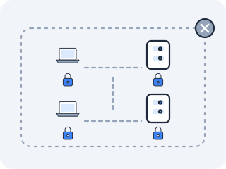

# Network Policy — iptables with a YAML interface

By default, Kubernetes is a flat, trusting network: every Pod can open a connection to every other Pod, in any namespace, on any port. That is wonderful for getting started and terrifying for production, where a compromised frontend should not be able to dial the database directly. NetworkPolicy is how you close those doors — and it turns out to be the firewall rules from Act IV, written in YAML instead of `iptables`.



### Why isn't flat Pod connectivity enough?

Flat connectivity means one breached Pod can reach everything. You want segmentation: the database should accept connections only from the API Pods, the API only from the frontend, and nothing should talk to internal services it has no business touching. In Act IV you already had the tool for "drop this packet unless it matches" — iptables filter rules. But Pod IPs are ephemeral; a firewall rule pinned to `10.244.1.7` is wrong the moment that Pod restarts with a new IP. You needed a way to express "allow traffic from the API Pods" that survives Pods coming and going.

### So what is a NetworkPolicy, really?

A **NetworkPolicy** is a declarative rule that selects a set of Pods by *label* and specifies which ingress (incoming) and egress (outgoing) traffic is allowed for them. The crucial design choice: it operates on **Pod identity (labels), not IP addresses**. You write "Pods labeled `app=database` may receive traffic on port 5432 from Pods labeled `app=api`."

The CNI plugin watches both the policies and the Pods, maintains the live mapping from labels to current Pod IPs, and translates the policy into actual enforcement on each node — **iptables filter rules** for plugins like Calico, or **eBPF programs** for Cilium. When a Pod restarts and gets a new IP, the CNI rewrites the underlying rules so the label-based intent stays true even though the IPs changed.

Which makes a NetworkPolicy exactly **the Act IV filter table, with a controller keeping it in sync as Pod IPs churn underneath the labels** — and explains the odd division of labour: Kubernetes itself only stores your intent, and the plugin is the thing that enforces it.

### What does one actually look like?

Four fields carry all of the meaning. Read them before you read the semantics:

```yaml
apiVersion: networking.k8s.io/v1
kind: NetworkPolicy
metadata:
  name: db-accepts-api-only
spec:
  podSelector:                       # WHO this policy applies to
    matchLabels: { app: database }
  policyTypes: [ Ingress ]           # WHICH direction it governs
  ingress:                           # WHAT is allowed in (everything else is not)
    - from:
        - podSelector:
            matchLabels: { app: api }
      ports:
        - port: 5432
```

`podSelector` is the same label-matching you met in [the Services lesson](03-services.md), doing a different job: there it chose which Pods a Service sends traffic *to*, here it chooses which Pods a rule applies *to*. Not one IP address appears anywhere in the document — that is the entire design.

Two of those four fields have behaviour that is not obvious from reading them, and both bite people.

First, an **empty `podSelector: {}` selects every Pod in the namespace**, not none. It is the widest possible selector, not the narrowest.

Second, **`policyTypes` plus an empty allow list means deny.** A Pod with no policy selecting it accepts everything; the moment *any* policy selects a Pod for `Ingress`, that Pod switches to default-deny for ingress and only the listed sources get through. So a document with `policyTypes: [ Ingress ]` and no `ingress:` list at all is not a no-op — it is "permit nothing inbound," which is how people write a namespace-wide default-deny on purpose, and how they write one by accident.

Policies are also **additive**: several may select the same Pod, and the Pod accepts the union of everything they allow. There is no ordering and no explicit `deny` rule to write — you deny by not allowing.

And one thing that is not visible in the document at all: **enforcement requires CNI support.** Flannel alone does not enforce NetworkPolicy; Calico and Cilium do. Applying a policy on a cluster whose CNI ignores it produces no error and no effect, which is its own debugging trap and the subject of a warning further down this page.

### What does it look like, before and after?

<!-- figure -->

```
   BEFORE any policy (default):           AFTER policy on app=database:
   every Pod → every Pod, all ports       ingress allowed ONLY from app=api : 5432

   frontend ──┐                            frontend ──X (dropped in kernel, no RST)
   api ───────┼──► database  :anything     api ───────► database :5432  ✓
   intruder ──┘                            intruder ──X (dropped in kernel)

   the CNI keeps: { app=api } → { 10.244.1.7, 10.244.2.9, ... }  ← updated as Pods churn
   and writes:    iptables filter rule (Calico)  or  eBPF program (Cilium)  on each node
```

### Why does a blocked request time out instead of returning 403?

**Because the SYN dies in netfilter — the application never sees the request, so it cannot refuse it.**

Enforcement happens in the **kernel, at the node level**, before the packet ever reaches the destination application. This has a sharp, practical consequence for debugging: when a NetworkPolicy blocks traffic, the source Pod sees a **connection timeout**, not an HTTP 403. There is no rejection from the app, no log line in the server, no response of any kind — the SYN is silently dropped in netfilter and the client just waits and gives up.

People burn hours staring at an application that "isn't logging the request" when the request never reached the application at all; it died in the kernel. A 403 means the app said no; a timeout (with everything else healthy) often means a NetworkPolicy said no first. The application layer is never involved, by design.

> **Check yourself —** A request between two Pods times out. The server logs nothing at all. Does that mean the server is broken?

<details>
<summary>Answer</summary>

No — it is evidence the request never *arrived*. Enforcement happens in the kernel at the node, so a NetworkPolicy drop produces a timeout with no log line anywhere in the application. A 403 would mean the app saw the request and refused it; silence with everything else healthy points at the layer below.

</details>

### Where does the CNI write the rule?

On a node, a NetworkPolicy is visible as the filter rules the CNI wrote:

```
iptables -L -n | grep -i cali            Calico's policy filter rules (cali-* chains)
kubectl get networkpolicy -A             the declared policies
kubectl get pods --show-labels           the labels policies actually select on
```

For Cilium, there are no iptables chains to read — the enforcement is in eBPF, inspected with `cilium endpoint list` and `cilium monitor` instead, which is the "no chains, programs in the kernel" point from [the CNI lesson](05-cni.md) made concrete. Those two commands need a Cilium node, which this act does not build; [Act X](../act-10-cluster-security/09-encryption-between-pods.md) does.

### Can you watch a label flip a port open?

**Check which cluster you are on first, or this experiment will lie to you.** The paragraph above said enforcement requires CNI support; here is where that stops being trivia. A default kind cluster runs **kindnet, which does not enforce NetworkPolicy** — it will accept the policy you apply, report no error, and change nothing. Your `nmap` output will be identical before and after, and you will draw exactly the wrong conclusion.

So run this on the policy-enforcing cluster from [the lab lesson](01-lab-with-kind.md) — the `disableDefaultCNI` config with Calico installed — and confirm before you start that something is actually watching your policies:

```bash
kubectl config current-context                 # kind-netcni, not kind-netlab
kubectl get pods -n kube-system | grep -i -e calico -e cilium
```

If that second command prints nothing, stop and go build the other cluster; nothing below will be real.

This is the trap [the Gateway API lesson](06b-gateway-api.md) left you holding, and it is the same one exactly: the cluster stored your intent and nobody reconciled it. There it was a Gateway with no controller, and the tell was a `Programmed` condition that never went `True`. Here it is a NetworkPolicy with no enforcing CNI — and it is *worse*, because a Gateway that routes nothing fails loudly the moment someone curls it, while a policy that filters nothing looks exactly like a policy that is working. "The policy silently did nothing" is not only a lab problem; it is a production incident that ships as a false sense of security, and there is no status field to catch it.

With that confirmed, probe the target from a second Pod before and after applying the policy:

> **Predict first —** after you apply a deny NetworkPolicy, what word will `nmap` change to — and will the blocked port look like a refusal or a silent timeout?

```bash
nmap -p 5432,8080,9090 <database-pod-ip>      # BEFORE the policy
# apply a NetworkPolicy allowing ingress only from app=api on 5432
nmap -p 5432,8080,9090 <database-pod-ip>      # AFTER, from a non-api Pod
```

The word `nmap` reports is the tell. Before the policy, reachable ports read `open`. After, from a Pod that the policy does *not* permit, they read `filtered` — nmap's word for "the SYN went out and nothing, not even a rejection, came back," which is exactly the silent kernel drop. Run the same `nmap` from a Pod labeled `app=api` and `5432` is `open` again: identical packet, different source label, opposite result — because the rule keys on identity, not address.

That is the model, and the model is the part most material never gets right. What it is not is practice: every policy on this page has one `podSelector` and one port, and the exam's tasks do not. [The next lesson](07b-policy-shapes.md) writes the other four shapes — cross-namespace peers and the one hyphen that turns an AND into an OR, `ipBlock`, and egress — and proves each one against a four-client bench rather than asserting it.

> **You understand this when you can** explain why a NetworkPolicy denial shows up as a connection *timeout* rather than an HTTP 403 — the packet is dropped in the kernel at the node before it reaches the app — and why the rule survives Pods restarting with new IPs: it selects on labels, and the CNI keeps the label-to-IP mapping current as it rewrites the underlying iptables (or eBPF) rules.

---

← Prev: **[Gateway API](06b-gateway-api.md)** · ↑ **[Act V overview](README.md)** · Next: **[The four shapes of a NetworkPolicy](07b-policy-shapes.md)** →
