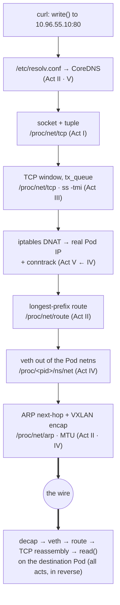
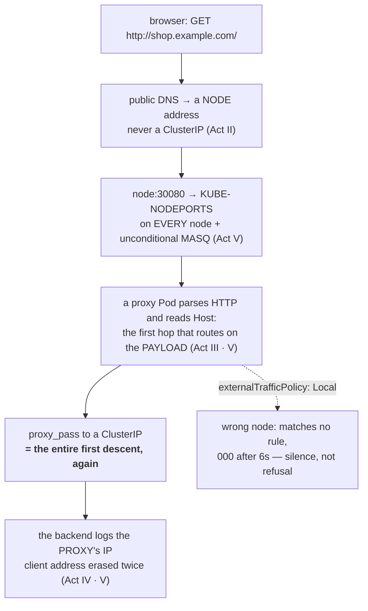

# The whole stack — two packets, five acts

You have built every layer. Now watch two packets fall through all of them: one going **across** the cluster, and one coming **in** from outside it.

Everything below, you already own. Nothing here is a new mechanism — and that is the point of the page. Five acts taught you seven layers one at a time, each in its own container, each with its own file. This is the first time you see them running *as one machine*, in the order a real request actually visits them.

Watch for one thing as you descend, because it is the whole course arriving at once: **at every single layer, the thing you reach for is a file.** Not a slogan — a working method. When this call breaks, you will not guess. You will read those files, top to bottom, in exactly the order this packet visits them.

## The scenario

A Pod named `app` runs `curl http://db/health`. `db` is a Kubernetes **Service** (a ClusterIP) backed by three `db` Pods, one of them on a *different node*. The client calls `write()` with an HTTP request; a `read()` eventually returns the response. Between those two calls is the entire course.

We follow the request down the sending side, across the wire, and up the receiving side. At each layer: **what happens**, and **the file that proves it**. Then we do it a second time for a request that starts on somebody's laptop — because that descent has three hops before Kubernetes exists, exactly one hop that does something none of the five acts has done yet, and then this first descent nested inside it, unchanged.

## Down the stack — the sending side

<!-- scrollytell -->


**1 · The name (Act II, scaled by Act V).** `curl` must turn `db` into an IP before anything else. The stub resolver reads `/etc/resolv.conf` — which in a Pod points at CoreDNS's ClusterIP — and asks it to resolve `db.default.svc.cluster.local` (the search domains in that same file complete the short name). CoreDNS answers with the Service's ClusterIP, say `10.96.55.10`. This is Act II's DNS resolution walk, with CoreDNS standing in for the resolver.
> **The file:** `/etc/resolv.conf` (who to ask, and the search suffixes).

**2 · The socket (Act I).** `curl` calls `socket()` and gets a file descriptor — a row in its fd table. `connect()` to `10.96.55.10:80` gives that socket an identity: the four-tuple *local IP:port ↔ remote IP:port*. Nothing has touched the wire yet; the socket is just a kernel object with buffers and a state.
> **The file:** `/proc/net/tcp` (the socket's tuple and state) · `/proc/<pid>/fd` (the descriptor itself).

**3 · The reliable stream (Act III).** `connect()` triggers the three-way handshake: SYN, SYN-ACK, ACK, with random initial sequence numbers. Once ESTABLISHED, `write()` copies the HTTP bytes into the socket's send buffer; TCP slices them into segments, each numbered, and holds copies in `tx_queue` until they're acknowledged. The bytes in flight are TCP's sliding window.
> **The file:** `/proc/net/tcp` (state, `tx_queue`/`rx_queue`) — or `ss -tmi` to read it humanely.

**4 · The virtual address is a lie (Act V).** Here is the twist you proved in Act V: `10.96.55.10` exists on *no interface anywhere*. So before the packet can be routed, `iptables` intercepts it in the `nat` table. The `KUBE-SERVICES` chain matches the ClusterIP, `KUBE-SVC-<hash>` picks one of the three backends *by probability*, and `KUBE-SEP-<hash>` **DNATs** the destination to a real Pod IP — say `10.244.2.3:8080` on another node. `conntrack` records the mapping so the reply can be un-rewritten later.
> **The file:** `iptables -t nat -L` (the DNAT chains) · `/proc/net/nf_conntrack` (the recorded flow).

**5 · Which way out? (Act II).** Now the packet has a *real* destination, `10.244.2.3`. The kernel does longest-prefix match against the routing table. `10.244.2.3` is on another node's Pod CIDR, so it's not on-link — it routes toward the overlay/CNI device, not straight out `eth0`.
> **The file:** `/proc/net/route` / `/proc/net/fib_trie` — or `ip route get 10.244.2.3`.

**6 · The private network stack (Act IV).** The Pod has its own **network namespace**; its `eth0` is one end of a **veth pair** whose other end plugs into a **bridge** (or CNI device) in the host namespace. The packet crosses the veth "virtual cable" out of the Pod's isolated stack and into the node's.
> **The file:** `/proc/<pid>/ns/net` (the namespace) · `ip -n <ns> link` (the veth) · `/sys/class/net/<bridge>/brif` (bridge members).

**7 · The wire, and who owns it (Act II).** To hand the frame to the next hop, the kernel needs a **MAC** for the next-hop IP, so it consults its ARP cache (or asks, and trusts the answer). The frame goes onto the wire — but the destination Pod is on another node, so the CNI wraps the whole packet inside another packet with **VXLAN** (Act IV's overlay), and *that* outer packet's MTU had better account for the 50 bytes of encapsulation (Act II's MTU story, exactly as promised).
> **The file:** `/proc/net/arp` (next-hop MAC) · `/sys/class/net/<dev>/mtu` (the ceiling that bites overlays).

## Up the stack — the receiving side

The outer VXLAN packet arrives at the destination node, is decapsulated, and lands in the target Pod's namespace via *its* veth. Now everything runs in reverse: the frame's MAC matched, IP routing delivered it locally, TCP checked the sequence numbers and reassembled the byte stream in order, and the destination Pod's server — blocked in `accept()` then `read()` — is finally handed the bytes.

**`write()` on one machine has become `read()` on another.** That single sentence, from the orientation, is the whole course.

The reply retraces the path. It leaves addressed *from* the real Pod IP `10.244.2.3` — but `conntrack` remembers the DNAT, reverse-rewrites the source back to the ClusterIP `10.96.55.10` the client dialed, and `curl` receives a response from exactly the address it asked for. It never learns a rewrite happened. That is why a Service works in both directions from a single outbound rule: **conntrack remembers.**

## The other descent — a request that starts outside

The descent above starts inside the cluster, at a Pod calling `write()`. Almost no real request does.
A real request starts on somebody's laptop, and the first three hops of its journey contain **no
Kubernetes at all** — then it arrives, and something has to decide which of your forty services it was
for. That decision is the one thing in this whole course that has never been made yet.

So: a browser asks for `http://shop.example.com/`, and inside the cluster three `shop` Pods and three
`blog` Pods are waiting. Follow it.

**1 · The name, again — but not CoreDNS (Act II).** The laptop's resolver reads *its* `/etc/resolv.conf`
and asks a public resolver, which walks the delegation chain to your zone. Identical mechanism to hop 1
of the first descent, different resolver — and note carefully what it *cannot* return. It cannot return
a ClusterIP. `10.96.55.10` is a fiction that exists only in one node's `nat` table, so it is unroutable
from anywhere outside that node. What DNS returns is a **node's** address, or a load balancer in front
of several.
> **The file:** `/etc/resolv.conf` on the client · `dig +trace shop.example.com` for the chain.

**2 · A port on every node (Act V).** The packet arrives at `<node>:30080`. `kube-proxy` wrote that rule
into `KUBE-NODEPORTS` on **every node in the cluster**, whether or not that node runs the Pod:

```bash
NP=30512   # your nodePort
for n in netlab-control-plane netlab-worker; do
  printf '%-22s %s rule(s)\n' "$n" \
    "$(docker exec $n iptables -t nat -S KUBE-NODEPORTS | grep -c "dport $NP")"
done
```

```
netlab-control-plane   2 rule(s)
netlab-worker          2 rule(s)
```

The Pod is on one node and both nodes answer, which is the property that makes a NodePort usable behind
a dumb load balancer. Read the chain it jumps to and one line will matter later:

```
-A KUBE-EXT-D2IOJ… -m comment --comment "masquerade traffic for … external destinations" -j KUBE-MARK-MASQ
-A KUBE-EXT-D2IOJ… -j KUBE-SVC-D2IOJ…
```

**An unconditional `KUBE-MARK-MASQ`.** Every externally-arriving packet gets source-NATted to the node's
own address before it goes anywhere. Hold on to that; it is about to cost you something.
> **The file:** `iptables -t nat -S KUBE-NODEPORTS` and the `KUBE-EXT-*` chain it names.

**3 · The first decision in this entire course that reads the payload (Act V, Act III).** Everything so
far — every hop of both descents — routed on an *address* and a *port*. Layer 3 and layer 4. But one
port on one node has to serve every hostname you own, and a port number cannot tell `shop` from `blog`.
So the packet is delivered to a Pod that terminates the TCP connection, **parses the HTTP request**, and
reads one header:

```bash
for h in shop.example.com blog.example.com nothing.example.com; do
  printf 'Host: %-22s -> ' "$h"
  curl -s -m 5 -H "Host: $h" "http://<node>:30080/"
done
```

```
Host: shop.example.com       -> I am shop
Host: blog.example.com       -> I am blog
Host: nothing.example.com    -> no vhost matched
```

**One address, one port, three destinations, and the only thing that differed was a line of text inside
the payload.** That is a genuinely new capability arriving, and it is worth being precise about why it
had to arrive *here* rather than earlier: a NAT rule matches fields in a header the kernel already
parsed, and `Host:` is in a byte stream that has to be reassembled and read as HTTP first. Which is why
this hop is a **process**, not a rule — and why it has to hold two TCP connections open at once, one to
the client and one to the backend.

And that is the whole of what an ingress controller is: a reverse proxy in a Pod, plus a controller that
writes its configuration file from `Ingress` objects. The measurement above was taken against
`nginx:1.27-alpine` with a hand-written `nginx.conf` and no ingress controller installed anywhere —
because there is nothing else in the box.
> **The file:** the controller's generated config (`kubectl exec … cat /etc/nginx/nginx.conf`) — and its
> `Ingress` objects, which are the *input* to that file rather than the thing that routes.

**4 · And now the first descent, nested inside the second (all acts).** From the proxy onward, the
request is an ordinary in-cluster call: `proxy_pass http://shop.north.svc.cluster.local` sends it back
to hop 1 of the first descent — `/etc/resolv.conf`, CoreDNS, a ClusterIP, `KUBE-SERVICES`, DNAT to a Pod
IP, longest-prefix route, veth, wire. **Every layer of the first descent runs again, in order, as step 4
of the second.** Nothing is added; it is the same seven files.
> **The files:** all seven from the first descent, unchanged.

**5 · What got lost on the way in.** Ask the backend who called it:

```bash
kubectl -n north logs deploy/shop --tail=1
```

```
10.244.1.61 - - [27/Aug/2026:01:09:05 +0000] "GET / HTTP/1.0" 200 10 "-" "curl/8.11.1" "-"
```

`10.244.1.61` is the **edge Pod's** IP. The client's address is gone, and it was erased *twice*: the
node masqueraded it at hop 2, and then the proxy at hop 3 terminated the connection and opened a new one
of its own. The second erasure is not a bug and cannot be configured away — a proxy that reads HTTP
*is* a new client. `X-Forwarded-For` exists because of this, and it is worth naming for what it is: a
**convention**, a header the proxy chooses to add and the backend chooses to believe, with no mechanism
underneath it. Compare `conntrack` in the first descent, which reverses a rewrite the kernel actually
recorded. One is bookkeeping the kernel keeps; the other is a note in the margin.

**6 · The one knob, and the trade it makes.** Set `externalTrafficPolicy: Local` and read the same chain
again:

```
-A KUBE-EXT-D2IOJ… -s 10.244.0.0/16 … -j KUBE-SVC-D2IOJ…                       <- pod traffic
-A KUBE-EXT-D2IOJ… -m addrtype --src-type LOCAL -j KUBE-MARK-MASQ              <- node-local only
-A KUBE-EXT-D2IOJ… -m addrtype --src-type LOCAL -j KUBE-SVC-D2IOJ…             <- node-local only
```

The masquerade is now **conditional**, so an external packet is no longer rewritten and the backend
finally sees the real client. But look at what an external packet arriving on a node with *no local
endpoint* now matches: it is not from `10.244.0.0/16`, and its source type is not `LOCAL`. It matches
**nothing**. It falls off the end of the chain, is neither DNAT'd nor rejected, and nobody ever answers:

```
via netlab-control-plane   -> 000 in 6.004230s      (no local endpoint)
via netlab-worker          -> 200 in 0.006993s      (has the Pod)
```

**Six seconds of silence and a client timeout, against seven milliseconds.** Not a refusal — Act III's
distinction, and Act V's `REJECT`-versus-`DROP` again: there is no rule saying no, so there is nothing to
say no *with*. That is the trade in full: **you can have the client's real IP, or you can have every node
answering, and the mechanism is a single `--src-type LOCAL` match.** Choosing `Local` makes your load
balancer's health checks load-bearing, because it is now the only thing that knows which nodes can
answer.

## The payoff picture


*Caption: the same packet, top to bottom, with the file you'd read at each layer — this resolves the confusion that Kubernetes networking is a new thing, by showing it is the five acts stacked.*

And the second descent, with the first one nested inside it as a single step:


*Caption: north-south. Three hops before Kubernetes exists, one hop that reads the payload, and then the east-west descent unchanged — which is why there are two pictures and only one set of files.*

## Why this is the last thing before debugging

Look back at that descent. Every layer answered to a **file** — `/etc/resolv.conf`, `/proc/net/tcp`, the `iptables` rules, `/proc/net/nf_conntrack`, `/proc/net/route`, `/proc/<pid>/ns/net`, `/proc/net/arp`. A working call is all of them agreeing. A *broken* call is exactly one of them lying — and because they sit in a fixed order, you can find the liar by reading them in that order instead of guessing.

That is the entire debugging method. When the abstraction breaks, you don't reach for magic; you reach for the files, top to bottom.

## Look how far that is

Go back to the very first page of the orientation. A process was an address space and a table of open files, and the question was: *if everything is a file, what kind of file is a network connection?* You had no answer, and no way to look for one.

You just narrated a request crossing a Kubernetes cluster — through DNS, a socket, a TCP window, a NAT rewrite that exists in no interface, a routing decision, a virtual cable out of a private namespace, an ARP lookup and a packet wrapped inside another packet — and you named the file that proves each step. That is not a bigger vocabulary than you had in the orientation. It is the same one question, answered seven times, at seven scales.

The creed was never handed to you. You caught yourself saying it around the tenth time the kernel answered a question by handing you a file.

> **Check yourself —** A colleague says "Kubernetes networking is a completely different world from Linux networking — you have to learn it separately." Using the descent above, give the two-sentence reply that dismantles that.

<details>
<summary>Answer</summary>

There is no separate world: every step in the descent is a plain Linux mechanism you built by hand in Acts I–IV — a socket, a routing table, a NAT rule, a veth pair, a VXLAN header — and Kubernetes only *automates when and how they are configured*. The single genuinely new idea is that a controller writes those rules for you from a declared desired state, so the thing you have to learn is not new networking, it's who is holding the pen.

</details>

> **You understand this when you can** narrate the east-west descent from `write()` to `read()`
> unaided, naming the mechanism and the file at each layer; say why DNS can never hand an outside
> client a ClusterIP; name the one hop that routes on the payload, and why it must be a process;
> explain both places an arriving client's IP is erased and which one no setting can fix; and
> derive from one `--src-type LOCAL` match why the wrong node goes silent instead of refusing.

**Which raises:** you can now describe a *working* call completely. But a broken one gives you a symptom, not a layer. Which file do you open *first*, and how do you avoid reading all seven every time?

---

↑ **[Act V overview](act-5-kubernetes/README.md)** · Next: **[The debugging method — five questions in order](act-5-kubernetes/08-debugging.md)** →
