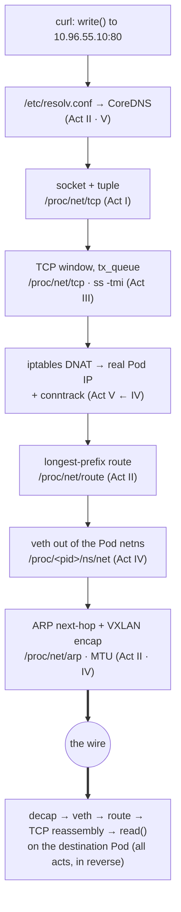

# The whole stack — one packet, five acts

You have built every layer. Now watch one packet fall through all of them at once.

Everything below, you already own. Nothing here is a new mechanism — and that is the point of the page. Five acts taught you seven layers one at a time, each in its own container, each with its own file. This is the first time you see them running *as one machine*, in the order a real request actually visits them.

Watch for one thing as you descend, because it is the whole course arriving at once: **at every single layer, the thing you reach for is a file.** Not a slogan — a working method. When this call breaks, you will not guess. You will read those files, top to bottom, in exactly the order this packet visits them.

## The scenario

A Pod named `app` runs `curl http://db/health`. `db` is a Kubernetes **Service** (a ClusterIP) backed by three `db` Pods, one of them on a *different node*. The client calls `write()` with an HTTP request; a `read()` eventually returns the response. Between those two calls is the entire course.

We follow the request down the sending side, across the wire, and up the receiving side. At each layer: **what happens**, and **the file that proves it**.

## Down the stack — the sending side

<!-- scrollytell -->

**1 · The name (Act II, scaled by Act V).** `curl` must turn `db` into an IP before anything else. The stub resolver reads `/etc/resolv.conf` — which in a Pod points at CoreDNS's ClusterIP — and asks it to resolve `db.default.svc.cluster.local` (the search domains in that same file complete the short name). CoreDNS answers with the Service's ClusterIP, say `10.96.55.10`. This is Act II's DNS resolution walk, with CoreDNS standing in for the resolver.
> **The file:** `/etc/resolv.conf` (who to ask, and the search suffixes).

**2 · The socket (Act I).** `curl` calls `socket()` and gets a file descriptor — a row in its fd table. `connect()` to `10.96.55.10:80` gives that socket an identity: the four-tuple *local IP:port ↔ remote IP:port*. Nothing has touched the wire yet; the socket is just a kernel object with buffers and a state.
> **The file:** `/proc/net/tcp` (the socket's tuple and state) · `/proc/<pid>/fd` (the descriptor itself).

**3 · The reliable stream (Act III).** `connect()` triggers the three-way handshake: SYN, SYN-ACK, ACK, with random initial sequence numbers. Once ESTABLISHED, `write()` copies the HTTP bytes into the socket's send buffer; TCP slices them into segments, each numbered, and holds copies in `tx_queue` until they're acknowledged. The bytes in flight are TCP's sliding window.
> **The file:** `/proc/net/tcp` (state, `tx_queue`/`rx_queue`) — or `ss -tmi` to read it humanely.

**4 · The virtual address is a lie (Act V).** Here is the twist you proved in Act V: `10.96.55.10` exists on *no interface anywhere*. So before the packet can be routed, `iptables` intercepts it in the `nat` table. The `KUBE-SERVICES` chain matches the ClusterIP, `KUBE-SVC-<hash>` picks one of the three backends *by probability*, and `KUBE-SEP-<hash>` **DNATs** the destination to a real Pod IP — say `10.244.2.3:8080` on another node. `conntrack` records the mapping so the reply can be un-rewritten later.
> **The file:** `iptables -t nat -L` (the DNAT chains) · `/proc/net/nf_conntrack` (the recorded flow).

**5 · Which way out? (Act II).** Now the packet has a *real* destination, `10.244.2.3`. The kernel does longest-prefix match against the routing table. `10.244.2.3` is on another node's Pod CIDR, so it's not on-link — it routes toward the overlay/CNI device, not straight out `eth0`.
> **The file:** `/proc/net/route` / `/proc/net/fib_trie` — or `ip route get 10.244.2.3`.

**6 · The private network stack (Act IV).** The Pod has its own **network namespace**; its `eth0` is one end of a **veth pair** whose other end plugs into a **bridge** (or CNI device) in the host namespace. The packet crosses the veth "virtual cable" out of the Pod's isolated stack and into the node's.
> **The file:** `/proc/<pid>/ns/net` (the namespace) · `ip -n <ns> link` (the veth) · `/sys/class/net/<bridge>/brif` (bridge members).

**7 · The wire, and who owns it (Act II).** To hand the frame to the next hop, the kernel needs a **MAC** for the next-hop IP, so it consults its ARP cache (or asks, and trusts the answer). The frame goes onto the wire — but the destination Pod is on another node, so the CNI wraps the whole packet inside another packet with **VXLAN** (Act IV's overlay), and *that* outer packet's MTU had better account for the 50 bytes of encapsulation (Act II's MTU story, exactly as promised).
> **The file:** `/proc/net/arp` (next-hop MAC) · `/sys/class/net/<dev>/mtu` (the ceiling that bites overlays).

## Up the stack — the receiving side

The outer VXLAN packet arrives at the destination node, is decapsulated, and lands in the target Pod's namespace via *its* veth. Now everything runs in reverse: the frame's MAC matched, IP routing delivered it locally, TCP checked the sequence numbers and reassembled the byte stream in order, and the destination Pod's server — blocked in `accept()` then `read()` — is finally handed the bytes.

**`write()` on one machine has become `read()` on another.** That single sentence, from the orientation, is the whole course.

The reply retraces the path. It leaves addressed *from* the real Pod IP `10.244.2.3` — but `conntrack` remembers the DNAT, reverse-rewrites the source back to the ClusterIP `10.96.55.10` the client dialed, and `curl` receives a response from exactly the address it asked for. It never learns a rewrite happened. That is why a Service works in both directions from a single outbound rule: **conntrack remembers.**

## The payoff picture

*Caption: the same packet, top to bottom, with the file you'd read at each layer — this resolves the confusion that Kubernetes networking is a new thing, by showing it is the five acts stacked.*

## Why this is the last thing before debugging

Look back at that descent. Every layer answered to a **file** — `/etc/resolv.conf`, `/proc/net/tcp`, the `iptables` rules, `/proc/net/nf_conntrack`, `/proc/net/route`, `/proc/<pid>/ns/net`, `/proc/net/arp`. A working call is all of them agreeing. A *broken* call is exactly one of them lying — and because they sit in a fixed order, you can find the liar by reading them in that order instead of guessing.

That is the entire debugging method. When the abstraction breaks, you don't reach for magic; you reach for the files, top to bottom.

## Look how far that is

Go back to the very first page of the orientation. A process was an address space and a table of open files, and the question was: *if everything is a file, what kind of file is a network connection?* You had no answer, and no way to look for one.

You just narrated a request crossing a Kubernetes cluster — through DNS, a socket, a TCP window, a NAT rewrite that exists in no interface, a routing decision, a virtual cable out of a private namespace, an ARP lookup and a packet wrapped inside another packet — and you named the file that proves each step. That is not a bigger vocabulary than you had in the orientation. It is the same one question, answered seven times, at seven scales.

The creed was never handed to you. You caught yourself saying it around the tenth time the kernel answered a question by handing you a file.

> **Check yourself —** A colleague says "Kubernetes networking is a completely different world from Linux networking — you have to learn it separately." Using the descent above, give the two-sentence reply that dismantles that.

Answer

There is no separate world: every step in the descent is a plain Linux mechanism you built by hand in Acts I–IV — a socket, a routing table, a NAT rule, a veth pair, a VXLAN header — and Kubernetes only *automates when and how they are configured*. The single genuinely new idea is that a controller writes those rules for you from a declared desired state, so the thing you have to learn is not new networking, it's who is holding the pen.

> **You understand this when you can** narrate this descent from `write()` to `read()` unaided — naming, at each of the seven layers, the mechanism and the file that proves it — and when a call breaks, reach for those files in that order rather than guessing.

**Which raises:** you can now describe a *working* call completely. But a broken one gives you a symptom, not a layer. Which file do you open *first*, and how do you avoid reading all seven every time?

---

↑ **[Act V overview](act-5-kubernetes/README.md)** · Next: **[The debugging method — five questions in order](act-5-kubernetes/08-debugging.md)** →
