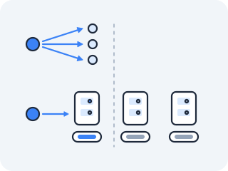
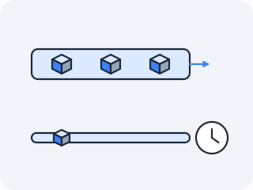

# In the wild — the same experiments, on your real Mac

The acts run inside a throwaway Linux container so you can break things safely. This file does the opposite: it points the **same ideas at the machine in front of you**, using tools that already ship with macOS. Nothing to install.

It's organised by act, so each `> On your own machine —` link in the lessons lands here.

**Optional, nicer tools.** Everything below runs with what macOS ships — `lsof`, `dig`, `tcpdump`,
`nettop`, `networkQuality`, `arp`, `ping`, `traceroute`. A few commands read better with a nicer
version of the same tool; each has a built-in fallback, so these are entirely optional:

```bash
brew install mtr      # per-hop latency and loss — nicer than traceroute
brew install ldns     # provides `drill`, a DNSSEC-friendly dig
brew install dog      # a colourful dig
```

## macOS is not Linux — but you meet the swaps as you need them

The container taught you the Linux toolbox; macOS has the same *concepts* under different commands. Rather than spoil later acts with one big table, **each section below flags only the swaps that act needs** — you meet a translation the moment an experiment calls for it, never before.

---

## Act I in the wild

*Concept:* the live socket table — every program quietly holding a connection — and who's eating your bandwidth.
*(Container version: `ss` + `/proc/net/tcp` + `/proc/<pid>/fd`.)*

- **Who's listening on your Mac (servers):**
  ```
  lsof -nP -iTCP -sTCP:LISTEN
  ```
  - `-n` no DNS lookups, `-P` no port-name lookups → raw numbers, fast.
  - Read the columns: `COMMAND  PID  USER  FD  ...  NAME` → `NAME` is `addr:port`.
- **Live connections right now:**
  ```
  lsof -nP -iTCP -sTCP:ESTABLISHED
  ```
- **The bandwidth hog (bytes per process, live):**
  ```
  nettop -P
  ```
  - `-P` = per-process rollup; watch `bytes_in` / `bytes_out` climb. Quit with `q`.

> **macOS vs Linux — read this:**
> - `lsof` *does* show the **process name (`COMMAND`), PID, and the fd number (`FD`)** — e.g. `3u` = fd 3, open read+write, the same fd you watched in minihttp. lsof is your `/proc` replacement, not the thing that hides it.
> - The tool that hides the owner is **`netstat`** — `netstat -an` lists the sockets but never the program. So: `netstat` to *count* sockets, `lsof` to *name* the culprit.
> - Inspect one process's open files (the `/proc/<pid>/fd` move): `lsof -p <pid>`.

---

## Act II in the wild

### Your home network's neighbours (ARP)

*Concept:* the ARP cache mapping IP → MAC is live on your Wi-Fi this second.
*(Container version: `ip neigh` on a virtual bridge.)*

- **List every device your Mac has spoken to on the LAN** — router, phone, TV, that forgotten smart bulb:
  ```
  arp -a
  ```
- **Watch a neighbour appear:** `ping <a-device-ip>` then `arp -a` again → a new IP↔MAC row.
- The first 3 bytes of a MAC are the vendor (OUI) — that's how you spot which gadget is which.

> **macOS vs Linux:** Linux moved to `ip neigh`; macOS still uses the classic `arp -a`. Same cache, same ARP protocol underneath.

### Which Cloudflare datacenter answers *you* (anycast + longest-prefix)

*Concept:* `1.1.1.1` is **anycast** — you and a friend in another city reach *different physical boxes*; routing picks the nearest.



- **Make Cloudflare confess its location:**
  ```
  dig CH TXT id.server @1.1.1.1 +short
  ```
  → a colo code like `"LHR"`, `"EWR"`, `"FRA"` — the actual datacenter serving you.
- **Count how few hops away it is:**
  ```
  traceroute 1.1.1.1
  ```
  → usually a handful of hops; anycast keeps the nearest copy close.

### Watch DNS happen in real time

*Concept:* one page load fans out into dozens of name lookups (ads, trackers, CDNs).

1. Terminal 1 — start a sniffer on DNS:
   ```
   sudo tcpdump -n -i en0 port 53
   ```
2. Browser — load one news site.
3. Watch dozens of strangers get resolved in a single second.

> **macOS vs Linux:** your resolver config isn't `/etc/resolv.conf` here — read it with `scutil --dns`. The Wi-Fi interface is `en0`, not `eth0`.

---

## Act III in the wild

### Distance, measured in milliseconds (speed of light)

*Concept:* RTT is a ruler. Light in fibre ≈ **200 km per millisecond**.

- ```
  ping -c 5 1.1.1.1
  ```
- Take the avg RTT → rough one-way distance ≈ `RTT/2 × 200 km`.
  - 20 ms RTT ≈ ~2,000 km of cable round-trip. A 150 ms server is *physically* far — no upgrade beats the speed of light.

### Why your call stutters mid-download (flow control / bufferbloat)

*Concept:* a fat download fills a buffer; your call's packets wait in that queue. "Fast" speed tests miss it.

- ```
  networkQuality -v
  ```
  - Reports **responsiveness (RPM)** idle vs under load. Watch RPM crater when loaded → that drop *is* bufferbloat.

> **macOS vs Linux:** `networkQuality` is an Apple built-in (Monterey+). There's no Linux equivalent shipped by default — this is the one place macOS hands you more.

### Where your latency actually lives (HTTP four-stage timing)

*Concept:* a single request is layers stacked — DNS → TCP → TLS → server think-time. Time each.



1. Run this against a site you open daily:
   ```
   curl -w "dns:    %{time_namelookup}s\ntcp:    %{time_connect}s\ntls:    %{time_appconnect}s\nttfb:   %{time_starttransfer}s\ntotal:  %{time_total}s\n" -o /dev/null -s https://example.com
   ```
2. **Run it twice.** Second run: `dns` ≈ 0 (the answer is cached), `tls` and `total` drop — the caches are warm. That's *why* the second load feels instant.
   - `dns` = Act II · `tcp` = Act III handshake · `tls` = encryption setup · `ttfb` = the server thinking.

---

## Act IV in the wild

*Concept:* you built a bridge, a veth pair and a DNAT rule by hand. Docker Desktop has been quietly running all three on your Mac the whole time — inside its Linux VM. Here you meet your own handiwork wearing a product's name.

### The bridge you built, as a Docker network

1. List the networks, then look inside the default one:
   ```bash
   docker network ls
   docker network inspect bridge --format '{{range .IPAM.Config}}subnet={{.Subnet}} gateway={{.Gateway}}{{end}}'
   ```
2. That `gateway` address is `docker0` — the *same* virtual switch you created with `ip link add br0 type bridge`. The subnet is the address range it hands out.

### A container's stack really is its own

1. Start something, then look at the network from inside it:
   ```bash
   docker run -d --name wild -p 8080:80 nginx
   docker exec wild ip addr
   ```
2. Its `eth0` is one end of a veth pair; the other end is plugged into that bridge. Note the address is from the subnet you just printed — and that this `eth0` is *not* any interface on your Mac.

### The DNAT rule, seen from the outside

1. You published port 8080. Ask macOS who is listening:
   ```bash
   lsof -iTCP:8080 -sTCP:LISTEN -n -P
   ```
2. What answers is Docker's own proxy process, not nginx. `-p 8080:80` is the `iptables` DNAT rule from Act IV, with Docker Desktop's port-forwarder standing in for the parts of the path that live inside the VM.
3. Clean up: `docker rm -f wild`.

> **macOS vs Linux:** this is the act with the fewest 1:1 swaps, and the reason is structural. There is no `ip netns`, no `veth`, no `iptables` and no `/proc/net` on macOS, because **the namespaces and bridges are not on your Mac at all** — they are inside the Linux VM Docker Desktop runs. On a Linux host, `ip link show docker0`, `ip link show type veth` and `sudo iptables -t nat -L DOCKER` show you the very same objects directly, with no VM in between. The `docker network` and `docker exec` commands above are the portable view of them.

---

## Act V's method in the wild

*Concept:* Act V's real gift was not a `kubectl` flag — it was a **discipline**: ask the layers in a fixed order and stop at the first that lies. Point that same discipline at your own machine and everyday "the internet's broken" triage collapses to **four commands — ping the number, then ping the name.** Run them bottom-up; **stop at the first that fails** — that layer is your culprit.

1. **Router alive?** (your link / Wi-Fi)
   ```
   ping -c 2 $(route -n get default | awk '/gateway/{print $2}')
   ```
2. **Internet alive?** (routing beyond your router — a *number*, no DNS)
   ```
   ping -c 2 1.1.1.1
   ```
3. **Names resolve?** (DNS)
   ```
   dig +short example.com
   ```
4. **Name reachable end-to-end?** (the *name*)
   ```
   ping -c 2 example.com
   ```

| First failure | The verdict |
|---|---|
| 1 — router | your Wi-Fi / cable / router |
| 2 — `1.1.1.1` | ISP / routing upstream |
| 3 — `dig` | DNS (number works, name doesn't) |
| 4 — `example.com` | that specific host or site, nothing else |

The classic tell: **2 works but 4 doesn't → it's DNS.** Run these four before you ever reach for the restart button.

> **macOS vs Linux:** find your default gateway with `route -n get default` (or `netstat -rn | grep default`) — there's no `ip route` here.

---

## What just happened

Every command on this page ran on a machine you did not set up as a lab, with no container, no `--privileged`, and no `/proc`. And they still worked — because you were never really learning `ip` and `ss`. You were learning *which question to ask at which layer*, and those questions survive the change of operating system. The tool names were always the disposable part.

That is the whole transfer test, and it is the reason the course insisted on the kernel's own files before the friendly wrapper: a wrapper is platform-specific, a mechanism is not.

> **You understand this when you can** sit at an unfamiliar machine — no `/proc`, no `ip`, tools you have not used — and still find the answer, because you know which layer you are interrogating and what a healthy answer looks like at that layer.
