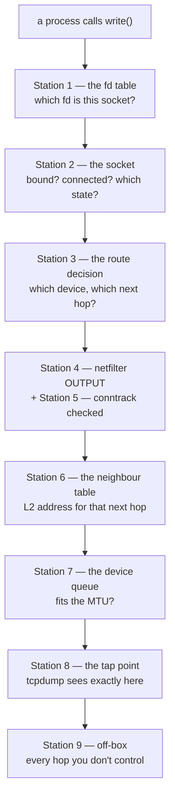
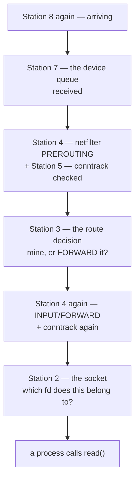

# The map — ten places kernel state lives, and what reads each one

**This is the page to open first.** Everything else in this reference is a lookup table; this one is the
thing you should be able to redraw from memory. It assumes Acts I–IV: namespaces, veth pairs, `iptables`,
conntrack are already yours. If any of those five words is unfamiliar, [the acts](../networking-fundamentals/README.md)
are the place to meet them for the first time — this page will still be here.

The course's own question is *"how does `write()` on one machine become `read()` on another?"* Every tool
in this reference exists to inspect one **station** on that journey — a specific piece of kernel state a
packet passes through or is checked against. Learn the ten stations and you stop memorising commands: a
new tool is just "oh, that's another way to read station 4."

---

## The two halves of the journey

A packet's route through *your* machine is not one line, it's two mirrored halves — out through the
stack, across the wire, back up through the stack on the other side. The same ten stations serve both
halves; only the order they're visited in flips.

**Outbound — `write()` on this host:**

**Inbound — `read()` on the far host, or a reply arriving back on yours:**

**Read the diagram, not the numbers, as the truth.** The stations are numbered for lookup, not for wire
order — number 4 (netfilter) and number 5 (conntrack) are each checked at *three* different points in one
trip, which is exactly the shape [Act IV's own hook diagram](../networking-fundamentals/act-4-one-pretends-many/03-iptables-and-nat.md)
draws. One station, several visits — that's normal, not a diagram bug.

Station 0 doesn't appear on the diagram at all: **name resolution happens entirely in userspace, before
any of this starts.** `write()` needs an IP; turning a name into one is a library call, not a kernel
station — which is exactly why `dig` can succeed while your application still fails to connect.

---

## The ten stations, for lookup

| # | Station | The state | Read it | Change it | Per-namespace? |
|---|---|---|---|---|---|
| 0 | [Names](#station-0--names-the-one-station-thats-not-in-the-kernel) | `/etc/resolv.conf`, `/etc/hosts`, `/etc/nsswitch.conf` | [`getent hosts`](tools/socket/getent-hosts.md), [`dig`](tools/socket/dig.md) | edit the files | yes — mount namespace |
| 1 | [The fd table](#station-1--the-fd-table-is-this-even-a-socket) | `/proc/<pid>/fd/` | `readlink`, [`lsof`](tools/procfs/lsof.md) | `close()`, [`ulimit`](tools/procfs/ulimit.md) | no — per-process |
| 2 | [The socket](#station-2--the-socket-bound-connected-or-lying-there-half-open) | `/proc/net/tcp{,6}`, `udp{,6}` | [`ss -tanp`](tools/netlink/ss.md) | the app's own syscalls | yes — net namespace |
| 3 | [The route decision](#station-3--the-route-decision-which-door-and-which-key) | `/proc/net/route`, routing tables | [`ip route get`](tools/netlink/ip.md) | `ip route add/change` | yes |
| 4 | [The netfilter hooks](#station-4--the-netfilter-hooks-five-doors-one-ruleset-each) | the loaded ruleset | [`iptables-save`](tools/netlink/iptables-save.md), [`nft list ruleset`](tools/netlink/nft.md) | `iptables -A`, `nft add rule` | yes |
| 5 | [Conntrack](#station-5--conntrack-the-kernels-memory-of-what-it-already-decided) | `/proc/net/nf_conntrack` | [`conntrack -L / -E`](tools/netlink/conntrack.md) | `conntrack -D`, `-F` | yes |
| 6 | [The neighbour table](#station-6--the-neighbour-table-do-i-know-how-to-reach-the-next-hop) | `/proc/net/arp` | `ip neigh show`, [`arping`](tools/packet/arping.md) | `ip neigh add/del` | yes |
| 7 | [The device](#station-7--the-device-the-queue-and-the-mtu) | `/sys/class/net/<dev>/mtu`, its counters | `ip -s link`, `ethtool -S`, `tc -s qdisc` | `ip link set`, `tc qdisc` | yes (the device itself lives in one) |
| 8 | [The tap point](#station-8--the-tap-point-what-you-see-depends-on-where-you-stand) | nothing — a hook, not a file | [`tcpdump`](tools/packet/tcpdump.md), [`pwru`](tools/probe/pwru.md) | — read-only by nature | yes — one veth end each side |
| 9 | [Off-box](#station-9--off-box-everything-past-your-last-interface) | nothing local | [`traceroute`](tools/packet/traceroute.md), [`mtr`](tools/packet/mtr.md) | — not yours to change | n/a |

`13` netlink tools, `14` procfs tools and the rest of the seventy-two on [the full index](tools/README.md)
are all clients of one of these ten spots, or of the eight syscall-level interfaces that group them —
[the interface roster](tools/README.md#the-eight-interfaces--the-whole-roster-on-one-screen) is that same
fact sliced the other way, by *how* a tool talks to the kernel rather than *where* it's looking.

---

## Station 0 — Names: the one station that's not in the kernel

**What it is.** Before a socket exists, a name has to become an address. `getaddrinfo()` — the libc call
underneath every "connect to a hostname" — consults **NSS** (Name Service Switch), which reads
`/etc/nsswitch.conf` to decide what order to check sources in. `/etc/hosts` usually goes first; DNS,
configured by `/etc/resolv.conf`, comes after.

**The trap.** `dig @<server> <name>` talks to a nameserver directly and skips NSS entirely. It can succeed
while the *application* still fails, because a stale `/etc/hosts` entry, or a `nsswitch.conf` that never
reaches DNS at all, sits in front of it. [`getent hosts`](tools/socket/getent-hosts.md) is the one tool
that resolves exactly the way the application does — for a good reason: measured against `localhost` in
this course's lab image, `getent hosts` opens no socket at all, because `/etc/hosts` answered and NSS
stopped there.

**Lessons:** [DNS](../networking-fundamentals/act-2-two-machines/04-dns.md) ·
[CoreDNS](../networking-fundamentals/act-5-kubernetes/04-coredns.md) (Act V — the same station, a
different file: the kubelet writes the Pod's own `/etc/resolv.conf`).

---

## Station 1 — The fd table: is this even a socket?

**What it is.** [Act I's whole opening move](../networking-fundamentals/act-1-one-machine/01-the-fd-table.md):
a socket is a file descriptor, one row in `/proc/<pid>/fd/`, indistinguishable from an open regular file
until you follow where the symlink points. This station answers "does the process even have the handle it
thinks it has" — before you ask anything about what the handle is doing.

**The trap.** A process can run out of *file descriptors* — a resource ceiling set by `ulimit` — and every
symptom that produces looks exactly like a network fault: connections refused, accepts failing, "too many
open files" in a log that never mentions sockets by name.

**Lessons:** [the fd table](../networking-fundamentals/act-1-one-machine/01-the-fd-table.md) ·
[everything is a file](../networking-fundamentals/act-1-one-machine/06-everything-is-a-file.md)

---

## Station 2 — The socket: bound, connected, or lying there half-open

**What it is.** The kernel's own ledger of every socket, one row per connection, readable straight from
`/proc/net/tcp` and `/proc/net/udp` before you ever run a tool — [decoding that row by hand](../networking-fundamentals/act-1-one-machine/05-ports-and-proc-net-tcp.md)
is the point of Act I lesson 5. `ss -tanp` is the friendly wrapper; it is reading the same file.

**The trap.** No row for your expected port doesn't mean "the app crashed" — it can mean `bind()` never
happened, or happened on the wrong address (`0.0.0.0` vs `127.0.0.1` is Act I's own worked example of a
service that's listening and still unreachable). And the *state* column is the fact worth reading before
anything else: [`SYN-SENT`](../networking-fundamentals/act-3-the-internet/02-tcp-states.md) stuck means
nothing came back; that already tells you the problem is downstream of this station, not at it.

**Lessons:** [ports and /proc/net/tcp](../networking-fundamentals/act-1-one-machine/05-ports-and-proc-net-tcp.md) ·
[TCP states](../networking-fundamentals/act-3-the-internet/02-tcp-states.md)

---

## Station 3 — The route decision: which door, and which key

**What it is.** [Read the routing table by hand](../networking-fundamentals/act-2-two-machines/02-ip-and-routing.md#read-the-routing-table-by-hand)
once, from `/proc/net/route`, and `ip route get <dst>` stops being magic — it's the same longest-prefix
match, run for you. This station decides two things at once: which local interface a packet leaves from,
and which address is the *next hop* — the input the very next station needs.

**The trap.** `ip route get` gives you the kernel's *decision* for one destination, not the table it was
decided from — if the answer surprises you, `ip route show` (or `ip -j -d route show` for the full detail)
is the table itself, and that's where a wrong entry actually lives. Multiple routing tables and policy
rules exist too (`ip rule`) — beyond what the acts teach, but [`ip`'s own page](tools/netlink/ip.md) covers
the shape of it.

**Lessons:** [IP and routing](../networking-fundamentals/act-2-two-machines/02-ip-and-routing.md) ·
[routing and BGP](../networking-fundamentals/act-2-two-machines/02b-routing-and-bgp.md) — off-box routing,
where station 3 stops being something you control.

---

## Station 4 — The netfilter hooks: five doors, one ruleset each

**What it is.** [Act IV names the five hooks](../networking-fundamentals/act-4-one-pretends-many/03-iptables-and-nat.md)
a packet can pass through — `PREROUTING`, `INPUT`, `FORWARD`, `OUTPUT`, `POSTROUTING` — and this station is
"which rule, on which hook, matched." **DNAT rewrites the destination in `PREROUTING`** (before the routing
decision runs); **SNAT rewrites the source in `POSTROUTING`** (after it). That ordering isn't a convention,
it's the only ordering that lets the kernel still know where to route the packet after DNAT changes what
"where" means.

**The trap.** A packet for a *published port* gets DNAT'd in `PREROUTING` to a container's address and then
takes the `FORWARD` path — it was never addressed to this host, so it never reaches `INPUT`, and any
firewall whose rules live only on `INPUT` (`ufw` is the canonical example) will report green while the port
sits wide open. Read the ruleset that actually ran (`iptables-save`, or `nft list ruleset` on the nf_tables
backend — **check which with `iptables -V`**, since the same binary is one or the other depending on the
backend), never the tool that only reports on its own rules.

**Lessons:** [iptables and NAT](../networking-fundamentals/act-4-one-pretends-many/03-iptables-and-nat.md)

---

## Station 5 — Conntrack: the kernel's memory of what it already decided

**What it is.** Netfilter doesn't re-run every rule for every packet of a connection — the first packet's
verdict is cached as a flow in `/proc/net/nf_conntrack`, and every later packet in that flow is matched
against the cache first. This is *how* SNAT's reply traffic finds its way back to the right container
without a matching rule for the return direction: conntrack remembers the mapping it made outbound and
un-rewrites it on the way in.

**The trap.** The table has a ceiling (`net.netfilter.nf_conntrack_max`). A connection that can't get a
flow entry because the table is full fails in a way that looks exactly like an intermittent, load-dependent
network fault — check `nf_conntrack_count` against `nf_conntrack_max` early, before you start blaming the
wire.

**Lessons:** [conntrack](../networking-fundamentals/act-3-the-internet/02b-conntrack.md)

---

## Station 6 — The neighbour table: do I know how to reach the next hop?

**What it is.** Station 3 hands you a next-hop *IP*. Nothing moves until that IP has a link-layer address
— `/proc/net/arp` (ARP for IPv4, NDP fills the equivalent role for IPv6) is that cache, and `ip neigh show`
reads it with the one field that actually matters: the NUD state.

**The trap.** `FAILED` or `INCOMPLETE` *is* the diagnosis, not a step on the way to one — it means the wire
itself never answered, with IP entirely out of the picture. `arping <next-hop>` proves or disproves layer 2
reachability without a routing table or a socket anywhere near the test.

**Lessons:** [ethernet and ARP](../networking-fundamentals/act-2-two-machines/01-ethernet-and-arp.md)

---

## Station 7 — The device: the queue, and the MTU

**What it is.** The last stop before the wire, and the first stop off it: an interface, its queueing
discipline, and its MTU — `/sys/class/net/<dev>/mtu` is the file; `ip -s link` and `ethtool -S <dev>`
read what has actually been happening on it (drops, errors, overruns), and `tc -s qdisc show dev <dev>` is
the same question for the scheduler sitting in front of the device.

**The trap.** Small requests working while large ones hang, every time, is this station — nearly always
the MTU. **The overlay case is the one to remember: a VXLAN or WireGuard header eats bytes**, so the
effective MTU *inside* a tunnel is lower than the outer interface reports, and nothing about the interface
itself says so. `ping -M do -s <bytes> <host>`, walking the size up, finds the exact break point; ICMP
"fragmentation needed" being silently dropped is why path MTU discovery sometimes can't fix itself.

**Lessons:** [MTU and fragmentation](../networking-fundamentals/act-2-two-machines/03b-mtu-and-fragmentation.md) ·
[overlay and VXLAN](../networking-fundamentals/act-4-one-pretends-many/04-overlay-vxlan.md)

---

## Station 8 — The tap point: what you see depends on where you stand

**What it is.** Not a file — a hook into the device driver's send/receive path (`AF_PACKET`, or
`SOCK_RAW`). `tcpdump` and `tshark` sit here, and what they show you is *only* what physically crossed that
one point, in that direction.

**The trap, stated as generally as it gets:** a tap sees bytes on a wire, never the host state that put
them there or the rule that will act on them next — it cannot tell you which process or which firewall
rule was responsible, only what a packet looked like at that instant. The sharpest version of this: on a
cluster running an eBPF datapath in kube-proxy-free mode (Cilium is the common case), Service-to-backend
translation happens **inside the `connect()` syscall itself**, via a cgroup-BPF hook — so a packet capture
on the Pod's veth shows the *backend* Pod IP and never the Service IP at all, because the Service IP existed
only for the duration of that syscall and packet capture is downstream of it. `bpftool cgroup tree` shows
you the hook exists; `pwru` or `retis` trace a packet through arbitrary kernel functions, which is the only
way to see *before* and *after* a tap rather than just *at* it.

**Lessons:** [CNI](../networking-fundamentals/act-5-kubernetes/05-cni.md) ·
[encryption between Pods](../networking-fundamentals/act-10-cluster-security/09-encryption-between-pods.md)

---

## Station 9 — Off-box: everything past your last interface

**What it is.** Once a packet leaves your last interface, none of the previous nine stations exist for you
any more — they belong to the next machine, and you have no file to read for any of them. `traceroute` and
`mtr` are the instruments built for exactly this blindness: they infer the path by provoking ICMP replies
from every hop along it, rather than reading state that isn't yours.

**The trap.** The outbound and return path are not guaranteed to be the same hops — asymmetric routing is
the classic cause of a connection that "half works," and it's invisible unless you capture (station 8) at
*both* ends at once and compare.

**Lessons:** [routing and BGP](../networking-fundamentals/act-2-two-machines/02b-routing-and-bgp.md)

---

## The overlay every container adds: stations 2–7 exist once *per namespace*

**A Pod, a container, a `netns` — is a network namespace**, and a network namespace is its own complete
copy of stations 2 through 7: its own socket table, its own routing table, its own netfilter ruleset, its
own conntrack table (in most configurations), its own neighbour cache, its own view of whichever devices
were placed inside it. Station 1 (the fd table) is per-*process*, not per-namespace, and stations 0, 8 and 9
sit outside the model entirely — names are userspace, a tap is per-veth-end rather than per-namespace, and
off-box was never yours.

This single fact resolves most of what looks like a Kubernetes-specific mystery:

- **"It works from the node but not from the Pod"** is almost always "I read station 3 (or 2, or 6) in the
  wrong namespace." Compare `readlink /proc/self/ns/net` on both sides before anything else — the same
  inode means you were never in a different namespace to begin with.
- **A ClusterIP answers from nowhere** because it is a rewrite rule at station 4 (a Service is netfilter or
  eBPF configuration, not a host), and pinging it tests a station that was never going to answer.
- **`kubectl exec` and then `ip addr`, `ip route`, `cat /etc/resolv.conf`** is you manually re-running
  stations 3, 3 and 0 inside the Pod's namespace instead of your shell's — the same commands, a different
  copy of the same state.

**Lessons:** [namespaces](../networking-fundamentals/act-4-one-pretends-many/01-namespaces.md) ·
[pod networking](../networking-fundamentals/act-5-kubernetes/02-pod-networking.md) ·
[services](../networking-fundamentals/act-5-kubernetes/03-services.md)

---

## What can't be read, only watched

Four stations — 0, 1, 2 and 6/7's underlying files — are snapshots: `cat` a `/proc` file twice and you can
miss anything that happened in between. Stations 4, 5 and 8 have a streaming form (`iptables`/`nft
monitor`, `conntrack -E`, `tcpdump` itself is inherently a stream) precisely because a rule match or a
tracked flow is often the transient you're actually hunting. If your evidence has to come from re-reading a
`/proc` file, you are polling — [the full breakdown, and which tool streams which station, is on the tool
index](tools/README.md#what-can-catch-a-transient).

---

## Where to go from here

- Arrived with a symptom instead of a station in mind? **[By question](04-by-question.md)** is the same
  ten stations, sorted by what you're seeing rather than by what you're checking.
- Know the station, need the tool's full capability surface? **[The tool index](tools/README.md)**, or the
  interface page it links from — [`netlink`](tools/netlink/README.md), [`procfs`](tools/procfs/README.md),
  and the six others.
- Need to *derive* a command nobody showed you? **[The grammar](01-the-grammar.md)** is the flag-letter and
  naming conventions that hold across the whole toolchain.
